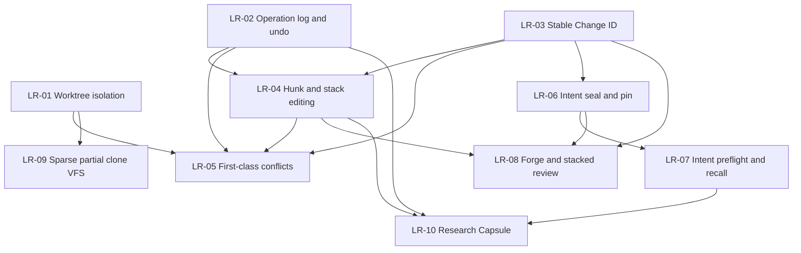

# Libra 长期功能规划

## 文档职责

本文是 Libra 不绑定具体发布日期和版本号的长期产品与工程路线图。它从真实开发者工作流出发，综合分析以下版本管理与相邻项目后，记录 Libra 未来需要补齐的十项长期能力：

- Sapling：Smartlog、提交栈编辑、mutation lineage、undo/redo、EdenFS。
- Jujutsu：operation log、稳定 Change ID、一等冲突、自动 descendant rebase、并发 operation DAG。
- GitButler：并行 branch workspace、hunk assignment、图形化历史编辑、operation snapshots、Forge 集成。
- Grit：Rust Git 引擎、上游 Git 测试套件驱动的兼容性治理。
- Lore：大型二进制、dirty-set、sparse/virtual clone、shared store、dependency hydration、FastCDC。
- Entire：外部 Agent session/checkpoint、commit linkage、rewind/resume、多 Agent review。
- Mainline：sealed intent、commit pin、preflight、intent-first review、coverage/gaps。
- research-git：Feature Capsule、实验谱系、recall/compose、compare/ablation/provenance。
- git-sync：ref/object 复制、plan/policy、pack relay、仓库格式迁移。

`agenta-ai/agenta` 的版本能力面向 prompt、workflow、evaluator、testset 和 environment 等领域对象，不是源码版本控制系统，因此只作为领域版本化参考，不作为 Libra VCS 功能对标基线。

本文只记录长期方向，不表示功能已经承诺进入某个 release，也不替代按日期维护的执行计划：

- [`plan-20260708.md`](plan-20260708.md)：Git 兼容与 Agent tracing 缺口收敛。
- [`plan-20260713.md`](plan-20260713.md)：外部 Agent transcript 读取、导入和 coverage。
- [`plan-20260715.md`](plan-20260715.md)：`libra code` AgentRuntime 与 Web-only 迁移。
- [`../gap/lore.md`](../gap/lore.md)：Lore 能力对标。
- [`../gap/mainline.md`](../gap/mainline.md)：团队可迁移意图、seal、pin、preflight 和 recall。
- [`../gap/research-git.md`](../gap/research-git.md)：Research Capsule 和实验记忆。

当某项长期能力进入实施阶段时，必须另建或更新可执行计划，补齐源码现状核对、设计决策、任务拆分、迁移、测试、兼容窗口、发布和回滚要求。本文中的优先级是依赖和开发者价值排序，不是发布日期承诺。

## 规划原则

以下原则适用于 LR-01 至 LR-10：

1. **开发者价值优先于命令数量。** 优先解决并行开发、数据丢失、历史重写、恢复、评审和上下文复用问题，不以补齐 Git 长尾 flag 数量衡量进展。
2. **Libra-native，不复制竞品实现。** 复用 Libra 的 Git 对象和 pack 兼容、SQLite 可变状态、稳定错误码、结构化输出、对象存储、AgentRuntime、sandbox 和 cloud 能力。
3. **Git 互操作仍是底线。** 新的 change、conflict、intent、research 等元数据可以是 Libra 扩展，但普通代码提交、对象传输和远端协作不能无故破坏 Git 兼容。
4. **所有 mutation 必须可观察、可恢复。** 新的历史编辑、workspace 组合、Agent mutation 和自动修复能力必须进入 operation log，并具有 preview、原子提交和失败恢复语义。
5. **机器接口先于交互外壳。** hunk、stack、conflict、preflight、Forge 和 research 等能力先冻结可测试的 Rust API 与 `--json`/`--machine` 契约，再构建 Web/TUI 交互。
6. **逻辑身份与存储身份分离。** commit OID 仍是内容身份；change、intent、review、task 和 capsule 使用自己的稳定逻辑身份，并记录与 commit rewrite 的关系。
7. **共享数据必须经过安全发布。** 原始 prompt、tool call、transcript、ContextFrame、Evidence 和私有路径不能因为存储在 Git 对象中就自动成为团队可共享数据。
8. **先确定性、后智能化。** preflight、hunk identity、overlap、recall、capsule capture 等先提供确定性基线；LLM judgment 只作为带 provenance、可撤销的增强层。
9. **不重复建设事实源。** operation、Agent session、intent、research、Forge projection 各自可以有读模型，但不能在 CLI、Web 和 Agent adapter 中复制状态机。
10. **计划状态必须据代码更新。** 每次开始实施前重新核对当前代码、`COMPATIBILITY.md`、命令文档和测试；已有能力只补缺口，不按本文历史快照重复实现。

## 当前基础

Libra 已经具备较强的底层能力，因此十项长期规划不是从零开始：

| 基础能力 | 当前事实 | 长期规划中的用途 |
|---|---|---|
| Git 对象、index、pack、wire protocol | Git/SHA-1/SHA-256 兼容基础已存在 | 所有代码历史和远端互操作 |
| SQLite refs、HEAD、reflog、sequencer | 可变状态可事务化存储 | worktree 隔离、operation restore、conflict 和 rewrite |
| `libra op log/show/restore` | operation graph 已公开，但命令接入覆盖仍窄 | LR-02 的基础 |
| linked worktree 新布局 | 已有 per-worktree HEAD/index/HEAD reflog 基础 | LR-01 的基础；sequencer/pseudo-ref 仍需隔离 |
| merge/rebase/cherry-pick/revert/rerere | Git 风格 conflict-stop sequencer 已存在 | LR-05 的兼容入口和迁移基础 |
| Agent session/checkpoint/review/investigate | 外部 Agent capture、只读 review、redaction、artifact objectization 已存在 | LR-06、LR-07、LR-10 的证据源 |
| `--json`/`--machine` 和稳定 `LBR-*` | Agent 可驱动的 CLI 基础已存在 | 十项能力的公共机器契约 |
| tiered storage、cloud、alternates、deps、hydrate | 大仓库和跨机器对象读取基础已存在 | LR-09 的基础 |
| AI history、IntentSpec、Decision、projection | 本地 AI 工作流对象已存在 | LR-06、LR-07 的私有源 |
| semantic extractor、skills、AgentRuntime | 已有 Rust symbol 抽取和受控 Agent 执行基础 | LR-04、LR-07、LR-10 |

## 长期功能总览

| ID | 长期功能 | 优先级 | 当前判断 | 已有规划关系 |
|---|---|---:|---|---|
| LR-01 | 完整多工作区隔离与并行 Agent 工作区 | P0 | 部分实现、迁移态 | `COMPATIBILITY.md` worktree deferred 项、Lore 计划 |
| LR-02 | 全命令 Operation Log、完整快照与 Undo/Redo | P0 | 基础已存在、覆盖不足 | `op` 开发文档已有增量方向 |
| LR-03 | 稳定 Change ID 与历史重写谱系 | P0 | 缺失 | 尚无完整执行计划 |
| LR-04 | 非交互 Hunk API、Hunk 归属与 Stack 编辑 | P0 | 缺失 | D15 延后 Git patch mode；需按新模型重启 |
| LR-05 | 一等冲突对象与 Modeless Sequencer | P1 | 缺失 | 现有 unified sequencer 不覆盖此模型 |
| LR-06 | Intent Seal、Intent-Commit Pin 与安全团队发布 | P1 | 缺失 | `gap/mainline.md` ML-01/02/03 |
| LR-07 | 开工前意图检索与语义冲突 Preflight | P1 | 缺失 | `gap/mainline.md` ML-04/05/08 |
| LR-08 | Forge/PR/CI 集成与 Stacked Review | P1 | 基本缺失 | 尚无完整执行计划 |
| LR-09 | Materializing Sparse Checkout、Partial Clone 与 VFS Hydration | P2 | 有替代基础、核心未实现 | D10、D18、Lore Phase 3 |
| LR-10 | Feature/Research Capsule 与实验谱系 | P2 | 缺失 | `gap/research-git.md` Phase 0-5 |

---

## LR-01：完整多工作区隔离与并行 Agent 工作区

### 开发者问题

多个开发者、Agent 或自动化任务需要同时处理同一仓库时，每个任务必须拥有独立的工作状态。仅隔离目录但共享 sequencer、pseudo-ref 或 mutation owner，会导致一个工作区中的 merge/rebase/commit 影响另一个工作区，或使并发任务只能退回到多个独立 clone。

当前 Libra 的新 linked-worktree 布局已经具备 per-worktree HEAD、index 和 HEAD reflog，但仍有迁移期限制：

- linked worktree 中的 merge、rebase、cherry-pick、revert、bisect 等 sequencer 操作仍受全局状态限制。
- `ORIG_HEAD`、`MERGE_HEAD`、bisect/worktree refs 等 pseudo-ref/namespace 尚未完整 worktree-scope 化。
- 旧 symlink-layout worktree 仍可能共享 HEAD/index，文档和迁移体验需要收口。
- 当前工作区模型仍是“一目录一分支/提交状态”，尚不支持 GitButler 式一个 workspace 内的多 task lane 组合。

### 目标能力

- 所有新 worktree 拥有独立 HEAD、index、HEAD reflog、sequencer state 和 pseudo-refs。
- linked worktree 可安全执行 merge、rebase、cherry-pick、revert、bisect 和 Agent mutation。
- `worktree add <path> <branch>`、`--detach`、branch collision 和 worktree ownership 语义完整。
- 提供旧 layout 的检测、doctor、迁移和失败回滚。
- Agent task 可申请独立 workspace lease；task、agent、worktree、change 和 operation 具有可查询关联。
- 多 worktree 继续共享 immutable object store、packs、tiered cache、refs/tags/remotes 和仓库级配置。
- 在完成独立 worktree 后，再评估 GitButler 式 parallel lanes；parallel lanes 必须构建在 LR-04 hunk ownership 和 LR-03 Change ID 之上，不能用共享 index 模拟。

### 非目标

- 不通过禁止并发、全局大锁或“建议用户不要同时操作”来伪装隔离。
- 不为每个 Agent 默认复制完整对象库。
- 不在 per-worktree state 完成前实现多 branch 合成 workspace。

### 完成判据

- 两个 linked worktree 可在不同分支上同时 commit/rebase，互不移动对方 HEAD、index 或 sequencer。
- 一个 worktree 的冲突、abort、continue 和 operation undo 不影响另一个 worktree。
- crash/restart 后可从各自 worktree 恢复 sequencer 和 operation 状态。
- 旧 layout 有明确迁移结果，不存在静默继续共享状态的未知模式。
- 并发测试覆盖人类 CLI、内部 AgentRuntime 和外部 Agent task workspace。

### 依赖与顺序

LR-01 可先完成 per-worktree sequencer；parallel lanes 依赖 LR-02、LR-03 和 LR-04。

---

## LR-02：全命令 Operation Log、完整快照与 Undo/Redo

### 开发者问题

开发者和 Agent 需要按“操作”恢复仓库，而不仅是按 commit 或 reflog 恢复某个 ref。典型问题包括：

- 撤销刚才的 rebase、branch rewrite 或 Agent mutation。
- 恢复操作前的 index、working tree、冲突和 sequencer。
- 查看哪个命令、Agent、task 或 intent 改变了仓库。
- 在 undo 后 redo，或在历史 operation 上运行只读诊断。

Libra 已有 `libra op log/show/restore`、operation graph 和 transaction wrapper，但当前开发文档明确记录命令接入仍是增量的，现阶段不能把它视为 Jujutsu/GitButler 级的统一安全网。

### 目标能力

- 所有会修改 refs、HEAD、index、working tree、sequencer、stash、worktree registry 或 AI mutation state 的命令统一接入 operation wrapper。
- operation view 包含仓库共享 refs，以及每个 worktree 的 HEAD、index、pseudo-ref、sequencer 和 conflict 状态。
- 增加 `libra op undo`、`op redo`、`op diff` 和历史 operation 只读视图。
- `--at-op <op>` 或等价 API 支持在历史 operation 上执行 status/log/diff/show 等只读查询。
- operation metadata 记录 command、argv 摘要、actor、agent、task、worktree、change、intent/checkpoint、开始/结束时间和结果。
- mutation 前后 view 与 object references 原子发布；失败 operation 可诊断但不能成为可恢复的成功 view。
- working-tree 快照采用内容寻址、增量和资源上限，不无界复制整个仓库。

### 非目标

- 不用 operation log 替代 code commit history。
- 不把每次文件系统事件都记录成用户可见 operation。
- 不允许 `op restore --force` 在没有明确 preview 和受保护路径检查时覆盖未知用户数据。

### 完成判据

- 主要 mutating command coverage 由机器守卫维护，新增命令默认必须声明是否进入 operation log。
- merge/rebase/cherry-pick/commit/reset/checkout/switch/stash/worktree/Agent mutation 均可操作级 undo。
- undo/redo 恢复 refs、index、worktree 和 sequencer 的一致状态。
- 多 worktree restore 只修改目标 scope，除非用户明确选择 repository-wide view restore。
- 故障注入覆盖 snapshot、object write、DB transaction、worktree publish 和 final view publish 的崩溃窗口。

### 依赖与顺序

LR-02 应在 LR-04、LR-05 和任何自动历史重写功能大规模开放前完成核心覆盖。

---

## LR-03：稳定 Change ID 与历史重写谱系

### 开发者问题

Commit OID 是内容身份，不是开发者心中的逻辑变更身份。amend、rebase、autosquash、split、fold、cherry-pick 和 merge 后，如果所有 review、intent、task 和 checkpoint 都只绑定 SHA，则关联会断裂。

### 目标能力

- 为逻辑 change 分配稳定 `change_id`，与 commit OID 分离。
- 创建、amend、rebase、autosquash、split、fold、move、cherry-pick 时写入 mutation lineage。
- lineage 支持一对一、一对多、多对一和跨分支复制关系，并区分 successor、derived、copied、abandoned。
- 增加 `libra change list/show/log/trace` 或等价公共 API。
- 所有结构化输出在适用位置同时返回 `commit_id` 和 `change_id`。
- PR、review、task、intent pin、checkpoint 和 operation 可以绑定 change ID，并保留具体 commit snapshot。
- rewrite mapping 可由 operation log、sequencer 和 commit metadata 重建或验证；不能只依赖易丢失的临时文件。
- 与普通 Git 远端互操作时，commit 仍是标准 Git commit；Change ID side metadata 丢失时必须明确降级，不伪造连续 identity。

### 关键设计问题

- Change ID 是否写入 commit trailer、Libra side ref、SQLite projection，或采用组合模型。
- 外部 Git rewrite 后如何重建 lineage。
- cherry-pick 是同一 change 的副本还是新 change，必须有明确可配置/可审计语义。
- split/fold 后默认主 successor 如何选择，调用方不能假设永远一对一。

### 完成判据

- amend/rebase 后 `change_id` 保持稳定，旧 commit 可追踪到新 commit。
- split/fold/cherry-pick 关系可机器查询，且不会覆盖旧历史证据。
- Forge、intent pin 和 Agent task 可在 commit rewrite 后自动重新关联或明确进入 ambiguous 状态。
- side metadata 缺失、冲突或分叉时 fail loud，并提供 doctor/repair，而不是静默选一个 SHA。

### 依赖与顺序

LR-03 是 LR-04 stack editing、LR-06 intent pin 和 LR-08 stacked review 的共同前置。

---

## LR-04：非交互 Hunk API、Hunk 归属与 Stack 编辑

### 开发者问题

人类和多个 Agent 经常在同一个文件中产生不同逻辑任务的修改。file-level staging 无法可靠分离这些变更，传统交互式 `add -p` 又不适合 Agent、Web 和自动化。

Libra 当前把跨命令 patch mode 作为 D15 延后项；长期方向不应先复制 Git TTY patch editor，而应先建立稳定、非交互、可恢复的 hunk/change API。

### 目标能力

- `hunk list --json` 返回稳定 hunk descriptor：path、old/new range、context hash、patch hash、mode、assignment、staleness。
- hunk 可分配给 task、agent、change、branch lane 或暂存目标。
- 文件继续编辑后，通过明确的 fuzzy reconciliation 规则保留或失效原 assignment。
- 支持按 hunk stage、unstage、discard、move 和 commit。
- 支持 sub-hunk selection，但每次选择必须可序列化、可 preview、可重放。
- 提供 stack editing：split、fold/squash、move、reword、drop、absorb、amend-to-change。
- `absorb` 根据 blame/change lineage 把工作区 hunk 吸收到最可能引入相邻代码的 change，并要求 dry-run/confirmation。
- stack rewrite 产生完整 old commit -> new commit 和 change lineage mapping，并由 operation log 包裹。
- Web UI、CLI 和 AgentRuntime 只消费同一 hunk/stack engine。

### 建议命令形态

以下仅用于表达目标，具体 CLI 需单独设计：

```text
libra hunk list --json
libra hunk assign <hunk-id> --task <task-id>
libra add --hunk <hunk-id>...
libra commit split <change> --spec <file-or-json>
libra commit absorb --dry-run
libra stack move <change> --after <change>
```

### 非目标

- 第一阶段不实现依赖终端编辑器的 Git 风格 patch UI。
- 不把行号当作稳定 hunk identity。
- 不允许 hunk fuzzy match 在有歧义时静默选择目标。

### 完成判据

- 同一文件中的两个 task 可独立提交，未选 hunk 保持原状。
- hunk 扩大、缩小、相邻合并、上下文漂移和文件 rename 有明确 reconciliation 测试。
- split/fold/move/absorb 全部可 preview、undo，并维护 Change ID lineage。
- Agent 只使用 JSON contract 即可完成细粒度 staging，不依赖 TTY。

### 依赖与顺序

依赖 LR-02 和 LR-03。parallel workspace lanes 还依赖 LR-01。

---

## LR-05：一等冲突对象与 Modeless Sequencer

### 开发者问题

当前 Git 风格 sequencer 遇冲突后停止，要求用户 resolve 后执行 `--continue`、`--skip` 或 `--abort`。这种模型兼容且熟悉，但会阻塞并行 Agent、提交栈重写和跨 worktree automation。

### 目标能力

- 定义 versioned conflict object，记录 base/ours/theirs、path、mode、hunk identity、producer operation 和 resolution lineage。
- commit/tree 或 Libra side metadata 可合法表示 unresolved conflict，而不是只依赖临时 marker 和 index stage。
- merge/rebase/cherry-pick 支持两个明确模式：Git-compatible stop-on-conflict 和 Libra-native record-conflicts。
- `record-conflicts` 模式完成 graph rewrite，并把 conflicted change 作为可继续移动、review、diff 和后续 rebase 的状态。
- 增加 `conflict list/show/resolve` 的机器接口。
- 修改早期 change 后，descendant 可自动 rebase；产生的冲突保留在对应 change 上。
- rerere 从 whole-file byte-identical 基线升级为规范化 per-hunk conflict/resolution，并记录适用证据。
- conflict resolution 本身进入 operation log，可 undo/redo。

### 兼容策略

- 默认行为在兼容窗口内继续保持现有 conflict-stop 语义。
- 一等冲突首先作为显式 Libra-native mode 发布。
- 标准 Git checkout/push 必须得到普通 Git commit；未解决 conflict 不能被伪装成普通 clean Git tree 推送。

### 完成判据

- rebase 可以完成并留下 conflicted changes，无全局阻塞 sequencer。
- conflicted change 可被继续 rebase、move、inspect 和 review。
- conflict object 在 restart、cloud backup 和 worktree 切换后保持完整。
- resolve 后生成可验证 lineage，rerere 可在等价 hunk 上复用且不误应用。

### 依赖与顺序

依赖 LR-01 per-worktree state、LR-02 operation safety 和 LR-03 Change ID。与 LR-04 stack engine 共同设计。

---

## LR-06：Intent Seal、Intent-Commit Pin 与安全团队发布

### 开发者问题

Libra 已经保存 Intent、Plan、Decision、Run、PatchSet、Evidence、ContextFrame 和 Agent checkpoint，但普通完成路径尚未稳定回答：

- 哪个 intent 授权并产生了这个 code change？
- 这个 intent 在何时冻结，最终范围和决策是什么？
- rebase、squash 或 merge 后，intent 应绑定哪个 commit/change？
- 哪些工程判断可以安全地与团队共享？

原始 AI history 混合了 prompt、tool call、context、run 和证据，不适合作为团队 intent channel 直接推送。

### 目标能力

- `seal` 在 commit/PR 边界冻结 IntentSpec、summary、fingerprint、decision、rejected alternatives、constraints、risks 和 followups。
- `pin` 同时绑定 stable Change ID、code commit OID、tree OID 和 seal digest。
- rewrite 后通过 Change ID、tree、commit mapping、merge parent、subject/goal 等受控 cascade 重新关联。
- 支持存量 intent/commit backfill 和 manual pin，并记录 provenance。
- 新建安全的 `refs/libra/intent-team` publication plane；私有 `libra/intent` 永远不直接 mirror。
- publication 只允许 approved、team-visible、policy-compatible、字段白名单且已脱敏的 sealed intent/decision/pin。
- 接收端先验证 manifest/schema/policy/content hash，再构建隔离 team projection；远端记录不得自动提升为本地 Policy/Constraint 或直接注入 prompt。
- 支持 publication lease、tracking watermark、revocation/tombstone 和 doctor/repair。
- Decision 增加一等 `alternatives[]` 和 rejected reason，而不是只保存单 verdict 或不透明 summary。

### 安全边界

- Run、ToolInvocation、Evidence、ContextFrame、ContextSnapshot、raw hook/session payload、完整 prompt/query/attachment 默认禁止进入 team ref。
- local seal 不等于 team approval。
- tombstone 只保证未来默认读取/注入停止；不能虚假承诺从所有 remote、backup 和 clone 物理删除。

### 完成判据

- 正常完成 workflow 后 intent 不再长期停留在 `commit_sha=None` 或等价未绑定状态。
- amend/rebase/squash/merge 后 pin 能自动迁移或明确报告 ambiguous/dangling。
- 两仓库之间可以 publish/sync 经批准 intent，而 outgoing tree/pack 不含私有 AI 对象。
- coverage 可区分 local-covered、team-covered、skipped 和 uncovered。
- `intent doctor` 可检测 pin dangling、projection stale、manifest/policy mismatch 和 revocation 漏应用。

### 已有计划关系

以 [`../gap/mainline.md`](../gap/mainline.md) 的 ML-01、ML-02、ML-03、ML-06、ML-13 为主要设计输入。实施前必须与当时的 Memory、AgentRuntime 和 Change ID 设计重新收敛。

---

## LR-07：开工前意图检索与语义冲突 Preflight

### 开发者问题

传统 VCS 通常在代码已经写完、merge 已开始时才暴露 line conflict。多 Agent 开发更常见的是语义冲突：修改不同文件但实现相同目标、恢复已被否决的方案、违反历史约束、基于过时团队状态工作，或同时改变同一 API 行为。

### 目标能力

- `intent preflight` 在编辑前检查初始化、身份、sync freshness、branch/base drift、dirty state、active intent base、proposed overlap、upstream merged overlap 和 goal overlap。
- `intent context --current|--files|--query` 检索相关 sealed intents、decisions、rejected alternatives、constraints、risks 和 followups。
- fingerprint 至少覆盖 files、symbols、subsystems、architecture、behavior、API 和 tags。
- 第一阶段使用确定性、可解释的加权 scoring，不依赖 embedding。
- 检索前先执行 visibility、trust、sensitivity、ACL 和 stale filtering。
- 输出 hard stop、warning、related records、overlap evidence 和 recommended next actions。
- 生成 versioned selection receipt：记录 as-of commit/ref、projection watermark、policy/scorer version、selected IDs、分数、原因、遗漏原因和 bundle hash。
- SessionStart 可向外部 Agent 注入经过授权和脱敏的只读 context bundle；注入不能创建 intent 或改变 policy。
- phase-2 Agent semantic judge 只消费 phase-1 candidates，并把判断写为可撤销、带 provenance 的事件。

### 非目标

- 不把文本相似度直接当作阻断性真相。
- 不允许未验证 remote intent 自动进入 prompt。
- 不因 embedding 服务不可用而使确定性 preflight 不可用。

### 完成判据

- stale sync、base behind 和高置信 proposed overlap 能在 mutation 前阻断。
- rejected route 和高优先级 constraint 能在相关文件开工前出现。
- 同一冻结输入生成相同 selection receipt；ref/config/policy 改变时 receipt 可解释地改变。
- context injection 全程不写 intent，不泄露私有 record，并可从 audit 中追踪选择依据。

### 已有计划关系

以 [`../gap/mainline.md`](../gap/mainline.md) 的 ML-04、ML-05、ML-08、ML-11 为设计输入。依赖 LR-06；推荐同时消费 LR-03 Change ID 和 LR-04 symbol/hunk 基础。

---

## LR-08：Forge/PR/CI 集成与 Stacked Review

### 开发者问题

真实团队工作流不会在 `push` 后结束。开发者需要创建和更新 PR、查看 reviewer/approval/CI/mergeability、维护 stacked changes，并在 rewrite 后保留 review identity。Libra 当前具备 remote、push/pull、`open` 和内部 Agent review，但尚无完整 Forge 工作流。

### 目标能力

- 定义 provider-neutral Forge trait，首批支持 GitHub 和 GitLab，后续评估 Bitbucket/Gitea。
- `forge status` 或等价命令展示当前 branch/change 对应 PR、review、CI 和 mergeability。
- 提供 PR create/update/open/checkout/merge/close 的 CLI 与机器 API。
- stack publish 将多个 logical changes 映射为有依赖关系的 PR 链。
- PR identity 优先绑定 LR-03 Change ID，同时记录当前 head/base commit。
- split/fold/rebase 后更新 PR mapping，不静默创建重复 PR 或丢失 review。
- Smartlog/change view 合并本地 stack、remote branch、PR、review 和 CI 状态。
- Libra Agent review findings 可经显式授权附加为 PR comment/check/artifact；默认保持本地私有。
- 复用现有 vault/auth/token、安全输出和 rate-limit 基础，不新建散落凭据系统。
- Forge API 失败不能破坏本地 refs、change mapping 或 operation state。

### 非目标

- 不把 GitHub 特有字段写死为核心 change model。
- 不要求使用 Forge 才能使用本地 stack/change 工作流。
- 不自动公开 transcript、prompt 或未经确认的 AI finding。

### 完成判据

- 一个三层 change stack 可创建、更新和重排对应 PR 链。
- amend/rebase 后 PR 仍关联同一 Change ID。
- CI/review 状态可在 CLI JSON 和 Web UI 中一致查询。
- GitHub/GitLab adapter 使用同一核心 contract，provider-specific 差异显式建模。
- 网络超时、权限失败、部分更新和 rate limit 有幂等重试/恢复语义。

### 依赖与顺序

依赖 LR-03；stacked review 强依赖 LR-04。推荐在 LR-06 pin 可用后将 intent summary 作为可选 PR 描述来源。

---

## LR-09：Materializing Sparse Checkout、Partial Clone 与 VFS Hydration

### 开发者问题

大型 monorepo 的关键体验指标是首次下载量、工作区磁盘占用、status 成本、按需文件访问延迟和多 workspace 缓存复用。只过滤 `ls-files`/`diff` 输出不能解决这些问题。

当前 Libra 已有 read-only `sparse-view`、dependency graph、显式 `hydrate`、tiered storage、alternates、dirty cache 和 FUSE/task-worktree 基础，但仍缺真正 materializing sparse checkout、promisor/partial clone 和透明 on-access hydration。

### 目标能力

#### 阶段 A：Materializing sparse checkout

- 增加 skip-worktree 或等价索引状态，保证 full HEAD + narrow worktree 时 status/add/commit 不误报删除或丢文件。
- 支持 cone 和 non-cone patterns，并与现有 `sparse-view` 明确区分。
- checkout/switch/merge/rebase/reset/restore 对 sparse paths 具有一致、安全语义。
- `clone --sparse` 和 dependency-filtered materialization 复用同一引擎。

#### 阶段 B：Partial clone/promisor

- clone/fetch 支持对象过滤和 promisor metadata。
- missing object 的读取路径可以按 policy 从 remote/tiered storage 获取，并做 OID 验证。
- negotiation、GC、fsck、bundle、alternates 和 offline 模式理解 promised objects。
- 不把“完整下载后只隐藏文件”宣称为 partial clone。

#### 阶段 C：VFS/on-access hydration

- 文件首次访问时透明 hydrate，支持 whole-object 起步，后续与 LFS/media range/chunk 对齐。
- 多 worktree/Agent workspace 共享 immutable cache，但保持独立 mutable state。
- IDE/watcher/service 可主动报告 dirty paths，避免每次全树扫描。
- dependency graph 可驱动 task-specific prefetch 和 hydration。
- hydration 失败保持原文件不变，不留下半写文件。

### 非目标

- 不通过窄 index 构造不完整 commit。
- 不在无 promised-object 语义时简单忽略 missing object。
- 不把 feature-gated FastCDC client 宣称为已有跨机器 media 服务。

### 完成判据

- narrow worktree commit 仍生成完整、正确的 HEAD tree。
- 典型大型仓库 clone 和工作区磁盘占用可按 filter/pattern 实际下降。
- offline/local/remote read policy 下 missing object 行为明确且可测试。
- 多 workspace 共享对象缓存，不重复下载同一 immutable content。
- VFS crash、remote timeout、OID mismatch 和 cache eviction 有故障注入覆盖。

### 已有计划关系

延续 `docs/development/commands/_compatibility.md` 的 D10/D18 和 [`../gap/lore.md`](../gap/lore.md) 的 sparse/VFS/shared-store 方向。FastCDC server 只能在此基础和 LFS/fsck/heal 能力稳定后推进。

---

## LR-10：Feature/Research Capsule 与实验谱系

### 开发者问题

Commit、branch、intent 和 checkpoint 都不能完整表达“一个未来值得重新使用的实验想法”：

- commit 可能混有重构、测试和多个实验。
- branch 会随主线演进而腐化。
- checkpoint 保存会话，但粒度通常过大。
- intent 描述目标，但不一定包含 code slices、knobs、assumptions、metric 和 resurrection guide。

### 目标能力

- `ResearchCapsule`：name、intent、status、base commit/change、source diff、code slices、knobs、data assumptions、result summary、resurrection guide。
- `ResearchRun`：command、artifact tree/checkpoint、metrics、return code、environment summary、active capsules。
- `ResearchEdge`：variant_of、depends_on、overlaps、alternative_to、composable_with、supersedes、conflicts_with、derived_from。
- `ResearchProposal`：从 session、checkpoint、run、staged/worktree diff 捕获的候选，必须经 review 才能成为 approved capsule。
- 确定性 capture 先按 file/hunk，复用并扩展 semantic extractor 生成 symbol slice；未知语言保留 raw diff fallback。
- lexical + graph-aware recall，返回 score、reason 和 provenance；embedding 只作可选索引。
- compose 生成旧 capsule + 当前代码 + dependency/conflict context 的 regeneration brief。
- regeneration 由受控 AgentRuntime author，不能直接自动 commit。
- byte-exact artifact、metrics 和 provenance 由 Libra 确定性存储，不依赖 Agent 重放。
- 提供 compare、ablation、provenance、metric direction 和 graph read APIs。
- MCP 第一阶段只读；所有写入、approve、regenerate 和 run 继续走 CLI/AgentRuntime approval/sandbox。
- 团队共享必须经过 namespace、trust、sensitivity 和 redaction policy，不能直接暴露私有 code slices 或环境数据。

### 非目标

- 不导入 `.rgit/graph.db` 作为 Libra 事实源。
- 不 shell out 到 Git 实现核心 capture/diff/history。
- 不自动把每个 diff 或 Agent session 提升为长期知识。
- 不让 LLM 生成的高语义 edge 覆盖确定性证据；默认先写 neutral overlap。

### 完成判据

- 在没有 `.git` 的纯 Libra 仓库中可 capture/review/list capsule。
- approved capsule 可从 ref/object 真源重建 projection。
- recall/compose 返回受限、可解释、带 provenance 的结果。
- regeneration 后可比较 clean/adapted/missing slices，并关联新 run/variant。
- compare/ablation 能基于真实 metric lineage 运行，而不是把 token usage 当实验指标。
- secret/redaction failure 在 persist、MCP 和 publication 前 fail-closed。

### 已有计划关系

以 [`../gap/research-git.md`](../gap/research-git.md) 的 Phase 0-5 为设计输入。依赖 LR-02 operation safety；推荐消费 LR-03 Change ID、LR-04 slice/hunk 和 LR-06/LR-07 的安全 publication/retrieval primitives。

---

## 实施顺序

十项功能按四个阶段推进。阶段之间是架构依赖，不要求每个阶段的所有增强都完全结束后才开始下一阶段的设计，但不得绕过前置安全能力直接开放高风险 mutation。

### 阶段一：安全并发基础

1. LR-01 完成 per-worktree sequencer 和 mutable state 隔离。
2. LR-02 把 operation log 扩展为所有 mutation 的安全网。
3. LR-03 建立稳定 Change ID 和 rewrite lineage。

阶段完成后，Libra 应能够安全支持多个 worktree/Agent 并行工作、按操作恢复，并在 rewrite 后保持逻辑变更身份。

### 阶段二：变更组织与冲突模型

1. LR-04 建立 hunk ownership、非交互 staging 和 stack editing。
2. LR-05 建立 first-class conflict 和 modeless rewrite。

阶段完成后，Libra 应能够把同一文件中的修改分配给不同任务，安全编辑提交栈，并允许冲突作为可版本化状态存在。

### 阶段三：团队协作和工程意图

1. LR-06 建立 seal、pin 和安全 `intent-team` publication。
2. LR-07 建立 intent recall、preflight 和上下文注入。
3. LR-08 建立 Forge/PR/CI 和 stacked review。

阶段完成后，团队应能把逻辑 change、工程意图、PR 和评审关联在一起，并在开工前发现重复工作和语义冲突。

### 阶段四：规模与长期知识复用

1. LR-09 完成 materializing sparse、partial clone 和 VFS hydration。
2. LR-10 完成 Research Capsule、实验谱系和 regeneration loop。

阶段完成后，Libra 应能服务大型 monorepo/资产仓库，并把有价值的实验想法作为可审查、可召回、可再生的一等资产。

## 依赖图



## 跨功能验收门禁

任何 LR 项进入实施时，除具体功能验收外，还必须满足以下共同门禁：

### 数据正确性

- 所有 refs/HEAD/index/sequencer/worktree mutation 要么完整成功，要么回滚到可验证的旧状态。
- 支持 SHA-1 和 SHA-256，不硬编码 OID 长度。
- side projection 可从对象/ref 真源重建，不能成为唯一不可恢复事实源。
- crash window、并发 CAS、重复请求和 idempotency 有故障注入测试。

### 安全与隐私

- 外部 Agent、Forge、remote intent 和 capsule 内容全部视为不可信输入。
- 进入终端、prompt、对象库、SQLite、日志、MCP 或 publication 前执行对应的 cap、validation、redaction、provenance 和 authorization。
- mutation 复用 AgentRuntime hardening、approval、sandbox 和 tool ACL，不建立旁路执行器。
- 删除、revocation 和 tombstone 的保证范围必须诚实说明，不宣称无法证明的跨 clone 物理擦除。

### 机器接口

- 所有新公共命令提供稳定 `--json`/`--machine` schema。
- 新错误使用稳定 `LBR-*`，同步 `docs/error-codes.md`。
- 列表有分页、limit 和资源上限；graph/recall 不做无界遍历。
- CLI、Web 和 Agent adapter 使用同一核心 service，不复制业务状态机。

### 兼容与迁移

- Git-compatible 默认行为的改变必须有显式兼容窗口和迁移说明。
- 新 Libra metadata 丢失时明确降级或 fail loud，不伪造完整 lineage/intent/conflict。
- 老 worktree、老 operation、老 checkpoint、老 intent 和老 repository schema 有明确读取、迁移或拒绝策略。
- `COMPATIBILITY.md`、用户命令文档、开发文档、`tests/INDEX.md` 和 compat/integration tests 同步。

### 性能

- status/add/commit/diff 等热路径不因长期元数据默认退化为全历史扫描。
- operation snapshots、hunk reconciliation、preflight、Forge sync、partial clone 和 capsule recall 均有容量上限和大仓库基准。
- 大对象、transcript、findings、capsule artifact 和 VFS 数据采用 streaming/chunking 或内容引用，避免无界内存加载。

## 不进入本长期 Top 10 的兼容增强

以下能力仍可按用户需求推进，但当前不应优先于 LR-01 至 LR-10：

- submodule 命令族和 `clone --recurse-submodules`。
- octopus merge 和更多自定义 merge strategies。
- `bisect replay`、`bisect terms`。
- `stash create`、`stash store`。
- `commit --allow-empty-message`。
- Git GPG 外部 keyring 全互操作。
- `blame --reverse`、高级 copy/move detection。
- `cat-file --follow-symlinks`。
- 更多非首批 external Agent roster。

这些项目继续由 `COMPATIBILITY.md`、`docs/development/commands/_compatibility.md` 和对应命令开发文档管理。若实际用户需求、生态互操作或生产阻塞证明其优先级上升，可以另行调整，但不应以“更接近 100% Git flag parity”为理由自动抢占长期架构项目。

## 路线图维护

- LR 编号一经被执行计划或 issue 引用，不重新编号；废弃项标记 superseded/cancelled 并记录替代项。
- 每季度或重大架构变更后，按代码和测试重新核对“当前基础”和“当前判断”。
- 某项进入实施时，在本表增加执行计划链接、owner、状态和最近验证日期。
- 功能完成只以代码、测试、文档和可发布版本为证据；本文文字或 checkbox 不是完成证明。
- 竞品能力只作为问题和设计参考；最终接口、数据模型、安全边界和兼容策略必须由 Libra 自身 RFC/ADR 决定。
