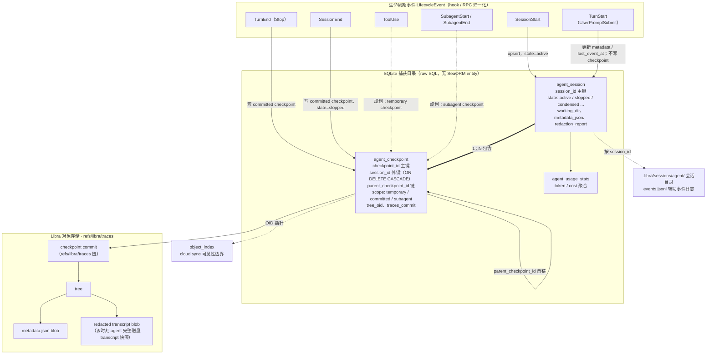
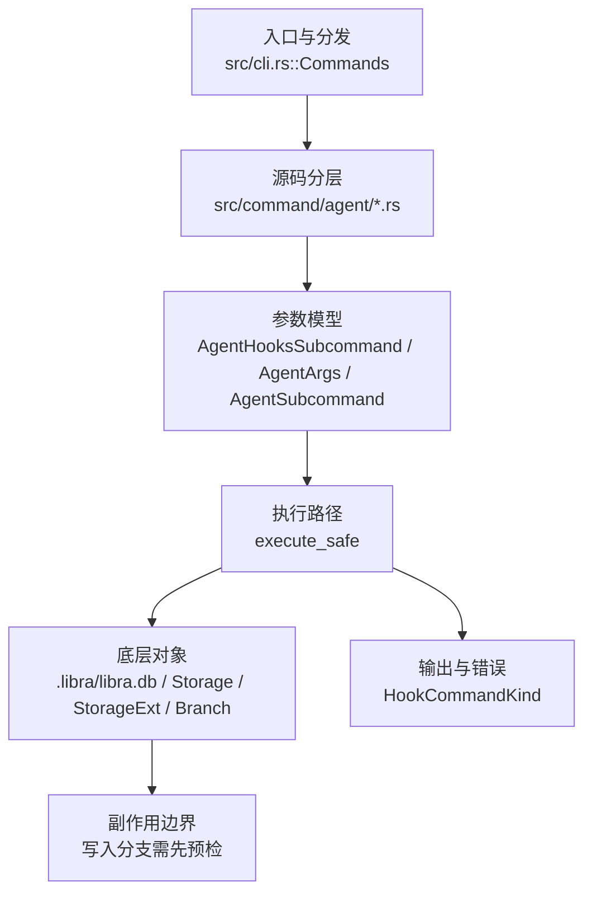

# `libra agent` 开发设计

> 本文件是 `libra agent`（外部 Agent 捕获子系统）的**公共 CLI/行为事实源**，已从 [`docs/development/internal/code-agent-runtime.md`](../internal/code-agent-runtime.md) 拆入 external-agent 捕获需要的 entireio/cli 对齐契约、AG-16~AG-24a 任务卡、E1–E10 wire contract、checkpoint/export、review/investigate 与验收命令。`docs/development/internal/code-agent-runtime.md` 继续负责内部 AgentRuntime、Web-only 迁移、MCP/control-plane 边界和 Gate 8 的总览追踪；两份文档任一处修改 public surface、E 契约、AG-16~AG-24a 或有意差异时，必须同一 PR 同步。

> **术语与特性边界澄清**：本文档中的 "SubagentStart / SubagentEnd" 与 checkpoint `scope = 'subagent'` 专指**被观测的外部 Agent**（Claude Code 等）在其 transcript 中产生的子代理事件，由 `libra agent` 捕获。**与此正交**的是 Cargo feature `subagent-scaffold`（CEX-S2-10，Step 2 子代理契约 schema-only 脚手架），它用于 `src/internal/ai/agent/`、`goal/` 等内部 AgentRuntime 的子代理合约定义，当前受 CP-4 gate 保护。Cargo.toml 中的注释引用本文档 "Step 2 audit closure" 应理解为外部捕获计划为整体子代理事件面提供上下文；内部 scaffold 的实际实现与审计位于内部 AI 模块与 `docs/development/internal/code-agent-runtime.md`。新增/修改任一 "subagent" 语义时，必须同步更新 Cargo 注释与两份文档。

## 捕获概念结构图（Session / turn / checkpoint / transcript）

下图说明外部 Agent 捕获各概念之间的关联：生命周期事件如何驱动写入、`agent_session` 与 `agent_checkpoint` 的从属关系、checkpoint 如何落到 `refs/libra/traces` 上的 commit/tree/blob，以及 transcript 快照、usage、辅助日志和 cloud 可见性的位置。事实源：schema `sql/migrations/2026050303_agent_capture.sql`、写入器 `src/internal/ai/hooks/runtime.rs`（`ingest_agent_traces_payload` / `write_committed_checkpoint`）。



**关联关系说明**：

- **session 1 ── N checkpoint**：一个 `agent_session` 包含 0..N 个 `agent_checkpoint`；`agent_checkpoint.session_id` 是非空外键且 `ON DELETE CASCADE`（删除 session 会连带删除其全部 checkpoint）。索引 `idx_agent_checkpoint_session(session_id, created_at)` 专为「按时间列出某 session 的多个 checkpoint」设计。
- **checkpoint 自链**：checkpoint 之间用 `parent_checkpoint_id` 串成链，为 `libra agent checkpoint rewind` 提供 turn 级回放粒度。
- **turn 与 checkpoint 的关系**：turn 是 `TurnStart`(UserPromptSubmit) 到 `TurnEnd`(Stop) 的交互区间；**committed checkpoint 在 `TurnEnd` 落盘**（`SessionEnd` 再收尾一个），`TurnStart` 本身只更新 `agent_session`（`metadata_json` / `last_event_at`），不产生 checkpoint。换算：N 个完成的 turn → N 个 TurnEnd checkpoint + 1 个 SessionEnd checkpoint。
- **checkpoint 与对象存储**：每个 committed checkpoint 在 `refs/libra/traces` 上 append 一个 commit，其 tree 携带 `metadata.json` 和该时刻 agent **完整磁盘 transcript 的脱敏快照**（不是单轮增量）；SQLite 行只存摘要与 OID 指针（`tree_oid` / `traces_commit`），不存正文。
- **transcript**：外部 agent 自己产生的原始会话文件（可能很大、含敏感信息），落盘前必经 redaction，默认 metadata-first 读取；redacted 正文走显式 detail/transcript 路径（size cap/streaming/redaction 约束），未脱敏 raw 仅经 `--allow-raw` + audit。
- **scope 三类**：`committed`（TurnEnd / SessionEnd，当前已实现）、`temporary`（ToolUse 等，规划）、`subagent`（SubagentStart / End，规划）。图中虚线箭头表示规划路径，尚未在当前 hook ingest 中落地。
- **旁路数据**：`agent_usage_stats` 记 token/cost 聚合；`.libra/sessions/agent/<session_id>/events.jsonl` 是辅助事件日志；`object_index` 决定上述对象对 cloud sync 的可见性。

## Agent 命令实现功能边界

本节根据当前 `entire agent` 命令面和 `cmd/entire/cli/agent/` 抽象，冻结 `libra agent` 改进方案的功能边界。参考实现中 `entire agent` 负责 repository 内的 Agent integration 管理（`list` / `add` / `remove`），底层 `agent` package 负责 registry、capability、hook、transcript、token、skill 与 external plugin protocol；`review`、`investigate`、`session`、`checkpoint`、`attach`、`resume`、`rewind` 是消费这些能力的相邻工作流。Libra 当前已把 `session`、`checkpoint`、`clean`、`doctor`、`push`、`rpc` 放在 `libra agent` 下，因此它们只在**操作外部 Agent 捕获产物**时属于本命令边界。

`libra agent` 改进方案包含以下功能面：

- **Agent 集成管理**：列出 registered / available / installed agents；安装与移除 hook；保留 `status` / `enable` / `disable` canonical 入口，并新增 `list` / `add` / `remove` 兼容别名。输出必须区分 `registered`、`hook_installable`、`transcript_readable`、`launchable_review`、`launchable_investigate`、`external_binary`，不得把“可注册”误报为“可安装 hook”或“可启动 reviewer”。
- **能力声明与 registry**：以 `DeclaredAgentCaps` / capability-gated helper 表达 hooks、transcript analyzer/preparer、token calculator、text generator、compaction、hook response、subagent-aware extractor 等可选能力。built-in adapter 可通过 trait/impl 直接声明；external binary 必须先通过协议声明能力，未声明的方法 fail-closed。
- **Hook 与 lifecycle 捕获**：已安装 provider hook、隐藏 `agent hooks` 入口和 external RPC parser 只能产出 provider-neutral lifecycle event，经统一校验、owner filtering、path/session validation、redaction 后再写入 checkpoint。事件边界包括 `SessionStart`、`TurnStart`、`TurnEnd`、`Compaction`、`SessionEnd`、`SubagentStart`、`SubagentEnd`、`ModelUpdate`、`ToolUse`。
- **Session / checkpoint 捕获与诊断**：`agent_session`、`agent_checkpoint`、`agent_usage_stats`、`.libra/sessions/agent/`、`refs/libra/traces` 和 `object_index` 共同构成外部捕获事实源。`session list/show` 与 `checkpoint list/show` 默认 metadata-first；读取 redacted transcript、prompt、context、stderr 必须走显式 `--detail`/`--transcript` 路径，受 size cap、streaming/chunk、redaction 约束（无需授权门）；未脱敏 raw payload 仅经显式 `--allow-raw` 授权访问/导出，每次写 append-only audit（见「读取 pipeline」与合规规格）。`clean`、`doctor`、`push`、`rewind` 只处理这些外部捕获对象，不扩大为通用 Git/工作区维护命令。
- **External `libra-agent-<name>` 协议**：保留 Libra 的 JSON-RPC 传输，能力面与 entire external protocol 对齐：`info`、`protocol_version`、8-bool capability schema、repo-root/env 注入、timeout、IO cap、settings gate、provenance、内置 slug 仿冒防护、stderr capture/redaction。它不是 MCP stdio，也不是内部 AgentRuntime turn 控制面。
- **Transcript intelligence 与 skill event**：允许按 capability 做 transcript 准备、文件/模型/token/prompt/skill/subagent 提取和 native transcript chunk/reassemble；extractor 缺失或可选字段缺失可 fail-open 并标 `partial`，但 redaction、path 安全、UTF-8/JSON envelope、写入、rewind apply、hook install/uninstall、external launch/fix 一律 fail-closed。
- **Review / investigate 相邻工作流**：review / investigate 可以消费 `libra agent` 的 registry、capability、checkpoint、transcript 和 findings/provenance 数据；但 mutating fix/action 必须桥接内部 `libra code` AgentRuntime serialized queue、approval、sandbox 和 tool gate。observed external agent 只能提供 transcript、hook event、findings、manual attach/provenance，不能直接成为 Libra 的受控 mutating executor。

### 第一批支持项目（执行本文档时的强制范围）

执行本文档的 agent 集成计划时，第一批 supported roster **只允许**包含以下 3 个 observed external agent：

| slug | AgentKind / DB value | 第一批状态 | 必须支持的能力 | 安装配置面 |
|---|---|---|---|---|
| `claude-code` | `ClaudeCode` / `claude_code` | first-batch supported；hook-installable | hook install/uninstall/status、lifecycle ingest、transcript read、checkpoint/export、review evidence | `.claude/settings.json` |
| `codex` | `Codex` / `codex` | first-batch supported；Codex HookProvider 落地前只能 transcript-readable，不能标 installed | capability row、transcript read；HookProvider 落地后 hook install/uninstall/status、lifecycle ingest、checkpoint/export | 以上游实测为准：当前不得假定 `.codex/hooks.json`；候选为 project `.codex/config.toml` hooks 键、本地 plugin 定义及用户级 `~/.codex/config.toml` `[hooks.state]` trusted/enabled 记录 |
| `opencode` | `OpenCode` / `opencode` | first-batch supported；OpenCode HookProvider 落地前只能 transcript-readable，不能标 installed | capability row、transcript read；HookProvider 落地后 hook install/uninstall/status、lifecycle ingest、checkpoint/export、review evidence | 以上游实测为准：当前不得假定 `.opencode/hooks.json`；新写入候选为 `.opencode/plugins/` Libra 插件文件或 `opencode.json` plugin 项；单数 `.opencode/plugin/` 只可作为上游兼容读取/迁移输入，不作为 Libra 新写入目标 |

首批之外的 `gemini`、`cursor`、`copilot`、`factory-ai`、`pi`、`vogon`、未知 external slug 和历史/预览 adapter **不得作为 supported agent 暴露**：`list/status --json` 不能把它们标成 `supported=true`、`hook_installable=true`、`installed=true`、`launchable_review=true` 或 `launchable_investigate=true`；`add/enable` 必须返回 actionable unsupported / skipped diagnostic；hook ingest 不得为这些 slug 写入 `agent_session.agent_kind`。源码中已有的 `AgentKind`、SQL CHECK 或历史 provider 只能作为 migration/backward-compat 背景，不能扩大本文执行范围。

首批 capability matrix 必须固定这些字段：`slug`、`agent_kind`、`db_value`、`supported`、`support_wave="first_batch"`、`registered`、`transcript_readable`、`hook_installable`、`installed`、`launchable_review`、`launchable_investigate`、`external_binary`、`config_paths`、`capabilities`。新增首批外 agent 必须另开 PR 更新本节、E9、任务卡、用户文档和 compat schema pin test。

### Claude Code 安装流程契约（第一批必须满足）

Claude Code 是第一批必须可安装的 external-agent hook provider。执行 `libra agent enable --agent claude-code`（以及未来 alias `libra agent add claude-code`）时必须满足以下条件：

1. **注册与状态输出**

   `claude-code` 行必须暴露：`supported=true`、`support_wave="first_batch"`、`registered=true`、`agent_kind=claude-code`、`db_value=claude_code`、`provider_name=claude`、`stability=stable`、`protected_dirs=[".claude"]`、`transcript_readable=true`、`hook_installable=true`、`installed=<bool>`、`capabilities.hooks=true`、`capabilities.native_transcript=true`。

2. **启用顺序**

   启用命令的实现顺序必须是：解析 CLI slug `claude-code` / alias `claude` → 映射 `AgentKind::ClaudeCode` → 查找 `provider_name=claude` 的 `HookProvider` → 构造 `ProviderInstallOptions`（二进制路径由 `resolve_hook_binary_path` 生成：`--binary-path` 或 `current_exe`，经 `fs::canonicalize` 得绝对路径，解析失败即硬错误；**禁止回退裸 `libra` PATH 查找**，与 plan.md §0.3.3/A4 断言一致）→ 读取 `.claude/settings.json` → upsert Libra-managed hook entries → 原子写回 → 重新读取配置验证 → `list/status` 报告 `installed=true`。任一步失败都必须 fail-closed，不得写半截 JSON，不得创建 `agent_session`，不得把 `installed` 标为 true。

3. **安装后的 `.claude/settings.json` 目标形态**

   Libra 只管理自己写入的 command hook，必须保留用户已有 top-level keys、matcher、非 Libra hook 和额外字段。安装器按 event key 增量 upsert `matcher=null` 的 Libra hook entry；如果用户已有同 event 的其它 matcher 或 command，必须保留。

   ```json
   {
     "hooks": {
       "SessionStart": [
         {
           "matcher": null,
           "hooks": [
             {
               "type": "command",
               "command": "<canonicalized-libra-abs-path> hooks claude session-start",
               "timeout": 10
             }
           ]
         }
       ],
       "UserPromptSubmit": [
         {
           "matcher": null,
           "hooks": [
             {
               "type": "command",
               "command": "<canonicalized-libra-abs-path> hooks claude prompt",
               "timeout": 10
             }
           ]
         }
       ],
       "PostToolUse": [
         {
           "matcher": null,
           "hooks": [
             {
               "type": "command",
               "command": "<canonicalized-libra-abs-path> hooks claude tool-use",
               "timeout": 10
             }
           ]
         }
       ],
       "Stop": [
         {
           "matcher": null,
           "hooks": [
             {
               "type": "command",
               "command": "<canonicalized-libra-abs-path> hooks claude stop",
               "timeout": 10
             }
           ]
         }
       ],
       "SessionEnd": [
         {
           "matcher": null,
           "hooks": [
             {
               "type": "command",
               "command": "<canonicalized-libra-abs-path> hooks claude session-end",
               "timeout": 10
             }
           ]
         }
       ]
     }
   }
   ```

   示例中 `<canonicalized-libra-abs-path>` 为占位符：实际写入值是 `resolve_hook_binary_path` 产出的 canonicalize 绝对路径。绝对路径是**必须形态**——schema/snapshot test 断言 command 以绝对路径开头、以 `hooks claude <verb>` 结尾，不允许裸 `libra` PATH 查找（与 plan.md §0.3.3/A6.5 安装断言互引）。

   `ModelUpdate`、`Compaction`、`ToolUse` parser 能力可以存在，但当前 Claude Code 安装器只要求写入上表 5 个 forward events；若未来增加安装事件，必须同步本节、`docs/development/commands/hooks.md`、schema tests 和 uninstall 规则。

4. **停用与移除**

   `libra agent disable --agent claude-code` / `remove claude-code` 只能删除 Libra-managed hook entries（command 以安装时写入的 libra 绝对路径开头、以 `hooks claude <verb>` 结尾）；不得删除用户自定义 hook、`.claude/settings.json` 中其它配置或已捕获的 `agent_session` / `agent_checkpoint` / `refs/libra/traces` 数据。停用后 capability matrix 必须显示 `supported=true`、`hook_installable=true`、`installed=false`。

### OpenCode 安装流程契约（第一批必须满足）

**状态（2026-07-05，AG-19 已落地）**：OpenCode HookProvider 已实现（`src/internal/ai/hooks/providers/opencode/`），capability row 为 `supported=true`、`hook_installable=true`、`capabilities.hooks=true`。以下契约以真实 `opencode 1.17.13` 实测固定（探测记录见 plan.md A4 行）。

1. **注册与状态输出**

   `opencode` 行暴露：`supported=true`、`support_wave="first_batch"`、`registered=true`、`agent_kind=opencode`、`db_value=opencode`、`provider_name=opencode`、`stability=stable`、`protected_dirs=[".opencode"]`、`transcript_readable=true`、`hook_installable=true`、`installed=<运行时>`、`capabilities.native_transcript=true`、`capabilities.hooks=true`、`config_paths=[".opencode/plugin/libra-hooks.js"]`。

2. **启用顺序（已实现）**

   `libra agent enable --agent opencode` / `add opencode`：解析 CLI slug → 映射 `AgentKind::OpenCode` → **经 registry adapter `as_hooks()` 取得 `HookProvider`（AG-19 已删除 provider-name 字符串桥）** → 构造 `ProviderInstallOptions`（二进制路径同 Claude Code 契约：`resolve_hook_binary_path` canonicalize 绝对路径，禁止裸 `libra` PATH 查找）→ 原子写 Libra-managed plugin 文件（临时文件 + rename）→ 重新读取验证。任一步失败 fail-closed，不得把 `installed` 标为 true。

3. **安装配置目标形态（1.17.13 实测固定）**

   实测结论：`<project>/.opencode/plugin/`（单数）、`.opencode/plugins/`（复数）与 `opencode.json` 的 `"plugin"` 数组条目**同时全部加载**（无优先级互斥）；plugin 为 JS/TS 模块，导出 `async ({ project, client, directory, worktree, serverUrl, $ }) => Hooks` 工厂（SDK typings：`@opencode-ai/plugin`）。加载失败按 plugin 粒度非致命，仅 `--print-logs` 可见；`--pure` / `OPENCODE_PURE=1` 关闭全部外部 plugin（安装文档必须注明该盲区）。

   - **Libra 唯一写入目标**：`.opencode/plugin/libra-hooks.js`（上游 SDK 文档使用的规范目录），文件首行携带 Libra-managed 标记注释；install/uninstall 同时检测 `.opencode/plugins/` 下携带标记的重复受管文件并清理（双目录同载会导致事件双发）。不携带标记的用户文件在任何路径下都不触碰（同名用户文件导致 install 硬错误而非覆盖）。
   - plugin 内 forward 命令以 canonicalize 绝对路径起始（`<binary> agent hooks opencode <verb>`），事件转发 best-effort、handler 全 try/catch 永不抛出。

   **事件映射（实测固定）**：`session.created -> SessionStart`；`message.updated`（`properties.info.role == "user"`，plugin 侧过滤）`-> TurnStart`；`tool.execute.after -> ToolUse`；`session.idle -> TurnEnd`（**Libra 侧推断规则**：headless run 的可靠 turn 完成信号，非 OpenCode 官方 terminal event）；`session.deleted -> SessionEnd`；`session.compacted -> Compaction`。流式事件（`message.part.updated/delta`、`session.status/updated/diff` 等）一律不转发。

4. **停用与移除（已实现）**

   `disable/remove opencode` 只删除携带 Libra-managed 标记的 plugin 文件（两个目录都检查）；不删除用户自定义 OpenCode 配置，也不删除已捕获数据。OpenCode hook parser 只产 `LifecycleEvent`，不直接写 checkpoint；写入走统一 validation/redaction/owner filtering/checkpoint writer。

### Codex 捕获目标契约（AG-19 已落地）

**状态（2026-07-05）**：Codex HookProvider 已实现（`src/internal/ai/hooks/providers/codex/`），Codex 进入第一批 supported roster，`hook_installable=true`。本节契约以真实 `codex-cli 0.142.4` 实测固定，并与上游源码 `rust-v0.142.4`（commit `57d253ad`）逐字节核对（trusted_hash 算法外部复现全部命中）。Gemini 可安装只是历史实现事实，不属于本文第一批支持目标。

Libra 安装用户级 Codex hook、读取 Codex JSONL transcript、把捕获结果写入 `agent_session` / `agent_checkpoint` / `agent_usage_stats`，并把 checkpoint blob 推送到 `refs/libra/traces`。这里描述的是外部 Codex 捕获路径；内部受控执行、tool approval、sandbox 和 workspace mutation 仍属于 `libra code` AgentRuntime。

1. **注册与可见性检查**

   Codex 的注册来自内置 adapter / capability registry，而不是用户手动创建一条 DB 记录。当前源码事实是 `agent_for(AgentKind::Codex)` 返回 stable-promoted adapter；当前 CLI 尚无 `list` 子命令，`status` 只输出 session/checkpoint 聚合，不输出 per-agent capability matrix。AG-16/AG-17 落地 capability matrix 与 `list` 后，用户才应通过以下命令确认 Codex 已进入 `libra agent` 目录，并且不得把 `registered` / `transcript_readable` 误读为已可安装 hook：

   ```bash
   libra agent list
   libra agent status
   libra agent doctor
   ```

   AG-19 落地后，`codex` 行暴露：`registered=true`、`agent_kind=codex`、`provider_name=codex`、`stability=stable`、`protected_dirs=[".codex"]`、`transcript_readable=true`、**`hook_installable=true`、`capabilities.hooks=true`**、`installed=<运行时>`、`capabilities.native_transcript=true`、`config_paths=[".codex/hooks.json"]`（project 级可见的加载路径；实际写入目标是用户级，见下）。同 PR 已同步 schema pin tests（`compat_agent_capability_matrix_pin`）。`list --json` 与 capability-matrix JSON 是自动化脚本和测试的事实源；人类输出只用于诊断，不得作为稳定解析面。

2. **启用（安装 Codex hook，已落地）**

   canonical 命令是 `enable`，`add` 只是兼容别名，二者同语义、同退出码、同 JSON schema：

   ```bash
   libra agent enable --agent codex
   libra agent add codex
   libra agent add codex --force
   ```

   启用实现顺序（已落地）：解析 CLI slug `codex` → 映射 `AgentKind::Codex` → **经 registry adapter `as_hooks()` 取得 `HookProvider`（AG-19 删除了 provider-name 字符串桥）** → 构造 `ProviderInstallOptions`（二进制路径同 Claude Code 契约：`resolve_hook_binary_path` canonicalize 绝对路径，禁止回退裸 `libra`）→ upsert 用户级 `$CODEX_HOME/hooks.json` Libra-managed hook entry 与 `config.toml` `[hooks.state]` trust 记录（自算 trusted_hash）→ 原子写回 → 重新读取验证（`hooks_are_installed` 同时要求零 trust gap）。任一步失败 fail-closed：不留半写入 JSON/TOML，不创建 `agent_session`，不把 `installed` 标成 true。安装级真实 `codex exec` 冒烟属 A6.5 采集 smoke 任务口径（hook 触发机制本身已在本节证据中以相同 hash 算法/相同文件形态实测证明）。

   安装成功后的副作用只允许是 Libra 管理的 Codex hook 配置（0.142.4 实测固定）：

   - **写入目标是用户级** `$CODEX_HOME/hooks.json`（`CODEX_HOME` env 缺省 `~/.codex`）：形如 `{"hooks": {"<EventName>": [{"hooks": [{"type": "command", "command": "<canonical binary> hooks codex <verb>", "timeout": 30, "statusMessage": "libra capture"}]}]}}`（顶层 key 必须是 `hooks`，handler 字段 `deny_unknown_fields`）。project 级 `.codex/hooks.json` 是真实加载路径，但只对用户 config 中 `[projects."<abs>"] trust_level = "trusted"` 的项目生效（且 bypass flag 也不解锁未受信项目层），Libra 因此不写 project 级。
   - hooks feature 在 0.142.4 默认启用（Stage::Stable），无需也不得写 `[features] hooks = true`。
   - **trust 双重门控（实测 + 源码核对）**：用户级 `$CODEX_HOME/config.toml` `[hooks.state."<hooks.json 绝对路径>:<event_snake>:<group_idx>:<handler_idx>"]`，字段 `enabled`（缺省 true）+ `trusted_hash = "sha256:" + sha256(紧凑、键递归排序的 JSON {"event_name","matcher"?,"hooks":[{"type","command","timeout"(生效值,缺省600),"async":false,"statusMessage"?}]})`。installer 自算 hash 只增删 Libra 自有 entry（带 `# libra-managed codex hook trust entry (AG-19)` 标记注释行），其余字节原样保留（byte-for-byte pin 测试）。**未受信 hook 在 `codex exec` 下静默不执行**（零 stderr 信号），故 `hooks_are_installed` 要求零 trust gap；state key 是位置型（上游 TODO durable id），重装必须按最终文件重算 index 并清理指向本文件的陈旧 Libra key。
   - 安装 canonical provider events：`SessionStart`、`UserPromptSubmit`、`PostToolUse`、`Stop`、**`SubagentStart`、`SubagentStop`**（Codex 原生 subagent 生命周期 hook，映射 Libra `SubagentStart`/`SubagentEnd`）。`PreToolUse`/`PreCompact`/`PostCompact`/`PermissionRequest` 可解析（`recognizes_event` 全表 10 名）但默认不安装转发。
   - **trust-gap banner（AG-19）**：Codex `SessionStart` ingest 成功后，结构性比较 hooks.json 中 Libra-managed handler 与 `[hooks.state]` 当前 hash，仅当存在未批准 entry 时向 stderr 输出一条 banner（提示 `libra agent enable --agent codex` 刷新）；`enabled=false` 且 hash 匹配是刻意停用，不算 gap。
   - `--force` 只能重写 Libra-managed Codex hook entries，不得删除用户自定义 hook。

3. **安装后的配置证据（2026-07-05 实测记录）**

   - Codex CLI 版本 `codex-cli 0.142.4`；smoke 入口 `codex exec -C <repo> --skip-git-repo-check --sandbox read-only "<短 prompt>" </dev/null`（**stdin 必须重定向**：非 tty 打开的 stdin 会让 exec 永久等待）。hook 触发时 exec transcript 打印 `hook: <EventName>` / `hook: <EventName> Completed`。
   - hook 收到的 stdin payload 为 Claude Code 兼容单行 JSON：`session_id`、`transcript_path`（`$CODEX_HOME/sessions/YYYY/MM/DD/rollout-*.jsonl`）、`cwd`、`hook_event_name`、`model`、`permission_mode`，事件特有字段 `prompt`/`turn_id`（UserPromptSubmit）、`tool_name`/`tool_input`/`tool_response`/`tool_use_id`（Pre/PostToolUse）、`stop_hook_active`/`last_assistant_message`（Stop）、`source`（SessionStart：`startup|resume|clear|compact`）。
   - Libra-managed entry 识别规则：handler `command` 含子串 `" hooks codex "`（兼容旧拼写 `agent hooks codex`）；卸载按该规则反向匹配，只删自有 handler/state，group 清空才删除，文件永不删除。trusted_hash 算法已用两个已知向量外部复现逐字节命中（探测记录：`session_start` 向量 `sha256:11a16641…f6195`）。
   - 保留用户配置断言均有 pin 测试：用户 hooks.json group/handler 结构保留、config.toml 用户字节做前缀精确保留、卸载后 byte-for-byte 还原。

4. **运行 Codex 并自动捕获（已落地）**

   启用后，用户正常运行外部 Codex。Libra 不接管 Codex 进程，也不替 Codex 执行 tool；Codex 在自己的生命周期事件上调用 hook 命令，把事件 JSON 从 stdin 传给 Libra：

   ```bash
   libra hooks codex session-start
   libra hooks codex prompt
   libra hooks codex tool-use
   libra hooks codex stop
   libra hooks codex subagent-start
   libra hooks codex subagent-end
   ```

   hook 文件写出的稳定调用面是 `libra hooks codex <verb>`（路由到 AgentTraces 捕获路径 `refs/libra/traces`）；`libra agent hooks codex <verb>` 保留为同一路径的内部入口。provider event 到 Libra lifecycle event 的映射（已固定）：

   | Codex 事件 | Hook 命令 | Libra lifecycle | 最小捕获字段 | 写入边界 |
   |---|---|---|---|---|
   | `SessionStart` | `session-start` | `SessionStart` | `session_id`、`transcript_path`、`cwd`、`model` | upsert `agent_session`，记录 owner/model/transcript path |
   | `UserPromptSubmit` | `prompt` | `TurnStart` | `session_id`、`turn_id`、`prompt`、`transcript_path` | 追加 session event，允许 prompt 摘要进入 metadata |
   | `PostToolUse` | `tool-use` | `ToolUse` | `tool_name`、`tool_use_id`、`tool_input`、`cwd` | 只把 `apply_patch` / `Write` / `Edit` 归入文件变更集 |
   | `Stop` | `stop` | `TurnEnd` | `session_id`、`turn_id`、`transcript_path` | 形成 checkpoint 边界，触发 transcript 增量读取 |
   | `SubagentStart` | `subagent-start` | `SubagentStart` | `session_id`、`cwd` | 记入 session `subagent_events` metadata（capped） |
   | `SubagentStop` | `subagent-end` | `SubagentEnd` | `session_id`、`cwd` | 同上；未来接通 `CheckpointScope::Subagent`（AG-20） |

5. **Transcript 读取与解析**

   `transcript_path` 可以来自 hook payload 的绝对路径，也可以由 `session_id` 反查 `CODEX_HOME/sessions/YYYY/MM/DD/rollout-*.jsonl`。读取只允许发生在显式 detail/transcript 路径、`--allow-raw` raw 路径、checkpoint 写入或 rewind/export 需要时；默认 list/status 不读完整 transcript。

   解析器的最小职责是：按 JSONL 行 offset 计算增量；从 user `input_text` 提取 prompt；从 `apply_patch` custom tool call 提取新增/修改/删除文件；从 `event_msg.token_count` 计算 token delta；portable export/restore 时剥离 `encrypted_content` 与 compaction-only 历史。解析失败可以把 extractor 标成 `partial`，但路径越界、非 UTF-8/JSON envelope、redaction 失败、size cap 超限、写入 checkpoint 失败必须 fail-closed。

6. **持久化、查看与同步**

   lifecycle event 与 transcript bytes 经过 validation、owner filtering、path safety、redaction、size/chunk limit 和 audit 后，才允许写入 `agent_session`、`agent_checkpoint`、`agent_usage_stats`，并把 transcript/checkpoint blob 挂到 `refs/libra/traces` 与 `object_index`。一次 Codex 会话产生数据后，用户用以下命令查看和同步捕获结果：

   ```bash
   libra agent doctor
   libra agent session list --agent codex
   libra agent session show <session_id>
   libra agent checkpoint list
   libra agent checkpoint show <checkpoint_id>
   libra agent push
   ```

   默认 `list/show` 只展示 metadata，不自动展示 raw prompt、context、stderr 或完整 transcript；需要 redacted detail 的命令必须显式声明（受 cap/streaming/redaction 约束）；需要未脱敏 raw 的命令必须 `--allow-raw` 并写 audit log。

7. **停用与移除（已落地）**

   canonical 停用命令是 `disable`，`remove` 只是兼容别名：

   ```bash
   libra agent disable --agent codex
   libra agent remove codex
   ```

   停用只移除 Libra-managed Codex hook entry（`$CODEX_HOME/hooks.json` 中 command 匹配 `" hooks codex "` 的 handler）并清理 Libra 写入的 `[hooks.state]` trust 记录（带标记注释的自有 section）；不删除用户自定义 Codex 配置（byte-for-byte pin 测试），也不删除已经捕获的 `agent_session`、`agent_checkpoint`、`refs/libra/traces` 数据。停用后 `libra agent list --json` 显示 `registered=true`、`hook_installable=true`、`installed=false`。历史数据清理仍走 `libra agent clean` / retention / GC 策略。

8. **消费与执行边界**

   `session`、`checkpoint`、`doctor`、`push`、`rewind` 可以消费捕获到的 Codex 数据；`review` / `investigate` 可以把这些数据作为 evidence/provenance。任何 fix、workspace mutation、tool approval 或 sandbox 执行仍必须进入内部 `libra code` AgentRuntime，不能由 observed Codex 捕获路径直接执行。

明确不属于 `libra agent` 改进方案的范围：

- 不实现或迁移内部 `libra code` 的 turn state、runtime replay truth、WebSocket/Web API control plane、MCP stdio command；这些由 `docs/development/internal/code-agent-runtime.md` 与 [`code.md`](code.md) 的 C6 边界承接。当前 `docs/development/mcp.md` 不在工作区，不能作为本计划事实源。
- 不把 `libra agent` 设计成 Git 兼容命令，也不要求与 entire 的 subcommand+stdio 传输 wire-compatible；只对齐能力语义、schema、checkpoint/export 形状和安全边界。
- 不复活 `claudecode` provider；第一批 observed external-agent slug / hook provider 只允许 `claude-code`、`codex`、`opencode`。
- 不允许 unknown / preview / external agent kind 直接写入 `agent_session.agent_kind` CHECK enum；未知类型进入 quarantine/unsupported。
- 不默认读取、展示、上传或导出完整 raw transcript/prompt/context/stderr；raw 访问必须显式授权并写 audit log。

## 命令实现目标

`libra agent` 的目标是管理 Libra 外部代理捕获能力，包括安装/移除 provider hooks、查看会话与 checkpoint 状态、输出只读诊断信息，以及把 `refs/libra/traces` 推送到远端。该命令服务于 Agent 运行记录和外部工具接入，不对应 Git 原生命令。

## 对比 Git 与兼容性

- 兼容级别：`intentionally-different`。Libra external-agent capture extension, not a Git command

- 该命令或行为属于 Libra 扩展/有意差异；重点是清晰边界、结构化输出和可测试错误，而不是 Git 完全同形。

## 独立分析结论（11 维度）

> 本表是本文档 11 维度独立分析结论的**唯一事实源**。后续章节只能引用本表，不再维护第二张 11 维度评审表；任何对结论、评级或实施门禁的修改都必须直接更新本表。

| 维度 | 评级 | 解释 | 唯一结论 | 必须落到实施的门禁 / 证据 |
|---|---|---|---|---|
| 合理性 | ✅ 合理 | 目标与现有命令分工一致：外部 Agent 捕获、hook、transcript 和 checkpoint 归 `libra agent`；受控执行、approval、sandbox 和 workspace mutation 归 `libra code`。因此方向成立，风险主要是实现时把 observed external agent 边界外扩。 | `libra agent` 继续做外部 Agent 捕获，`libra code` 继续做内部受控 AgentRuntime，边界符合当前源码和 Gate 8 方向；observed external agent 只能提供 transcript、hook event、findings、provenance。 | Gate 8 任何任务不得把 observed external agent 变成 mutating executor；fix、workspace mutation、tool approval、sandbox 执行只能桥接内部 AgentRuntime。 |
| 可行性 | ✅ 合理 | 已有基础设施支撑分阶段交付；关键安全、修复、并发和 workflow 能力虽仍是净新建，但本文已把它们拆成独立 AG 卡、前置依赖和降级形态。执行 `libra agent` 外部捕获计划不要求先完成完整内部 AgentRuntime / Web-only 迁移；真正的硬前置只出现在 AG-22 / AG-23 的 mutating fix/action 路径。 | 已有 `AgentKind`、`ObservedAgent`、hook dispatcher、RPC v1、checkpoint writer；settings gate、stderr 捕获、doctor repair、prune 并发保护、review / investigate 命令层按 AG-18/AG-20/AG-22/AG-23 净新建交付。AG-22 / AG-23 拆成 read-only workflow 与 mutating fix bridge 两层：read-only review/investigate 启动的是**外部 agent 进程**（Claude Code/Codex/OpenCode），其并发 fan-out 依赖 AG-18 external RPC spawn 能力 + workspace 隔离，**不是**内部 `SubAgentDispatcher::dispatch_batch`；`materialize_isolated_workspace`（`sub_agent_dispatcher.rs:738`）可作为 workspace 隔离 helper 复用候选，但须在 AG-22/AG-23 中明确抽取边界。fix/action 必须等待内部 serialized fix 入口经源码确认。 | 分阶段落地：AG-16 / AG-18 先冻结 capability 与安全 contract，AG-19 / AG-20 再接 writer。AG-22 / AG-23 若 fix bridge 未就绪，只能发布 read-only findings/provenance/manual attach；不得暗示 `--fix` 可用。完整 `docs/development/internal/code-agent-runtime.md` 内部迁移计划不是本文整体前置，只在 mutating fix/action 桥接时成为硬前置。 |
| 完整性 | ✅ 合理 | 主流程覆盖面足够支撑方案拆分；本文已把版本、迁移、崩溃恢复、分页、资源预算、超时重试、合规、测试 target、DoD、settings、migration、错误码、release/rollback 固化为强制门禁。门禁是落地输入，不等同于当前代码已满足。 | 主路径覆盖 capability contract、CLI、RPC、lifecycle、checkpoint/export、review/investigate；schema versioning、migration/backfill/rollback、crash recovery、分页、资源预算、超时重试和索引门禁均已在本文冻结为 AG-18/AG-20/AG-24a/AG-24 输入。D1/R2 cloud mirror 与删除传播仍是 cloud-enabled 路径的待建能力，不能作为当前实现事实解读。 | 保留已补的 `AgentKind` 命名映射、资源预算、超时重试、分页复合索引、DoD、settings、migration、错误码和 release/rollback 要求；AG-20 必须有 crash recovery 矩阵、分页契约、migration/backfill/rollback 证据；AG-24a 必须落地合规实现与测试，AG-24 必须逐项证明本文门禁已有测试/文档/延后说明。 |
| 安全性 | ✅ 合理 | 当前实现仍存在外部 binary PATH 信任、env/stderr 继承、provenance 缺失和 redaction 绕过风险；方案合理性来自本文已将这些风险全部收束为 AG-18/AG-19/AG-20 的 fail-closed 安全门禁，并明确生产启用前不得声称已安全。 | `discover_rpc_agents` 当前对 PATH 上任意 `libra-agent-*` 零 gate 自动注册；spawn 无 `env_clear` 且继承 stderr；无 provenance、受信目录 allowlist、内置 slug 仿冒防护；`RedactedSink` 仍为 placeholder。本文要求 external agents 默认 disabled、未知 binary quarantine、trust/provenance、env allowlist、stderr capture/redaction、内置 slug skip-and-log、raw hook input never persisted。 | env 默认 fail-closed：`env_clear` + allowlist；stderr 捕获、截断、redaction；provenance 使用受信目录或 sha256 登记并缓解 TOCTOU；内置 slug skip-and-log；raw hook input 不得落盘；`RedactedSink` 必须类型级接入 checkpoint writer / cloud uploader。exec-bit 已实现，勿重做。 |
| 功能正确性与接口兼容性 | ✅ 合理 | 命名和 wire 形状差异已被明确列为契约问题，而不是隐含假设：返回字段、DB 列、RPC v1/v2 capability 形状、CLI slug 和 SQL enum 的差异都已有映射、版本轴、alias parity 与 schema pin 要求。 | `append_checkpoint_commit` 返回字段是 `commit_hash`，写 DB 列时才对应 `traces_commit`；RPC v1 `capabilities` method 与 v2 `info.capabilities` 同名异构；SQL `agent_kind` 用 snake_case，CLI slug 用 kebab-case，转换由 `AgentKind` 四个 match 函数负责。 | `list` / `add` / `remove` 只是 `status` / `enable` / `disable` alias，必须同语义、同退出码、同 JSON；RPC v1/v2 协商和错误语义见版本兼容矩阵；所有 `--json` 字段加 schema pin test；命名映射必须满足 CLI、DB、JSON、docs、测试 round-trip。 |
| 数据流与控制流正确性 | ✅ 合理 | parser -> normalized event -> validation/redaction -> writer 的分层方向正确；非原子写序带来的 ref/catalog 窗口已被固化为 5 阶段 crash window、幂等重试、doctor repair 和 prune 并发保护要求。 | 真实 checkpoint 写序是 blob/tree -> `object_index` enqueue -> ref CAS -> `agent_checkpoint` INSERT -> 用户输出，其中 ref 已提升但 DB 行未 INSERT 是高风险窗口。本文已把窗口 A（loose object）和窗口 B（catalog-vs-ref）分别纳入 AG-20 并发测试与修复策略。 | 固化 5 阶段 crash window；doctor repair 覆盖 DB 行缺对象、ref 可达无 catalog、`object_index` 缺索引三类；ref CAS 冲突必须可重试；prune 并发保护区分 loose-object 窗口和 catalog-vs-ref 窗口；redaction 失败必须 fail-closed。 |
| 性能与效率 | ✅ 合理 | 性能风险已被转化为固定数值和可验证证据：默认分页、cap、keyset cursor、复合索引、lazy transcript、streaming/chunk reader、bounded RPC/review sink 均已有明确门禁。 | `session list` 当前仍有硬编码 LIMIT 200；大 transcript 默认读取、review sink、RPC stdout/stderr 都可能出现 unbounded 行为；keyset cursor 若无复合索引会退化成全表排序。方案要求替换硬编码 LIMIT，并通过 migration + `EXPLAIN QUERY PLAN` + instrumented reader 证明默认路径有界。 | `session list` / `checkpoint list` 默认 `--limit 50`、cap 500、keyset cursor、page envelope；添加 `agent_session(started_at DESC, id DESC)` 和 `agent_checkpoint(created_at DESC, checkpoint_id DESC)` 复合索引并用 `EXPLAIN QUERY PLAN` 验证；detail 才读 transcript；large transcript / zstd / chunk streaming；review sink 和 RPC reader bounded。 |
| 可靠性与容错性 | ✅ 合理 | extractor partial、写入 fail-closed、terminal state、timeout/cancel cleanup、DB UPSERT/探测和 doctor repair 已被明确分层；因此方案在可靠性上合理，但落地 PR 必须用测试证明每条 fail-open/fail-closed 分类。 | extractor 可 fail-open 并标 partial；写入、rewind、hook install/uninstall、external launch/fix 必须 fail-closed。当前 doctor 只读且仅查一类 orphan；`agent_checkpoint` INSERT 无 `ON CONFLICT`，崩溃重放会主键冲突。 | 冻结 external RPC、hook ingest、checkpoint write、review/investigate terminal-state 枚举；object 写已幂等，DB INSERT 必须探测或 UPSERT；timeout/cancel 必须释放进程、reader、lock、lease、pending turn；redaction 失败列入 fail-closed；doctor repair 是净新建交付。 |
| 兼容性与互操作性 | ✅ 合理 | 本文已明确 Libra 追求 capability/schema/checkpoint 语义 parity，而非 entire wire-compatible；JSON-RPC 传输、legacy reader/writer 非对称和第一批 supported roster 都被标为设计选择并要求 schema/fixture 守卫。 | Libra 保留 JSON-RPC 传输，不照搬 entire subcommand+stdio，是设计差异；兼容目标是 capability/schema/checkpoint 语义 parity，不是 wire-compatible。legacy reader/writer 方向必须逐项写死，避免「有意差异」退化为「过时」。 | 用户输出和文档必须说明 capability parity, transport differs；E4 legacy content_hash/model/session_id/.zst 仅按方向兼容，writer 不输出 legacy 形态；第一批 supported roster 固定为 `claude-code`/`codex`/`opencode`，Gemini/Cursor/Copilot/FactoryAI 不得作为 supported 暴露；E9 parity 复跑须记录日期和基线。 |
| 可扩展性与可维护性 | ✅ 合理 | closed enum + SQL CHECK 的同步成本已通过 `AgentKind` keyed registry、capability matrix、architecture guard 和跨文档同步矩阵收束为单一维护流程；新增 provider 不再依赖分散手工更新。 | closed enum + SQL CHECK 有利于稳定，但新增 agent 需要同步 enum、DB CHECK、docs、schema tests、capability registry；registry 单一入口和守卫断言必须明确。本文规定 registry 是唯一事实源，并禁止 provider parser 直接依赖 checkpoint writer、command handler 或 mutating AgentRuntime 模块。 | 以 `AgentKind` 为 key 定义静态 capability registry；新增 AgentKind 必须同步 SQL CHECK、docs、schema tests、architecture guard；守卫断言 `AgentKind` 变体集合、`agent_session.agent_kind` CHECK 列表、本文 roster 三者一致。 |
| 合规性与标准符合性 | ✅ 合理 | retention、erasure、raw export 授权、append-only audit、redaction report、本地删除一致性与 cloud mirror 条件边界均已固化为可执行规格；方案不再把 redaction 误当作完整合规。 | transcript retention、删除权、raw export 授权、audit log 不可变性和 redaction report 已在本文固化；cloud restore/delete 一致性分为两层：本地 `refs/libra/traces` / object / DB 必须立即一致，D1/R2 删除传播只在 AG-19/AG-20 引入 cloud mirror 后成为强制实现面。 | 落地 retention / GC、删除一致性矩阵、redaction report、raw `--allow-raw` 显式授权；audit log 必须 append-only，字段包含 actor、scope、raw/detail 标志、redaction summary、object ids、reason；cloud-enabled restore 不得复活已删除对象，未启用 cloud mirror 时不得在文档中声称 D1/R2 已覆盖。 |

**总体结论**：文档方向、边界和落地门禁均已达到“合理”评级；当前实现仍有安全边界与净新建能力待落地，但这些不再是方案缺口，而是 AG-18/AG-20/AG-22/AG-23/AG-24a/AG-24 的明确交付项。后续改进重点是按本文门禁补齐实现证据（schema 版本、env fail-closed、provenance、crash recovery、分页、合规），并通过测试与文档守卫防止「有意差异」退化为「过时」。

**评级门禁闭环核对（证据 checklist，不是第二张 11 维度评审表）**：

> 目的：逐项确认上表最后一列是否足以支撑 `✅ 合理` 评级。若下表任一“必须证据”未在对应 AG PR 中落地，该维度仍可作为方案设计保持合理，但该 PR 不得宣称对应维度的实现已经闭环。

| 维度 | 门禁是否足以支撑 `✅ 合理` | 必须随实现提交的证据 |
|---|---|---|
| 合理性 | 满足。边界已经限定为 external-agent capture，mutating executor 只能桥接内部 AgentRuntime。 | architecture guard 证明 observed-agent provider 不 import mutating AgentRuntime / checkpoint writer；AG-22/AG-23 测试证明 fix bridge 未就绪时返回稳定 unsupported，而不是绕过 approval/sandbox。 |
| 可行性 | 满足。AG-16~AG-24a 已拆分依赖、降级形态和 hard prerequisite，read-only 与 mutating fix 分层清楚。 | PR DoD 标明 read-only 或 fix-ready；`docs/development/internal/code-agent-runtime.md` 给出 serialized fix bridge 源码锚点前，`--fix` 测试必须走 `ERR_AGENT_FIX_BRIDGE_UNAVAILABLE` 对应的 stable unsupported。 |
| 完整性 | 满足。主路径、settings、migration、错误码、release/rollback、测试 target 已被列为 Gate 8 输入。 | AG PR checklist 包含 docs/tests/compat/release notes/rollback；AG-24a 提供合规实现证据，AG-24 逐行核对“落地执行补充规格”和测试矩阵，没有证据的项必须写延后原因与重启条件。 |
| 安全性 | 满足。所有已知外部输入攻击面都有 fail-closed 门禁和禁用默认值。 | fake binary 证明 env secret 不透传；stderr flood 只输出 redacted/truncated 摘要；built-in slug impersonation 被拒绝；provenance mismatch 进入 quarantine；`RedactedSink` 接入 writer/uploader。 |
| 功能正确性与接口兼容性 | 满足。命名映射、版本轴、alias parity、RPC v1/v2 同名异构均已被契约化。 | schema snapshot 固定 `--json` 字段；round-trip 覆盖 CLI slug ↔ DB snake_case ↔ JSON；RPC v1 `capabilities.methods[]` 与 v2 `info.capabilities` 双形状协商测试；alias 与 canonical 同语义/退出码/JSON。 |
| 数据流与控制流正确性 | 满足。真实写序、窗口 A/B、doctor repair 和 prune 并发保护已明确。 | deterministic crash/retry 测试覆盖 blob/tree、`object_index`、ref CAS、DB INSERT、用户输出五阶段；doctor repair 覆盖 DB 缺对象、ref 可达无 catalog、`object_index` 缺索引；prune A/B 并发测试。 |
| 性能与效率 | 满足。分页、索引、lazy IO、bounded sink 均有固定数值和验证方式。 | `EXPLAIN QUERY PLAN` 命中复合索引；instrumented reader 证明默认 list/show 不读 transcript；49 MiB transcript 和 `.zst` 只在 explicit detail/transcript 路径 streaming；RPC/review sink cap 测试。 |
| 可靠性与容错性 | 满足。fail-open/fail-closed 分类、terminal state、timeout/cancel cleanup、UPSERT/doctor repair 已明确。 | error/timeout/cancel 测试断言释放进程、reader、lock、lease、pending turn；checkpoint replay 不主键冲突；redaction/path/UTF-8/JSON 失败不写 raw fallback；doctor repair 幂等。 |
| 兼容性与互操作性 | 满足。明确 parity-compatible 而非 wire-compatible，legacy reader/writer 非对称已写死。 | fixture 覆盖 bare `content_hash`、missing `model`、裸 UUID `session_id`、`.zst`；writer snapshot 证明只输出新格式；文档和 JSON 输出说明 transport differs / capability parity。 |
| 可扩展性与可维护性 | 满足。`AgentKind` keyed registry、SQL CHECK、docs、schema tests、architecture guard 形成单一维护闭环。 | guard 比对 `AgentKind::all()`、SQL CHECK、registry、first-batch roster；新增 provider PR 必须同步 docs/migration/tests；provider modules 禁止 import command handlers、checkpoint writer、mutating runtime。 |
| 合规性与标准符合性 | 满足。retention、erasure、raw export、audit、redaction report、本地/cloud 条件边界已成可执行规格。 | GC/erasure 测试证明重写 `refs/libra/traces` + 删除 DB/object_index；raw export 必写 append-only audit；redaction report 不含原文；未启用 D1/R2 mirror 时 release notes 不承诺 cloud tombstone。 |

本次核对结论：上表 11 个维度的门禁/证据均已满足 `✅ 合理` 的文档评级要求；剩余风险属于实现交付与验证工作，必须按对应 AG 卡落地，不能用“方案合理”替代测试或迁移证据。

> **维护规则**：本节是唯一 11 维度结论表。下文「实现基线」「独立核对备注」「强制补强项」「Gate 8 阶段」只能提供证据、任务和测试要求，不得再新增或维护第二张 11 维度结论表。

**本轮补强决策（2026-06-21）：**

1. `docs/development/internal/code-agent-runtime.md` 是内部 `libra code` AgentRuntime / Web-only 迁移事实源，**不是**执行本文 AG-16~AG-24a 外部捕获面的整体前置。`libra agent` 的 capability、hook、checkpoint/export、doctor、pagination、redaction、retention、read-only review/investigate 可独立推进；只有 mutating fix/action 需要该文档提供 serialized fix bridge 源码锚点。
2. AG-22 / AG-23 必须拆分发布能力：read-only review/investigate（findings/provenance/manual attach）可以先落地；`--fix`、workspace mutation、tool execution、sandbox/approval 只能在 `docs/development/internal/code-agent-runtime.md` 给出并实现 serialized fix bridge 后启用。
3. D1/R2 相关删除传播只适用于 cloud mirror 已引入并启用后的路径；当前 `agent_session` / `agent_checkpoint` / `agent_usage_stats` 尚无 D1 mirror，本文所有 cloud 合规要求不得被误读为现状。
4. 外部 binary provenance 的 TOCTOU 缓解必须按平台能力分层实现：支持 `fexecve` / `O_EXEC` 的平台优先使用同一文件句柄派生；不支持的平台必须用受信目录、canonical path、父目录权限校验、hash + device/inode revalidation、absolute-path spawn 和 quarantine 降低竞态，不能声称完全消除 TOCTOU。
5. 2026-07-03 复核确认：`docs/development/agent.md` 已不在工作区，内部计划当前路径为 `docs/development/internal/code-agent-runtime.md`；本文不得再引用 `docs/development/web-only.md`、`docs/development/code-agent-runtime.md` 或 `../agent.md` 作为可点击事实源。

## 设计方案

- 入口与分发：已公开接入 `src/cli.rs::Commands`；已由 `src/command/mod.rs` 导出。CLI 层在 `src/cli.rs` 把解析后的参数交给命令模块，命令模块负责把领域错误转换为 `CliError` / `CliResult`。
- 源码分层：主要实现文件为 `src/command/agent/checkpoint.rs`、`src/command/agent/clean.rs`、`src/command/agent/doctor.rs`、`src/command/agent/hooks.rs`、`src/command/agent/mod.rs`、`src/command/agent/push.rs`、`src/command/agent/rpc.rs`、`src/command/agent/session.rs`、`src/command/agent/status.rs`。参数/子命令类型包括：`AgentHooksSubcommand`、`AgentArgs`、`AgentSubcommand`、`StatusArgs`、`EnableArgs`、`DisableArgs`、`CleanArgs`、`DoctorArgs`、`PushArgs`、`CheckpointSubcommand`、`CheckpointListArgs`、`CheckpointShowArgs`、`CheckpointRewindArgs`、`SessionSubcommand`、`SessionListArgs`、`SessionShowArgs`、`SessionStopArgs`、`SessionResumeArgs`、`SessionPromoteArgs`、`SessionDeriveToolCallsArgs`、`AgentRpcSubcommand`、`AgentRpcListArgs`、`AgentRpcInvokeArgs`；输出、错误或状态类型包括：`HookCommandKind`；主要执行函数包括：`execute_safe`。
- 捕获实现分层：观测 adapter 在 `src/internal/ai/observed_agents/`（`adapter.rs` 的 `ObservedAgent` + `ObservedAgentHooks`/`TranscriptTruncator`/`TranscriptChunker` optional traits、`AgentKind`；`rpc.rs` 的 external `libra-agent-*`；`redaction.rs`；`builtin/`）；hook 生命周期在 `src/internal/ai/hooks/`（`lifecycle.rs` 的 `LifecycleEventKind`、`runtime.rs`、当前代码已有 `providers/{claude,gemini}`，但执行本文档的第一批目标必须收敛为 `providers/{claude,codex,opencode}`）；checkpoint 写入在 `src/internal/ai/history.rs`（`HistoryManager::append_checkpoint_commit`）。
- 执行路径：`execute_safe` 负责 CLI 安全包装、错误映射和输出配置；索引路径会加载、比较、刷新或保存 `.libra/index`；对象路径会解析 revision 并读写 blob/tree/commit/tag 等对象；引用路径会读取或更新 SQLite refs、HEAD 与 reflog；数据库路径会通过 SeaORM/SQLite 或 D1 客户端持久化元数据；AI 路径会读写 session、checkpoint、thread graph 或 agent profile 状态。

- 流程图：以下流程图按当前源码分层展示主路径和底层对象边界，便于维护者把代码入口、执行函数和副作用范围对应起来。



- 底层操作对象：agent checkpoint（Agent 运行快照、回放和 transcript 截断输入）；Agent profile / runtime 对象（外部代理、hook、权限和运行状态）；session/thread store（AI 会话、线程、事件和恢复状态）；SeaORM / `.libra/libra.db`（配置、refs、reflog、AI/发布元数据等 SQLite 表）；`Storage` / `StorageExt`（对象存储抽象，覆盖本地、remote 和 publish 存储）；`Branch` / branch store（SQLite refs 上的分支读写、过滤和上游关系）；`Commit`（提交对象、父提交关系和提交消息载荷）；`Tree`（由索引或对象遍历生成的目录树对象）；`Index` / `.libra/index`（暂存区状态、路径条目和刷新/保存边界）；`ClientStorage`（本地/分层对象存储读写入口）；`LocalStorage`（本地对象或发布存储根目录）；`DatabaseConnection`（SeaORM 数据库连接）。**注意**：`agent_session` / `agent_checkpoint` / `agent_usage_stats` 三表只有 raw SQL（migration `2026050303_agent_capture.sql` 等），**没有 Sea-ORM entity**，扩展字段走 metadata blob 或新 migration。
- 输出与错误契约：人类输出、`--json` / `--machine` 输出和 quiet/verbose 分支必须继续走现有 `OutputConfig` / `emit_json_data` / `CliError` 路径；新增失败模式要补稳定错误码、用户提示和回归测试。
- 副作用边界：凡是写入索引、对象库、refs/HEAD、reflog、SQLite/D1、工作树或远端的路径，都必须先完成参数校验和 dry-run/预检分支，再执行持久化，避免部分写入后静默成功。

## 实现历史

- 本节依据本地 main 分支提交历史重写，筛选与该命令实现、测试或文档路径直接相关的提交；以下是归纳后的实现脉络。
- 2026-02-05 `ab75c7f2`（`Introduce AI Agent Infrastructure (#187)`）：基础实现节点：Introduce AI Agent Infrastructure (#187)；当前实现的主要轮廓可追溯到该提交。
- 2026-06-05 `fa450e91`（`feat(agent): support promoted transcript truncation`）：功能演进：support promoted transcript truncation；该节点扩展了当前命令可用的参数或行为。
- 2026-06-05 `8761159f`（`feat(agent): install hooks for the 5 promoted external agents`）：功能演进：install hooks for the 5 promoted external agents；该节点扩展了当前命令可用的参数或行为。
- 2026-06-01 `4aab5988`（`fix(agent): extract checkpoint transcripts`）：实现修正：extract checkpoint transcripts；该节点把边界行为、错误处理或兼容差异纳入当前实现约束。
- 2026-06-05 `15e51a85`（`docs(agent): sync agent.md with the 7-agent hook matrix and rewind truncation`）：文档与兼容口径：sync agent.md with the 7-agent hook matrix and rewind truncation；当前文档按该节点之后的实现状态校准。
- 历史结论：当前文档应以这些提交之后的代码、测试和兼容矩阵为准；更早的迁移式文档只保留为背景，不再作为事实来源。

## 当前状态

- 公开状态：已公开；模块状态：已导出。
- 用户文档：`docs/commands/agent.md`。
- Synopsis：`libra agent <status|enable|disable|session|checkpoint|clean|doctor|push|rpc>`。
- 公开参数/子命令包括：`status`、`enable [--agent <NAME>...]`、`disable [--agent <NAME>...]`、`session <list|show|stop|resume|promote|derive-tool-calls>`、`checkpoint <list|show|rewind>`、`clean [--all]`、`doctor`、`push [--remote <NAME>]`、`rpc <list|invoke>`（隐藏的 `hooks` 子命令供已安装的 provider hook 内部调用）。
- 当前源码已注册 `AgentKind`：`ClaudeCode`、`Cursor`、`Codex`、`Gemini`、`OpenCode`、`Copilot`、`FactoryAi`（7 类，`observed_agents/adapter.rs:27`），这是实现基线和迁移事实，不等于本文第一批 supported roster。当前代码可安装 hook 的仅 `claude-code` / `gemini`（`STABLE_AGENT_SLUGS`，`src/command/agent/mod.rs:216`）；执行本文档时必须把支持面收敛为 `claude-code` / `codex` / `opencode`，并把 `gemini`、`cursor`、`copilot`、`factory-ai` 从 supported/installable/launchable 输出中移除或标为 unsupported。

> **⚠️ 当前安全现状（AG-18 落地前）**：`discover_rpc_agents` 对 `$PATH` 上任意 `libra-agent-*` 执行零 gate 自动注册（仅 exec-bit 检查）；`RpcAgent::spawn` 使用 `Stdio::inherit()` 继承 child stderr 且**不执行 `env_clear`**，子进程继承父进程全部环境（包含 `*_API_KEY`、`LIBRA_*` 凭证）；**无 provenance 校验、无受信目录 allowlist、无内置 slug 仿冒防护**；`RedactedSink` 仍是占位 trait，redaction 仅手工散点调用（`hooks/runtime.rs`）。外部 `libra-agent-*` 及 hook stdin 在 AG-18 完成 settings gate + env allowlist + provenance + stderr 捕获 + slug 防护前，**必须视为不可信代码执行入口**。生产环境或包含敏感仓库的场景暂不建议启用外部 RPC / 新 hook 捕获。所有强制补强项 #2 措施落地前，`rpc invoke` 与 hook ingest 路径存在 secret 泄露、仿冒、未脱敏数据落盘、DoS 等风险。

## 实现基线（2026-06-17 ground-truth 核对）

> 本节是 Gate 8 的事实起点。下文「方案评审」「强制补强项」「Gate 8 阶段」反复使用「补强」「扩展」「保留」等措辞，极易把**当前已实现**与**从零新建**混为一谈，从而低估排期。凡下表标「净新建」的项，拆卡与估时**不得**按「在既有实现上加约束」处理；凡标「已实现」的项，**不得**重复造轮子或当作差距上报。锚点均经源码核对。

| 能力 | 当前实现基线（核对锚点） | Gate 8 性质 |
|---|---|---|
| 外部 binary 安全 | `discover_rpc_agents`（`rpc.rs:552`）对 PATH 上任意 `libra-agent-*` **零 gate 自动注册**；spawn（`rpc.rs:162`，`Stdio::inherit()` at `:166`）继承 child stderr，且**无 `env_clear`**，子进程继承父进程全部 env（含 `*_API_KEY`、`LIBRA_STORAGE_*`、`LIBRA_D1_*`）；内置 slug 冲突未 skip、无 provenance、无 settings gate；**exec-bit 校验已实现**（`rpc.rs:586`，`mode() & 0o111 == 0` 则 skip） | settings gate / stderr 捕获 / env allowlist / provenance / 内置 slug 仿冒防护＝**净新建**；exec-bit＝**已实现，勿重做** |
| Redaction | 仅 `hooks/runtime.rs` 手工调 `Redactor::redact`；类型级 `RedactedSink`（`redaction.rs:219`）明确标注为 **Phase-1 placeholder**，尚未对 checkpoint writer / cloud uploader 生效——任何新增持久化路径都能绕过 redaction | 「raw-input-never-persisted」类型级不变量＝**净新建** |
| doctor | 只读（`DoctorReport` 仅 emit，`doctor.rs`）；唯一不一致检测是 orphan checkpoint（`session_id` 不能 JOIN `agent_session` 的 FK-cascade 失败，`doctor.rs:66`）；**无任何 repair** | DB↔object / ref / object_index 三类一致性检测 + repair＝**净新建** |
| 分页 | `session list` 硬编码 `ORDER BY started_at DESC LIMIT 200`（`session.rs:297`），无 cursor、无 `--limit` | keyset cursor + `--limit` + page envelope＝**净新建**（须替换硬编码 LIMIT 200） |
| schema 版本 | `agent_session`/`agent_checkpoint` 已有 `schema_version INTEGER NOT NULL DEFAULT 1`（`2026050303:34`），`agent_usage_stats` 同（`2026050302:26`） | DB 行版本＝**已有**；external-JSON 与 RPC `protocol_version` 两个版本轴＝净新建 |
| prune / rewind | `libra agent clean [--all]` → `prune_checkpoint_commits`（`history.rs:1066`）按 catalog 重建 `refs/libra/traces`＝**cleanup/prune 已实现**；`checkpoint rewind --dry-run/--apply`（`checkpoint.rs:142`）是 worktree restore（委派 `restore --source <parent_commit>`），**与 prune 无关** | preview/condensation/shadow-branch＝净新建；prune 并发保护＝净新建 |
| lifecycle 解耦 | hook provider parser（当前代码 `providers/{claude,gemini}`）只产 `LifecycleEvent`，**不直接写 checkpoint**；写入集中在 `runtime.rs` | 「parser↔writer 解耦」对现有内置 provider＝**已成立**；AG-19 真实 delta＝owner filtering + `SubagentStart/End` + Codex/OpenCode HookProvider + 约束未来 external-binary parser 维持同边界；Gemini 不进入第一批 supported roster |
| review / investigate | 命令层**不存在**（无 `libra review` / `libra investigate`）；reviewer 并发启动外部 agent 进程的机制**不存在**（须基于 AG-18 external RPC spawn 新建，不依赖内部 `SubAgentDispatcher`）；fix 依赖的内部 AgentRuntime serialized fix 入口当前**无源码锚点** | 整个 workflow + external reviewer launch + fix bridge＝**净新建 / 0→1**；AG-22/AG-23 read-only 前置须先确认 AG-18 external RPC spawn 就绪；fix 前置须先确认 fix 入口存在 |
| AG-13 workflow seam | `SubAgentDispatcher` 仅 `dispatch`（`src/internal/ai/agent/runtime/sub_agent.rs:1481`）；`dispatch_batch` / `dispatch_parallel` **不存在**。`materialize_isolated_workspace` 已存在于 `src/internal/ai/agent/runtime/sub_agent_dispatcher.rs:738`，并有 `materialize_isolated_workspace_reroots_registry_and_rebases_sandbox` 测试，但它当前服务单次内部 sub-agent dispatch 路径。**澄清**：AG-22/AG-23 的 reviewer 是外部 agent 进程，fan-out 机制是 external RPC 并发 spawn，**不依赖** `dispatch_batch`；`materialize_isolated_workspace` 可作为 reviewer worktree 隔离 helper 复用候选，须显式抽取为 public seam。 | `dispatch_batch`（内部 sub-agent 用）＝**净新建，但 AG-22/AG-23 review/investigate 不依赖它**；reviewer workspace 隔离＝已有 helper 可复用，须抽取边界 |

## 独立核对备注（2026-06-17，代码锚点复核）

> 本节只保留源码核对事实、锚点和修正记录，不再维护第二张 11 维度结论表；11 维度结论的唯一表单是上文「独立分析结论（11 维度）」。

本文档的 11 维度评审表经独立源码核对（`append_checkpoint_commit` 5 阶段写序 + `runtime.rs:898` 之后 INSERT、`discover_rpc_agents` 全 PATH 扫描 + 仅 exec-bit、`session list` 硬编码 LIMIT 200、`doctor` 仅单类 orphan 只读、`RedactedSink` 占位 trait 未 wiring、`CheckpointCommit.commit_hash` 映射 `traces_commit` 列、`prune` catalog-driven 重建而非 ancestor 移动、`agent_checkpoint` 纯 INSERT 无 ON CONFLICT、`push` 委托 refspec 等）后结论基本一致。补强重点仍为 AG-18 安全边界、AG-20 crash/prune 窗口 + doctor repair、AG-24a retention/GC/audit 实现、AG-24 schema 版本三轴 + 守卫断言。已落地的部分（exec-bit、transcript 路径 root 校验、object_index enqueue、已注册 compat 守卫）在表中已正确标注&#8220;已实现，勿重做&#8221;。

**本 PR 独立复核新增发现**（20 项声明，18/20 正确）：
1. `sub_agent.rs` 路径应补全为 `src/internal/ai/agent/runtime/sub_agent.rs:1481`（原文档少 `agent/runtime/`）
2. `rpc.rs:166` 实际是 `Stdio::inherit()` 调用行，`RpcAgent::spawn` 函数定义在 `:162`（行为锚点正确，函数锚点微偏）
3. SQL `agent_kind` CHECK 约束使用 snake_case（`claude_code`），CLI slug 使用 kebab（`claude-code`），转换由 4 个 match 函数（`AgentKind::as_db_str`/`as_cli_slug`/`from_db_str`/`from_cli_slug`，`adapter.rs:40/66/81/96`）实现，`from_cli_slug` 额外接受 short-form aliases（`"claude"`/`"factory"` 等），`from_db_str` 严格只接受 snake_case——文档之前未明确该命名映射规则
4. env allowlist 缺 `HOME`/`USER`/`SHELL`/`TZ`/`LANG`/`LC_ALL`/`TERM` 等外部 CLI 常见依赖变量
5. provenance 缺少 TOCTOU 竞争条件缓解；理想路径是校验后通过同一文件句柄派生，平台不支持时必须记录 best-effort 降级策略（受信目录、权限、hash、device/inode revalidation、quarantine），不得声称完全消除竞态
6. 分页 keyset cursor 依赖复合索引（`agent_session(started_at DESC, id DESC)`），文档未要求创建

**二轮复核发现**（首轮新增的 `AgentKind` 命名映射表中存在事实错误）：
- 不存在 `agent_slug_to_kind()` 函数（首轮错引）；实际是 4 个独立 match 函数。
- 不存在 `AgentKind::as_str()` 或 `::Display` impl（首轮错引）；实际有 `as_db_str()` 与 `as_cli_slug()`，`Debug` derive 但无 `Display`。
- `from_cli_slug` 接受 **short-form aliases**（`"claude"`/`"open-code"`/`"github-copilot"`/`"factory"`），不仅是 kebab/snake 双向。
- `from_db_str` 是 **strict mode**（拒绝 `"claude-code"` 这类 kebab 输入），与 `from_cli_slug` 行为不对称。
- 函数行号：`as_db_str` 在 `adapter.rs:40`（首轮错写 42），`as_cli_slug` 在 `:81`（首轮错写 90）。

## 强制补强项

1. **Public schema versioning（区分三条版本轴）**：版本不是单一概念，必须分清并各自加测试——(a) **DB 行版本** `agent_session`/`agent_checkpoint`/`agent_usage_stats` 的 `schema_version` 列**已存在**（`2026050303:34`、`2026050302:26`，DEFAULT 1），AG-19/AG-20 扩列时 bump 该值并写 backfill SQL；(b) **external-JSON 版本** 所有新增 `--json` 输出、checkpoint export metadata、review/investigate state 须带顶层 `schema_version`；(c) **RPC protocol 版本** `libra-agent-* info.protocol_version`（见 E2）。稳定字段只能 additive，删除/重命名需 migration notes、backfill 与 compat snapshot test；文档须给出「DB 列 ↔ external-JSON 字段」映射表，避免两套版本号互相误用。
2. **外部二进制安全边界**：现状（必须先承认再修复，见「实现基线」表）——`discover_rpc_agents` 零 gate 自动注册、spawn 无 `env_clear`、`Stdio::inherit()` 继承 stderr、无 provenance、内置 slug 冲突未防；其中**仅 exec-bit 校验已实现**（`rpc.rs:586`，AG-18 勿重做）。AG-18 必须从无到有补齐：
   - **settings gate**：默认受 `external_agents` 等价开关控制；未启用时 discovery 不注册外部 binary。
   - **env fail-closed（完整 allowlist 规格）**：spawn 前 `env_clear()`，仅注入下列显式 allowlist，**严禁透传 `*_API_KEY`、`LIBRA_STORAGE_*`、`LIBRA_D1_*`、`*_BASE_URL`、`*_TOKEN`、`*_SECRET`、`*_PASSWORD`** 等凭证/端点变量。回归测试：会回显 env 的 fake binary 拿不到任何 secret。

     允许列表（大小写敏感，精确匹配变量名）：
     - `LIBRA_AGENT_PROTOCOL_VERSION` — 协议版本协商
     - `LIBRA_CLI_VERSION` — CLI 版本信息
     - `LIBRA_REPO_ROOT` — 仓库根路径（只读用途）
     - `PATH` — 子进程自身查找依赖
     - `HOME` — 许多 CLI 需要（配置查找、dotfile 等）
     - `USER` / `LOGNAME` — 进程身份标识（部分 agent 依赖）
     - `SHELL` — 子进程 shell 调用需要
     - `TZ` — 时区一致性
     - `LANG` / `LC_ALL` / `LC_CTYPE` — 区域/编码（locale group）
     - `TERM` — 终端类型（部分 agent 检测颜色支持）
     - `LIBRA_AGENT_PROTOCOL_DEBUG` — 仅当显式启用时注入，默认清除
     - 以上未列出的任何变量一律清除，不做通配保留
   - **provenance（exec-bit ≠ provenance）**：定义为至少其一——(a) 二进制路径必须落在受信目录 allowlist（如 `~/.libra/agents/` 或 settings 登记目录），拒绝任意用户可写 PATH 项；(b) settings 按 slug 登记已批准二进制的绝对路径 + sha256，运行前校验未变更。**TOCTOU 缓解**：按平台能力分层。Unix/Linux 支持同一文件句柄执行时，sha256 校验后必须通过同一 `File`/fd 派生（如 `fexecve`/`execveat` 或等价封装），避免校验后重新按路径 open；macOS/Windows 若当前 Rust `Command` 无法从 fd spawn，则必须退化为受信目录 + canonical path + 父目录非 world-writable 校验 + sha256 + device/inode/mtime revalidation + absolute-path spawn，并在代码注释和测试中标为“best-effort TOCTOU mitigation”，不得声称完全消除竞态。首次发现的新二进制默认 quarantine，须 `libra agent enable --agent <slug>` 显式批准后方可 invoke。
   - **内置 slug 仿冒防护**：discovery 对 slug ∈ `STABLE_AGENT_SLUGS`（含任何 built-in `AgentKind`）的外部 `libra-agent-*` 二进制 skip-and-log，绝不允许外部冒用内置身份；JSON/CLI 对 external agent 必须带 `external_binary:true` 与解析出的绝对路径。
   - **stderr**：不得长期继承到用户终端，必须捕获、cap、redact 后按 error/debug 输出。
3. **Checkpoint 原子性与恢复**：按真实写序固化 crash window 表（5 阶段，注意 DB INSERT 在 ref CAS **之后**且在 `append_checkpoint_commit` **之外**）——(a) blob/tree 已写；(b) `object_index` 已 enqueue（`history.rs:914`）；(c) ref CAS 已提升（`history.rs:307/749`）；(d) `agent_checkpoint` INSERT（`runtime.rs:900`，`commit_hash`→`traces_commit` 列）；(e) 用户输出。重点标注 (c)→(d) 之间崩溃会留下「ref 指向合法 commit 但 catalog 无行」的状态，且对依赖 catalog 的 prune/clean/doctor 不可见。baseline：`doctor` 当前只读、仅检一类 FK-orphan（`doctor.rs:66`），**无 repair**。AG-20 必须把 doctor 从单一只读检测扩展为覆盖 (i) DB 行指向缺失 commit/tree/blob 对象、(ii) ref 可达 checkpoint commit 但无 catalog 行（insert-pending 残留）、(iii) `object_index` 缺该对象索引 三类检测，并给出 repair 或可操作的人工处理建议（区分幂等重建与需人工）。
4. **Prune 并发保护（两个窗口）**：prune（`libra agent clean` → `prune_checkpoint_commits`，`history.rs:1066`）是 **catalog-driven 重建**——`load_checkpoint_history_rows`（`history.rs:1136`）读 `agent_checkpoint`，再由 `rebuild_checkpoint_history`（`history.rs:1157`）完全从 catalog 行重写整条 `refs/libra/traces`，**不是**「把 ref 移到祖先」。因此有两个并发窗口：**窗口 A（loose-object）** writer 写完 blob/tree、`object_index` 后、ref CAS 前，loose object 不可达，并发 prune 误删 loose object；**窗口 B（catalog-vs-ref，此前漏写）** ref CAS 已提升但 `agent_checkpoint` INSERT 未完成，prune 的 catalog 扫描看不到该 checkpoint，rebuild 重写 ref 时把这个**已可达、合法**的 checkpoint 直接从历史抹掉。AG-20 的保护（临时保护 ref / writer lease / in-progress marker）必须覆盖到 **DB INSERT 完成为止**，仅保护 loose object 不够；或要求 prune 在重建前对比「ref 可达 commit 集」与「catalog」，ref 多于 catalog 时 fail-closed 拒绝重建。并发 prune 测试须拆为窗口 A、窗口 B 两个用例。
5. **列表与大对象性能（固定数值，不留口子）**：baseline——`session list` 当前硬编码 `ORDER BY started_at DESC LIMIT 200`（`session.rs:297`），无 cursor，须替换。统一分页契约：默认 `--limit 50`、上限 cap 500；keyset cursor（排序键 `(started_at DESC, id DESC)`，cursor 不透明）；`--json` 输出 page envelope `{items, next_cursor, has_more}`，并加回归测试。`session list`、`checkpoint list`、`review list`、`investigate list`（run 枚举入口，命令面见「落地执行补充规格 §5」）一律走该契约。**数据库索引**：keyset cursor 的排序键必须对应复合索引（`agent_session(started_at DESC, id DESC)`、`agent_checkpoint(created_at DESC, checkpoint_id DESC)`），否则分页在大表上退化为全表排序，违反 cap 500 的性能预期。migration 中补索引并加 `EXPLAIN QUERY PLAN` 回归测试验证索引命中。默认 `show` 只读 metadata/content hash/token usage/summary；读取 `full.jsonl`、chunks、`.zst` 或 raw context/prompt 只能走显式 detail/flag，并有 size cap、streaming reader 和 redaction（instrumented 测试证明默认路径不触碰 transcript body）。
6. **Fail-open / fail-closed 分类**：可 fail-open（warning + partial metadata）——extractor、model/token/skill 解析、optional context/prompt 缺失。必须 fail-closed——hook install/uninstall、RPC protocol mismatch、unknown mutating method、rewind apply、fix/mutation、DB/ref/object 写失败，**外加**：(a) **redaction 执行失败 / size-cap 命中后无法安全截断 / transcript 路径校验（symlink canonicalize 后须落在 adapter home-relative roots）失败 / UTF-8·JSON envelope 解码失败**——一律 fail-closed，绝不退化为写入未脱敏 raw bytes（redaction 失败＝写失败）；(b) **untrusted seed**（issue-link / seed prompt 间接 prompt-injection）进入任何 mutating / 高权限 workflow（fix、tool 调用、AgentRuntime turn）默认拒绝，非交互须显式 flag/approval，且 seed 文本进入 prompt 前须 redaction 并标 `provenance=untrusted`。关键区分：metadata 字段缺失→fail-open 标 partial；内容脱敏/路径安全失败→fail-closed。
7. **合规与保留策略（可执行门禁，非口号）**：外部 transcript、prompt、context、stderr、review findings 都按潜在 PII 处理。AG-24a 必须落地实现面，AG-24 负责同步文档、compat 守卫与 release notes：
   - **保留期**：给出 transcript/prompt/context 的默认 retention（如 stopped-session checkpoint 默认保留 N 天，可由 settings 覆盖），到期由 GC 清理。
   - **删除一致性矩阵**：`refs/libra/traces` 是 GC root（`history.rs`），单删对象不可达；删除/被遗忘权（erasure）必须**重写 traces ref**（catalog 重建剔除目标 checkpoint）+ 删 `agent_checkpoint`/`agent_session` 行 + 删 `object_index`。cloud delete 只在 AG-19/AG-20 引入并启用 D1/R2 mirror 后成为强制传播面；在当前无 D1 mirror 的实现中，文档只能声明本地对象/SQLite/ref 删除一致性，不得声称 D1/R2 已覆盖。
   - **redaction report**：schema 化、带版本、可审计（命中规则计数、是否触发 size-cap、是否 fail-closed），不含原文。
   - **raw 显式授权**：读取/导出未脱敏原文仅经显式 `--allow-raw`（或等价 approval），且每次写一条 audit 记录（who/when/which checkpoint/scope）。**审计日志不可变性**：audit 记录必须是 append-only（写入后不可修改或删除），存储在单独 SQLite 表或 append-only 日志文件；1 年保留期（见合规保留期表），到期前不得 truncate 或 single-row delete ——删除整表或整文件须走合规审批流程，非常规 GC。
   - **前置**：`RedactedSink` 类型级 wiring（强制补强项见 #2/持久化第 5 条）未完成前，不得宣称 raw-input-never-persisted。
8. **稳定错误码目录（E10）**：E2/E8 反复出现 fail-closed 但全文无统一 `StableErrorCode` 目录。AG-18 起每个 fail-closed 失败模式（protocol mismatch、undeclared method、timeout、oversize、PATH/slug 冲突、provenance 拒绝、path traversal、unknown agent kind、redaction 失败、ref/DB/object 写失败）须分配稳定错误码，错误消息含 binary path/slug/method 与可操作下一步，并按 CLAUDE.md 要求同步 `docs/error-codes.md`（`compat_error_codes_doc_sync` 守卫）。
9. **可观测性**：长生命周期路径（hook ingest、checkpoint write、RPC invoke、prune、review/investigate run）须有 tracing span 与计数器（捕获事件数、redaction 命中数、checkpoint 写入/失败数、prune 删除数、RPC timeout/oversize 数），便于诊断与压测断言「无 unbounded growth」。
10. **隐藏 `hooks` 子命令契约**：`AgentSubcommand::Hooks`（`mod.rs`，`hide=true`）供已安装 provider hook 内部调用，是不可信外部输入入口，须明确：stdin size cap + UTF-8/JSON + `SessionHookEnvelope` + expected `LifecycleEventKind` 校验顺序、未知 verb/事件的退出码、校验失败 fail-closed 且不 panic、不回显 raw stdin。**hook 命令崩溃行为**：`libra hooks <provider> <verb>` 由外部 agent（Claude Code 等）同步调用；若 Libra hook handler 进程崩溃（OOM、panic、signal），必须保证：(a) 不写半截 checkpoint/DB 行（写入操作须在进程退出前 commit 或完全 abort）；(b) 退出码非零，使外部 agent 能检测到 hook 失败；(c) 不在 stderr 泄露 raw stdin 内容；(d) 外部 agent 对 hook 失败的预期行为由 provider install 文档固定（Claude Code：继续运行但标记 hook 失败；Codex/OpenCode：按 provider 自身 retry/skip 策略）。hook 命令崩溃回归测试须覆盖 panic 路径和 OOM kill 路径，断言无部分写入。
11. **超时/重试策略（逐操作固化，不留歧义）**：
    | 操作 | 超时 | 重试策略 | 失败模式 |
    |---|---|---|---|
    | RPC invoke（`libra agent rpc invoke`） | 30s（`RPC_DEFAULT_TIMEOUT`，`rpc.rs:54`） | 幂等方法最多 2 次退避（100ms + jitter）；非幂等方法不重试 | fail-closed + 稳定错误码 |
    | hook ingest（stdin 读取） | 10s 首字节 + 30s 完整帧 | 不重试（不可重入） | fail-closed，不再处理该事件 |
    | checkpoint write（`append_checkpoint_commit`） | 60s | CAS 冲突重试 3 次（50ms + jitter）；INSERT 非幂等领域探测后 UPSERT | fail-closed，写失败=不返回成功 |
    | prune（`libra agent clean`） | 120s | 不自动重试；显示清理进度后可手动重试 | fail-open（部分清理可接受） |
    | doctor 检测 | 30s | 不重试 | fail-open（报告超时项可跳过） |
    | doctor repair | 60s 每类 repair | 幂等 repair 重试 2 次 | fail-closed（不留下半修复状态） |
    | review/investigate run | 按 max_turns * 120s 估算，绝对上限 3600s | run-level 超时写 terminal-state `timeout` | fail-closed（释放所有进程/锁/lease） |
    | cloud sync（push） | 300s | 网络错误 3 次退避（1s/5s/15s + jitter） | fail-open（部分推送，提示网络异常） |
12. **资源预算与并发上限**：所有"bounded"承诺必须有结构化数字上限，不得留"合理上限"或"适当限制"等模糊措辞。
    | 资源 | 上限 | 可配置 | 超限行为 |
    |---|---|---|---|
    | 单次 RPC 帧 | 16 MiB（`RPC_MAX_FRAME_BYTES`，`rpc.rs:60`） | 否 | fail-closed（拒绝该帧） |
    | 并发 RPC invoke | 4 路 | 否 | 排队等待，不静默丢弃 |
    | 单次 stdin 大小（hook ingest） | 16 MiB | 否 | fail-closed（拒绝该 hook 事件） |
    | 单次 transcript 读取（detail 路径） | 256 MiB | settings `max_transcript_read_bytes` | 截断 + redaction + 标记 `truncated:true` |
    | 并发 checkpoint write | 1 路（writer lease） | 否 | 排队等待，CAS 冲突重试 |
    | 并发 prune | 1 路 | 否 | 返回"清理进行中"提示 |
    | 并发 doctor | 1 路 | 否 | 返回"诊断进行中"提示 |
    | 并发 review/investigate run | settings `max_concurrent_runs`（默认 2） | 是 | 排队，队列上限 10，超限返回 actionable error |
    | 单次 review run 内并发 reviewer | settings `max_reviewers_per_run`（默认 4） | 是 | 超限 reviewer 排队，不影响已启动 reviewer |
    | 单次 investigate run 内并发 agent turn | 1（strict round-robin） | 否 | 排队等待当前 agent turn 完成 |
    | reviewer 进程树深度 | 1（reviewer 本身可 spawn 子进程，但不允许子进程再 spawn reviewer） | 否 | fail-closed，终止 reviewer 并标 terminal error |
    | review sink 内存缓冲区 | 64 KiB | 否 | 阻塞 reviewer 直到 sink 消费（反压） |
    | stderr 捕获缓冲区（per RPC） | 64 KiB | 否 | 截断 + redaction，标 `stderr_truncated:true` |
    | hook event 处理队列 | 128 个事件 | 否 | 拒绝新事件，返回退避建议 |

## 威胁建模与 fail-closed 矩阵

> 本节把「当前安全现状」与「强制补强项 #2/#6/#7」中的风险结构化，便于 AG-18/AG-19/AG-24a/AG-24 按威胁逐项设计回归测试。

| 威胁 ID | 威胁描述 | 攻击面 | 当前状态 | 缓解（必须落地） | 失败模式 |
|---|---|---|---|---|---|
| T1 | 任意 PATH 上的 `libra-agent-*` 被自动注册并执行 | `discover_rpc_agents` | 仅 exec-bit 检查，零 gate | settings gate + provenance allowlist/SHA256 + 新二进制 quarantine | 拒绝注册/调用，记录 slug 与绝对路径 |
| T2 | 外部 binary 继承父进程 env，泄露 API key / storage / D1 凭证 | `RpcAgent::spawn` | 无 `env_clear`，`Stdio::inherit()` | `env_clear()` + allowlist（见 #2）；stderr 捕获 | 拒绝 spawn；fake binary 回显测试失败 |
| T3 | 外部 binary 冒用内置 agent slug | `libra-agent-claude-code` 等 | 未 skip | 对 slug ∈ `STABLE_AGENT_SLUGS`/built-in `AgentKind` 的 external binary skip-and-log；JSON 带 `external_binary:true` | 拒绝注册，记录仿冒尝试 |
| T4 | Hook stdin / RPC frame 含未脱敏 PII 被直接落盘 | hook ingest、RPC invoke | `RedactedSink` placeholder，仅 runtime 散点 redact | `RedactedSink` 类型级 wiring；redaction 失败 fail-closed | 写失败，不返回成功 |
| T5 | 外部 stderr 泄露 token/path/prompt 到终端/JSON | `Stdio::inherit()` | 直接继承 | 捕获、cap、redact 后进入诊断摘要 | stderr 不直接暴露；JSON 错误只含 redacted 摘要 |
| T6 | Untrusted seed（issue-link / prompt）进入 mutating workflow | review `--fix` / investigate fix | 命令层不存在，无 gate | 默认拒绝；显式 flag/approval；seed redaction + `provenance=untrusted` | fail-closed，提示需显式授权 |
| T7 | Path traversal 或 symlink 逃逸导致读取/写入仓库外文件 | transcript path、context.md、prompt.txt | 依赖 adapter home-relative roots 校验 | canonicalize 后校验前缀；失败 fail-closed | 拒绝事件，不写入 checkpoint |
| T8 | 未知 agent kind 直接写入 `agent_session.agent_kind` CHECK enum | discovery / hook | 当前 `AgentKind` 7 类；外部未知需 quarantine | unknown/quarantine policy；不强插 DB enum | 拒绝写入，标 unsupported/quarantine |
| T9 | provenance 校验后 binary 被替换（TOCTOU） | external `libra-agent-*` spawn | 当前无 provenance | 平台分层：fd-based exec 优先；不支持时受信目录 + canonical path + 权限 + hash + device/inode revalidation + quarantine | 拒绝 spawn 或标 best-effort mitigation，不声称完全消除竞态 |
| T10 | 已删除 transcript/checkpoint 被 cloud restore 复活 | local GC / cloud sync / restore | 当前 agent 表无 D1 mirror；对象 ref 是本地 GC root | 本地 erasure 重写 ref + DB/object_index 删除；cloud mirror 启用后传播 D1/R2 delete tombstone | cloud 未启用时不声明覆盖；启用后 restore 必须尊重 tombstone |

**关键原则**：对外部不可信输入（binary、stdin、stderr、seed、path）默认 fail-closed；对内部 extractor 可选字段缺失可 fail-open 但须标 `partial`。

## 文档边界与 Gate 8

- `libra agent` 是外部 Agent 捕获命令；本文执行目标的第一批 supported roster 仅为 Claude Code/Codex/OpenCode。当前源码和历史迁移中仍可能出现 Gemini/Cursor/Copilot/FactoryAI 等枚举或 adapter，但它们不得作为第一批 supported/installable/launchable agent 暴露。
- `libra code` 是内部 AgentRuntime/Web Code UI 迁移主线：turn submit/respond/cancel/observe 只走 WebSocket/Web API；`libra code --stdio` 是 MCP stdio server，`libra code-control --stdio` 是 live TUI/Web automation client，二者分工以 [`code.md`](code.md) 的 C6 契约和 `docs/commands/code-control.md` 为准；当前 `docs/development/mcp.md` 不在工作区，不能作为事实源。
- `libra agent` 可以复用 `SessionStore` 原语、Web 展示和内部 AgentRuntime 的 review/fix bridge，但不得与内部 `libra code` 的 turn state、checkpoint 类型、DB 表语义或 MCP 控制面混同。
- `claudecode` provider 已硬删除；本文第一批只允许 `claude-code`、`codex`、`opencode` 作为 observed external-agent slug/hook provider。`src/internal/ai/claudecode/` 不存在，`src/cli.rs` 对 `--provider claudecode` 返回移除错误，`diagnostics_redaction_test` 仍是 diagnostics 字段脱敏回归测试。
- Gate 8 的执行顺序：AG-16 先冻结 capability contract；AG-17/AG-18 扩 CLI alias 与 `libra-agent-*` RPC；AG-19/AG-20 扩 lifecycle dispatcher 与 checkpoint/export；AG-21 补 transcript intelligence/skill events；AG-22/AG-23 补 review/investigate workflow；AG-24a 落地 retention/erasure/audit 合规实现；AG-24 收敛 docs/tests/compat。

### 前置依赖决策矩阵（Web-only / AgentRuntime / cloud）

| 工作项 | 是否需要先完成完整内部 AgentRuntime / Web-only 迁移 | 是否需要 `docs/development/internal/code-agent-runtime.md` fix bridge 前置 | 可先交付的降级形态 |
|---|---|---|---|
| AG-16 capability matrix / roster / quarantine | 否 | 否 | 无降级；直接按本文执行 |
| AG-17 `list/add/remove` alias | 否 | 否 | 无降级；只管理外部捕获能力 |
| AG-18 external RPC v2 security | 否 | 否 | 无降级；不得通过 MCP 或 Code UI 替代 |
| AG-19 lifecycle dispatcher / hook ingest | 否 | 否 | 无降级；只写 observed-agent capture artifacts |
| AG-20 checkpoint/export/doctor/pagination | 否 | 否 | 本地对象/SQLite/ref 一致性先落地；cloud mirror 另按 AG-19/AG-20 扩展 |
| AG-21 transcript intelligence / skill events | 否 | 否 | extractor 缺失按 `partial` fail-open |
| AG-22 review workflow read-only | 否 | 否（依赖 AG-18 external RPC spawn，不依赖 AG-13 `dispatch_batch`） | findings manifest + provenance + manual attach |
| AG-23 investigate workflow read-only | 否 | 否（同 AG-22，依赖 AG-18 external RPC spawn） | state.json + findings_doc + manual attach |
| AG-22/AG-23 `--fix` / mutating action | 不要求完整内部迁移 | **是**：需要 serialized fix bridge、approval/sandbox/tool gate 源码锚点并已实现 | 未就绪时隐藏/拒绝 `--fix`，错误提示 read-only 可用与重启条件 |
| AG-24a retention/erasure/audit 实现 | 否 | 否 | 本地对象/SQLite/ref/audit 一致性先落地；cloud mirror tombstone 仅在 mirror 启用后进入强制面 |
| AG-24 docs/tests/compat closeout | 否 | 仅在发布 fix/action 时需要同步 code-agent-runtime 状态 | release notes 明确哪些能力 read-only、哪些延后 |

结论：本文的外部捕获面不等待完整内部 AgentRuntime / Web-only 迁移；只有会修改工作区或调用内部工具的路径才依赖内部 AgentRuntime fix bridge。任何实现 PR 若无法证明 fix bridge 已存在，必须把 review/investigate 标为 read-only 并阻止 `--fix` 成功执行。

## 持久化与对象边界

| 平面 | 输入来源 | 事实源 | SQLite 角色 | Libra 对象角色 |
|---|---|---|---|---|
| 内部 `libra code` AgentRuntime | WebSocket/Web API、provider stream、tool/sub-agent/goal 事件 | append-only `SessionEvent` JSONL，目标隔离到 `.libra/sessions/code/<session_id>/events.jsonl` | `ai_*` 表保存 thread/scheduler/index/artifact/usage projection，不是 transcript 真源 | Task/Run/Artifact metadata 可经 `StorageExt` 写 blob/history |
| 外部 `libra agent` 捕获 | provider hook / RPC 解析出的 `LifecycleEvent` | `agent_session` / `agent_checkpoint` catalog + `refs/libra/traces` checkpoint commit；辅助 log 在 `.libra/sessions/agent/<session_id>/events.jsonl` | `agent_session`、`agent_checkpoint`、`agent_usage_stats` 三表 raw SQL，无 SeaORM entity；SQLite 只存摘要与 OID 指针 | redacted transcript、metadata、events JSONL、root/session export payload 写成 Git-compatible blob/tree/commit |
| 共享 repo 元数据 | refs、对象同步、cloud restore | `.libra/objects` + SQLite ref/index | `reference` 存 HEAD/branch/tag/ref；`object_index` 是 cloud sync 可见性边界 | 所有大 payload 必须可由对象 OID 恢复，绕过 `ClientStorage::put`/`append_checkpoint_commit` 时必须证明写入 `object_index` |

外部捕获写入规则：

1. hook/RPC 输入先做 stdin size、UTF-8、JSON、`SessionHookEnvelope`、expected `LifecycleEventKind` 校验；provider parser 只产 `LifecycleEvent`，不得直接写 checkpoint。
2. `HookTarget::AgentTraces` 使用 `SessionStore::from_storage_path_with_subdir(storage_path, "agent")`，外部捕获日志与内部 `libra code` session lock 隔离。
3. `agent_session` / `agent_checkpoint` / `agent_usage_stats` 无 SeaORM entity；**注意**：这三表当前**没有** D1 mirror（`sql/publish/` 只含 publish_* 表）——D1 mirror 是 AG-19/AG-20 扩字段时的**待建**要求，不是现状。扩字段时同步写 raw SQL migration、D1 mirror、测试和本文表格；若实现 PR 不引入 cloud mirror，则验收只要求本地 SQLite/ref/object/object_index 一致，并必须在 release notes 中写明 D1/R2 deletion propagation 不适用。
4. `HistoryManager::append_checkpoint_commit`（`history.rs:880`）是 checkpoint 对象写入唯一封装：依次写 redacted transcript / metadata / events blob、build tree、`enqueue_agent_blob_object_index_update` 写 `object_index`（**关键**：无此步则 cloud restore 看不到 transcript blob）、再做 `refs/libra/traces` 的 CAS 提升（`update_ref_if_matches`），返回 `CheckpointCommit { commit_hash, tree_oid, metadata_blob_oid }`（`history.rs:1560`）。**注意**：返回结构体字段名是 `commit_hash`，**不是** `traces_commit`；`agent_checkpoint` 行的 INSERT **不在本函数内**，由调用方 `hooks/runtime.rs`（`runtime.rs:900`）在函数成功返回、ref 已提升之后执行，并把 `commit_hash` 写入 `agent_checkpoint.traces_commit` **列**。全文 `traces_commit` 一律指该 DB 列名，与返回字段 `commit_hash` 不得混用。**现状 INSERT 为普通 INSERT（无 ON CONFLICT/UPSERT）**，同一 checkpoint_id 重放或崩溃重试会触发主键冲突（见可靠性与 AG-20）。
5. 现状：redaction 仅在 `hooks/runtime.rs` 手工调用 `Redactor::redact`，类型级 `RedactedSink`（`redaction.rs:219`）仍是 Phase-1 placeholder，**未对 checkpoint writer / cloud uploader 生效**——任何新增持久化路径都可能绕过 redaction。目标（AG-19/AG-20 必做）：把 `append_checkpoint_commit` 与 cloud-sync uploader 改为只接受 `RedactedBytes`（impl `RedactedSink`），使 `&[u8]` 在类型层面无法进入持久化 sink；redaction 失败＝写失败（fail-closed），不得 fall back 到写 raw transcript。校验和 redaction 必须在任何持久化之前完成；不得走“先 insert DB 再补对象”的新路径，否则会产生 DB 指向不存在对象、cloud restore 缺 blob 或 prune 删除未挂 ref 对象的窗口。

### 外部 Agent 持久化详细设计

本节固定 external-agent capture 的目标模型：外部 Agent 的 hook/transcript 数据继续使用 Libra/Git-compatible object/ref 基础设施持久化，但**不**转写为内部 `libra code` AgentRuntime 的 typed AI objects（`Run`、`Task`、`ToolInvocation`、`Evidence`、`Decision`、`ContextFrame`、`Intent`、`Plan`、`PatchSet` 等）。两者共享的只有底层对象库、ref CAS、`object_index` 和 redaction 不变量；领域对象、DB 表、查询入口和生命周期语义保持分离。

**事实源分层**：

| 层 | 数据 | 允许内容 | 禁止内容 | 读取入口 |
|---|---|---|---|---|
| SQLite catalog | `agent_session`、`agent_checkpoint`、`agent_usage_stats` | 小字段、状态、时间戳、provider/session id、OID 指针、schema_version、redaction summary | full transcript、raw prompt、raw hook payload、stderr body、大 JSON | `session list/show`、`checkpoint list/show` 默认路径 |
| Agent session log | `.libra/sessions/agent/<session_id>/events.jsonl` | redacted canonical lifecycle event、dedup key、partial/error marker、debug-safe provenance | provider raw stdin、未脱敏 prompt/tool_input、完整 transcript | explicit detail/debug；默认 list/show 不读 |
| Agent traces ref | `refs/libra/traces` | redacted transcript blob、metadata blob、canonical lifecycle events blob、export manifest、content hash | 未脱敏 raw bytes、provider-native opaque payload（除非 explicit raw export + audit） | checkpoint detail/export/push/restore |
| `object_index` | object reachability for cloud sync | traces 相关 blob/tree/commit OID、type、size | 业务字段副本 | cloud sync/restore/doctor |

**目标 checkpoint tree 布局**（AG-20 固定；字段 additive 变更必须 bump external JSON schema）：

```text
checkpoint/<checkpoint_id[0..2]>/<checkpoint_id[2..]>/
  metadata.json
  manifest.json
  events/
    lifecycle.jsonl
  transcript/
    <agent_kind>.jsonl
  redaction_report.json
  content_hash.txt
```

- `metadata.json`：checkpoint-level 摘要，包含 `schema_version`、`checkpoint_id`、`session_id`、`agent_kind`、`provider_session_id`、`scope`、`working_dir`、`parent_commit`、`created_at`、`model`、`token_usage`、`files_touched`、`partial`、`redaction_report_oid`、`events_oid`、`transcript_oid`、`content_hash`。
- `manifest.json`：对象清单，列出每个文件的 logical role、OID、byte length、media type、compression、redaction state、schema_version。`doctor` 和 export 以该文件作为 object/tree 自校验入口。
- `events/lifecycle.jsonl`：只存 provider-neutral lifecycle event，不存 provider 原始 envelope。每行必须带 `schema_version`、`event_id`、`kind`、`agent_kind`、`session_id`、`provider_session_id`、`timestamp`、`source`、`partial`、`provenance`。
- `transcript/<agent_kind>.jsonl`：redacted transcript bytes。若源格式不是 JSONL，仍可保留原始扩展名或写 `transcript/<agent_kind>.bin`，但 manifest 必须声明 `media_type` 和 `format`；默认 `show/list` 不读取该 blob。
- `redaction_report.json`：只含 redaction 统计和规则命中，不含原文。
- `content_hash.txt`：`sha256:<64-hex>`，用于导出/恢复校验；兼容 legacy bare hex 读取，但 writer 只输出 prefixed form。

**canonical lifecycle event JSONL 最小 schema**：

```json
{
  "schema_version": 1,
  "event_id": "uuid-v5-or-provider-dedup-id",
  "kind": "tool_use",
  "agent_kind": "codex",
  "session_id": "codex::provider-session-id",
  "provider_session_id": "provider-session-id",
  "turn_id": "optional-turn-id",
  "tool_use_id": "optional-tool-use-id",
  "subagent_session_id": null,
  "timestamp": "2026-06-22T00:00:00Z",
  "cwd": "/repo",
  "model": "optional-model",
  "prompt_summary": "redacted-or-omitted",
  "tool_name": "apply_patch",
  "modified_files": ["src/lib.rs"],
  "new_files": [],
  "deleted_files": [],
  "partial": false,
  "provenance": {
    "source": "hook",
    "provider": "codex",
    "hook_command": "tool-use"
  }
}
```

实现约束：

1. `event_id` 必须稳定可重放：优先使用 provider identity key（`event_id` / `request_id` / `turn_id` / `message_id` / `tool_use_id` / `sequence` / `timestamp`），缺失时按 `(agent_kind, provider_session_id, kind, canonicalized payload)` 派生 UUID v5。不得使用 `DefaultHasher` 产出需要跨版本持久化的 ID。
2. `prompt_summary` 只能是 redacted 摘要或省略；完整 prompt 只能进入 redacted transcript 或 explicit raw export 路径。
3. `tool_input` / `tool_response` 默认不进入 event JSONL。若为了文件变更推导必须保留结构化摘要，只允许写 redacted、bounded、schema 化字段，例如 `modified_files`、`new_files`、`deleted_files`、`tool_name`。
4. provider-native envelope 可在测试 fixture 中保留，但生产持久化默认禁止。需要 redacted detail 时走显式 detail/transcript 路径（无需授权门）；需要未脱敏 raw 时必须走 `--allow-raw` + audit log，且 raw export 不写回 `traces`。
5. `events/lifecycle.jsonl` 是 checkpoint 证据源；`agent_session.metadata_json` 只能缓存小摘要和 OID，不得成为唯一事实源。

**写入 pipeline**：

```text
provider hook/RPC stdin
  -> bounded read + UTF-8/JSON decode
  -> provider-specific parser
  -> canonical LifecycleEvent
  -> central validation + owner filtering + dedup
  -> redaction + path safety + size/chunk checks
  -> update agent_session summary
  -> append canonical event to session log
  -> on checkpoint boundary: build metadata/manifest/events/transcript RedactedBytes
  -> append_checkpoint_commit(ref=refs/libra/traces)
  -> UPSERT/probe agent_checkpoint catalog
  -> enqueue object_index for every blob/tree/commit that restore needs
```

所有箭头左侧失败时不得执行右侧写入。`agent_session` summary 写入失败、redaction 失败、path safety 失败、checkpoint object/ref/DB 写入失败都视为 fail-closed；optional extractor 失败可写 `partial=true`，但不能写 raw fallback。

**读取 pipeline**：

- `session list` / `checkpoint list`：只读 SQLite catalog，分页使用 keyset cursor；不得 touch transcript blob。
- `session show` / `checkpoint show` 默认：读 SQLite + `metadata.json` 小 blob，显示 summary、status、content hash、token usage、files touched、partial/redaction 状态。
- `--detail`：可读 `events/lifecycle.jsonl` 和 `manifest.json`，仍不读 transcript body，除非显式 `--transcript`。
- `--transcript` / export：按 manifest 读取 transcript blob，streaming + cap + redaction verification；若 blob 缺失，显示 `missing_object` 并建议 `doctor repair` 或重新同步。
- `--allow-raw`：只导出到用户指定路径，不写入 traces；必须写 append-only audit log。

**DB ↔ object 映射**：

| SQLite 字段 | Object/ref 对应 | 说明 |
|---|---|---|
| `agent_session.session_id` | event/checkpoint JSON `session_id` | Libra canonical id，通常为 `<provider>::<provider_session_id>` |
| `agent_session.agent_kind` | tree path `<agent_kind>`、event `agent_kind` | 必须来自 `AgentKind::as_db_str()`，不可写 CLI slug |
| `agent_session.provider_session_id` | event `provider_session_id` | provider 原生 session id，校验后保存 |
| `agent_session.metadata_json.transcript_path` | manifest source hint | 只能作为 hint；实际 checkpoint 读取以 manifest/OID 为准 |
| `agent_checkpoint.checkpoint_id` | `checkpoint/<shard>/<rest>/` | checkpoint stable id |
| `agent_checkpoint.tree_oid` | checkpoint root tree OID | doctor 必须验证存在且可解析 |
| `agent_checkpoint.metadata_blob_oid` | `metadata.json` blob OID | 小摘要，可用于 list/show detail |
| `agent_checkpoint.traces_commit` | `refs/libra/traces` commit hash | 来自 `CheckpointCommit.commit_hash` |

**schema versioning**：

- DB row `schema_version` 只描述 SQLite row shape。
- `metadata.json` / `manifest.json` / `events/lifecycle.jsonl` 各自带 external JSON `schema_version`，同一 checkpoint 内必须一致或在 manifest 中声明 per-file version。
- RPC `protocol_version` 只描述 external binary wire protocol，不得与 DB/external JSON 混用。
- AG-20 若新增 object layout 字段，只能 additive；删除/重命名必须提供 reader fallback、migration notes、schema pin test。

**与内部 AI object model 的边界**：

- external lifecycle event 可以被 review/investigate 消费为 evidence/provenance，但不能自动转成内部 `ToolInvocation` 或 `Task` 并触发 workspace mutation。
- 内部 `libra code` AgentRuntime 若要引用外部 checkpoint，只能保存 `agent_checkpoint.checkpoint_id` / `traces_commit` / OID 指针，不能复制 raw transcript 到 `AI_REF`。
- future bridge 只能从 redacted canonical event / manifest 读取证据；任何 fix/action 必须重新进入内部 AgentRuntime approval/sandbox/tool gate。

## Checkpoint 写序、崩溃恢复与并发窗口详细矩阵

> 本节把「强制补强项 #3/#4」和「持久化第 4 条」中的写序、崩溃窗口、并发风险与治疗措施表格化，作为 AG-20 实现与测试的直接输入。

| 阶段 | 操作 | 源码锚点 | 阶段成功后状态 | 阶段失败后状态 | 是否幂等 | 恢复/重试规则 |
|---|---|---|---|---|---|---|
| (a) | 写 redacted transcript / metadata / events blob | `append_checkpoint_commit` 内部 | loose blob 存在，尚未挂 tree/ref | 无垃圾，可重试 | 是（按 OID 去重） | 重试写即可 |
| (b) | 写 tree + enqueue `object_index` | `history.rs:914` | tree/blob 可被对象库遍历，cloud sync 可见 | loose object 存在但 cloud restore 可能缺失索引 | 是（按 OID 去重） | 重试 enqueue |
| (c) | ref CAS 提升 `refs/libra/traces` | `history.rs:307/749` | ref 指向合法 commit；`git show` 可见 checkpoint | loose object 仍可达（若 a/b 成功）但 ref 未更新 | 是（CAS 重试） | 重试 CAS；若旧 ref 已前进则冲突处理 |
| (d) | `agent_checkpoint` INSERT (`traces_commit` 列) | `runtime.rs:900` | catalog 行存在；`session list`/`doctor` 可见 | **ref 已提升但 catalog 缺失**（窗口 B 残留） | **否**（现状纯 INSERT） | AG-20 改为 UPSERT/探测；doctor repair 识别并补行 |
| (e) | 用户输出 / tracing span 结束 | caller | 用户感知成功 | 即使输出失败，(a)-(d) 已持久化 | — | 不rollback |

**并发窗口**：

- **窗口 A（loose-object）**：(a)→(b)→(c) 之间，ref 尚未指向新 commit，loose object 不可达。并发 `prune` 若按对象可达性扫描，可能误删未挂 ref 的 blob/tree。
  - 治疗：writer lease / in-progress marker 覆盖到 (c) 完成；或 prune 扫描时保留 in-progress marker 指向的 OIDs。
- **窗口 B（catalog-vs-ref）**：(c)→(d) 之间，ref 已指向合法 commit，但 `agent_checkpoint` 行未写入。`prune_checkpoint_commits` 是 catalog-driven rebuild，会重写 ref 并**丢弃**该合法 checkpoint。
  - 治疗：保护 ref / in-progress marker 必须覆盖到 (d) 完成；或 prune 重建前对比「ref 可达 commit 集」与「catalog 行集」，ref 多于 catalog 时 fail-closed 拒绝重建。

**`agent_session` 与 `agent_checkpoint` 创建顺序与 orphan 判定**：

- `agent_session` 行由 `SessionStart` lifecycle event 创建（`runtime.rs`），在首个 checkpoint 之前。`agent_checkpoint` 行由 `Stop`/`TurnEnd` event 触发写入（`runtime.rs:900`）。
- **session-without-checkpoint 是合法中间态**：active session 在产生第一个 `TurnEnd` 之前只有 `agent_session` 行、无 `agent_checkpoint` 行。`doctor` **不得**将无 checkpoint 的 session 标为 orphan。
- **checkpoint-without-session 是非法态**：`agent_checkpoint.session_id` 应 FK-cascade 到 `agent_session.id`；若 session 行缺失，doctor 当前已检测此 orphan（`doctor.rs:66`）。repair 策略：若 session 可从 ref/transcript 重建则补行；否则标 `missing_session` 需人工。
- **GC 不得清理 active session**：`agent_session` 行的 `ended_at` 为 NULL 时表示 session 仍在进行，GC/retention 不得删除其 checkpoints 或 transcript 对象。

**doctor repair 矩阵（AG-20 净新建）**：

| 不一致类型 | 检测方法 | 修复动作 | 是否自动 |
|---|---|---|---|
| DB 行指向缺失 commit/tree/blob | 遍历 `agent_checkpoint` 行，解析 `traces_commit`/tree/metadata_blob OID，检查对象存在性 | 若对象缺失但 ref 可达，可从 ref 重建 catalog 行；若对象真正缺失，标 `missing_objects` 需人工 | 部分自动 |
| ref 可达 commit 但无 catalog 行（窗口 B 残留） | 遍历 `refs/libra/traces` commit 祖先，与 `agent_checkpoint` 行 JOIN | INSERT 缺失行（幂等探测）；若 commit 元数据不可解析，标需人工 | 自动 |
| `object_index` 缺失 | 比对对象 OID 与 `object_index` 表 | 幂等 re-enqueue；若对象缺失，转上一条 | 自动 |

## 已验证 wire 契约（E1-E10）

> 本块是 AG-16~AG-24a 的冻结引用。**entire 侧**来自 2026-06-16 对 `/Volumes/Data/entireio/cli` 源码和 `/Volumes/Data/entireio/cli-checkpoints` 归档的逐项核对（根 `metadata.json` 4,377 个、per-session `metadata.json` 5,949 个、最大单 checkpoint 61 session、最大 `full.jsonl` 48,774,003 bytes（46.51 MiB）、唯一 `.zst` 路径 `e6/5d9bec561a/0/full.jsonl.zst`）。**Libra 侧 writer 布局**以本文「外部 Agent 持久化详细设计」为准（2026-06-23 冻结）。E4/E3/E8 刻意拆成 entire（import/reader/语义参考）与 Libra（writer/run wire）两层，避免把 entire 落盘形态误当作 Libra writer 目标。未来复跑若 entire 数字变化，先更新 E4-entire/E8-entire，再同步 `docs/development/internal/code-agent-runtime.md` 的 Gate 8 总览。

> **Parity 治理（防止「有意差异」退化为「过时」）**：entire 是活跃演进的外部项目，其 roster/能力/wire key 会变化。规则：(1) E1 `DeclaredCaps`/`DeclaredAgentCaps` 8 key、E2 `info` 字段、E3-JSONL/E4-libra/E6/E7/E8-libra wire key 的任何变更由 compat schema pin test 锁定 **Libra 侧**契约，entire 上游变化不自动跟进；(2) 每次复跑核对须在本节记录核对日期与 entire commit/版本（entire 基线 2026-06-16；Libra writer 基线 2026-06-23）；(3) 有意差异（保留 JSON-RPC 传输、Libra writer 使用 `checkpoint/<shard>/` + `manifest.json` + `events/lifecycle.jsonl` 而非 entire per-session 目录、首批 supported roster 只取 `claude-code`/`codex`/`opencode`、不导入 `pi`/`vogon`、不把 Gemini/Cursor/Copilot/FactoryAI 暴露为 supported）一律标注为 **Libra 设计选择**而非待补差距，AG-24 closeout 复核时逐条确认其仍是「有意」而非「漏跟」。

### E1：Optional capability 集合 + `DeclaredCaps` / `DeclaredAgentCaps`

- entire `Agent` 核心方法包括 identity、transcript storage、legacy session/resume 能力；`ResolveSessionFile` 对未受信 `agentSessionID` 必须先做 session-id validation。
- optional capability interfaces 包括 `HookSupport`、`FileWatcher`、`ProtectedFilesProvider`、`TranscriptAnalyzer`、`PromptExtractor`、`TranscriptPreparer`、`TokenCalculator`、`ModelExtractor`、`TextGenerator`、`TranscriptCompactor`、`HookResponseWriter`、`RestoredSessionPathResolver`、`Launcher`、`SkillDiscoverer`、`SessionBaseDirProvider`、`SubagentAwareExtractor`、`SkillEventExtractor`、`CapabilityDeclarer`、`TestOnly`。
- `DeclaredCaps`（entire）与 `DeclaredAgentCaps`（Libra Rust 类型名）是同一 8-bool wire 契约的别名；序列化 key 冻结为：`hooks`、`transcript_analyzer`、`transcript_preparer`、`token_calculator`、`compact_transcript`、`text_generator`、`hook_response_writer`、`subagent_aware_extractor`。
- 故意不进 `DeclaredCaps`：`SessionBaseDirProvider`、`ModelExtractor`、`SkillEventExtractor`；`PromptExtractor` 无独立 key，gate 复用 `transcript_analyzer`。
- **external binary 的 gate 规则（必须移植，否则 AG-18 会自行发明语义）**：不进 `DeclaredCaps` 的三能力对 external `libra-agent-*` 的解锁依据 v1 `capabilities.methods[]` 是否声明对应 method（如 `model_extract` / `skill_events` / `session_base_dir`），未声明则该 method **fail-closed**（语义键 `ERR_AGENT_CAPABILITY_UNDECLARED`，真实 `LBR-*` 编号由 A3 分配）；built-in adapter 走 trait impl 直接判定，不经 8-bool。`PromptExtractor` 对 external 由 `transcript_analyzer=true` 解锁，不单独声明。schema pin test 须同时断言：(a) 序列化后恰好 8 个 snake_case key 不多不少；(b) 三非声明能力按 `methods[]` 解锁、`PromptExtractor` 复用 `transcript_analyzer` 的 gate 行为。

### E2：External plugin 协议

- Libra 使用 `libra-agent-<name>`，保留现有 JSON-RPC frame 传输；不照搬 entire 的 subcommand+stdio，但要对齐 `info`、protocol version、capability schema、PATH conflict、exec-bit、settings gate、repo-root/env、timeout 与 IO hard cap。
- `info` 响应字段：`protocol_version`、`name`、`type`、`description`、`is_preview`、`protected_dirs`、`protected_files`、`hook_names`、`capabilities`（E1 8-bool object）。⚠️ **同名异构告警**：此处的 `info.capabilities`（8-bool object）≠ 现网 v1 RPC 的 `capabilities` **method**（`{methods:[string]}`，`rpc.rs:375`，由 `negotiate_capabilities()` 缓存）；两者 wire 形状不同、不可混淆，并存与协商规则见 Phase 14「RPC 版本兼容矩阵」与下文「接口兼容性承诺矩阵」。
- method 集覆盖必备 read/write/resolve/chunk/reassemble/format-resume 与按 cap 解锁的 hooks、transcript analyzer/preparer、token/text、hook response、subagent-aware、compaction。
- 环境变量**注入**使用 `LIBRA_AGENT_PROTOCOL_VERSION`、`LIBRA_CLI_VERSION`、`LIBRA_REPO_ROOT`；不得复用 `ENTIRE_*`。⚠️ 同样关键的是**清除**：spawn 前必须 `env_clear()` 再注入 allowlist（见强制补强项 #2 与「落地执行补充规格 §2」），不得让子进程继承父进程的 `*_API_KEY`/`LIBRA_STORAGE_*`/`LIBRA_D1_*` 等凭证——「注入什么」与「清除什么」是两条独立契约。
- **trust / quarantine / provenance（AG-18 必落地）**：`agent.external_agents.enabled` 默认 `false`——关闭时 `rpc list`/`trust`/`invoke` 一律拒绝且不执行 PATH 扫描（`ERR_AGENT_EXTERNAL_AGENTS_DISABLED`，`untrust` 豁免）；开启后未知 `libra-agent-*` 只 quarantine（`quarantined:true` + reason），不注册、不 invoke；`libra agent rpc trust` 记录 path/sha256/device/inode/mtime（world-writable 父目录拒绝信任）；hash 或 inode 变化重新 quarantine（`ERR_AGENT_PROVENANCE_REJECTED`）；built-in slug 冲突 skip-and-log（`ERR_AGENT_BUILTIN_SLUG_IMPERSONATION`）。
- protocol version mismatch fail closed（`ERR_AGENT_PROTOCOL_VERSION_MISMATCH`）；**开启后的** discovery 对单个不合规 binary fail-open=skip-and-log（整体不中断；门禁关闭时根本不发生 discovery）；`rpc invoke` 不得调用未声明 method（`ERR_AGENT_CAPABILITY_UNDECLARED`）；env/stderr/redaction 安全失败（`ERR_AGENT_IO_REDACTION_SECURITY_FAILURE`）；invoke timeout/broken-pipe/malformed-frame 传输失败（`ERR_AGENT_RPC_TRANSPORT_FAILED`）。

### E3：Lifecycle event 模型

#### E3-enum（Rust dispatcher）

- entire 标准事件是 `SessionStart`、`TurnStart`、`TurnEnd`、`Compaction`、`SessionEnd`、`SubagentStart`、`SubagentEnd`、`ModelUpdate`、`ToolUse`。
- Libra 已有 `LifecycleEventKind` 11 变体和 dispatcher 原语；AG-19 的真实 delta 是补 `SubagentStart`/`SubagentEnd`、first-writer-wins owner filtering、Codex trust-gap，以及 provider parser 与 checkpoint writer 解耦。
- owner filtering：`SessionStart`/`TurnStart` 豁免，其余事件若 recorded owner agent kind 不匹配则 skip，防多 provider 转发重复 checkpoint；第一批测试只要求覆盖 Claude Code/Codex/OpenCode。
- Codex trust-gap：结构性比较 repo hook 声明与本地已批准状态，只在 Codex `SessionStart` banner 提示待批准 hook 数。
- **未知 event type 处理**：当外部 agent 新版本发出 Libra 尚不识别的 lifecycle event type 时，dispatcher 必须 skip-and-log（标 `unknown_event_type` warning），不得 panic、不得写入 checkpoint、不得阻断后续已知事件处理。`LifecycleEventKind` 须用 `#[non_exhaustive]` 标注（或在 match 中保留 `_ =>` 兜底分支），防止新增变体时遗漏处理。

#### E3-JSONL（checkpoint/session 持久化 wire）

- Libra writer 的 canonical lifecycle 证据源是 `events/lifecycle.jsonl`（见「外部 Agent 持久化详细设计」），每行 JSON 带 `schema_version`、`event_id`、`kind`（snake_case，对齐 `LifecycleEventKind` wire 名）、`agent_kind`、`session_id`、`provider_session_id`、`timestamp`、`source`、`partial`、`provenance` 及按 kind 的可选字段。
- provider-native hook envelope **不得**直接落盘；parser 只产 `LifecycleEvent`，writer 只写 redacted canonical JSONL。
- session 级 append-only log（`.libra/sessions/agent/<session_id>/events.jsonl`）与 checkpoint 内 `events/lifecycle.jsonl` 使用同一 canonical schema。
- invalid envelope / path / UTF-8 校验失败 fail-closed（`ERR_AGENT_HOOK_ENVELOPE_INVALID`），不回显 raw stdin。

### E4-entire：Checkpoint/export import & legacy reader

- 分片布局：`<id[:2]>/<id[2:]>/N/`，checkpoint id 12 lowercase hex。
- root `metadata.json`（CheckpointSummary）key：`cli_version`、`checkpoint_id`、`strategy`、`branch`、`checkpoints_count`、`files_touched`、`sessions`、`token_usage`、`combined_attribution`、`has_review`、`has_investigation`。
- per-session `metadata.json`（CommittedMetadata）key：`cli_version`、`checkpoint_id`、`session_id`、`strategy`、`created_at`、`branch`、`checkpoints_count`、`save_step_count`、`files_touched`、`agent`、`model`、`turn_id`、`is_task`、`tool_use_id`、`transcript_identifier_at_start`、`checkpoint_transcript_start`、`token_usage`、`skill_events_version`、`skill_events`、`session_metrics`、`summary`、`initial_attribution`、`prompt_attributions`、`kind`、`review_skills`、`review_prompt`、`investigate_run_id`、`investigate_topic`。
- per-session 产物：`full.jsonl`（或 `.zst`）、`prompt.txt`、`content_hash.txt`、可选 `context.md`。
- `content_hash.txt` = `sha256:<64-lowercase-hex>` 且无换行；reader 兼容 legacy bare hex。
- 真实 fixture 必须覆盖 multi-session、缺失 optional 文件、`full.jsonl.zst`、旧记录无 `model`、裸 UUID `session_id`、接近 50 MiB transcript。
- **legacy 兼容方向表（E4-entire reader；Libra writer 见 E4-libra）**：

  | legacy 形态 | reader 方向 | Libra writer 方向 |
  |---|---|---|
  | `content_hash` 裸 hex（无 `sha256:`） | 容忍并接受 | 必带 `sha256:` 前缀 |
  | 旧记录无 `model` 字段 | 容忍并标 `model: unknown`（partial metadata） | 始终写 `model` |
  | 裸 UUID `session_id` | 容忍 | 保留原值不规范化（便于与 entire 归档比对） |
  | `.zst` 取代 `full.jsonl` | 必须能解 `.zst` 与未压缩两种 | 见 E4-libra manifest 声明 compression |

- **用途边界**：E4-entire 只用于 import fixture、legacy reader、与 cli-checkpoints 归档比对；**不是** Libra AG-20 writer 目标。

### E4-libra：Checkpoint/export writer layout

- Writer 目标 tree（AG-20 固定，见「外部 Agent 持久化详细设计」）：

  ```text
  checkpoint/<checkpoint_id[0..2]>/<checkpoint_id[2..]>/
    metadata.json
    manifest.json
    events/lifecycle.jsonl
    transcript/<agent_kind>.jsonl
    redaction_report.json
    content_hash.txt
  ```

- `metadata.json`：checkpoint-level 摘要；**不**复制 entire per-session `CommittedMetadata` 全字段。
- `manifest.json`：logical role → OID、byte length、media type、compression、redaction state、schema_version；大 transcript 分片路径相对 manifest 声明（见 E5）。
- `events/lifecycle.jsonl`：E3-JSONL canonical event；**不**写 `prompt.txt`/`context.md` 为独立 sidecar。
- `transcript/<agent_kind>.jsonl`：redacted transcript bytes；非 JSONL 源格式可写 `.bin`，manifest 声明 `media_type`/`format`。
- `redaction_report.json`：规则命中统计，不含原文。
- `content_hash.txt`（AG-20 冻结定义，writer 实现 `history::checkpoint_content_hash`）：`sha256:<64-lowercase-hex>`、无换行；对 manifest `content_hash.coverage` 声明顺序（`metadata`、`lifecycle_events`、`transcript`、`redaction_report`）下各 entry 字节的**串联**做 sha256。transcript 取逻辑（分片重组后）字节流，因此 hash 对 E5 分片不变；`manifest.json`（在 hash 之后写入、声明包括 content_hash 在内的全部 entry）与 `content_hash.txt` 自身不在覆盖内（自引用不可能）。reader 兼容 legacy 裸 hex（与 E4-entire 表同口径，helper `history::parse_content_hash`）。
- `metadata.json` external schema v2（AG-20，additive）：v1 全字段保留，新增 `model`（取触发 lifecycle event 的 model，缺失时写 `"unknown"`，镜像 E4-entire 容忍）。
- 仍保留 `refs/libra/traces`、SQLite `agent_*` catalog 与 Libra object 存储。
- import/reader：须能读 E4-entire fixture 并映射到 Libra canonical layout；export 默认输出 E4-libra。

### E4-libra-v1：升级前 Libra 存量布局（legacy reader 兼容）

改造前（当前 `history.rs` writer）的存量 checkpoint 布局为：

```text
checkpoint/<checkpoint_id[0..2]>/<checkpoint_id[2..]>/
  metadata.json
  events/<provider>.jsonl
  transcript/<provider>
```

无 `manifest.json`、`redaction_report.json`、`content_hash.txt`。兼容承诺（与 plan.md Task A5 同口径）：

- reader（metadata-first list/show/detail/transcript）与 doctor 必须把该布局识别为 **legacy-v1**，而不是 AG-20 的三类不一致；不得误报缺 manifest，不得触发 repair 改写。
- v1 checkpoint 的 show/transcript 走无 manifest 的 fallback 解析；writer 只输出 E4-libra，新写入不得再产生 v1 布局。
- `tests/fixtures/agent_checkpoints/` 必须包含一个由改造前 writer 生成的 v1 布局 fixture 供回归。
- `agent_kind=gemini` 的存量 session/checkpoint 行继续可读（read-only）；doctor 对残留 gemini hooks 配置给出指向卸载通道（AG-17 gemini uninstall-only 契约）的 actionable 提示。
- v1→E4-libra 提供 migration notes 与 schema pin test；reader fallback 为主路径，`refs/libra/traces` 一次性 backfill/重写为可选项，不做则 release notes 说明 v1 checkpoint 长期以 legacy 形态可读。

### E5：Transcript chunking

- 阈值 `50 * 1024 * 1024`；chunk suffix `.%03d`。
- JSONL 按行边界切，单行超阈值报错；OpenCode/Codex 若使用 whole-JSON 或非 JSONL transcript，必须通过 trim 后 JSON object + agent-specific root key 判断并写 fixture 固定。
- Libra 已有 `TranscriptChunker` trait（无 impl）；AG-20/AG-21 必须补 line-safe chunk/reassemble、manifest 相对路径声明、可选压缩和 lazy detail。
- **manifest-relative chunk paths**：分片 OID/路径必须在 `manifest.json` 中列出 logical role（如 `transcript/claude_code.jsonl.001`），`doctor`/export/`--transcript` 只通过 manifest 解析，不得硬编码 entire 式 `N/full.jsonl.%03d` 路径。chunk 文件名的 `<agent_kind>` 段与 E4-libra 相同，必须取 `AgentKind::as_db_str()` 的 snake_case 形态（`claude_code`），不得写 CLI slug（`claude-code`）。

### E6：Token usage

JSON key 冻结为 `input_tokens`、`cache_creation_tokens`、`cache_read_tokens`、`output_tokens`、`api_call_count`、`subagent_tokens`。AG-21 必须写 entire 到 Libra `CompletionUsageSummary` 的显式映射函数与测试。

### E7：Skill event

`SkillEvent` 结构包含 `ID`、`EventType`、`Skill{Name}`、`Source{Agent,Signal,Confidence}`、`TurnID`、`Timestamp`、`TranscriptAnchor`、`Native`、`Collapse`。EventType 为 `prompt_invocation` / `tool_invocation`；signal 为 `input_slash_command` / `prompt_slash_command` / `skill_tool_use`。首批 curated registry：`claude-code` -> `/review`,`/security-review`,`/simplify`；`codex` -> `/review`；`opencode` -> `/review`（若 OpenCode 上游无等价 slash command，必须在实现 PR 改为 empty 并解释原因）。

### E8-entire：Review / Investigate / Launch 语义

- review：多 reviewer 并发、fan-in channel、串行 sink dispatch；findings 是 agent stdout 自由文本，`--fix` 才启发式解析 severity/ID/title/body。Libra 可以增强结构化 manifest，但必须标注这是 Libra 增强，不是 entire parity。
- investigate：strict round-robin，`RunState` 持久化 `run_id/topic/agents/max_turns/quorum/completed_rounds/turn/next_agent_idx/stances/findings_doc/starting_sha/started_at/updated_at/pending_turn`；单线程写 `findings.md`；issue-link/untrusted seed 默认只读，非交互必须显式允许。
- launch/fix：剥离 review/investigate provenance env 后进入普通 session。Libra 的 mutating fix 必须桥接回内部 AgentRuntime serialized queue、approval/sandbox/tool gate；observed external agent 只能提供 transcript、hook event、findings、manual attach/provenance。
- ⚠️ **fix-bridge 前置**：上述「内部 AgentRuntime serialized fix 入口」当前**无源码锚点**。AG-22 启动前须由 `docs/development/internal/code-agent-runtime.md` 给出源码锚点；未就绪时 AG-22/AG-23 只能交付 read-only（`ERR_AGENT_FIX_BRIDGE_UNAVAILABLE`）。

### E8-libra：Review / Investigate run wire

- Run state 目录：`.libra/sessions/agent-runs/<run_id>/`（见「落地执行补充规格 §5」），最小文件集：`state.json`、`findings.md`、`manifest.json`、`reviewers/<agent_slug>.stdout.redacted.log`、`reviewers/<agent_slug>.stderr.redacted.log`。
- `manifest.json` 必含：`schema_version`、`run_id`、`kind`（`review|investigate`）、`agents`、`starting_sha`、`target_scope`、`terminal_state`、`created_at`、`updated_at`、`findings_oid`（如已写对象）、`redaction_report`、`manual_attach`。
- `state.json` 承载 E8-entire 语义字段（round-robin、`pending_turn`、`stances`、`quorum` 等）；investigate 单线程写 `findings.md`，review fan-in 后串行 sink。
- untrusted seed 进入 mutating workflow 须显式 flag（`ERR_AGENT_UNTRUSTED_SEED_FOR_MUTATION`）；read-only 路径默认拒绝。

### E9：Agent roster

entire 当前是 1 stable（`claude-code`）+ 7 preview（`codex`、`copilot-cli`、`cursor`、`factoryai-droid`、`gemini`、`opencode`、`pi`）+ 1 test-only canary（`vogon`）+ external 动态。Libra 当前源码仍保持 7 known `AgentKind`，但本文执行目标的第一批 supported roster 固定为 `claude-code` / `codex` / `opencode`。`gemini`、`cursor`、`copilot`、`factory-ai`、`pi`、`vogon` 和未知 external slug 必须 quarantine/unsupported，不直接写入新的 supported capability rows，也不得在 `list/status --json` 中标为 supported、hook-installable 或 launchable。

### E10：稳定错误码语义目录（fail-closed 目录）

所有 E2/E3/E4-libra/E8-libra fail-closed 路径须映射到 `StableErrorCode`（见强制补强项 #8 与「落地执行补充规格 §4」）。**本表语义键的真实编号已由 A3 于 2026-07-04 分配**（`LBR-AGENT-002`~`011`，见 `docs/error-codes.md` 与 `src/utils/error.rs` pin 测试；`LBR-AGENT-001` 早已发布为 `AgentBudgetExceeded`，未被复用；`LBR-AGENT-012` 由 A3 实现切片按 codex review 结论补分配——timeout/broken-pipe/malformed-frame 不再复用 `007` 的 IO-cap/redaction 语义）。

| 语义键 | 真实编号（A3 已分配，2026-07-04） | 触发条件 | 主要 AG |
|---|---|---|---|
| `ERR_AGENT_EXTERNAL_AGENTS_DISABLED` | `LBR-AGENT-002` | external agents 未启用但请求 list/trust/invoke（`untrust` 不受门禁——撤销信任只会收紧安全面） | AG-18 |
| `ERR_AGENT_PROTOCOL_VERSION_MISMATCH` | `LBR-AGENT-003` | protocol version mismatch | AG-18 |
| `ERR_AGENT_CAPABILITY_UNDECLARED` | `LBR-AGENT-004` | undeclared capability / method | AG-18 |
| `ERR_AGENT_PROVENANCE_REJECTED` | `LBR-AGENT-005` | provenance 拒绝或 hash 变化 | AG-18 |
| `ERR_AGENT_BUILTIN_SLUG_IMPERSONATION` | `LBR-AGENT-006` | built-in slug impersonation | AG-18 |
| `ERR_AGENT_IO_REDACTION_SECURITY_FAILURE` | `LBR-AGENT-007` | env/stderr/redaction 安全失败 | AG-18/AG-19 |
| `ERR_AGENT_HOOK_ENVELOPE_INVALID` | `LBR-AGENT-008` | hook envelope UTF-8/JSON/schema/path 校验失败 | AG-19 |
| `ERR_AGENT_CHECKPOINT_STORE_INCONSISTENT` | `LBR-AGENT-009` | checkpoint ref/DB/object/object_index 写入或恢复失败 | AG-20 |
| `ERR_AGENT_FIX_BRIDGE_UNAVAILABLE` | `LBR-AGENT-010` | review/investigate `--fix` bridge 未就绪 | AG-22/AG-23 |
| `ERR_AGENT_UNTRUSTED_SEED_FOR_MUTATION` | `LBR-AGENT-011` | untrusted seed 请求进入 mutating workflow | AG-22/AG-23 |
| `ERR_AGENT_RPC_TRANSPORT_FAILED` | `LBR-AGENT-012`（A3 实现切片补分配） | rpc invoke timeout、broken pipe/子进程提前退出、malformed JSON-RPC frame（IO hard-cap 超限仍归 `007`） | AG-18 |
| `ERR_AGENT_TRACES_PUSH_DIVERGED` | 未分配（A5 方案 (b) 时在其 slice 分配） | prune/rewrite 后 `agent push` 遇 `refs/libra/traces` 非快进发散（仅当 plan.md A5 选定方案 (b) 稳定错误码 + 重推出口时启用；方案 (a) force-with-lease 等价语义无需新码） | AG-20 |
| `ERR_AGENT_RAW_ACCESS_DENIED` | `LBR-AGENT-013`（A8.5 实现切片分配） | `checkpoint export --raw`（或等价 raw 未脱敏访问）未带 `--allow-raw` → fail-closed 拒绝；redacted `--detail`/`--transcript` 路径无需授权门；拒绝与授权均写 `agent_audit_log`（granted 0/1） | AG-24a |

真实 `LBR-*` 编号以 `docs/error-codes.md` 为准；新增/重命名须同步 `compat_error_codes_doc_sync`，并补同码不得映射多个 variant 的唯一性守卫。

### 接口兼容性承诺矩阵

> 本节明确 `libra agent` public surface 的兼容承诺，防止后续字段/命令重命名破坏脚本与外部 binary。

| Surface | 兼容承诺 | 版本轴 | 变更流程 |
|---|---|---|---|
| `libra agent status/enable/disable/session/checkpoint/clean/doctor/push/rpc` 子命令 | 保留 canonical 入口；新增子命令 additive | CLI 语义 major | 删除/重命名需 deprecation cycle + release notes |
| `libra agent list/add/remove` | `status`/`enable`/`disable` 的 alias，**严格同语义/退出码/JSON** | CLI 语义 major | alias 只增不减；canonical 变更自动继承 |
| `--json` 输出字段名 | additive only；删除/重命名需 `schema_version` bump + migration notes | external-JSON `schema_version` | 加 compat snapshot test |
| capability matrix JSON（`list/status --json`） | additive only；`supported`/`hook_installable`/`launchable_*` 语义冻结 | external-JSON `schema_version` | roster 变更同步 docs + architecture guard |
| RPC v1 `capabilities` method | 至少保留一个 release window | RPC `protocol_version` | v2 binary 必须继续应答 |
| RPC v2 `info` method | 字段 additive；`protocol_version` 显式 | RPC `protocol_version` | 与 v1 协商语义加 snapshot test |
| E4-libra `metadata.json` / `manifest.json` | additive only；key 重命名需 migration + backfill | external-JSON `schema_version` | fixture 覆盖旧格式 |
| E3-JSONL `events/lifecycle.jsonl` 行 shape | `kind` additive；删除/重命名 kind 需 migration notes | per-line `schema_version` | event schema pin test |
| `redaction_report.json` | additive only | external-JSON `schema_version` | redaction fixture |
| E8-libra review/investigate `manifest.json` | additive only | external-JSON `schema_version` | workflow fixture |
| `AgentKind` enum / SQL CHECK | 新增变体需 migration + 文档 roster + architecture guard | DB `schema_version` + roster | 三者一致守卫 |
| E4-entire legacy reader（bare hex、missing model、UUID session_id、`.zst`） | 永久 reader 兼容 | — | writer 走 E4-libra，不带 legacy 形态 |
| E4-libra-v1 存量布局（无 manifest/redaction_report/content_hash） | 长期 reader/doctor 兼容（legacy-v1 分类，不误报不 repair） | — | writer 只输出 E4-libra；一次性 backfill 可选，见 E4-libra-v1 节 |

### Rust 契约草图（AG-16 pin）

```rust
#[derive(Debug, Clone, Copy, PartialEq, Eq, Serialize, Deserialize, Default)]
pub struct DeclaredAgentCaps {
    pub hooks: bool,
    pub transcript_analyzer: bool,
    pub transcript_preparer: bool,
    pub token_calculator: bool,
    pub compact_transcript: bool,
    pub text_generator: bool,
    pub hook_response_writer: bool,
    pub subagent_aware_extractor: bool,
}

pub trait CapabilityDeclarer {
    fn declared_capabilities(&self) -> DeclaredAgentCaps;
}
```

Schema pin test 必须断言序列化后的 8 个 snake_case key 精确匹配 E1，不多不少。

### `AgentKind` 命名映射规则（snake_case ↔ kebab-case ↔ short-form aliases）

`AgentKind` 枚举（`src/internal/ai/observed_agents/adapter.rs:27`）在 6 个域之间通过显式函数转换，**不是**简单的字符串替换。各域命名风格与示例：

| 域 | 命名风格 | 示例 | 来源/接口 |
|---|---|---|---|
| Rust `AgentKind` 枚举变体 | PascalCase | `ClaudeCode`, `FactoryAi` | `pub enum AgentKind`（`adapter.rs:27`） |
| DB value（`agent_session.agent_kind`） | snake_case | `claude_code`, `factory_ai` | `AgentKind::as_db_str()`（`adapter.rs:40`） |
| DB value 反向解析 | snake_case（strict） | `claude_code` → `Some(ClaudeCode)`；`claude-code` → `None` | `AgentKind::from_db_str()`（`adapter.rs:66`，**strict mode，kebab 一律拒绝**） |
| CLI slug（`--agent`, `status` 输出, JSON `slug`） | kebab-case | `claude-code`, `factory-ai` | `AgentKind::as_cli_slug()`（`adapter.rs:81`） |
| CLI slug 反向解析 | kebab + snake + short form aliases | `claude-code` / `claude_code` / `claude` → `Some(ClaudeCode)` | `AgentKind::from_cli_slug()`（`adapter.rs:96`，**permissive mode**） |
| SQL CHECK constraint | snake_case | `'claude_code'`, `'factory_ai'` | migration `2026050303:17` |
| ~~当前代码 `STABLE_AGENT_SLUGS`~~（历史锚点，2026-07-04 AG-17 落地时删除） | kebab-case | 曾为 `"claude-code"`, `"gemini"`（旧 `mod.rs:216`） | CLI roster 现从 AG-16 registry（`observed_agents/registry.rs` `supported_slugs()`）派生，无独立常量 |
| 第一批 supported roster | kebab-case | `"claude-code"`, `"codex"`, `"opencode"` | 本文“第一批支持项目”；实现时应作为 capability matrix 的 supported 事实源 |
| external binary 命名 | kebab-case | `libra-agent-claude-code` | `RPC_BINARY_PREFIX = "libra-agent-"`（`rpc.rs:50`） |

**Short-form aliases**（仅 `from_cli_slug` 接受，DB 与 binary 命名永远不会使用）：
- `"claude"` → `ClaudeCode`
- `"open-code"` → `OpenCode`
- `"github-copilot"` → `Copilot`
- `"factory"` → `FactoryAi`

**规则**：
1. **所有新增 `AgentKind` 变体必须同时更新以下 6 个域**，不得遗漏：Rust enum、`as_db_str`/`as_cli_slug` 双向转换、SQL CHECK migration、docs roster、第一批 supported roster（仅当明确进入支持范围）、external binary 命名。
2. **转换函数不依赖字符串 transform**：现有实现使用 `match` 显式列举，不做 `"-"` → `"_"` 自动转换。新增变体必须**同时**更新 4 个 match 表（`as_db_str`、`as_cli_slug`、`from_db_str`、`from_cli_slug`），不依赖"自动推导"。
3. **双向不变量**：
   - `AgentKind::as_db_str(k) → from_db_str` 必须恒为 `Some(k)`
   - `AgentKind::as_cli_slug(k) → from_cli_slug` 必须恒为 `Some(k)`
   - 反向：`from_db_str` 仅接受 snake_case；`from_cli_slug` 接受 kebab/snake/short-form aliases。
4. **回归测试（已存在，固定命名映射）**（`src/internal/ai/observed_agents/adapter.rs` 单元测试）：
   - `agent_kind_round_trip`（`:261`） — round-trip `as_db_str`/`as_cli_slug` 双向
   - `agent_kind_accepts_underscore_aliases`（`:269`） — 接受 underscore alias
   - `agent_kind_rejects_unknown`（`:285`） — 拒绝未知 kind
   - `agent_kind_from_db_str_round_trips_every_variant`（`:297`） — 7 个变体 round-trip
   - `agent_kind_from_db_str_rejects_cli_slug_aliases_and_unknowns`（`:315`） — strict mode 拒绝 kebab
   - `agent_kind_as_db_str_pins_seven_snake_case_strings`（`:338`） — pin 7 个 snake_case 字面量
   - `agent_kind_as_cli_slug_pins_seven_hyphenated_strings`（`:356`） — pin 7 个 hyphenated 字面量
   - `agent_kind_from_cli_slug_accepts_short_form_aliases`（`:375`） — short form aliases
   - `agent_kind_all_returns_seven_variants_in_registration_order`（`:394`） — `all()` 顺序固定
5. **新增变体的 architecture guard**：在 `compat_agent_architecture_guard` target（已规划，Wave 1）中添加 `agent_kind_variant_count_matches_sql_check` 与 `agent_kind_roundtrip_from_db_and_cli_slug` 守卫，断言：
   - `AgentKind::all().len() == SQL CHECK 条目数`（migration 中枚举）
   - 对每个变体，`from_db_str(as_db_str(k)) == Some(k)`
   - 对每个变体，`from_cli_slug(as_cli_slug(k)) == Some(k)`
6. **external binary slug 发现**（`discover_rpc_agents`）：kebab-case slug 直接匹配（无 short-form alias 解析），不做 re-hydration 到 snake。未知 slug 走 quarantine/unsupported，不写入 `agent_session.agent_kind` CHECK enum。

## 与参考代码的功能差距分析

> **核对基线（2026-06-16）**：本章基于 `/Volumes/Data/entireio/cli`（Go 实现的 entire CLI，功能参考）与 `/Volumes/Data/entireio/cli-checkpoints`（entire 落盘的 checkpoint 归档）的**当前**源码逐项核对，并对照 Libra 现仓库实现。每条差距都映射到本文 AG-16~AG-24a 与上文 E1–E10 wire 契约。旧 d0a714 分析版的 10 节结论已并入此处并升级为 source-grounded 形态；旧分析里引用的 `/run/media/eli/...` 路径与"9 agents"等口径以本章为准。

### 参考项目说明

- `/Volumes/Data/entireio/cli`：entire CLI 的 Go 实现，提供完整的 agent 捕获、hook 分发、多 agent 协作、review / investigate / spawn 等能力。核心包：`cmd/entire/cli/agent/`（capability 模型、registry、event、chunking、skill events、external 插件）、`cmd/entire/cli/lifecycle.go`（生命周期 dispatcher）、`cmd/entire/cli/{review,investigate}/`、`cmd/entire/cli/checkpoint/`。
- `/Volumes/Data/entireio/cli-checkpoints`：entire 运行产生的 checkpoint 数据归档（非源代码），按 `<id[:2]>/<id[2:]>/N/` 分片，含 `metadata.json`、`full.jsonl`、`context.md`、`prompt.txt`、`content_hash.txt`。它反映 entire 实际落盘的 checkpoint 数据模型，是 Libra checkpoint 丰富度与 fixture 的参考来源。

### 1. Agent 命令面差距（→ AG-17）

| entire CLI | libra 当前 | 差距说明 |
|---|---|---|
| `entire agent list`：列出已安装和可用的 agents，安装项标 `✓` | 无 `libra agent list`；只有 `status` | 缺少面向用户的 agent 目录/安装状态一览命令 |
| `entire agent add <agent>` / `remove <agent>`，支持 `--local-dev`、`--force` | `libra agent enable` / `disable`，无 `--local-dev` / `--force` | 安装/卸载语义和选项不完整；本地开发迭代和强制重装场景未覆盖；第一批仅 `claude-code`/`codex`/`opencode` 可进入 supported/installable 目标 |
| `entire hooks <agent> <verb>`：按 agent 的 `HookNames()` 动态注册顶层 hook verb | `libra hooks <provider> <subcommand>` 与隐藏 `libra agent hooks` 存在，但按 provider 硬编码、不按 agent 动态注册 | hook 分发层与 agent registry 未完全打通；新增 agent 需手动改命令代码 |

落地：`list` 作为 `status` 的 focused listing；`add <name>`/`remove <name>` 等价 `enable`/`disable --agent <name>`，**旧入口保持 canonical 不删除**；JSON list 字段冻结 `slug/agent_kind/stability/hook_installable/installed/transcript_readable/external_binary`（安装态 wire key 统一为 `installed`，以「第一批支持项目」capability matrix 为唯一事实源，不引入 `hooks_installed` 别名）。alias 精确契约（避免「alias 比 canonical 功能多」或退出码分叉）：

1. alias 必须与 canonical **严格同语义、同退出码、同 JSON 形状**：`add` == `enable --agent`，`remove` == `disable --agent`；`add`/`remove` **无 name** 时与无参 `enable`/`disable` 一致，作用于全部 stable agents（`mod.rs:117` 「Empty means all stable agents」）。任何 alias-only 的行为差异视为契约违规。
2. `--local-dev`/`--force` 若实现，必须**同时**挂在 canonical `enable`/`disable` 与 alias 上，不得只给 alias，以保持「旧入口 canonical」的完整性。
3. 明确并统一 `add gemini` / `add cursor` / `add copilot` / `add factory-ai` 与对应 `enable --agent <name>` 在「非第一批 supported roster」输入上的行为：必须 actionable unsupported 或 skip diagnostic，不得静默成功，不得写 hook 配置，不得把状态标为 supported/installable/launchable。

### 2. Agent 能力模型差距（→ AG-16，契约 E1）

entire `cmd/entire/cli/agent/agent.go` 定义核心 `Agent`（identity 6 + transcript storage 3 + legacy 6）+ ~18 个 optional capability interface，每个都有 `As<Cap>(ag) (T, bool)` gate helper；`DeclaredCaps`（`capabilities.go`）是 **8 个 bool** 的 wire 门控。Libra 当前 `observed_agents/adapter.rs` 只有 `ObservedAgent`(5 方法) + `ObservedAgentHooks`/`TranscriptTruncator`/`TranscriptChunker`(无 impl)。

| entire 能力接口 | 当前 libra 状态 | 建议 |
|---|---|---|
| `HookSupport`（install/uninstall/are-installed/parse） | 当前代码仅 Claude/Gemini 有 `HookProvider`（`hooks/providers/`） | 执行目标必须收敛为 Claude Code/Codex/OpenCode 三个第一批 provider；Gemini 不得作为 supported 暴露；按实际 adapter 能力标注，不为非首批 agent 误报可安装 |
| `ProtectedFilesProvider` | 无（仅 `protected_dirs`） | agent 可声明受保护文件，避免误改/误捕获 |
| `TranscriptAnalyzer` / `PromptExtractor` / `TranscriptPreparer` | 无 | 按 agent 解析/准备/分析 transcript（`PromptExtractor` gate 复用 `transcript_analyzer`） |
| `TokenCalculator` / `ModelExtractor` | 无 | 从 transcript 提取 token 用量（E6 key）和模型信息 |
| `TextGenerator` | 无 | 第一批仅为 Claude Code/Codex/OpenCode 设计 `--print` 式独立文本生成能力；其它 agent 不进入首批支持 |
| `TranscriptCompactor` | 无 | transcript 压缩/condensation（→ Entire Transcript Format） |
| `HookResponseWriter` | 无 | agent 向 hook 调用方写回 systemMessage |
| `RestoredSessionPathResolver` | 无 | 恢复会话时解析路径 |
| `Launcher` / `SkillDiscoverer` / `SessionBaseDirProvider` | 无 | agent 启动器、skill 发现、会话基础目录 |
| `SubagentAwareExtractor` | 仅内部 `sub_agent` 有相关逻辑 | 外部 agent 也支持子 agent 感知的文件/token 提取 |
| `CapabilityDeclarer` + `DeclaredCaps`（8 bool 门控） | 无 | external 二进制按 declared caps 解锁能力，未声明 fail closed（E1） |

`DeclaredCaps` 8 个冻结 wire key：`hooks`、`transcript_analyzer`、`transcript_preparer`、`token_calculator`、`compact_transcript`、`text_generator`、`hook_response_writer`、`subagent_aware_extractor`。`SessionBaseDirProvider`/`ModelExtractor`/`SkillEventExtractor` 故意不进 declared caps（built-in 直接判定）——这条规则必须随之移植。

### 3. Hook 与生命周期差距（→ AG-19，契约 E3）

| entire CLI | libra 当前 | 差距说明 |
|---|---|---|
| `DispatchLifecycleEvent(ctx, ag, event)`：规范化 `agent.Event` → 框架动作 | `hooks/lifecycle.rs` 已有 `apply_lifecycle_event` + `LifecycleEventKind`(11 变体) | **Libra 已有 dispatcher 原语**；当前代码内置 provider parser（`providers/{claude,gemini}`）已只产 `LifecycleEvent`、不直接写 checkpoint（写入集中在 `runtime.rs`）。执行本文档时第一批目标是保留 Claude 路径并补 Codex/OpenCode provider；Gemini 只能作为历史实现事实，不进入 supported roster。AG-19 真实 delta 是 owner filtering + `SubagentStart/End`，并**约束未来 external-binary parser 维持同一边界** |
| 标准化 `EventType`：SessionStart/TurnStart/TurnEnd/Compaction/SessionEnd/**SubagentStart/SubagentEnd**/ModelUpdate/ToolUse（9 个） | `LifecycleEventKind` 有 11 变体（含 entire 7 个 + `CompactionCompleted`/`PermissionRequest`/`SourceEnabled`/`SourceDisabled`），**缺 `SubagentStart`/`SubagentEnd`** | 补 subagent 两事件并打通 `CheckpointScope::subagent` |
| Agent ownership filtering：按记录的 `AgentType` first-writer-wins，忽略非属主转发事件 | 靠 `make_dedup_key`，无 agent-kind 归属 claim | 多 provider 转发时可能重复 checkpoint；第一批仅需覆盖 Claude Code/Codex/OpenCode 的 owner claim（`SessionStart`/`TurnStart` 豁免），非首批 agent 不得触发 supported 写入路径 |
| Codex trust-gap detection：检测用户未本地批准的新 hook | 无 | 安全/透明性不足；补 `codex.HookTrustGaps` 等价（结构性 key-presence 比对，仅 Codex SessionStart banner 提示） |

**AG-19 是扩展现有 `LifecycleEvent` 体系，不是新造平行 `ObservedAgentEvent`。**

### 4. Transcript 与 Checkpoint 差距（→ AG-20/AG-21，契约 E4-entire/E4-libra/E5）

| entire CLI | libra 当前 | 差距说明 |
|---|---|---|
| `ChunkTranscript`/`ReassembleTranscript` + `ChunkJSONL`/`ReassembleJSONL`，阈值 `MaxChunkSize = 50 MiB` | 有 `TranscriptTruncator`（truncation/redaction）+ `TranscriptChunker` trait（**无 impl**） | 第一批需覆盖 Claude Code/Codex/OpenCode transcript；大 transcript 无法分片存储/传输；归档实测最大 `full.jsonl` ≈ 46.5 MiB，逼近阈值 |
| Rewind preview / cleanup / condensation / shadow branches / manual-commit strategy | `checkpoint rewind --dry-run/--apply` 是 **worktree restore**（`checkpoint.rs:142`，委派 `restore --source <parent_commit>`，与 prune 无关）；`libra agent clean [--all]` → `prune_checkpoint_commits`（`history.rs:1066`）**已提供 cleanup/prune**（按 catalog 重建 `refs/libra/traces`） | 缺 rewind preview、condensation、shadow branch 等高级策略；**cleanup/prune 已实现**，不要误标为缺而重复造轮子（rewind ≠ prune） |
| checkpoint 元数据含 entire-style root/session export（E4-entire import）与 E4-libra writer tree | `checkpoint show` 只展示部分元数据 | 须支持 E4-entire import reader + E4-libra export/manifest + lazy 大 transcript 读取 |

### 5. 外部插件 / RPC 差距（→ AG-18，契约 E2）

| entire CLI | libra 当前 | 差距说明 |
|---|---|---|
| External plugin 协议：`entire-agent-<name>` 二进制，subcommand + JSON-over-stdio，`ProtocolVersion = 1`，`info` 声明 capability，30s timeout，stdout/stderr 各 10 MiB cap，`ENTIRE_*` env，`external_agents` settings gate | `libra agent rpc list/invoke` 发现 `libra-agent-*`，JSON-RPC v1，`RPC_BINARY_PREFIX="libra-agent-"`、`RPC_DEFAULT_TIMEOUT=30s`、`RPC_MAX_FRAME_BYTES=16 MiB`、`negotiate_capabilities()`，**exec-bit 校验已实现**（`rpc.rs:586`） | 缺 `info`/protocol version、hooks/prepare/analyze/token/text/subagent method、settings gate、provenance、内置 slug 仿冒防护、`env_clear`+allowlist、stderr 捕获、docs parity。**勿重做** exec-bit（已有） |
| `CapabilityDeclarer` + `DeclaredCaps` 门控可选接口 | 无 | external 二进制无法声明能力（同 §2） |

落地：保留 Libra **JSON-RPC 传输**（不切 subcommand+stdio），只对齐能力面、cap 集、版本协商；env 用 `LIBRA_*`，**不复用 `ENTIRE_*`**。

### 6. 多 Agent / Review / Investigate 差距（→ AG-22/AG-23，契约 E8-entire/E8-libra）

| entire CLI | libra 当前 | 差距说明 |
|---|---|---|
| `entire review [--agent]`：`AgentReviewer`/`Process`/`Sink`/`RunMulti` 多 agent 并发 + fan-in + 串行 sink | 无命令层 review；内部 workflow 规划在 AG-13~AG-15 | 无法按指定 agent 运行 review；findings 是自由文本 manifest（entire **无结构化 Finding**，`--fix` 才用启发式 `reviewFinding{ID,Title,Body}`） |
| `entire investigate`：strict round-robin、`RunState`/`PendingTurn`/`TurnStance`、quorum/stall/pause/cancel、`fix`/`show`/`clean` | 无 investigate 命令 | 缺多 agent 轮询调查；`plan_changed` 用 whole-file 指纹（非 per-finding dedup）；untrusted seed 默认拒绝（需 `--allow-untrusted-seed`） |
| `LaunchFixAgent` / `Spawner`：非交互启动 agent 会话；fix 前剥离所有 `ENTIRE_REVIEW_*`/`ENTIRE_INVESTIGATE_*` env | 无 | `--fix`/investigate fix 必须回到内部 AgentRuntime serialized queue + approval/sandbox/tool gate，observed agent 只当数据源/launcher |
| `entire attach --agent` / `entire review attach` | 无 `--agent` 过滤 | attach/resume 不能按 agent 筛选（`--agent` = 创建该 session 的 agent，用于 transcript 解析） |

### 7. Skill Discovery 差距（→ AG-21，契约 E7）

| entire CLI | libra 当前 | 差距说明 |
|---|---|---|
| `SkillDiscoverer` + `skilldiscovery` 注册表：按 agent 提供 curated review skills（`claude-code`→`/review`,`/security-review`,`/simplify`；`codex`→`/review`）+ install hints | `skills/` 有通用 skill 系统（loader/parser/dispatcher/scanner），**无 agent-specific discovery** | 外部 agent 无法被发现/推荐专属 skill；`SkillEvent`（E7）未纳入 session/checkpoint/search 投影 |

### 8. Agent 覆盖差距（→ AG-16，契约 E9）

| entire CLI | libra 当前 | 差距说明 |
|---|---|---|
| 内置 1 stable（Claude Code）+ 7 preview（Codex、Copilot CLI、Cursor、Factory AI Droid、Gemini CLI、OpenCode、Pi）+ 1 test-only canary（Vogon，`IsTestOnly`）+ external 动态 | 当前源码 `AgentKind` 7 类，hook-installable 仅 `claude-code`/`gemini`；Codex/OpenCode 为 stable-promoted 无 hook provider；无 Pi / Vogon | 执行目标不是补齐全部 promoted agents，而是**只支持第一批 `claude-code`/`codex`/`opencode`**。须补 Codex/OpenCode HookProvider，并把 `gemini`/`cursor`/`copilot`/`factory-ai`/`pi`/`vogon`/未知 external 名从 supported/installable/launchable 输出移除或标为 unsupported/quarantine。 |

### 9. 测试与架构差距（→ AG-24）

| entire CLI | libra 当前 | 差距说明 |
|---|---|---|
| `architecture_test.go`：agents 禁止 import `strategy`/`checkpoint`/`session`/`commands`/top-level `cli`；每个 agent 包必须 `init()` 调 `agent.Register` | `tests/compat/agent_docs_contract.rs`、`tests/compat/agent_run_non_exhaustive_guard.rs`（须在 `Cargo.toml` 注册 `[[test]]`） | 缺 import 约束与 self-register 强制测试 |
| `agent_test.go`/`registry_test.go`/`capabilities_test.go`/`chunking_test.go` + 大量 integration/E2E | 命令层与内部单元测试覆盖基础路径 | 需补 chunking、capability gating、external protocol、multi-agent review/investigate 测试（目标命名见本文「验收命令」） |

### 10. 来自 cli-checkpoints 的数据模型差距（→ AG-20，契约 E4）

归档实测（2026-06-16）：**4,377 个 checkpoint（根 `metadata.json` 计数）、5,949 个 session 目录**；session/checkpoint 分布 3,439×1、685×2、…、**最大 61 session**（`7b/7c2be8a262/`）；最大 `full.jsonl` ≈ **46.5 MiB**；**全归档仅 1 个 `.zst`**（`e6/5d9bec561a/0/full.jsonl.zst`，取代 `full.jsonl`）；`context.md` 仅 1,504 个（≈75% session 缺失）；`prompt.txt` 缺失 ~828；旧 v0.5.1 记录**无 `model` 字段**、`session_id` 是裸 UUID。

每个 session 目录含：`metadata.json`（per-session `CommittedMetadata`）、`full.jsonl`（或 `.zst`）、`prompt.txt`、`content_hash.txt`（`sha256:<64-hex>`，**无换行**）、可选 `context.md`。根目录 `metadata.json` = `CheckpointSummary`（聚合 + `sessions[]` 路径映射）。

libra 当前 `agent_checkpoint` 表关注 `parent_commit`、`tree_oid`、`metadata_blob_oid`、`traces_commit`，对上述用户可读上下文文件缺直接导出。建议：

1. `libra agent checkpoint show` 支持 `--format=full` 展示/导出 `context.md`、`prompt.txt` 摘要（默认 lazy，不读 MB 级 transcript）。
2. `libra agent session show` 在 `--extract-transcript` 之外增加 `--extract-context` / `--extract-prompt`。
3. metadata blob 中规范存储 transcript/context/prompt 的 OID 指针（无 Sea-ORM entity，走 raw SQL / blob）；**import reader** 须兼容 E4-entire fixture，**writer** 输出 E4-libra tree（见「外部 Agent 持久化详细设计」），不得把 entire per-session 目录当作 writer 默认。

## Gate 8 实施阶段

### Phase 14：外部 Agent capability、CLI 与 RPC contract

目标：先把 entireio/cli 的 Agent 能力模型稳定成 Libra 的公共 contract，再改 CLI/外部 binary。该阶段只定义和验证“能否调用某能力”，不改变 checkpoint writer 语义。

- 在 `src/internal/ai/observed_agents/adapter.rs` 增加 `DeclaredAgentCaps` / `ObservedAgentCapability`，覆盖 hooks、transcript analyze/prepare、token/text/compaction、hook response、subagent-aware 等 E1 能力。
- 为 optional trait 增加 capability-gated helper：built-in adapter 可通过 trait impl + declared caps 进入；external binary 必须先声明 capability，未声明直接拒绝调用。
- `agent_for` / registry 输出 capability matrix，但 `supported=true` 只能给第一批 `claude-code`、`codex`、`opencode`；当前源码其它 known `AgentKind` 只能显示为 unsupported/quarantined/migration-background，不得标为 `hook_installable`、`installed`、`launchable_review` 或 `launchable_investigate`。
- `libra agent list` 是 `status` 的 focused listing；`libra agent add <name>` 等价 `enable --agent <name>`；`remove <name>` 等价 `disable --agent <name>`；旧入口保持 canonical。
- 升级 `libra-agent-<name>` RPC：在现有 JSON-RPC v1 上增加 `info`、protocol version、capability schema、**E2 settings gate + trust/quarantine/provenance**（「落地执行补充规格 §2」）、`env_clear`+allowlist、repo-root/env 注入、timeout/IO cap、内置 slug 仿冒防护；PATH conflict 去重亦在此。**exec-bit 校验已实现（`rpc.rs:586`），勿重做。**
- 所有 fail-closed RPC 失败须映射 **E10** 语义键及其真实 `LBR-*` 编号，错误消息含 binary path/slug/method 与可操作下一步。不得使用已被 `AgentBudgetExceeded` 占用的 `LBR-AGENT-001`。
- 所有新增 public JSON 必须带 `schema_version` 或 `protocol_version`；`capabilities` v1 兼容窗口至少保留一版，`info` v2 与旧 `capabilities.methods[]` 的关系要有 snapshot test 固定（须同时固定两种 wire 形状）。
- **RPC 版本兼容矩阵（AG-18，消除同名异构 `capabilities` 歧义）**：
  1. v1 method 仍叫 `capabilities` → `{methods:[string]}`；v2 binary **必须继续应答**该 method（至少一个 release window）以兼容旧 client。
  2. v2 新增 `info` method，其 `capabilities` 字段是 E1 的 8-bool object；文档/代码须显式标注「此 `info.capabilities` ≠ v1 `capabilities` method」。
  3. client 协商顺序：先试 `info`；缺失或 `protocol_version` 不符则回退 v1 `capabilities`；两者皆失败则 discovery **fail-open = skip-and-log**。
  4. `info` 缺 `protocol_version` 视为 v1；version mismatch **fail-closed**。
- AG-18 不能把当前 `rpc.rs` 的 stderr 继承行为（`rpc.rs:166` `Stdio::inherit()`）当作安全实现；v2 必须改为捕获 stderr、截断、redaction，并在错误里包含 binary path、slug、method、**E10** 稳定错误码和可操作下一步。

验收：

- `libra agent list --json` 每个首批 agent 都有 capability/stability/support_wave 字段，schema 测试固定字段名；非首批 agent 若出现，必须 `supported=false` 且不可 install/launch。
- `libra agent add gemini` / `add cursor` / `add copilot` / `add factory-ai` 返回 actionable unsupported，不静默成功；`libra agent add claude-code` 走 Claude hook install，`add codex` / `add opencode` 在各自 HookProvider 落地后走对应安装流程。
- fake `libra-agent-test` fixture 覆盖 protocol mismatch、capability 未声明、method error、stdout 超限、timeout、PATH conflict。
- fixture 覆盖 stderr 泄露风险：外部二进制输出疑似 token/email/path 到 stderr 时，默认用户输出和 JSON 错误必须只出现 redacted/truncated 摘要。
- `rg -n "claudecode|claude_code provider|src/internal/ai/claudecode" src docs` 不出现被复活的 provider 设计；允许 `claude-code` external-agent slug 和历史迁移说明。

### Phase 15：lifecycle dispatcher 与 checkpoint/export

目标：把 external-agent hook/parser 输出归一成 provider-independent lifecycle event，由统一 dispatcher 做校验、redaction、owner filtering 与 checkpoint/export，而不是让 provider hook 直接写 checkpoint。

- 扩展现有 `LifecycleEvent` / `LifecycleEventKind`（**E3-enum**），补 `SubagentStart`、`SubagentEnd`、tool/subagent/model/skill/token 等字段；已有变体保持兼容。
- 建立 central validation：session id/provider session id 非空；tool/subagent event 必须有对应 id；`cwd` 可信；path 不得 traversal；unknown agent kind quarantine（**E3-JSONL** / `ERR_AGENT_HOOK_ENVELOPE_INVALID` 对应的真实编号）。
- 建立 owner filtering：根据 transcript path/session owner/provider session id 判定事件归属，避免多 adapter 重复 checkpoint。
- Hook providers 和 external binary parser 只返回 `LifecycleEvent` 或 provider-neutral builder；checkpoint writer 只消费 validated/redacted event，写入 **E3-JSONL** `events/lifecycle.jsonl` 与 session log（见「外部 Agent 持久化详细设计」）。
- **Writer 输出 E4-libra tree**（`metadata.json`、`manifest.json`、`events/lifecycle.jsonl`、`transcript/<agent_kind>.jsonl`、`redaction_report.json`、`content_hash.txt`），保留 `refs/libra/traces`、raw SQL `agent_*` 表和 Libra 对象存储。**E4-entire** 仅用于 import fixture 与 legacy reader，不得作为 writer 默认布局。
- `checkpoint list/show` 默认只读 metadata、manifest、`redaction_report`、content hash、token usage 和 session summary；显式 `--transcript` / `--detail` 才读取大 transcript 或 lifecycle JSONL，且必须 redaction + size cap。
- 大 transcript 分片按 **E5 manifest-relative** 路径声明；写入协议必须记录 crash recovery matrix，按**真实写序**（注意 `agent_checkpoint` INSERT 在 ref CAS 之后、`append_checkpoint_commit` 之外）：(a) blob/tree 写入 → (b) `object_index` enqueue → (c) ref CAS 提升 → (d) `agent_checkpoint` INSERT/UPSERT（`runtime.rs:900`）→ (e) 用户输出，逐阶段失败后的可观测状态、`doctor` 修复动作和幂等重试规则；重点标注 (c)→(d) 崩溃残留「ref 有 commit、catalog 无行」（`ERR_AGENT_CHECKPOINT_STORE_INCONSISTENT` 对应的真实编号）。`doctor` repair 为净新建（baseline 只读、仅一类 FK-orphan）。
- 关闭 prune 两类并发窗口（A loose-object：ref CAS 前 loose object 不可达被误删；B catalog-vs-ref：ref 已提升但 DB 行未 INSERT，catalog-driven `rebuild_checkpoint_history` 会丢弃已可达 checkpoint）：实现的临时保护 ref / writer lease / in-progress marker **必须覆盖到 DB INSERT 完成为止**；或 prune 重建前对比 ref 可达 commit 集与 catalog，ref 多于 catalog 时 fail-closed。

验收：

- **Writer fixture** 断言 E4-libra tree（`manifest.json`、`events/lifecycle.jsonl`、`redaction_report.json`）；**Reader fixture** 另覆盖 E4-entire import（multi-session、缺失 optional、裸 hash、Codex JSONL envelope、OpenCode whole-JSON、`full.jsonl.zst`）。
- `checkpoint show` 对 49 MiB 级 transcript 默认不一次性读取；instrumented reader 证明默认路径只访问 metadata/manifest。
- redaction 测试覆盖 `events/lifecycle.jsonl`、`transcript/<agent_kind>.jsonl`、`redaction_report.json`；raw bytes 不能进入默认 stdout/JSON。
- invalid session id、path traversal、unknown agent kind、duplicated owner event fail closed 或 quarantine，且不 panic。
- checkpoint writer crash/retry 测试覆盖 DB 行缺失、ref 缺失、object_index 缺失、CAS conflict，且 **concurrent prune 拆成窗口 A（loose-object）与窗口 B（ref 已提升 / DB 未 INSERT）两个用例**；`agent_checkpoint` INSERT 当前非幂等（无 `ON CONFLICT`），重试前须探测 `traces_commit` 是否已存在或改 UPSERT，须有回归测试；`doctor` 输出必须能定位三类缺口并给出修复或人工处理建议。

### Phase 16：transcript intelligence、review 与 investigate workflow

目标：补齐 entireio/cli 在 transcript 提取、review、多 Agent investigate 上的用户可见能力，同时保持 mutating 操作只由内部 AgentRuntime 执行。

- 在 observed agent adapter 层补 `TranscriptAnalyzer`、`PromptExtractor`、`TranscriptPreparer`、`TokenCalculator`、`ModelExtractor`、`TextGenerator`、`TranscriptCompactor`、`HookResponseWriter`、`SubagentAwareExtractor`、`SkillEventExtractor`。
- extractor 默认 fail-open：checkpoint 仍可保存，但 metadata 标 `unknown` 或 `partial` 并记录 warning。`rewind --apply`、hook install/uninstall、external binary launch/fix 等 mutating path 必须 fail closed。
- 实现 `AgentReviewWorkflow`（**E8-entire** 语义 + **E8-libra** run wire）：多 reviewer 并发，事件 fan-in 到单一 dispatcher；sink serial dispatch 且不得阻塞；findings 写入 `.libra/sessions/agent-runs/<run_id>/`（`state.json`、`findings.md`、`manifest.json`、redacted reviewer logs）。read-only review 是 AG-22 的最低可交付形态；`--fix` 只有在内部 AgentRuntime serialized fix bridge 已有源码锚点且 approval/sandbox/tool gate 测试通过后才可启用（否则返回 `ERR_AGENT_FIX_BRIDGE_UNAVAILABLE` 对应的真实编号）。
- 实现 `AgentInvestigateWorkflow`：**E8-entire** strict round-robin + **E8-libra** `state.json`/`manifest.json` 持久化 run id/topic/agents/quorum/max_turns/next_agent_idx/pending_turn/stances/findings_doc/starting_sha；支持 continue/show/clean。read-only investigate 是 AG-23 的最低可交付形态；fix 子路径与 AG-22 同一前置；untrusted seed 进入 mutation 时返回 `ERR_AGENT_UNTRUSTED_SEED_FOR_MUTATION` 对应的真实编号。
- issue link / seed prompt 属于 untrusted seed：默认只读，必须显式 flag 或 UI approval 才可进入高权限 workflow。
- reviewer/investigator 一律经隔离 workspace（`materialize_isolated_workspace` 抽取为 public seam，必选路径；ignore 规则排除 secrets）+ 最小权限只读形态 spawn（codex `--sandbox read-only`、claude `--permission-mode plan`、opencode 非危险模式；CLI 版本变化时按 plan.md §0.3.2 约定复核），测试断言实际 spawn 参数与工作目录指向隔离 workspace；in-place 运行只允许显式危险 flag 且默认拒绝。
- reviewer findings/stances 与被引用的 transcript/checkpoint 摘要在注入后续 agent prompt 或汇总前，与 seed 同等对待：标注 provenance=untrusted、走与 seed 相同的 redaction 管线、prompt 中以 spotlighting 明确定界；`review show` / `investigate show` 渲染前剥离 ANSI/终端控制序列（外部 stdout 自由文本可注入转义序列伪造终端输出）。
- review/investigate launchability 与 observed-agent capability 分开；registered/readable 不等于 launchable reviewer。
- 所有 review/investigate run 都必须有 terminal state（success/error/cancel/timeout/partial），取消和超时必须释放外部进程、reader thread、locks、workspace lease 和 pending turn；review 的取消入口为 `review cancel <run_id>`，前台阻塞 run 的 SIGINT/SIGTERM 等价于 cancel（共用同一 cleanup）。
- `session list`、`checkpoint list`、`review list`、`investigate list` 默认分页（`--limit 50`/cap 500/keyset cursor）；任何读取 transcript body 的路径必须是显式 detail/flag，并以 streaming/chunk reader 实现。
- 本地三 agent 采集 smoke（plan.md A6.5/§0.3）是第一期硬门禁：Phase 16 read-only workflow 开工前，`codex`/`claude`/`opencode` 三条真实采集链路必须已按 plan.md §0.3 通过 `agent_local_capture_smoke_test` 验收。

验收：

- Claude/Codex/OpenCode launchable fake fixture 覆盖 review fan-in；Gemini/Cursor/Copilot/FactoryAI fixture 必须证明非首批 agent 走 unsupported/manual attach fallback，不能进入 launchable path。
- review sinks 压力测试：单个 reviewer 高频输出不会阻塞其它 reviewer；cancel 后 task 收敛并写 terminal state。
- investigate 测试覆盖 max-turns、quorum reached、no-new-findings stalled、agent failure pause、continue resume；fix bridge 就绪时覆盖 mutating fix，未就绪时覆盖 stable unsupported。
- read-only review/investigate 不依赖完整内部 AgentRuntime / Web-only 迁移；`review --fix` / investigate fix 的 mutating tool 调用必须经过 AgentRuntime serialized queue、approval/sandbox/tool gate。若 fix bridge 未就绪，测试必须断言 `--fix` 返回 actionable unsupported，而不是跳过或假成功。
- 压力测试覆盖大量 findings、慢 reviewer、外部进程 stderr flood、cancel during pending turn，并断言无 unbounded memory growth 或卡死。
- 安全断言：reviewer/investigator spawn 参数为最小权限只读形态且工作目录为隔离 workspace（非仓库根）；findings/stances 注入下一轮 prompt 前带 provenance=untrusted 标注并经 redaction；`show` 输出对含 ANSI 转义序列的 findings 渲染安全。

### Phase 17：docs、compat、release closeout

目标：把 Gate 8 public behavior、JSON schema、fixtures 和用户文档收敛，避免 `docs/development/internal/code-agent-runtime.md`、本文、`docs/commands/agent.md` 继续漂移。

- 本文包含 capability matrix、list/add/remove alias、RPC protocol（E2）、**E3-enum/E3-JSONL** lifecycle、**E4-libra/E4-entire** checkpoint/export、**E5** chunking、**E8-libra/E8-entire** review/investigate、**E10** 错误码与用户流。
- 更新 `docs/commands/agent.md` / zh-CN 文档（若存在）与 `COMPATIBILITY.md`，把 `libra agent` 标记为 Libra-only extension，并列出 JSON output compatibility guarantees（含「接口兼容性承诺矩阵」新增行）。
- 更新 `tests/INDEX.md`：新增/重命名的 `agent_*`、`observed_agents_*`、`agent_review_*`、`agent_investigate_*` 测试 target 必须有 wave、purpose、source mapping。
- 旧 d0a714 分析关闭表必须保留：每个旧 phase 映射到 AG-16~AG-24a 或说明因当前架构变化废弃（例如 `claudecode` provider）。
- release notes / migration notes 明确 `enable/disable` 仍可用，`list/add/remove` 是 alias；external binary protocol version bump 的兼容窗口和错误提示要写清；**E4-libra writer 与 E4-entire import** 的差异须在 release notes 说明。
- 补合规实现与 closeout：transcript/prompt/context/stderr/review findings 的 retention、GC、本地删除一致性、raw export 显式授权、append-only `agent_audit_log`、**redaction_report** 可审计字段必须先由 AG-24a 进入实现和测试，再由 AG-24 同步用户文档或运维文档；只有在 AG-19/AG-20 引入并启用 D1/R2 mirror 后，才把 cloud restore/delete tombstone 作为发布门禁。
- 交付前复核上文「独立分析结论（11 维度）」唯一表与 **「评级门禁闭环核对」** 证据清单；所有「必须落到实施的门禁 / 证据」要么有测试和文档证据，要么在 release notes 中明确延后原因和重启条件；AG-24a 须提供合规实现证据，AG-24 须逐行核对「落地执行补充规格」§1~§10。

## 任务卡（AG-16~AG-24a）

| 卡 | 依赖 | Scope | Evidence | Must-not |
|---|---|---|---|---|
| AG-16 Observed Agent capability contract | 无；Gate 8 第一张卡 | `observed_agents/adapter.rs`、registry、doctor/status JSON schema | `DeclaredAgentCaps`、capability-gated helper、第一批 supported roster（`claude-code`/`codex`/`opencode`）、unknown/quarantine policy | 不声称非首批 agent 可安装 hooks 或可 launch；不改存储 schema前先改 writer |
| AG-17 CLI alias parity | AG-16 | `src/command/agent/*`、`docs/commands/agent.md`、compat tests | `list/add/remove` 兼容别名；stable/preview/read-only/launchable 字段；enable/disable 旧入口不破坏；gemini 降级为 **uninstall-only 通道**（`remove/disable` 可卸载已安装的 Libra-managed hooks、幂等、卸载后 `add/enable` 返回 actionable unsupported、存量捕获数据只读保留） | 不删除 `status/enable/disable`；不把 add/remove 解释成内部 AgentRuntime 管理；卸载不得删除用户自有 hook entry 或已捕获数据 |
| AG-18 External `libra-agent-<name>` protocol v2 | AG-16 | `observed_agents/rpc.rs`、`command/agent/rpc.rs`、external protocol docs | versioned `libra-agent-<name>` protocol、fake binary fixtures、timeout/IO/conflict/settings gate、`env_clear`+allowlist（secret 不泄露）、provenance、内置 slug 仿冒防护、stderr capture/redaction、RPC 版本兼容矩阵 snapshot、terminal-state 枚举 + idempotent-retry 测试 | 不用 MCP；不调用未声明能力；不继承或泄露 stderr/secrets；不重做已实现的 exec-bit |
| AG-19 Normalized observed-agent lifecycle dispatcher | AG-16；AG-18 可并行 | hooks runtime、lifecycle dispatcher、SessionStore/SQLite 写入边界 | `LifecycleEvent` 扩展、central validation、owner filtering、redaction-before-persist、tool/subagent/model/skill event tests | 不让 provider hook 直接写 checkpoint；不让 invalid session/tool id fail-open |
| AG-20 E4-libra checkpoint export and lazy transcript IO | AG-16、AG-19 writer contract | `history.rs`、`command/agent/checkpoint.rs`、objects/DB/Web detail | E4-libra root/manifest/events/transcript/redaction_report payload、E4-entire import reader、content_hash、E5 manifest-relative chunking/zstd、metadata-first list/show（`--limit 50`/cap 500/keyset cursor）、大 transcript fixture、按真实写序的 crash recovery matrix、doctor 三类检测+repair（净新建）、prune 窗口 A/B 并发测试、`agent_checkpoint` INSERT 幂等、E4-libra-v1 存量布局 legacy reader/doctor 分类（见 E4-libra-v1 节）、prune/rewrite 后 `agent push` 非快进语义（force-with-lease 等价或 `ERR_AGENT_TRACES_PUSH_DIVERGED` + 重推出口，plan.md A5 二选一） | 默认路径不读完整 transcript；不把大 payload 存 SQLite；不留下 ref/DB/object_index 不一致却返回成功；不把 `commit_hash`（返回字段）与 `traces_commit`（DB 列）混用；writer 不得输出 entire per-session 目录为默认 |
| AG-21 Transcript intelligence and skill-event extraction | AG-16、AG-18、AG-20 | transcript analyzer/preparer/token/model/subagent/skill traits | optional extractor traits、fallback semantics、Claude/Codex/OpenCode fixture、missing optional file tests | 不让 extractor error 阻断 checkpoint；mutating path 不允许 silent fallback |
| A6.5 本地三 Agent 采集 smoke（plan.md §0.3/§3，第一期硬门禁） | AG-17、AG-19、AG-20、AG-21 | `tests/agent_local_capture_smoke_test.rs`、`tests/harness/agent_local_capture.rs`、`Cargo.toml`、`tests/INDEX.md` | `agent_local_capture_smoke_test`（`LIBRA_RUN_LOCAL_AGENTS=1` env-gate + `#[ignore]`，串行）：本机真实 `codex`/`claude`/`opencode` 各自完成 hook install → 最小非破坏会话 → lifecycle/session/checkpoint/`refs/libra/traces` 采集 → metadata-first/redaction 断言 → 卸载 smoke；evidence 仅 redacted summary | 不得以 fake fixture 或单 agent 通过替代；不得在 CI 默认启用；任一 agent 缺 binary/登录态/HookProvider 时只能标 blocked，不得声称第一期完成 |
| AG-22 Agent review workflow parity | read-only: AG-16、AG-18（external RPC spawn）、AG-21；reviewer 是外部 agent 进程，fan-out 机制是 external RPC 并发 spawn + workspace 隔离，**不是**内部 `SubAgentDispatcher::dispatch_batch`（后者服务内部 sub-agent）；`materialize_isolated_workspace`（`sub_agent_dispatcher.rs:738`）可作为 reviewer worktree 隔离 helper 复用候选，须在 AG-22 中显式抽取为 public seam；fix 路径另需 AgentRuntime serialized fix 入口**经源码确认存在** | review workflow、findings manifest、可选 AgentRuntime fix bridge | read-only: multi-agent review fan-in、bounded sinks、findings schema、terminal states({success,error,cancelled,timeout,partial})、manual attach/provenance、`review list` 分页 + `review cancel` 清理、最小权限只读 spawn 断言 + 隔离 workspace（public seam）、findings 注入前 provenance=untrusted + redaction + spotlighting、`show` 渲染前 ANSI 剥离；fix-ready: `review --fix` 等价路径进入 AgentRuntime；fix-not-ready: `--fix` 稳定 unsupported 错误 | 不把 reviewer stdout 当 canonical result；不绕过 approval/sandbox 执行 fix；不让 cancel/timeout 泄漏进程或锁；不以 in-place 工作目录运行 reviewer（默认拒绝）；**fix 入口未经源码确认存在时不得声称 `review --fix` 可用**（先交付 read-only） |
| AG-23 Agent investigate workflow parity | read-only: AG-16、AG-18（external RPC spawn）、AG-21；与 AG-22 同理，investigate 的 multi-agent round-robin 启动外部 agent 进程，不依赖 AG-13 `dispatch_batch`；fix 路径同 AG-22 前置 | investigate workflow、run state、quorum/stall、可选 fix | read-only: strict round-robin、state.json、pending turn/stance、quorum/max-turns/continue/show/clean fixtures、`investigate list` 分页、并发 run-id lock、terminal-state 释放进程·reader·lock·lease·pending-turn、复用 AG-22 的隔离 workspace seam + 最小权限只读 spawn 断言、stances/findings 注入下一轮 turn 前 provenance=untrusted + redaction + spotlighting、`show` 渲染前 ANSI 剥离；fix-not-ready: fix 返回稳定 unsupported 错误 | 不并发写 findings；不默认信任 issue-link seed；不把 review 并发模型套到 investigate；不以 in-place 工作目录运行 investigator（默认拒绝）；**fix 入口未确认存在时不得声称 investigate fix 可用** |
| AG-24a / A8.5 合规实现面 | AG-20、AG-21 | `agent_audit_log`、raw 访问授权（`--allow-raw`）、retention GC、erasure | append-only audit、`--allow-raw` gate（仅未脱敏 raw；redacted detail/transcript 无需授权门）、`agent.retention.*` settings（含 `findings_days`）、本地三面删除一致性、`agent_audit_log_test` | 不把合规实现降级为 A9/AG-24 文档同步；不让 `clean --all` 或 GC 删除 audit log |
| AG-24 Gate 8 docs, tests, and compatibility closeout | AG-16~AG-23 + AG-24a | docs/tests/compat/release notes | 本文、`docs/development/internal/code-agent-runtime.md`、`docs/commands/agent.md`、COMPATIBILITY、tests/INDEX 同步；旧 d0a714 分析关闭表；retention/GC/raw export 合规说明 | 不把 `claudecode` provider 写回文档；不让 MCP/control 面边界回退；不发布无 schema/version/retention 说明的 public surface |

### 落地执行补充规格（DoD / settings / migration / release）

> 本节把上文评审建议转成执行附件。AG-16~AG-24a 任一 PR 若触达对应能力，必须把本节相关行作为 PR checklist；不能只引用任务卡标题后直接实现。

#### 1. 每张 AG 卡的完成定义（Definition of Done）

| 卡 | 最小可合并 PR 边界 | 必须同步的证据 | 可延期但必须写明的内容 |
|---|---|---|---|
| AG-16 | `AgentKind` registry、8-bool capability schema、第一批 roster pin、unsupported/quarantine 输出 | capability snapshot、architecture guard、`docs/commands/agent.md` capability 字段说明 | 非首批 agent 的未来支持计划 |
| AG-17 | `list/add/remove` alias 与 canonical 命令同语义、同退出码、同 JSON | command tests、help/examples、unsupported agent 输入测试 | `--local-dev`/`--force` 可延期，但不得只挂 alias |
| AG-18 | RPC v2 `info` + v1 兼容、settings gate、provenance、env allowlist、stderr capture/redaction | fake binary fixture、secret 不泄露测试、protocol snapshot、错误码文档 | fd-based exec 在不支持平台的 TOCTOU 降级说明 |
| AG-19 | Codex/OpenCode HookProvider、central validation、owner filtering、`RedactedBytes` 写入入口 | invalid envelope、owner claim、trust-gap、raw input redaction 测试 | Gemini/Cursor 等非首批 provider 的 migration/background 状态 |
| AG-20 | E4-libra checkpoint export layout、E4-entire import reader、lazy IO、keyset pagination、UPSERT/doctor repair、prune A/B 窗口保护 | large transcript、`.zst`、crash recovery、doctor repair、`EXPLAIN QUERY PLAN` 测试 | condensation/shadow branch 高级策略 |
| AG-21 | transcript/token/model/subagent/skill extractor 接入首批 provider | E6 token mapping、E7 skill event、missing optional file partial 测试 | provider 无上游能力时的 empty registry 解释 |
| AG-22 | read-only review workflow、findings manifest、terminal states、cancel/timeout resource release | fake reviewer fan-in、sink backpressure、unsupported `--fix` 或 fix-bridge 测试 | `--fix` mutating path，除非 serialized fix bridge 已有源码锚点 |
| AG-23 | read-only investigate workflow、round-robin state、continue/show/clean、run-id lock | quorum/max-turns/stall/pause/resume、pending-turn cleanup、unsupported fix 测试 | mutating investigate fix，条件同 AG-22 |
| AG-24a / A8.5 | `agent_audit_log`、raw 访问授权（`--allow-raw`）、retention GC（transcript/stderr/findings 三窗口）、erasure 本地一致性 | `agent_audit_log_test`、raw gate、GC 不删 audit、erasure 三面一致测试 | D1/R2 deletion propagation，除非 cloud mirror 已启用 |
| AG-24 | docs/compat/release notes/tests/INDEX/source-of-truth 全部收敛 | drift guards、release notes、retention/raw export docs、compat matrix | 未实现项必须有延后原因、重启条件和用户可见限制 |

每张卡的 PR 描述必须包含：变更边界、未触碰项、测试命令、稳定错误码变更、migration/backfill 状态、用户可见行为、回滚路径。若只交付 read-only 降级形态，PR 标题或正文必须明确 `read-only`，不得让用户误以为 mutating fix 已可用。

#### 2. Settings 与用户授权规格

| setting key | 默认值 | 类型 | 作用 | 写入/修改入口 | 安全要求 |
|---|---:|---|---|---|---|
| `agent.external_agents.enabled` | `false` | bool | 是否发现并注册外部 `libra-agent-*` binary | `libra agent rpc trust` 或未来 settings 命令；也可手工配置 | false 时 `rpc list`/`trust`/`invoke` 一律以 `ERR_AGENT_EXTERNAL_AGENTS_DISABLED` 拒绝（不执行 PATH 扫描；`untrust` 豁免——撤销信任只收紧安全面），不注册、不 invoke |
| `agent.external_agents.trusted_dirs` | `["~/.libra/agents"]` | string[] | 受信 binary 目录 allowlist | `libra agent rpc trust --dir <path>` | canonical path；父目录不得 world-writable |
| `agent.external_agents.approved_binaries` | `{}` | map slug -> path/sha256/device/inode/mtime | 已批准 binary provenance 记录 | `libra agent rpc trust <path>` / `untrust` | 首次发现 quarantine；hash 或 inode 变化后重新 quarantine |
| `agent.external_agents.env_allowlist_extra` | `[]` | string[] | 额外透传 env（默认不建议） | 仅显式配置 | 禁止通配；不得匹配 `*_API_KEY`、`*_TOKEN`、`*_SECRET`、`*_PASSWORD`、`LIBRA_STORAGE_*`、`LIBRA_D1_*` |
| `agent.retention.transcript_days` | `90` | integer | stopped-session transcript/prompt/context 保留期 | settings | active session 不受 GC |
| `agent.retention.stderr_days` | `30` | integer | stderr/debug blob 保留期 | settings | GC 后保留聚合计数 |
| `agent.retention.findings_days` | `90` | integer | review/investigate run state 与 findings（`.libra/sessions/agent-runs/<run_id>/`、findings blob/manifest/DB 行）保留期 | settings | 到期由 `clean --gc` 或 review/investigate clean 清理；不触碰 `agent_audit_log` |
| `agent.max_transcript_read_bytes` | `268435456` | integer | detail/transcript 路径单次读取上限（256 MiB） | settings | 超限必须截断 + redaction + `truncated:true` |
| `agent.max_concurrent_runs` | `2` | integer | review/investigate run 并发上限 | settings | 队列上限 10，超限 actionable error |
| `agent.max_reviewers_per_run` | `4` | integer | 单次 review reviewer 并发 | settings | 超限排队，不静默丢弃 |

授权流：

1. `libra agent rpc list --json` 对未知 binary 输出 `quarantined:true`、`reason`、`path`、`sha256`，但不注册为 callable agent。
2. `libra agent rpc trust <path> --agent <slug>` 记录 absolute path + sha256 + device/inode/mtime；若 slug 与 built-in 冲突，返回稳定错误，不能 trust。
3. `libra agent rpc untrust <slug>` 删除 approved record；后续 discovery 回到 quarantine。
4. `libra agent add <slug>` 只安装 supported roster 的 hook；external binary trust 不等于 hook install、review launch 或 mutating permission。
5. 所有 settings 写入都必须有 `--json` 输出与审计/诊断事件；失败不得留下半写配置。

#### 3. Migration / DDL 执行草案

| 交付点 | SQLite migration | D1 / cloud mirror | down / rollback | 验收 |
|---|---|---|---|---|
| AG-16 registry guard | 无 schema 变更；若新增 `AgentKind` 才改 CHECK | 不适用 | 不适用 | enum/SQL/doc roster 三者一致测试 |
| AG-18 trusted binary provenance | 新增 `agent_external_binary_trust`（slug、path、sha256、device、inode、mtime、approved_at、approved_by、schema_version）或明确使用 config KV | 不适用 | 删除表或回滚 config keys | secret env fixture + provenance mismatch 测试 |
| AG-20 pagination | 新增 `idx_agent_session_started_id` on `(started_at DESC, id DESC)`；新增 `idx_agent_checkpoint_created_id` on `(created_at DESC, checkpoint_id DESC)` | 若 cloud mirror 同步引入，D1 同名索引 | drop index | `EXPLAIN QUERY PLAN` 命中索引 |
| AG-20 checkpoint idempotency | `agent_checkpoint` INSERT 改 UPSERT/探测；必要时新增 unique guard | mirror 启用时同步 UPSERT 语义 | 保留旧 reader；down 不得删除数据 | crash replay 不主键冲突 |
| AG-20 doctor repair | 视实现需要新增 `agent_checkpoint_repair_log` | mirror 启用时同步 repair/tombstone | repair log 可保留不回滚 | 三类不一致可诊断/修复 |
| AG-24a audit | 新增 `agent_audit_log` append-only 表 | cloud mirror 启用时可同步不可变 audit 摘要 | down 不得删除审计数据；只能停止新写入 | raw export 写 audit；clean/GC 不删 audit |

Forward DDL 必须 idempotent；每个 forward migration 如有 `_down.sql`，不得删除用户 transcript/checkpoint/audit 数据。涉及 `agent_session`、`agent_checkpoint`、`agent_usage_stats` 行 shape 的变更必须 bump DB row `schema_version` 并提供 backfill SQL；external JSON `schema_version` 与 RPC `protocol_version` 不随 DB migration 自动变化。

#### 4. 稳定错误码语义目录（E10）

| 语义键 | 触发条件 | 默认退出码 | 输出要求 | 文档/测试 |
|---|---|---:|---|---|
| `ERR_AGENT_EXTERNAL_AGENTS_DISABLED` | external agents 未启用但请求 list/trust/invoke 外部 binary（`untrust` 豁免） | 128 | 提示启用 setting 或 trust 命令 | `docs/error-codes.md` + AG-18 |
| `ERR_AGENT_PROTOCOL_VERSION_MISMATCH` | protocol version mismatch | 128 | 包含 slug、binary path、expected/actual version | AG-18 protocol fixture |
| `ERR_AGENT_CAPABILITY_UNDECLARED` | undeclared capability / method | 128 | 包含 method、capability、next step | AG-18 capability fixture |
| `ERR_AGENT_PROVENANCE_REJECTED` | provenance 拒绝或 hash 变化 | 128 | 包含 redacted path、sha256 摘要、trust 指令 | AG-18 provenance fixture |
| `ERR_AGENT_BUILTIN_SLUG_IMPERSONATION` | built-in slug impersonation | 128 | 包含 slug 与 external path；说明 built-in 不可覆盖 | AG-18 PATH conflict fixture |
| `ERR_AGENT_IO_REDACTION_SECURITY_FAILURE` | env/stderr/redaction 安全失败 | 128 | 不输出 raw stderr/prompt；只给 redacted summary | AG-18/AG-19 redaction |
| `ERR_AGENT_HOOK_ENVELOPE_INVALID` | hook envelope UTF-8/JSON/schema/path 校验失败 | 128 | 不回显 raw stdin；说明 provider/verb | AG-19 hook tests |
| `ERR_AGENT_CHECKPOINT_STORE_INCONSISTENT` | checkpoint ref/DB/object/object_index 写入或恢复失败 | 128 | 包含 checkpoint_id、缺失对象类别、doctor 建议 | AG-20 crash tests |
| `ERR_AGENT_FIX_BRIDGE_UNAVAILABLE` | review/investigate `--fix` bridge 未就绪 | 128 | 明确 read-only 可用、fix 延后条件 | AG-22/AG-23 unsupported tests |
| `ERR_AGENT_UNTRUSTED_SEED_FOR_MUTATION` | untrusted seed 请求进入 mutating workflow | 128 | 提示显式 approval/flag；标 provenance | AG-22/AG-23 seed tests |
| `ERR_AGENT_RPC_TRANSPORT_FAILED` | rpc invoke timeout、broken pipe/子进程提前退出、malformed JSON-RPC frame（IO hard-cap 超限归 `ERR_AGENT_IO_REDACTION_SECURITY_FAILURE`） | 128 | 包含 slug、method、失败类别；不回显 raw frame | AG-18 transport fixture |
| `ERR_AGENT_TRACES_PUSH_DIVERGED` | prune/rewrite 后 `agent push` 遇 `refs/libra/traces` 非快进发散（仅 plan.md A5 选定方案 (b) 时启用） | 128 | 包含 remote、ref、重推出口指引 | AG-20 push tests |

实际落地时真实 `LBR-*` 编号以 `docs/error-codes.md` 为准；本表是分配前的语义清单。「默认退出码」由 `src/utils/error.rs` 的 category 派生（`Cli`→129，其余运行期类别→128），不能逐码自由指定：本表全部语义键均为运行期拒绝/未就绪/授权类（与 `LBR-UNSUPPORTED-001` 先例一致），故取 128；若实现确需 129，必须走 `Cli` category 并在 PR 中说明理由。新增、重命名或删除任何错误码必须同步 `StableErrorCode`、`docs/error-codes.md`、JSON snapshot 和 `compat_error_codes_doc_sync`，并验证没有复用已发布编号。

#### 5. Review / Investigate 用户流与持久化

Read-only review 命令面（AG-22 最小形态）：

```text
libra review --agent <slug>... [--since <rev>] [--checkpoint <id>] [--json]
libra review list [--json] [--limit N] [--cursor <keyset>]
libra review show <run_id> [--json]
libra review cancel <run_id>
libra review clean [--run <run_id>] [--all]
libra review --fix ...   # fix bridge 未就绪时返回 ERR_AGENT_FIX_BRIDGE_UNAVAILABLE 对应的真实编号
```

`review list` 是 run_id 的枚举入口，走统一分页契约（默认 `--limit 50`、cap 500、keyset cursor、`--json` 带 schema/version）；`review cancel <run_id>` 触发 `cancelled` terminal state 并释放 external process、reader task、locks、workspace lease，前台阻塞 run 的 SIGINT/SIGTERM 等价于 cancel（共用同一 cleanup）。

Read-only investigate 命令面（AG-23 最小形态）：

```text
libra investigate start --topic <text> --agent <slug>... [--max-turns N] [--quorum N]
libra investigate list [--json] [--limit N] [--cursor <keyset>]
libra investigate show <run_id> [--json]
libra investigate continue <run_id>
libra investigate cancel <run_id>
libra investigate clean [--run <run_id>] [--all]
libra investigate fix <run_id>   # fix bridge 未就绪时返回 ERR_AGENT_FIX_BRIDGE_UNAVAILABLE 对应的真实编号
```

`investigate list` 与 `review list` 同一分页契约（默认 `--limit 50`、cap 500、keyset cursor、`--json` 带 schema/version）。

Run state 最小布局：

```text
.libra/sessions/agent-runs/<run_id>/
  state.json
  findings.md
  manifest.json
  reviewers/<agent_slug>.stdout.redacted.log
  reviewers/<agent_slug>.stderr.redacted.log
```

`manifest.json` 必须包含 `schema_version`、`run_id`、`kind`（`review|investigate`）、`agents`、`starting_sha`、`target_scope`、`terminal_state`、`created_at`、`updated_at`、`findings_oid`（如已写对象）、`redaction_report`、`manual_attach`。AG-22/AG-23 的 stdout findings 是证据输入，不是 canonical structured finding；只有后续 `--fix` bridge 可在内部 AgentRuntime 中重新解析并受 approval/sandbox/tool gate 约束。

#### 6. 可观测性命名规范

| span / metric | 触发点 | 必带字段 | 禁止字段 |
|---|---|---|---|
| `agent.rpc.discover` | PATH/settings discovery | slug、external_binary、quarantined、reason | raw env、raw stderr |
| `agent.rpc.invoke` | 每次 RPC method 调用 | slug、method、protocol_version、timeout_ms、frame_bytes、terminal_state | prompt、token、raw response |
| `agent.hook.ingest` | hidden hook stdin 处理 | provider、verb、event_kind、frame_bytes、validated、partial | raw stdin、tool_input |
| `agent.redaction.apply` | redaction 执行 | rules_hit、size_cap_triggered、fail_closed | 原文片段 |
| `agent.checkpoint.write` | checkpoint writer | checkpoint_id、session_id、stage、cas_retries、object_count | transcript body |
| `agent.clean.prune` | prune/GC | deleted_objects、deleted_sessions、window_guard、duration_ms | raw path outside repo |
| `agent.doctor.repair` | doctor repair | inconsistency_type、repaired、manual_required | raw transcript |
| `agent.review.run` | review run | run_id、agent_count、terminal_state、duration_ms | reviewer raw stdout |
| `agent.investigate.run` | investigate run | run_id、turn、next_agent_idx、terminal_state | seed raw text |

测试里可用 tracing subscriber 或 fake sink 断言 span 字段存在且不含 secret 样本。任何新增长生命周期路径都必须先补 span 命名，避免后续按自由文本日志诊断。

#### 7. Fixture 与测试资产计划

| fixture 类别 | 位置 | 生成/存储策略 | 必测行为 |
|---|---|---|---|
| fake external binary | `tests/fixtures/agent_rpc/` | 小型 Rust/shell fixture 或 test helper 临时生成 | protocol mismatch、timeout、oversize、stderr flood、env echo |
| Claude/Codex/OpenCode hook envelope | `tests/fixtures/agent_hooks/` | 小 JSON 样本，覆盖 valid/invalid/unknown event | parser 只产 `LifecycleEvent`；invalid fail-closed |
| checkpoint export | `tests/fixtures/agent_checkpoints/` | 小样本提交仓库；大 transcript 用测试内生成 | root/session layout、legacy bare hash、missing optional |
| large transcript | 测试内生成临时文件 | 不提交 49 MiB 原文；生成 49 MiB JSONL 和单行超限样本 | 默认 lazy；detail streaming；chunk boundary |
| `.zst` transcript | 小压缩 fixture | 提交最小 `.zst` 样本 | reader 兼容 `.zst`；writer 方向按 manifest 固定 |
| review/investigate fake agents | `tests/fixtures/agent_workflows/` | fake reviewer 输出可控 stdout/stderr/延迟 | fan-in、backpressure、cancel、terminal state |

仓库内 fixture 原则：默认单文件小于 1 MiB；超过 5 MiB 的测试数据必须由测试生成或压缩并说明原因。含 token/email/path 的 fixture 必须使用假值并在测试中断言不会出现在 stdout/JSON/tracing。

#### 8. 性能与压力验收

| 场景 | 数据规模 | 验收标准 | 证据 |
|---|---:|---|---|
| `agent session list` | 10,000 sessions | 默认 `--limit 50` 不读 transcript；查询命中 `(started_at, id)` 索引 | `EXPLAIN QUERY PLAN` + instrumented reader |
| `agent checkpoint list` | 50,000 checkpoints | 默认 `--limit 50`，cap 500；cursor 稳定无重复/遗漏 | pagination property test |
| large transcript show | 49 MiB JSONL + `.zst` | 默认 show 只读 metadata；`--transcript` streaming，不一次性保留完整 Vec | reader byte-count 断言 |
| RPC stderr flood | 10 MiB stderr | 捕获 64 KiB cap + redaction + `stderr_truncated:true` | fake binary fixture |
| review sink | 4 reviewers 高频输出 | 单 reviewer flood 不阻塞其它 reviewer；内存缓冲不超过 64 KiB per sink | stress test + timeout |
| concurrent prune/write | writer 窗口 A/B | prune 不删除 in-flight objects；ref 多于 catalog 时 fail-closed | deterministic interleaving test |

性能测试默认应保持 L1 deterministic；需要慢测时放入明确 target，并在 `tests/INDEX.md` 标注 wave 与运行条件。

#### 9. 发布、回滚与兼容窗口

| 发布项 | 默认发布状态 | 回滚方式 | release notes 必写 |
|---|---|---|---|
| AG-16 capability/status JSON | enabled | additive 字段可保留；不回滚已公开字段 | supported roster 仅 `claude-code`/`codex`/`opencode` |
| AG-17 alias | enabled | alias additive，不删除 canonical | `status/enable/disable` 仍 canonical |
| AG-18 external RPC v2 | external discovery 默认 disabled | 关闭 `agent.external_agents.enabled`；untrust binary | v1/v2 兼容窗口、trust 流程、安全默认值 |
| AG-19 Codex/OpenCode hooks | opt-in via `agent add` | `agent remove <slug>` 删除 Libra-managed entries | 不删除用户 hook；Gemini 不再 supported/installable |
| AG-20 checkpoint/export | enabled for new writes | reader 兼容旧 layout；writer 不输出 legacy | migration/backfill、doctor repair 建议 |
| AG-22/AG-23 read-only | preview 或 explicit flag | disable command surface 或 return stable unsupported | `--fix` 是否可用；未就绪时原因和重启条件 |
| cloud mirror deletion | disabled until D1/R2 mirror exists | feature flag off；local erasure 仍执行 | 未启用时不承诺 cloud restore/delete tombstone |

任何 release notes 都必须区分“已实现默认行为”“preview/opt-in 行为”“明确延期行为”。尤其是 `review --fix`、investigate fix、D1/R2 deletion propagation、external binary discovery，不得使用会被理解为已默认启用的措辞。

#### 10. 跨文档同步矩阵

| 变更类型 | 必改文件 | 必改测试/守卫 |
|---|---|---|
| CLI 子命令、flag、help/examples | `docs/commands/agent.md`、本文、`COMPATIBILITY.md` | `command_test`、help examples compat |
| JSON 字段 / schema_version | 本文、`docs/commands/agent.md`、release notes | schema snapshot、`compat_agent_docs_contract` |
| `AgentKind` / roster / support wave | 本文、`docs/commands/agent.md`、SQL migration（如 CHECK 变化） | capability matrix pin、architecture guard |
| RPC protocol / external binary trust | 本文、external protocol docs、`docs/error-codes.md` | `agent_rpc_external_test`、error code sync |
| checkpoint export layout | 本文、`docs/commands/agent.md`、migration notes | `agent_checkpoint_export_test` |
| retention / raw export / audit | 本文、operator/user docs、`docs/error-codes.md` | docs contract、audit tests |
| internal AgentRuntime fix bridge | `docs/development/internal/code-agent-runtime.md`、本文 | AG-22/AG-23 fix bridge or unsupported tests |
| test target add/rename | `Cargo.toml`、`tests/INDEX.md`、本文验收命令 | target itself must be runnable |

AG-24a 合规实现与 AG-24 closeout 必须逐行核对本矩阵。若某项未同步，PR 不能声明 Gate 8 完成；只能声明对应 AG 的局部实现。

### AG-16~AG-21 统一 Provider 接口落地实施计划（trait 草图 + 改动清单）

> 本节是 AG-16~AG-21 的可执行落地计划。结论支点（2026-06-22 source-grounded 复核）：**(1) 存储面无需迁移**——外部 Claude/Codex hook 捕获**不**走 git-internal AI 对象模型（`is_ai_object()` 族 `Run/Task/ToolInvocation/RunUsage/Evidence/Decision/ContextFrame/Intent/Plan/PatchSet/ContextSnapshot`），而是按 §「持久化与对象边界」和 §「文档边界与 Gate 8」的有意差异，落 `agent_session`/`agent_checkpoint`/`agent_usage_stats` 裸 SQL + `refs/libra/traces` 上的 Git-compatible `blob/tree/commit`。该 typed 模型仅由**内部** `libra code` AgentRuntime 使用（`orchestrator/persistence.rs` 构造 `RunEvent/TaskEvent/ContextFrame` 并 `.append(...)`，`projection/rebuild.rs` 反序列化投影进 `ai_index_*`）。**(2) Provider 接口需要统一,但不是新建**——Libra 已具备「一个核心 trait + 可选能力 trait」骨架，但存在三处碎片化必须收敛。Provider/capability 轴与存储对象模型是**两个独立问题**,唯一共享契约是归一化的 `LifecycleEvent` + `RedactedBytes`;本计划只动 provider/capability/lifecycle 轴,**不改存储对象模型**。

#### 0. 现状 → 目标对照（source-grounded）

| 轴 | 现状锚点 | 缺口 | 目标 | AG |
|---|---|---|---|---|
| 注册键 | `AgentKind`（`adapter.rs:27`，7 变体，6 域命名映射已完整） | 无（已是单键） | 保持 `AgentKind` 为唯一注册键 | — |
| 核心 trait | `ObservedAgent`（`adapter.rs:191`：`provider_kind/provider_name/stability/read_transcript/protected_dirs`） | 无能力探测访问器 | 加 `as_*` 能力访问器 + `declared_capabilities()` 默认自省 | AG-16 |
| hook 能力 | **两套并存**：`ObservedAgentHooks`（`adapter.rs:223`，**0 impl**，dead）与 `hooks::HookProvider`（`provider.rs:101`，claude+gemini 真实 impl） | 重复且靠字符串桥（`runtime.rs:557` `"claude"→"claude_code"`）对接 | **删 `ObservedAgentHooks`**；hook 能力＝`ObservedAgent::as_hooks() -> Option<&dyn HookProvider>`，由 `AgentKind` 解析 | AG-16/AG-19 |
| hook 注册表 | `find_provider(name)`（`providers/mod.rs`，仅 `"claude"`/`"gemini"`） | 字符串键、缺 codex/opencode | 改 `hooks_for(AgentKind)`，删字符串注册表 | AG-19 |
| 能力声明 | **无** `DeclaredAgentCaps`/`CapabilityDeclarer`（grep src/ 零命中，仅 E1 文档契约已冻结） | built-in 无统一能力面；external 无 8-bool 协商 | 落地 8-bool `DeclaredAgentCaps` + `CapabilityDeclarer`（E1） | AG-16/AG-18 |
| 可选能力 trait | 仅 `TranscriptTruncator`（`adapter.rs:242`）+ `TranscriptChunker`（`adapter.rs:251`，无 impl） | 缺 E1 其余能力 | 补 `TranscriptAnalyzer/PromptExtractor/TranscriptPreparer/TokenCalculator/ModelExtractor/TextGenerator/TranscriptCompactor/HookResponseWriter/SubagentAwareExtractor/SkillEventExtractor` | AG-16/AG-21 |
| lifecycle 事件 | `LifecycleEventKind` 11 变体（`lifecycle.rs:35`） | 缺 `SubagentStart`/`SubagentEnd`；未标 `#[non_exhaustive]` | 补 2 变体 + `#[non_exhaustive]` | AG-19 |
| roster | `STABLE_AGENT_SLUGS`=`claude-code`/`gemini`（`mod.rs:216`） | 与第一批 `claude-code`/`codex`/`opencode` 不一致 | 加 Codex/OpenCode `HookProvider`，gemini 降级 unsupported（保留 read-only adapter，不 installable）；CLI roster 常量收敛归 AG-17（见改动清单） | AG-17/AG-19 |
| external 安全 | `RpcAgent::spawn`（`rpc.rs:162`）`Stdio::inherit()` 且**未 `env_clear`** | 子进程继承 `*_API_KEY`/`LIBRA_STORAGE_*`/`LIBRA_D1_*` | `env_clear()`+allowlist 注入、stderr capture/redact、内置 slug 仿冒防护 | AG-18 |
| redaction | `RedactedSink`（`redaction.rs:219`）Phase-1 placeholder，未接 writer | 任何新持久化路径可绕过 redaction | writer/uploader 只收 `RedactedBytes`，fail-closed | AG-19/AG-20 |
| checkpoint 幂等 | `agent_checkpoint` 纯 INSERT（`runtime.rs:900`，无 UPSERT） | 重放/崩溃重试主键冲突；窗口 B | UPSERT/探测 + doctor repair | AG-20 |

#### 1. 统一后的 trait 草图

> 与上文「Rust 契约草图（AG-16 pin）」「`AgentKind` 命名映射规则」对齐；下方为 **illustrative sketch**，绑定契约仍是 E1 的 8 个 snake_case key 与 schema pin test。Rust 没有 Go 的 interface 运行时断言,故 entire 的 `As*(ag)(iface, ok)` 在 Libra 用「核心 trait 上默认返回 `None` 的能力访问器」表达：built-in adapter 由 trait impl 决定 override 成 `Some(self)`，external RPC shim 由 `DeclaredAgentCaps` 的 bool 决定。

```rust
// ── 单一注册键（现状保留，adapter.rs:27）────────────────────────────
pub enum AgentKind { ClaudeCode, Cursor, Codex, Gemini, OpenCode, Copilot, FactoryAi }

// ── 8-bool 能力声明（新增；E1 + AG-16 已固定字段）──────────
// 故意不进 DeclaredAgentCaps：ModelExtractor / SkillEventExtractor /
// SessionBaseDirProvider；PromptExtractor 无独立 key，gate 复用 transcript_analyzer。
pub struct DeclaredAgentCaps { /* 8 bool，字段见 E1 */ }

/// external `libra-agent-*` 用它覆盖 `declared_capabilities()` 的自省默认值；
/// built-in adapter 不实现本 trait，走 trait-impl 自省。
pub trait CapabilityDeclarer { fn declared_capabilities(&self) -> DeclaredAgentCaps; }

// ── 核心 trait（现状 + 新增能力访问器，adapter.rs:191）──────────────────
pub trait ObservedAgent: Send + Sync {
    fn provider_kind(&self) -> AgentKind;
    fn provider_name(&self) -> &'static str;
    fn stability(&self) -> AgentStability { AgentStability::Stable }
    fn read_transcript(&self, s: &AgentSessionCtx) -> Result<Option<Vec<u8>>>; // 返回 raw，由 runtime 过 Redactor
    fn protected_dirs(&self) -> &'static [&'static str];

    // ↓ 新增：Rust 版 `As*` 能力探测。默认 None，实现某能力的 adapter override 为 Some(self)。
    fn as_hooks(&self) -> Option<&dyn HookProvider> { None }            // 取代 dead 的 ObservedAgentHooks
    fn as_transcript_analyzer(&self) -> Option<&dyn TranscriptAnalyzer> { None }
    fn as_prompt_extractor(&self) -> Option<&dyn PromptExtractor> { None } // gate 复用 transcript_analyzer
    fn as_transcript_preparer(&self) -> Option<&dyn TranscriptPreparer> { None }
    fn as_token_calculator(&self) -> Option<&dyn TokenCalculator> { None }
    fn as_model_extractor(&self) -> Option<&dyn ModelExtractor> { None }   // 不进 8-bool
    fn as_text_generator(&self) -> Option<&dyn TextGenerator> { None }
    fn as_transcript_compactor(&self) -> Option<&dyn TranscriptCompactor> { None }
    fn as_hook_response_writer(&self) -> Option<&dyn HookResponseWriter> { None }
    fn as_subagent_aware_extractor(&self) -> Option<&dyn SubagentAwareExtractor> { None }
    fn as_skill_event_extractor(&self) -> Option<&dyn SkillEventExtractor> { None } // 不进 8-bool
    fn as_transcript_truncator(&self) -> Option<&dyn TranscriptTruncator> { None }   // 现状保留
    fn as_transcript_chunker(&self) -> Option<&dyn TranscriptChunker> { None }       // 现状保留

    // 默认按访问器自省导出 8-bool（E1）；external RPC shim 由 CapabilityDeclarer override。
    fn declared_capabilities(&self) -> DeclaredAgentCaps {
        DeclaredAgentCaps {
            // hooks: self.as_hooks().is_some(), transcript_analyzer: self.as_transcript_analyzer().is_some(), …
            // compact_transcript: self.as_transcript_compactor().is_some(), …（8 个，对应 E1）
        }
    }
}

// ── hook 能力：复用现有 HookProvider（provider.rs:101，方法不变），删除 ObservedAgentHooks ──
pub trait HookProvider: Sync { /* provider_name/source_name/supported_commands/parse_hook_event/
    dedup_identity_keys/lifecycle_fallback_events/command_output/post_process_event/
    install_hooks/uninstall_hooks/hooks_are_installed —— 现状签名保持 */ }

// ── 其余可选能力 trait（新增，语义取自 E1/entire）────────────────────────
pub trait TranscriptAnalyzer: ObservedAgent { /* get_transcript_position / extract_modified_files_from_offset */ }
pub trait PromptExtractor: ObservedAgent   { /* extract_prompts(from_offset)；external 由 transcript_analyzer 解锁 */ }
pub trait TranscriptPreparer: ObservedAgent { fn prepare_transcript(&self, s: &AgentSessionCtx) -> Result<()>; }
pub trait TokenCalculator: ObservedAgent   { fn calculate_token_usage(&self, data: &[u8], from: usize) -> Result<CompletionUsageSummary>; } // E6
pub trait ModelExtractor: ObservedAgent    { fn extract_model(&self, data: &[u8]) -> Result<Option<String>>; }
pub trait TextGenerator: ObservedAgent     { /* generate_text(prompt, model) */ }
pub trait TranscriptCompactor: ObservedAgent { /* compact_transcript */ }
pub trait HookResponseWriter: ObservedAgent { fn write_hook_response(&self, message: &str) -> Result<()>; }
pub trait SubagentAwareExtractor: ObservedAgent { /* extract_all_modified_files + 含 subagent 的 total token */ }
pub trait SkillEventExtractor: ObservedAgent { fn extract_skill_events(&self, data: &[u8], from: usize) -> Result<Vec<SkillEvent>>; } // E7
// 现状保留：TranscriptTruncator (adapter.rs:242)、TranscriptChunker (adapter.rs:251)

// ── lifecycle 事件：补 2 变体 + non_exhaustive（lifecycle.rs:35；E3 695/698）──────────
#[non_exhaustive]
pub enum LifecycleEventKind {
    SessionStart, TurnStart, ToolUse, ModelUpdate, Compaction, CompactionCompleted,
    PermissionRequest, SourceEnabled, SourceDisabled, TurnEnd, SessionEnd,
    SubagentStart, SubagentEnd,  // 新增；同步 Display 与 dispatcher match
}

// ── 注册/解析：AgentKind 单键（mod.rs:69），删字符串 find_provider ────────────────
pub fn agent_for(kind: AgentKind) -> &'static dyn ObservedAgent;                 // 现状已有
pub fn hooks_for(kind: AgentKind) -> Option<&'static dyn HookProvider> {          // 取代 find_provider(name)
    agent_for(kind).as_hooks()
}
```

**SubagentStart/End 来源说明**：Claude 子代理事件来自 transcript（Task 工具）经 `SubagentAwareExtractor` 提取，而非 hook 命令；因此 `ProviderHookCommand`（`provider.rs:42`，7 变体）**通常无需新增** subagent 命令变体，subagent lifecycle 由 dispatcher 在读 transcript 时合成。若某 agent 上游确有 subagent hook，则按需在 `ProviderHookCommand` 增列并同步 `lifecycle_event_kind()`。

#### 1.1 Provider interface 详细设计

统一 provider interface 的目标不是引入第三套抽象，而是把当前分散的 `ObservedAgent`、`HookProvider`、stable-promoted transcript adapter、external RPC shim 收敛到一个 `AgentKind`-keyed registry。所有命名、capability、hook install、transcript read、launchability、JSON status 都必须从同一 registry 派生。

**设计原则**：

1. `AgentKind` 是唯一强类型 key。CLI slug、DB value、provider name、config paths、protected dirs、support wave、capability matrix 都是 `AgentKind` 的派生属性。
2. `ObservedAgent` 是 core identity + transcript access trait；`HookProvider` 是 hook 能力 trait；其它能力通过 `as_*` optional accessor 暴露。不得再新增与二者平行的 `Provider`/`Adapter`/`Integration` trait。
3. Built-in provider 的 capability 由 Rust trait impl 自省；external `libra-agent-*` 的 capability 由 RPC `info.capabilities` 声明。external binary 即使实现了方法，未声明 capability 也必须 fail-closed。
4. Provider parser 只产 canonical `LifecycleEvent`；持久化、redaction、owner filtering、checkpoint writer 全部在 central runtime 中完成。
5. Registry 是静态、可审计、可测试的；不使用动态 plugin self-register 来扩展 built-in `AgentKind`。external binary 只能进入 external/quarantine path，不能扩展 `agent_session.agent_kind` CHECK enum。

**模块目标结构**：

```text
src/internal/ai/observed_agents/
  adapter.rs          # AgentKind, ObservedAgent, AgentSessionCtx, core errors
  capability.rs       # DeclaredAgentCaps, capability accessors, optional capability traits
  registry.rs         # AgentRegistration table + agent_for(kind) + capability matrix
  builtin/
    claude_code.rs
    codex.rs
    opencode.rs
    stable_promoted.rs
  rpc.rs              # external libra-agent-* shim implementing ObservedAgent

src/internal/ai/hooks/
  provider.rs         # HookProvider, ProviderHookCommand, install options
  providers/
    claude.rs
    codex.rs
    opencode.rs
```

`hooks/providers/*` 可保留 provider-specific config writer/parser 代码，但 registry 查找不能再按字符串 `find_provider("claude")`；必须由 `AgentKind` 经 `agent_for(kind).as_hooks()` 取得。

**AgentRegistration 静态表**：

```rust
pub struct AgentRegistration {
    pub kind: AgentKind,
    pub slug: &'static str,
    pub db_value: &'static str,
    pub provider_name: &'static str,
    pub support_wave: Option<&'static str>,
    pub supported: bool,
    pub config_paths: &'static [&'static str],
    pub protected_dirs: &'static [&'static str],
    pub adapter: &'static dyn ObservedAgent,
}
```

Rules：

- `slug == kind.as_cli_slug()`，`db_value == kind.as_db_str()`，二者必须由 architecture guard 断言。
- 第一批只有 `claude-code`、`codex`、`opencode` 设置 `supported=true`、`support_wave=Some("first_batch")`。
- `gemini`、`cursor`、`copilot`、`factory-ai` 等可保留 adapter 作为 migration/background，但 `supported=false`，不得从该表导出 `hook_installable=true` 或 `launchable_* = true`。
- `provider_name` 是 hook/RPC attribution 字段，不是 DB value。Claude 可以是 `claude`，但写 DB 时必须使用 `kind.as_db_str() == "claude_code"`。
- `config_paths` 用于 `list --json`、doctor 和 install preview；provider-specific installer 仍负责实际读写。

**Capability matrix 派生规则**：

| JSON 字段 | 来源 | 说明 |
|---|---|---|
| `registered` | `AgentRegistration` 存在 | 源码知道该 kind，不代表 supported |
| `supported` | registration.supported | 只对第一批 true |
| `support_wave` | registration.support_wave | 第一批固定 `first_batch` |
| `transcript_readable` | core `ObservedAgent::read_transcript` 可用且 adapter 不返回 preview-only `NotYetImplemented` | stable-promoted 可 true，但非首批仍 `supported=false` |
| `hook_installable` | `agent.as_hooks().is_some() && supported` | capability + roster 双门控 |
| `installed` | `as_hooks().hooks_are_installed()` | 只在 `hook_installable=true` 时调用；否则 false |
| `launchable_review` | registry row `launchable_review`（AG-22 已落地：首批 `claude-code`/`codex`/`opencode` 为 true；`libra review` launcher 以该 flag 为唯一门控事实源，supported ≠ launchable） | registered/readable 不等于 launchable |
| `launchable_investigate` | registry row `launchable_investigate`（AG-23 已落地：首批 `claude-code`/`codex`/`opencode` 为 true；`libra investigate` launcher 以该 flag 为唯一门控事实源，与 `launchable_review` 独立声明、独立门控） | 与 review 分开 |
| `external_binary` | RPC shim registration | built-in false；external true 且必须带 absolute path |
| `capabilities` | `DeclaredAgentCaps` | 8-bool wire shape，字段名固定 |

**DeclaredAgentCaps 8-bool contract**：

```rust
pub struct DeclaredAgentCaps {
    pub hooks: bool,
    pub transcript_analyzer: bool,
    pub transcript_preparer: bool,
    pub token_calculator: bool,
    pub compact_transcript: bool,
    pub text_generator: bool,
    pub hook_response_writer: bool,
    pub subagent_aware_extractor: bool,
}
```

Wire key 必须是 snake_case，顺序由 schema pin test 固定。以下能力故意不进 8-bool：

- `ModelExtractor`：built-in transcript fallback；external 应通过 hook/RPC event 或 transcript analyzer 提供 model。
- `SkillEventExtractor`：当前 built-in-only，external 不通过 E1 暴露。
- `SessionBaseDirProvider` / restored path resolver：本地 path convention，不是 external protocol 能力。
- `PromptExtractor`：概念上属于 transcript analysis，external gate 复用 `transcript_analyzer`。
- `TranscriptTruncator` / `TranscriptChunker`：Libra 内部 rewind/export 能力，后续若外部化必须 bump E1。

**Built-in capability gate**：

Built-in adapter 不需要手写 `DeclaredAgentCaps`。默认 `declared_capabilities()` 按 `as_*().is_some()` 自省生成。实现者添加能力时必须同时：

- 实现对应 optional trait。
- override `ObservedAgent::as_<cap>() -> Some(self)`。
- 添加 capability matrix snapshot test。
- 若能力影响用户可见行为，同 PR 更新 `docs/commands/agent.md`。

**External RPC capability gate**：

External binary discovery 成功后创建 `RpcObservedAgent`，它必须保存 `DeclaredAgentCaps`。每个 optional method call 都按以下顺序处理：

```text
resolve external binary registration
  -> settings/provenance/env/stderr safety gate
  -> protocol_version compatible
  -> declared capability bool == true
  -> method-specific timeout/IO cap
  -> RPC invoke
  -> parse bounded response
  -> validate/redact before caller sees data
```

若 method 存在但 capability bool 为 false，返回 stable error `ERR_AGENT_CAPABILITY_UNDECLARED`。若 capability bool 为 true 但 method 缺失或 protocol mismatch，返回 stable error 并 mark provider degraded；不得 fallback 到 raw shell execution 或 guessed parser。

**HookProvider contract 细化**：

| 方法 | 允许副作用 | 禁止副作用 | 失败语义 |
|---|---|---|---|
| `parse_hook_event` | 无；只解析 envelope 到 `LifecycleEvent` | 写 DB、写 object、读完整 transcript、spawn 外部进程 | malformed/unknown fail-closed |
| `install_hooks` | 只写 provider config 中 Libra-managed entries | 删除用户 hook、创建 session/checkpoint、改工作树业务文件 | fail-closed；原子写回或不写 |
| `uninstall_hooks` | 只删除 Libra-managed entries | 删除用户配置、删除已捕获数据 | fail-closed；无配置时成功 no-op |
| `hooks_are_installed` | 只读 provider config | 创建/修复 config、写状态 | 读/parse 失败返回 error，由 caller 标 unknown/false |
| `command_output` | 返回 provider 期望 stdout payload | 读取 secret、依赖 DB 写入成功后才生成 | serialize 失败 fail-closed |
| `post_process_event` | 仅小范围 metadata enrich，必须 bounded | 写 checkpoint、绕过 redaction、读任意 path | error fail-closed unless documented partial extractor |

`parse_hook_event` 必须接收 provider-native event name，但输出的 `LifecycleEventKind` 只用 canonical enum。未知 upstream event 默认 fail-closed，除非 provider 明确把该 hook 定义为 pass-through/no lifecycle action。

**Install/uninstall 原子性**：

- Installer 先解析 existing config 到 raw-preserving structure，保留 unknown top-level keys、unknown hook event、non-Libra command、matcher、comments（TOML 可保留时必须保留）。
- Installer 只 upsert commands whose prefix matches current Libra managed prefix；`--force` 只删除并重建 Libra-managed entries。
- 写回必须使用 temp sibling + fsync + atomic rename；写后重新读取验证。验证失败要 restore 或返回明确错误，不能把 `installed=true` 写入 JSON/status。
- Disable/remove 不删除 `agent_session`、`agent_checkpoint`、`refs/libra/traces`。

**Provider lookup 流程**：

```text
CLI slug / hook route / DB row
  -> AgentKind::from_cli_slug or AgentKind::from_db_str
  -> registration_for(kind)
  -> enforce supported/support_wave for public command
  -> agent_for(kind)
  -> capability accessor (as_hooks/as_transcript_analyzer/...)
  -> central runtime / command handler
```

Special cases：

- Hook route should prefer `libra hooks <slug> <verb>` and map slug through `AgentKind::from_cli_slug()`。内部 hidden route 可保留 compatibility shim，但最终都必须进入同一 `AgentKind` path。
- DB reads must use `AgentKind::from_db_str()` strict parser；禁止用 CLI alias parser 读取 DB value。
- External binary slug 不能映射到 built-in `AgentKind`；发现 `libra-agent-claude-code` / `libra-agent-codex` / `libra-agent-opencode` 时 skip-and-log。

**生命周期与 provider interface 的边界**：

- `LifecycleEvent` 是 provider interface 与 persistence writer 的唯一共享数据结构。
- `LifecycleEvent` 不应包含 provider raw JSON；需要 provider-specific metadata 时放入 bounded `metadata` map，且每个 key 必须有 schema/version 和 redaction 规则。
- `ToolUse` 事件必须尽量包含 normalized file deltas（`modified_files`、`new_files`、`deleted_files`），避免 checkpoint writer 为了推导文件变更读取 raw `tool_input`。
- `SubagentStart`/`SubagentEnd` 可由 hook parser 或 transcript extractor 合成；合成者必须写 `provenance.source = "hook" | "transcript"`。

**迁移顺序**：

1. AG-16：新增 `capability.rs`、`registry.rs`、`AgentRegistration`、capability matrix JSON；保留旧 `find_provider` thin shim 但标 deprecated。
2. AG-16 同 PR 或后续：删除 dead `ObservedAgentHooks`，改调用点用 `as_hooks()`。
3. AG-17：CLI `list/add/remove` 从 registry 派生输出；不再用 `STABLE_AGENT_SLUGS` 作为唯一事实源。
4. AG-18：external RPC shim 实现 `ObservedAgent` + `CapabilityDeclarer`，按 `DeclaredAgentCaps` gate method。
5. AG-19：`hooks/providers` 增 Codex/OpenCode；`process_hook_event_with_target` 从 `AgentKind` 取 hook provider；删除 runtime 中 provider_name 字符串转 DB value 的 match。
6. AG-20/AG-21：把 transcript analyzer/token/subagent/skill 等 optional traits 接入 checkpoint/export，但保持 extractor fail-open、writer fail-closed。

**Provider interface architecture guards**：

- `AgentKind::all()`、SQL CHECK enum、registry table、本文 first-batch roster 必须由 compat test 比对。
- 每个 `AgentRegistration` 的 `slug` / `db_value` 必须等于 `AgentKind` 方法返回值。
- `supported=true` 的 registration 必须有 `support_wave`；`support_wave=first_batch` 的集合必须恰好是 `claude-code`、`codex`、`opencode`。
- `hook_installable=true` 只能来自 `supported=true && as_hooks().is_some()`。
- `find_provider(&str)` 如果暂时保留，只能调用 `hooks_for(AgentKind)`，不能拥有独立 match table。
- provider modules 禁止 import checkpoint writer、command handlers、internal AgentRuntime mutating modules；parser 只能依赖 lifecycle/provider/common validation 类型。

#### 2. 改动清单（按 AG，逐文件 + 现状锚点）

**AG-16 — capability contract / roster / quarantine**
- 新增 `src/internal/ai/observed_agents/capability.rs`：`DeclaredAgentCaps`（8 bool，精确匹配 E1）+ `CapabilityDeclarer` + 新可选能力 trait 定义（见 §1）。
- 改 `adapter.rs:191` `ObservedAgent`：加 `as_*` 访问器（默认 `None`）+ `declared_capabilities()` 自省默认实现。
- **删 `adapter.rs:223` `ObservedAgentHooks`**（0 impl，dead dup）；其能力由 `ObservedAgent::as_hooks()` 表达。
- 新增按 `AgentKind` 索引的静态 capability matrix，落 `observed_agents/registry.rs`（`slug/agent_kind/db_value/supported/support_wave/registered/transcript_readable/hook_installable/installed/launchable_review/launchable_investigate/external_binary/config_paths/capabilities`，见「第一批支持项目」）。gemini/cursor/copilot/factory-ai → quarantine/unsupported。**注**：CLI 侧 roster 常量 `mod.rs:216` `STABLE_AGENT_SLUGS` 的收敛不在 AG-16——AG-16 只冻结 `observed_agents/{capability,registry}.rs` 事实源，CLI roster 由 AG-17 承接（与 plan.md A1「任务归属澄清」同口径）。
- 测试（注册 `Cargo.toml [[test]]` + `tests/INDEX.md`）：`compat_agent_capability_matrix_pin::{declared_agent_caps_wire_keys_are_exactly_e1, known_agent_capability_matrix_matches_current_roster, unsupported_external_agent_kind_is_quarantined}`；`compat_agent_architecture_guard::{agent_kind_enum_sql_check_and_doc_roster_stay_in_sync, all_known_agent_kinds_resolve_non_null_adapter, observed_agent_modules_do_not_import_runtime_or_checkpoint_layers}`。
- Must-not（卡）：**不改 writer 先于 storage schema**；不把非首批 agent 标 supported/installable。

**AG-17 — CLI alias parity**
- 改 `src/command/agent/*`：`list`/`add`/`remove` 作为 `status`/`enable`/`disable` 的**严格同语义/退出码/JSON** alias；`add`/`remove` 无 name 等价无参（全部 stable agents，`mod.rs:117`）；非首批输入返回 actionable unsupported（不静默成功、不写 hook、不标 installable）。
- 改 `mod.rs:216` `STABLE_AGENT_SLUGS`：`claude-code`/`gemini` → `claude-code`/`codex`/`opencode`（CLI roster 从 AG-16 registry 派生，不再作独立事实源，见迁移顺序 #3）。
- gemini 降级为 **uninstall-only 通道**：`remove gemini` / `disable --agent gemini` 可卸载存量 Libra-managed hooks、幂等（未安装状态重复 remove exit 0 或明确提示）、只删 Libra 自有 entry、保留用户条目、不删已捕获数据；卸载后 `add/enable gemini` 返回 actionable unsupported；存量 `agent_kind=gemini` 数据只读可查（与 E4-libra-v1 节一致）。
- list JSON 字段冻结：`slug/agent_kind/stability/hook_installable/installed/transcript_readable/external_binary`（+ roster 段的 supported/support_wave/launchable_*；安装态 wire key 统一为 `installed`，与「第一批支持项目」matrix 一致，不用 `hooks_installed`）。
- 测试：`command_test::{agent_list_add_remove_aliases_parse, agent_list_json_contains_capability_fields, agent_add_non_hook_installable_returns_actionable_unsupported, agent_remove_gemini_uninstalls_legacy_hooks_idempotent, agent_remove_preserves_user_hook_entries}`。

**AG-18 — external `libra-agent-<name>` protocol v2 + 安全**
- 改 `observed_agents/rpc.rs`：实现 v2 `info`（含 8-bool `capabilities` object，E2），与 v1 `capabilities` method（`rpc.rs:375` `negotiate_capabilities()`）**并存**；external shim 实现 `ObservedAgent`，其 `as_*` 访问器按 `DeclaredAgentCaps` bool 返回 `Some`，3 个非声明能力（`model_extract`/`skill_events`/`session_base_dir`）按 v1 `methods[]` 解锁，`PromptExtractor` 由 `transcript_analyzer` 解锁，未声明 fail-closed。
- **安全必修**：`RpcAgent::spawn`（`rpc.rs:162`）spawn 前 `env_clear()` 再注入 allowlist（`LIBRA_AGENT_PROTOCOL_VERSION`/`LIBRA_CLI_VERSION`/`LIBRA_REPO_ROOT`），杜绝继承 `*_API_KEY`/`LIBRA_STORAGE_*`/`LIBRA_D1_*`；stderr capture+redact；`discover_rpc_agents`（`rpc.rs:552`）加内置 slug 仿冒防护（`RPC_BINARY_PREFIX="libra-agent-"`，`rpc.rs:50`）。
- 测试：`agent_rpc_external_test::{info_success_registers_binary, version_mismatch_is_skipped_with_reason, timeout_and_oversize_are_fail_closed, undeclared_capability_method_is_rejected, stderr_is_capped_redacted_and_not_inherited}`。

**AG-19 — normalized lifecycle dispatcher**
- 改 `hooks/lifecycle.rs:35`：加 `SubagentStart`/`SubagentEnd` + `#[non_exhaustive]`，同步 `Display` 与 dispatcher match（未知事件 skip-and-log，E3 698）。
- 改 `hooks/runtime.rs:557`：删 `"claude"/"gemini"` provider_name→agent_kind 字符串桥，改用 `hooks_for(AgentKind)`；同步删 `providers/mod.rs::find_provider` 字符串注册表（或保留 thin shim 标 deprecated）。
- 新增 Codex / OpenCode `HookProvider`（新 builtin adapter + `as_hooks()`）：Codex 和 OpenCode 的配置入口必须按真实上游 CLI 版本实测固定（Codex 需处理用户级 `[hooks.state]` trust/enabled 门控；OpenCode 预期为 plugin/config 入口），不得默认写未证实的 `.codex/hooks.json` / `.opencode/hooks.json` / `[features] hooks=true`。gemini `HookProvider` 不再列 supported/installable。
- central validation + owner filtering（first-writer-wins，`SessionStart`/`TurnStart` 豁免）+ redaction-before-persist：所有写入只接受 `RedactedBytes`（接 `RedactedSink`，`redaction.rs:219`），provider parser 仍只产 `LifecycleEvent`、不直接写 checkpoint。
- 测试：`agent_lifecycle_event_test::{invalid_hook_envelopes_are_rejected_before_checkpoint, owner_claim_prevents_duplicate_checkpoint, subagent_start_end_write_subagent_checkpoint, codex_trust_gap_banner_only_for_unapproved_hooks}`；`agent_checkpoint_redaction_test::raw_hook_input_is_redacted_before_persist`。

**AG-20 — checkpoint export / lazy IO（存储面，保持 bespoke）**
- 改 `history.rs:880` `append_checkpoint_commit` / `command/agent/checkpoint.rs`：E4 root/session payload、`content_hash`（`sha256:` 前缀）、chunking/zstd（落地 `TranscriptChunker`，`adapter.rs:251` 现无 impl）、metadata-first list/show（`--limit 50`/cap 500/keyset cursor）。
- 改 `runtime.rs:900` `agent_checkpoint` INSERT → 幂等（UPSERT/探测 `traces_commit`），消除窗口 B；doctor 三类检测+repair（见「doctor repair 矩阵」）；prune 窗口 A/B 并发保护。
- **存储不变量**：继续写 `blob/tree/commit` + catalog 行，**不**构造 git-internal `is_ai_object()` 类型；返回字段 `commit_hash` 不与 DB 列 `traces_commit` 混用。
- 测试：`agent_checkpoint_export_test::*`（见测试矩阵）。

**AG-21 — transcript intelligence / skill events**
- 在 claude-code / codex / opencode adapter 上实现新可选能力 trait：`TranscriptAnalyzer`/`PromptExtractor`/`TokenCalculator`（E6 wire key → `CompletionUsageSummary` 显式映射）/`ModelExtractor`/`SubagentAwareExtractor`/`SkillEventExtractor`（E7 `SkillEvent` + curated registry）。extractor 缺失/可选字段缺失 **fail-open 标 `partial`**；redaction/path/写入仍 fail-closed。
- 测试：`agent_transcript_intelligence_test::{claude_codex_opencode_fixtures_extract_metadata_or_partial, token_usage_mapping_uses_e6_wire_keys, missing_optional_files_return_partial_not_panic, skill_events_project_for_claude_and_codex}`。

#### 3. 存储边界声明（本计划**不**触碰）

- 外部捕获持久化**保持** §「持久化与对象边界」契约：`agent_session`/`agent_checkpoint`/`agent_usage_stats` 裸 SQL（无 SeaORM entity）+ `refs/libra/traces` 的 `blob/tree/commit`，SQLite 只存摘要与 OID 指针。
- **不**把外部捕获迁到 git-internal AI 对象模型(`Run/Task/ToolInvocation/RunUsage/...`)。理由：(a) §「文档边界与 Gate 8」禁止外部捕获与内部 `libra code` DB 表语义/checkpoint 类型混用；(b) AG-16 must-not「不改 storage schema 先于 writer」；(c) git-internal 对该对象族**只提供序列化与内容寻址**，loose-object writer / ref 锚定 / gc 保留全是宿主责任且这些对象**不可进 packfile**——迁移成本高、收益仅「内外统一查询」，非本计划目标。
- 若未来确需统一查询面,正确做法是**新增**一层只读投影器(capture store → typed 对象 + 复用 `ai_index_*`/`ProjectionRebuilder` 模式),且**先修订 spec 契约**,绝不替换现有 writer。
- 因此 provider/capability 轴与存储对象模型解耦,本计划唯一对存储的接触点是 AG-19/AG-20 的 `RedactedBytes` 写入约束与 AG-20 的幂等/导出格式。

#### 4. 执行顺序与并行

1. **AG-16**（先行，Gate 8 第一张卡）：纯契约 + roster pin + 删 dead trait,除 trait 面与 roster 外无行为变化。
2. **AG-17** ∥ **AG-18**：alias parity 与 external RPC v2+安全可并行（均只依赖 AG-16）。
3. **AG-19**（依赖 AG-16；AG-18 可并行）：lifecycle 扩展 + Codex/OpenCode `HookProvider` + 字符串桥拆除 + redaction-before-persist。
4. **AG-20**（依赖 AG-16、AG-19 writer 契约）：导出格式 + 幂等 + doctor repair + chunking。
5. **AG-21**（依赖 AG-16、AG-18、AG-20）：能力 trait 在 claude/codex/opencode 落地。
6. **AG-22** ∥ **AG-23**（依赖 AG-16、AG-18、AG-20/AG-21）：先落 read-only review/investigate；mutating `--fix` 必须等待内部 fix bridge。
7. **AG-24a**（依赖 AG-20、AG-21）：retention GC（transcript/stderr/findings 三窗口）、erasure、本地对象/SQLite/ref 一致性、raw 访问授权（`--allow-raw`）和 append-only audit。
8. **AG-24**（依赖 AG-16~AG-24a）：docs、compat、tests/INDEX、release notes 和 source-of-truth drift guard 收口。

> 每张卡落地必须同步：`Cargo.toml [[test]]`、`tests/INDEX.md`、本节锚点与下文测试矩阵；任一缺失视为未闭环（AG-24a 看实现证据，AG-24 看收口证据）。

### 测试目标与 INDEX 同步

> **2026-06-17 漂移修正**：当前仓库在 `Cargo.toml` / `tests/INDEX.md` 中只落地了 `compat_agent_docs_contract` 与 `compat_agent_run_non_exhaustive_guard` 两个相关 compat target。（**2026-07-04 更新**：AG-16 落地时已注册 `compat_agent_capability_matrix_pin` 与 `compat_agent_architecture_guard`，相关行状态已同步为「已注册」。）下表凡标记为「规划 target（未注册）」或「规划测试（未实现）」的项，都是 Gate 8 交付要求，**不是当前可运行命令**；迁移到「已注册」前必须同时补测试文件、`Cargo.toml [[test]]`、`tests/INDEX.md` 行和实际 `<target>::<test_fn>`。另外，`tests/command/agent_checkpoint_test.rs` 当前存在但未在 `tests/command/mod.rs` 中 re-export，因此不会进入 `command_test`。
>
> **2026-07-03 漂移修正**：内部运行时计划事实源已改为 `docs/development/internal/code-agent-runtime.md`，`docs/development/agent.md` 与旧 `docs/development/code-agent-runtime.md` 不在当前事实源路径。后续 compat doc guard 应补一个 source-of-truth 测试，禁止本文或 companion doc 重新引入 `../agent.md` / `../web-only.md` / `../code-agent-runtime.md` 的 Markdown 链接。

| AG / 契约 | target 状态 | 必须包含的 `<target>::<test_fn>` | 注册 / INDEX / 命令要求 |
|---|---|---|---|
| AG-16 / E1 / E9 | `compat_agent_capability_matrix_pin`：已注册（2026-07-04，AG-16 落地） | `compat_agent_capability_matrix_pin::declared_agent_caps_wire_keys_are_exactly_e1`; `compat_agent_capability_matrix_pin::known_agent_capability_matrix_matches_current_roster`; `compat_agent_capability_matrix_pin::unsupported_external_agent_kind_is_quarantined` | 新增 target 时同步 `Cargo.toml` + `tests/INDEX.md`；未注册前不得把该命令列入当前必跑清单 |
| AG-16 + AG-24 | `compat_agent_architecture_guard`：已注册（2026-07-04，AG-16 落地；`observed_agent_modules_do_not_import_runtime_or_checkpoint_layers` 放行 doc 注释与 `orchestrator::types` 数据 seam——`derived.rs:70` 既存投影依赖） | `compat_agent_architecture_guard::observed_agent_modules_do_not_import_runtime_or_checkpoint_layers`; `compat_agent_architecture_guard::all_known_agent_kinds_resolve_non_null_adapter`; `compat_agent_architecture_guard::external_agent_info_is_required_for_registration`; `compat_agent_architecture_guard::agent_kind_enum_sql_check_and_doc_roster_stay_in_sync` | 新增 target 时同步 `Cargo.toml` + `tests/INDEX.md`；失败才可作为 Gate 8 阻断信号 |
| AG-24 partial（已交付） | `compat_agent_docs_contract`：已注册 | `compat_agent_docs_contract::agent_doc_keeps_claudecode_marked_removed_not_active` | 当前唯一已落地的 public-agent doc 守卫；守卫 `claudecode` 不得复活 + 文档事实一致性 |
| AG-24a/AG-24 docs/schema/compliance/source-of-truth | `compat_agent_docs_contract`：规划测试（函数未实现） | `compat_agent_docs_contract::agent_doc_tracks_schema_versioning_and_retention_policy`; `compat_agent_docs_contract::agent_doc_tracks_code_agent_runtime_source_of_truth` | 这些函数当前不存在；新增 public schema/retention/raw export 约束或跨文档事实源变更时补入同一 target，并更新 `tests/compat/agent_docs_contract.rs`、`tests/INDEX.md` 说明 |
| AG-24 partial（已交付） | `compat_agent_run_non_exhaustive_guard`：已注册 | （见 `agent_run/` 下 `#[non_exhaustive]` 各 enum） | Wave 1；守卫内部 agent run 类型演进 |
| AG-17 | `command_test`：已注册 target；AG-17 五个测试已实现（2026-07-04，`tests/command/agent_roster_test.rs`） | `command_test::agent_list_add_remove_aliases_parse`; `command_test::agent_list_json_contains_capability_fields`; `command_test::agent_add_non_hook_installable_returns_actionable_unsupported`; `command_test::agent_remove_gemini_uninstalls_legacy_hooks_idempotent`; `command_test::agent_remove_preserves_user_hook_entries` | `list` / `add` / `remove` alias 落地时补测试；未补前不得声称 AG-17 有 command coverage |
| AG-18 / E2 | `agent_rpc_external_test`：已注册（2026-07-04，A3 落地；顶层 tests/ 自动发现无需 [[test]]；`agent.rpc.invoke` span 断言独立于 `agent_rpc_span_test`——单测试二进制规避 tracing callsite-cache 并发竞态） | `agent_rpc_external_test::info_success_registers_binary`; `agent_rpc_external_test::version_mismatch_is_skipped_with_reason`; `agent_rpc_external_test::timeout_and_oversize_are_fail_closed`; `agent_rpc_external_test::undeclared_capability_method_is_rejected`; `agent_rpc_external_test::stderr_is_capped_redacted_and_not_inherited` | Wave 1/2；原场景名 `agent_external_protocol_v2_matrix` 只作为目的说明，不再作为命令名 |
| AG-19 / E3 | `agent_lifecycle_event_test`：规划 target（未注册） | `agent_lifecycle_event_test::invalid_hook_envelopes_are_rejected_before_checkpoint`; `agent_lifecycle_event_test::owner_claim_prevents_duplicate_checkpoint`; `agent_lifecycle_event_test::subagent_start_end_write_subagent_checkpoint`; `agent_lifecycle_event_test::codex_trust_gap_banner_only_for_unapproved_hooks` | Wave 2；覆盖 owner claim、SubagentStart/End、trust-gap |
| AG-19 redaction | `agent_checkpoint_redaction_test`：规划 target（未注册） | `agent_checkpoint_redaction_test::raw_hook_input_is_redacted_before_persist`; `agent_checkpoint_redaction_test::extractor_warning_does_not_include_secret_owner_or_prompt` | Wave 2；与 lifecycle/checkpoint writer 同 PR 更新 |
| AG-20 / E4 / E5 | `agent_checkpoint_export_test`：规划 target（未注册） | `agent_checkpoint_export_test::exports_single_and_multi_session_layouts`; `agent_checkpoint_export_test::checkpoint_show_list_are_metadata_first`; `agent_checkpoint_export_test::content_hash_reader_accepts_legacy_bare_hex_and_writes_prefixed`; `agent_checkpoint_export_test::large_or_zstd_transcript_requires_explicit_detail`; `agent_checkpoint_export_test::doctor_repairs_partial_checkpoint_write`; `agent_checkpoint_export_test::concurrent_prune_does_not_delete_in_flight_checkpoint_objects` | Wave 2；原场景名 `agent_checkpoint_export_e4_fixtures` 落到该 target |
| AG-20 existing rewind guard | `command_test`：文件存在但未接入 | `command::agent_checkpoint_test::agent_checkpoint_rewind_dry_run_and_apply_restore_worktree_only` | `tests/command/agent_checkpoint_test.rs` 当前未在 `tests/command/mod.rs` 中 re-export；接入前不会运行，接入后用 `cargo test --test command_test agent_checkpoint_rewind` 验证 |
| AG-21 | `agent_transcript_intelligence_test`：已注册（2026-07-05，A6 落地；顶层 tests/ 自动发现） | `agent_transcript_intelligence_test::claude_codex_opencode_fixtures_extract_metadata_or_partial`; `agent_transcript_intelligence_test::token_usage_mapping_uses_e6_wire_keys`; `agent_transcript_intelligence_test::missing_optional_files_return_partial_not_panic`; `agent_transcript_intelligence_test::skill_events_project_for_claude_and_codex` | Wave 2；新增时同步 `tests/INDEX.md`；若拆 target，矩阵必须同步 |
| A6.5 本地三 Agent 采集 smoke（plan.md §0.3） | `agent_local_capture_smoke_test`：已注册（2026-07-05，A6.5 落地；顶层 tests/ 自动发现无需 `[[test]]`，driver 在 `tests/harness/agent_local_capture.rs`） | `agent_local_capture_smoke_test::local_capture_smoke_codex`; `agent_local_capture_smoke_test::local_capture_smoke_claude_code`; `agent_local_capture_smoke_test::local_capture_smoke_opencode` — 每个均 `#[ignore]` + `#[serial]` + `LIBRA_RUN_LOCAL_AGENTS=1` env-gate；harness 固化 plan.md §0.3.2~§0.3.6 全流程（preflight/只读登录检查/pinned `$LIBRA_BIN` sha256/hook install 断言/真实会话（进程组超时 kill）/Libra 侧 session/checkpoint/traces/doctor 断言/卸载 smoke/redacted evidence） | Wave local-only（`tests/INDEX.md` Wave 7）；CI 默认必须 skip；缺 binary/登录态时标 BLOCKED 跳过，不得以 fake fixture 替代 |
| AG-22 / E8 | `agent_review_workflow_test`：规划 target（未注册） | `agent_review_workflow_test::fake_reviewers_cover_success_error_cancel_and_slow_output`; `agent_review_workflow_test::review_sink_is_not_blocked_by_high_frequency_reviewer`; `agent_review_workflow_test::review_read_only_emits_findings_manifest_and_manual_attach`; `agent_review_workflow_test::review_fix_returns_unsupported_until_bridge_ready`; `agent_review_workflow_test::review_fix_bridge_enters_agent_runtime_mutating_path`; `agent_review_workflow_test::cancel_releases_reviewer_processes_and_locks` | Wave 3+；`review_fix_bridge_enters_agent_runtime_mutating_path` 只有在 fix bridge 源码锚点存在时加入必跑；否则 `review_fix_returns_unsupported_until_bridge_ready` 必跑；需 `--features test-provider` 时在命令中标注 |
| AG-23 / E8 | `agent_investigate_workflow_test`：规划 target（未注册） | `agent_investigate_workflow_test::round_robin_reaches_quorum_and_max_turns`; `agent_investigate_workflow_test::stalled_cancelled_paused_and_continue_resume_are_pinned`; `agent_investigate_workflow_test::investigate_read_only_persists_state_and_findings_doc`; `agent_investigate_workflow_test::investigate_fix_returns_unsupported_until_bridge_ready`; `agent_investigate_workflow_test::concurrent_same_run_id_fails_closed`; `agent_investigate_workflow_test::investigate_fix_bridge_enters_agent_runtime_mutating_path` | Wave 3+；fix bridge test 与 unsupported test 二选一按前置状态执行，read-only/state tests 必跑；需 `--features test-provider` 时在命令中标注 |
| AG-24a / A8.5 compliance | `agent_audit_log_test`：规划 target（未注册） | `agent_audit_log_test::raw_detail_requires_allow_raw_and_writes_audit`; `agent_audit_log_test::clean_gc_does_not_delete_audit_log`; `agent_audit_log_test::retention_gc_deletes_expired_transcript_objects`; `agent_audit_log_test::local_erasure_rewrites_traces_and_cleans_catalog` | Wave 2/3；新增 target 时同步 `Cargo.toml` + `tests/INDEX.md`；未启用 cloud mirror 时不得要求 D1/R2 tombstone 测试 |

AG-24a/AG-24 交付时必须逐行核对：没有 target、没有具体 test function、没有 `Cargo.toml` / `tests/INDEX.md` 注册、或验收命令未覆盖，均视为测试方案未闭环。

## 验收命令

只有触达 `src/internal/ai/observed_agents/*`、`src/command/agent/*`、external `libra-agent-*` RPC、agent checkpoint/export、review/investigate workflow、或 external-agent docs/tests 时才必跑。当前命令必须区分“已落地守卫”和“规划 target”：

```bash
# 当前已落地的兼容守卫（必须持续通过）
cargo test --test compat_agent_docs_contract
cargo test --test compat_agent_run_non_exhaustive_guard

# 当前可运行的 agent command 聚合目标；AG-17/AG-20 新用例接入后才可作为对应验收
cargo test --test command_test agent
cargo test --test command_test agent_checkpoint_rewind -- --list

# 当前源码事实核对
cargo test --lib observed_agents
rg -n "enum AgentKind|trait ObservedAgent|DeclaredAgentCaps|ObservedAgentCapability|TranscriptAnalyzer|TokenCalculator|SubagentAwareExtractor" src/internal/ai/observed_agents
rg -n "AgentSubcommand|List|Add|Remove|Rpc" src/command/agent

# 规划 target：只有在测试文件、Cargo.toml [[test]] 和 tests/INDEX.md 都落地后才加入必跑
cargo test --test compat_agent_capability_matrix_pin
cargo test --test compat_agent_architecture_guard
cargo test --test agent_rpc_external_test
cargo test --test agent_lifecycle_event_test
cargo test --test agent_checkpoint_export_test
cargo test --test agent_checkpoint_redaction_test
cargo test --test agent_transcript_intelligence_test
rg -n "LifecycleEvent|LifecycleEventKind|refs/libra/traces|content_hash|full.jsonl|full.jsonl.zst" src/internal/ai src/command/agent docs/development/tracing/agent.md

# Agent 第一期本地硬门禁（真实 codex/claude/opencode，CI 默认 skip；见 plan.md §0.3/A6.5）
LIBRA_RUN_LOCAL_AGENTS=1 LIBRA_LOCAL_AGENT_SET=codex,claude-code,opencode cargo test --test agent_local_capture_smoke_test -- --ignored --test-threads=1

cargo test --test agent_review_workflow_test
cargo test --test agent_investigate_workflow_test
cargo test --test agent_audit_log_test
rg -n "AgentReviewWorkflow|AgentInvestigateWorkflow|findings_doc|pending_turn|quorum|round-robin" src/internal/ai src/command docs/development/tracing/agent.md

# docs/source-of-truth drift
rg -n "claudecode|claude-code|libra-agent-|agent list|agent add|agent remove|LifecycleEvent|refs/libra/traces" docs/development docs/commands COMPATIBILITY.md tests/INDEX.md
! rg -n "\\]\\(\\.\\./agent\\.md\\)|\\]\\(\\.\\./web-only\\.md\\)|\\]\\(\\.\\./code-agent-runtime\\.md\\)" docs/development/tracing/agent.md docs/development/tracing/code.md docs/development/internal/code-agent-runtime.md

```

## 常见陷阱与纠偏

| 陷阱 | 风险 | 纠偏 |
|---|---|---|
| 把 observed external agent 当成内部受控 AgentRuntime | review/investigate fix 绕过 approval/sandbox/tool gate，产生不可审计 mutation | observed agent 只提供 transcript、hook event、findings、manual attach/provenance；fix/mutation 必须桥接回内部 AgentRuntime |
| 默认读取或展示完整 transcript | 接近 50 MiB 的真实 transcript 造成延迟/OOM，并泄露 prompt、stdout、owner email | list/show/Web summary 默认只读 metadata/content hash；body 只在显式 detail 路径读取，按 chunk/stream 处理并 redaction |
| 把 registered、hook-installable、launchable 混成一个状态 | 用户看到非首批 agent 或 HookProvider 未落地的 Codex/OpenCode 就误以为可 `add` 或可自动 spawn reviewer | capability matrix 单独声明 `supported`、`support_wave`、`registered`、`transcript_readable`、`hook_installable`、`launchable_review`、`launchable_investigate`；非首批路径返回 actionable unsupported 或 manual attach fallback |
| external binary 能力未声明就被调用 | 恶意或旧版本 `libra-agent-*` 可触发未验证方法、挂起或写入错误数据 | AG-16/AG-18 要求 declared caps + protocol version + settings gate + timeout/IO cap；未声明 fail closed |
| unknown agent kind 直接写 DB enum | Pi/Vogon/custom external 导入失败或破坏 `agent_session.agent_kind` CHECK | unknown/quarantine policy，不强插 DB enum |
| 把外部二进制 stderr 当作普通终端输出 | token、路径、prompt 片段或内部错误绕过 JSON/redaction/quiet 契约直接泄露 | AG-18 v2 捕获 stderr，统一 cap/redact 后进入诊断摘要；默认不继承 child stderr |
| checkpoint 写入成功消息早于 ref/DB/object_index 收敛 | 用户看到“已保存”，但 cloud restore、doctor 或后续 show 找不到对象/DB 行 | AG-20 必须有 crash recovery matrix 和 doctor repair；任何 ref/DB/object_index 缺口不得返回成功 |
| prune 与 checkpoint writer 并发 | 窗口 A：ref CAS 前 loose object 被 prune 删除；窗口 B：ref 已提升但 DB 行未 INSERT，catalog-driven prune 重建 ref 时把已可达 checkpoint 抹掉 | AG-20 的 writer lease/临时保护 ref/in-progress marker 须覆盖到 **DB INSERT 完成**，或 prune 重建前比对 ref 可达集与 catalog 后 fail-closed；并发测试拆 A/B 两用例 |
| 外部二进制 spawn 不 `env_clear` | child 继承父进程全部 env，恶意/旧版 `libra-agent-*` 直接读取 `*_API_KEY`/`LIBRA_STORAGE_*`/`LIBRA_D1_*` 等凭证（当前 `rpc.rs` 无 `env_clear`） | AG-18 spawn 前 `env_clear()` + 仅注入显式 allowlist；回归测试用会回显 env 的 fake binary 断言拿不到任何 secret |
| 外部二进制冒用内置 slug | PATH 上的 `libra-agent-claude-code`/`libra-agent-codex`/`libra-agent-opencode` 被注册为内置身份，对用户/JSON 呈现为可信内置 agent（仿冒） | discovery 对 slug ∈ 第一批 supported roster / built-in `AgentKind` 的外部二进制 skip-and-log；external agent JSON 带 `external_binary:true`+绝对路径；回归测试钉死 |
| 把 redaction-before-persist 当作已生效不变量 | `RedactedSink`（`redaction.rs:219`）仍是 Phase-1 placeholder，redaction 只是 runtime 手工散点调用，新增持久化路径可绕过，raw prompt/PII 落盘 | AG-19/AG-20 把 writer/uploader 改为只收 `RedactedBytes`（类型层面挡 `&[u8]`）；redaction 失败＝写失败 fail-closed；未 wire 前不得宣称 raw-input-never-persisted |
| 发布 public JSON 但没有 schema/version | 后续字段重命名或删除破坏脚本、Web UI 和外部 binary | 所有 `--json`、RPC `info`、checkpoint export、review/investigate state 都带 schema/protocol version 和 snapshot/schema pin test |
| 没有 retention/GC/raw export 规则 | redacted 或 raw transcript、prompt/context、review findings 在本地或 cloud-enabled 部署中无限期保留，难以满足隐私删除要求 | AG-24a 必须实现 retention（transcript/stderr/findings 三窗口）、GC、本地删除一致性、raw 访问授权（`--allow-raw`）和 append-only audit；AG-24 再同步用户文档、cloud mirror 启用后的 restore/delete tombstone 限制和 release notes |
| 把完整内部 AgentRuntime / Web-only 迁移当作 `libra agent` 外部捕获前置 | AG-16~AG-21 被错误阻塞，或实现者把外部捕获能力塞进内部 Code UI runtime | 按前置依赖决策矩阵执行：外部捕获/read-only review 可独立推进；只有 mutating fix/action 依赖内部 AgentRuntime serialized fix bridge |
| 把 AG-13 `dispatch_batch` 当作 review/investigate 的 multi-agent fan-out 机制 | reviewer 是外部 agent 进程（Claude Code/Codex/OpenCode），fan-out 依赖 AG-18 external RPC spawn；`dispatch_batch` 是内部 `SubAgentDispatcher` 方法，服务内部 sub-agent，两者是不同机制；误用会导致 review 无法启动外部 reviewer 或被迫先实现不相关的内部 batch dispatch | AG-22/AG-23 read-only 依赖 AG-18 external RPC spawn + AG-16/AG-21，不依赖 AG-13 `dispatch_batch`；`materialize_isolated_workspace` 可复用作 reviewer worktree 隔离，但须显式抽取 |

## 还未实现的功能

| 类别 | 未完成项 | 当前处理 | 参考来源 / 卡 |
|---|---|---|---|
| 兼容矩阵说明 | Libra 外部代理捕获扩展, 不是 Git 命令 | 按当前兼容矩阵保留；实现状态变化时同步 `_compatibility.md` 和测试证据。 | libra 当前实现 |
| Agent 迁移约束 | claudecode 硬删除已完成；`src/internal/ai/claudecode/` 不存在，不能重新作为活跃 provider 规划。 | 该约束必须保留，避免旧 provider 路径被重新规划为活跃实现。`src/cli.rs` 对 `--provider claudecode` 返回移除错误。 | libra 当前实现 |
| Agent 迁移约束 | `diagnostics_redaction_test` 仍是 diagnostics 字段脱敏的回归测试。 | 该约束必须保留，避免旧 provider 路径被重新规划为活跃实现。 | libra 当前实现 |
| 命令面 | `libra agent list` / `add` / `remove` 及 `--local-dev` / `--force` | 当前只有 `enable` / `disable` / `status`；新增 alias，旧入口 canonical。 | entire `agent_group.go` / AG-17 |
| 命令面 | 按 agent 动态注册的顶层 `libra hooks <agent> <verb>` | 当前 `libra hooks` 按 provider 硬编码子命令。 | entire `hook_registry.go` / AG-17 |
| 能力模型 | `DeclaredCaps`(8 bool) + capability-gated `As*` helper + `ProtectedFilesProvider`/`TranscriptAnalyzer`/`TokenCalculator`/`TranscriptCompactor` 等 optional trait | 当前 `ObservedAgent` 能力矩阵较薄。 | entire `agent/agent.go`,`capabilities.go` / AG-16,契约 E1 |
| Hook 生命周期 | 补 `SubagentStart`/`SubagentEnd`、first-writer-wins owner filter、Codex trust-gap | 当前 `LifecycleEventKind` 已有 11 变体 + dispatcher 原语，缺上述三项。 | entire `lifecycle.go`,`agent/codex/trust.go` / AG-19,契约 E3 |
| Transcript | 分块/重组大 transcript（50 MiB 阈值，Codex/OpenCode 非 JSONL 或 whole-JSON 检测） | 当前有 truncation/redaction，`TranscriptChunker` trait 无 impl。 | entire `agent/chunking.go` / AG-20,契约 E5 |
| Checkpoint | rewind preview / condensation / shadow branch / entire-style export | `checkpoint rewind --dry-run/--apply` 是 worktree restore（`checkpoint.rs:142`）；cleanup/prune **已由 `libra agent clean` → `prune_checkpoint_commits`（`history.rs:1066`）实现**，不在缺口内。 | entire `checkpoint/`,`strategy/` / AG-20,契约 E4 |
| 外部插件 | `info`/protocol version/capability 声明/扩展 method/settings gate/provenance/`env_clear`+allowlist/stderr 捕获/内置 slug 仿冒防护 | 当前 `rpc list/invoke` + `negotiate_capabilities`（JSON-RPC v1）；**exec-bit 校验已实现**（`rpc.rs:586`），勿重做。 | entire `agent/external/` / AG-18,契约 E2 |
| 多 Agent | `libra review --agent`、`libra investigate`、agent spawn/launch（fix 回内部 AgentRuntime） | 当前命令层无 review/investigate/spawn/launch。 | entire `review/`,`investigate/`,`agentlaunch/` / AG-22,AG-23,契约 E8 |
| Skill | agent-specific skill discovery + `SkillEvent` 投影 | 当前 skills 系统未与 agent registry 打通。 | entire `agent/skilldiscovery/`,`skill_events*` / AG-21,契约 E7 |
| Agent 覆盖 | 第一批只补 `claude-code` / `codex` / `opencode`；移除 Gemini/Cursor/Copilot/FactoryAI 等非首批 supported 暴露 | 当前代码仅 Claude Code / Gemini 可安装；Codex/OpenCode 尚无 HookProvider。 | 本文第一批支持项目 / AG-16,契约 E9 |
| 架构测试 | agent 包 import 约束 + self-register 强制测试 | 当前 compat guard 不足。 | entire `agent/architecture_test.go` / AG-24 |
| 测试装配 | `tests/command/agent_checkpoint_test.rs` 中的 rewind 行为测试未接入 `command_test` | 文件存在但 `tests/command/mod.rs` 未 `mod agent_checkpoint_test;`，因此 `cargo test --test command_test agent_checkpoint_rewind -- --list` 当前只列 help 测试。 | 漂移修正 / AG-20 |
| 数据模型 | checkpoint 导出 `context.md` / `prompt.txt` / `full.jsonl`（lazy） | 当前 `checkpoint show` / `session show` 不支持。 | cli-checkpoints 归档 / AG-20,契约 E4 |

## 合规、保留期、删除权与审计策略详细规格

> 本节把「强制补强项 #7」中的合规要求转化为可执行规格，供 AG-24a 实现与 AG-24 用户文档引用。

### 保留期与 GC

| 数据类别 | 默认保留期 | 可配置 | GC 触发条件 | 清理动作 |
|---|---|---|---|---|
| stopped-session checkpoint transcript/prompt/context | 90 天 | settings 可覆盖（`agent.retention.transcript_days`） | 每日 GC 或 `libra agent clean --gc` | 删除对象 + `object_index` + DB 行 + 重写 `refs/libra/traces` |
| active-session 事件 JSONL | 至 session end + 90 天 | — | session 显式 stop/timeout | 同上 |
| review/investigate findings 与 run state | 90 天 | settings 可覆盖（`agent.retention.findings_days`） | GC（`clean --gc` 或 review/investigate clean） | 删除 `.libra/sessions/agent-runs/<run_id>/` + findings blob + manifest + DB 行 |
| stderr / redaction report | 30 天 | settings 可覆盖（`agent.retention.stderr_days`） | GC | 删除诊断 blob，保留聚合计数 |
| audit log（raw 读取/export） | 1 年 | 运维设置 | 到期归档/删除（走「Audit log 规格」的合规审批整表流转，**非** AG-24a 常规 GC 交付项） | 按合规策略处理；与 append-only 约束不冲突——常规 GC/`clean --all` 永不触碰 |

### 删除权（erasure）一致性矩阵

| 操作 | 本地 | `object_index` | D1 | R2 / cloud | 注意 |
|---|---|---|---|---|---|
| 删除单个 checkpoint | 重写 `refs/libra/traces` 剔除该 checkpoint | 删除该 checkpoint 相关 OIDs | **仅 cloud mirror 启用后适用**：删除 `agent_checkpoint` mirror 行或写 tombstone | **仅 cloud mirror 启用后适用**：异步 cloud delete | 单删对象不可达但 cloud restore 会复活；未启用 D1/R2 mirror 时只能声明本地删除一致性 |
| 删除整个 session | 同上 + 删 `agent_session` + 删 session 目录 | 删相关 OIDs | **仅 cloud mirror 启用后适用**：删 session + checkpoint mirror 行 + usage 或写 tombstone | **仅 cloud mirror 启用后适用**：异步 cloud delete | 保留期到后才真正物理删除；cloud tombstone 必须阻止 restore 复活 |
| raw export（`--allow-raw`） | 写出到用户指定路径 | 不改动 | 写 audit 记录 | 不改动 | 必须记录 who/when/which checkpoint/scope |
| **audit log 删除** | **不允许单行删除** | — | — | — | **追加写、不可逆**：audit log 是 append-only，删除整表/整文件须走合规审批流程 |

### Audit log 规格

| 字段 | 类型 | 说明 |
|---|---|---|
| `audit_id` | UUID | 主键，生成时分配 |
| `timestamp` | UTC ISO 8601 | 记录时间 |
| `user_id` / `user_name` | TEXT | 执行用户标识 |
| `action` | TEXT | `raw_export` 或等价枚举值 |
| `checkpoint_id` | TEXT | 被读取的 checkpoint |
| `scope` | TEXT | 读取范围（`transcript`, `prompt`, `context`, `stderr`, `full`） |
| `export_path` | TEXT | 写出路径（若有） |
| `justification` | TEXT | 授权理由（由用户或审批者填写） |

- audit 表（暂定名 `agent_audit_log`）必须是 append-only：不允许 `UPDATE` 或 `DELETE`，仅允许 `INSERT` 和 `SELECT`。删除整表（`DROP TABLE` / `DELETE FROM`）须走合规审批流程，非常规 GC。
- 保留期 1 年（见保留期表），到期前不允许 truncate 或 single-row delete。到期归档后可选择迁移到合规存储或删除。
- `agent_audit_log` 不受 `libra agent clean --all` 或 GC 影响。

### Redaction report 字段（schema 化）

```json
{
  "schema_version": 1,
  "checkpoint_id": "...",
  "session_id": "...",
  "rules_hit": {"email": 2, "path": 5, "token": 1},
  "size_cap_triggered": false,
  "fail_closed": false,
  "provenance": "hook|rpc|extractor",
  "generated_at": "2026-06-17T08:23:16Z"
}
```

**注意**：report 不得包含任何原文或反推原文的信息。

## 维护要求

- 改进本命令前，必须先阅读并遵循 [docs/development/commands/_general.md](../commands/_general.md)；这是命令设计、实现、测试和文档同步的强制要求。
- 任何行为变更都要先核对实现源码，再同步 `COMPATIBILITY.md`、`docs/commands/<cmd>.md` 和相关测试。
- 新增 Git 兼容参数时必须明确 tier、错误码、JSON/机器输出契约和回归测试。
- entireio/cli 对齐的具体执行步骤、wire 契约（E1–E10）、任务卡（AG-16~AG-24a）与验收命令以本文作为 `libra agent` public surface 的事实源；[`docs/development/internal/code-agent-runtime.md`](../internal/code-agent-runtime.md) 只保留内部 AgentRuntime/Web-only 迁移、MCP/control-plane 边界与 Gate 8 总览追踪。本文与该计划任一处变更，另一处的边界说明与差距映射都要同步刷新。
- **跨文档同步**：修改涉及 "subagent" 语义、checkpoint scope 或 schema 时，同步检查/更新 `Cargo.toml` `subagent-scaffold` 特性注释（该注释引用本文档 "Step 2 audit closure"）。内部 CEX-S2-10 scaffold（`internal/ai/agent/*` 等）与本文档的外部捕获 subagent lifecycle 事件是不同层；混淆会导致特性 gate 与实现边界错位。

## 术语表与缩略语

| 术语 | 含义 |
|---|---|
| `libra agent` | Libra 的外部 Agent 捕获命令面（本文主体）。它负责管理外部 Agent 集成、hook 安装、session/checkpoint 捕获、诊断、清理和导出，不负责直接执行会修改工作区的 AI 任务。 |
| `libra code` | Libra 内部受控 AgentRuntime / Web Code UI 主线。涉及 tool approval、sandbox、serialized mutating queue 和内部运行时状态；与 `libra agent` 捕获外部 Agent 产物是两条边界不同的系统。 |
| observed external agent / 外部 Agent | 被 Libra 观测和捕获的外部工具进程，例如 Claude Code、Codex、OpenCode。它们可以提供 transcript、hook event、findings 或 provenance，但不能直接绕过 `libra code` 的审批和沙箱去修改工作区。 |
| internal AgentRuntime / 内部运行时 | `libra code` 使用的受控执行框架，负责模型调用、工具调用、权限、沙箱、队列、验证和 mutating fix/action。本文中的外部捕获只能在需要修改工作区时桥接回该运行时。 |
| checkpoint | 外部 Agent 运行过程中的“捕获保存点”。它把某个 session/turn/subagent 边界上的 transcript 摘要、prompt/context 指针、usage、provenance、redaction report 等元数据持久化到 `agent_checkpoint`、对象存储和 `refs/libra/traces`。它不是普通 Git commit，也不等于 `libra code` 内部任务 checkpoint；主要用于 `checkpoint list/show/export/rewind`、审计、恢复和 cloud sync。 |
| checkpoint scope | checkpoint 的范围标签，例如 session、turn、subagent 等。`scope = 'subagent'` 在本文只指外部 Agent transcript/hook 中观测到的子代理生命周期，不等于 Cargo feature `subagent-scaffold` 的内部 AgentRuntime 子代理 schema。 |
| session | 一次外部 Agent 会话的捕获单元，通常从 `SessionStart` 到 `SessionEnd`。`agent_session` 记录 agent kind、owner、cwd、transcript path、模型等元数据；一个 session 可以包含多个 turn 和 checkpoint。 |
| turn | session 内的一次用户请求到 Agent 回复/停止的交互边界，通常由 `TurnStart` / `TurnEnd` 表示。turn 边界可触发 checkpoint 写入或 transcript 增量读取。 |
| transcript | 外部 Agent 自己生成的会话记录文件或事件流，例如 JSONL 或 provider 原生 transcript。它可能很大且包含敏感信息，因此默认只读取 metadata/content hash；redacted 完整正文必须走显式 detail/transcript 路径（受 chunking、size cap、redaction 约束），未脱敏 raw 仅经 `--allow-raw` + audit。 |
| hook | 安装到外部 Agent 配置中的 Libra-managed command，例如 `libra hooks claude session-start`。外部 Agent 在生命周期事件发生时调用 hook，把事件 JSON 交给 Libra；hook parser 只能产出归一化 lifecycle event，不能直接写 checkpoint。 |
| HookProvider | 某个 observed external agent 的 hook 安装/卸载/状态实现。只有存在 `HookProvider` 且处于 supported roster 的 agent 才能标记为 `hook_installable=true`。 |
| LifecycleEvent / `LifecycleEventKind` | hook、RPC 或 transcript extractor 输入归一化后的生命周期事件模型。事件包括 `SessionStart`、`TurnStart`、`TurnEnd`、`Compaction`、`SessionEnd`、`SubagentStart`、`SubagentEnd`、`ModelUpdate`、`ToolUse` 等。 |
| `SubagentStart` / `SubagentEnd` | 从外部 Agent transcript 或 hook 中捕获到的子代理开始/结束事件。本文只把它们当作外部捕获事件，不能与内部 AgentRuntime 的子代理调度、`subagent-scaffold` feature 或 `SubAgentDispatcher` 混用。 |
| capability / 能力声明 | agent 对自身可选能力的声明，例如是否支持 hooks、native transcript、token 统计、skill event、subagent 提取等。实现必须按 capability gate 调用，未声明的能力 fail-closed。 |
| `DeclaredAgentCaps` / E1 | external binary 声明能力的 8-bool wire 结构，是 capability matrix 和 RPC v2 `info` 协议的稳定字段集合。 |
| capability matrix | `libra agent list/status --json` 的 agent 能力事实源。它把 `supported`、`registered`、`transcript_readable`、`hook_installable`、`installed`、`launchable_review`、`launchable_investigate`、`external_binary` 等状态拆开，避免把“已注册”误报成“可安装”或“可启动”。 |
| registered | agent 在 registry/capability matrix 中存在可识别条目。registered 只表示 Libra 知道这个 agent，不表示 hook 已安装、可启动 reviewer、或属于第一批 supported roster。 |
| installed | Libra-managed hook entries 已写入对应外部 Agent 配置并验证成功。installed 为 true 只表示捕获 hook 可用，不表示 Libra 会启动或控制该外部 Agent。 |
| hook-installable | 该 agent 在当前支持范围内有可用 `HookProvider`，可以执行 `libra agent enable/add` 安装 hook。Codex/OpenCode 在 HookProvider 未落地前可 `transcript_readable=true`，但不能标 `hook_installable=true`。 |
| launchable_review / launchable_investigate | 该 agent 可被 review/investigate 工作流启动为外部 reviewer/investigator 的能力标记。它独立于 registered、transcript_readable 和 hook_installable，不能互相推导。 |
| external binary / `libra-agent-<name>` | PATH 上的外部插件二进制，使用 Libra JSON-RPC 协议声明能力并提供可选服务。它不是 MCP stdio，也不是内部 AgentRuntime；必须有 protocol version、timeout、IO cap、settings gate、stderr redaction 和内置 slug 仿冒防护。 |
| RPC v2 `info` | 外部插件启动后返回身份、协议版本、capabilities、provenance 等信息的握手方法。Libra 通过它决定是否注册、是否启用能力、是否跳过不兼容或可疑 binary。 |
| fail-closed | 安全关键路径出错时拒绝继续并不写入状态，例如 hook 安装、redaction、path 校验、writer、rewind apply、external launch/fix。 |
| fail-open partial | 非关键 extractor 或可选字段缺失时允许继续，但结果必须标记为 `partial`，例如 transcript intelligence 缺少 token/model/skill 片段。 |
| redaction | 持久化或展示前的脱敏流程，用于移除 token、secret、PII、路径或 prompt 片段等敏感信息。写 checkpoint、stderr 诊断、raw hook 输入前必须先 redaction；redaction 失败属于 fail-closed。 |
| metadata-first | `session list/show`、`checkpoint list/show` 的默认读取策略：先展示 ID、时间、agent、scope、hash、大小、摘要等元数据，不默认加载完整 transcript/prompt/context/stderr。 |
| raw / detail 路径 | 用户显式读取完整正文的两级路径，均不能作为默认输出。detail/transcript（redacted）：显式 flag 触发，受 size cap、streaming/chunk、redaction 约束，无需授权门；raw（未脱敏）：仅经 `--allow-raw` 授权访问/导出，每次写 append-only audit 记录。 |
| owner filtering | 捕获写入时的归属过滤策略，防止不同用户、进程或并发 hook 抢写同一 session/checkpoint。除规定豁免外，重复或不匹配 owner 必须被拒绝或跳过。 |
| provenance | 数据来源证明，说明 checkpoint、finding、event 或 metadata 来自 hook、transcript、RPC、manual attach、reviewer 等哪条路径。用于审计、debug 和信任边界判断。 |
| `refs/libra/traces` | agent checkpoint 历史的 Libra ref 指针，指向由 checkpoint blob/tree/commit 组成的捕获历史。它是外部捕获对象被后续 show/export/cloud sync 找到的重要入口。本地分支名为 `traces`（常量 `TRACES_BRANCH`，`src/internal/branch.rs`），`libra agent push` 推送到远端 `refs/libra/traces`。 |
| `agent-traces`（旧名） | `refs/libra/traces` 的历史名称。早期仓库把捕获目录存放在 `agent-traces` 分支；`2026062301_rename_agent_traces_branch` 迁移在任何命令打开 `.libra/libra.db` 时由 schema 自动升级（`ensure_database_schema_is_current` / `MigrationRunner`）应用，把该 `reference` 行（及 reflog 历史）重命名为 `traces`，无需手动命令（`libra db` 子命令已于 2026-06-22 移除）。该旧名仍被 `is_locked_branch` / `is_ai_managed_branch`（常量 `LEGACY_TRACES_BRANCH`）当作锁定/AI 托管分支，确保尚未迁移的 ref 仍受破坏性操作保护。 |
| `CheckpointCommit.commit_hash` | `append_checkpoint_commit` 返回字段，对应 DB 列 `traces_commit`。它表示 checkpoint trace commit 的对象 ID，不应与普通代码提交或内部运行时任务 ID 混用。 |
| `object_index` | 对象索引 / cloud sync 可见性边界表。checkpoint 写入对象后，需要通过 `object_index` 和 DB 行让 doctor、cloud restore、prune 等流程知道这些对象仍然可达。 |
| `agent_session` / `agent_checkpoint` / `agent_usage_stats` | 外部 Agent 捕获的核心 SQLite 表：分别记录 session 元数据、checkpoint 元数据和 usage/token/cost 聚合。它们不是内部 AgentRuntime 的 SeaORM AI run/task 表。 |
| `agent_audit_log` | 规划中的 raw export / raw read 审计日志表，记录 who/when/which checkpoint/scope/justification。它应是 append-only，不受普通 GC 或 `clean --all` 影响。 |
| review / investigate workflow | 消费外部 Agent registry、checkpoint、transcript 和 findings 的相邻工作流。read-only 分析可以使用 observed external agent；涉及 fix/action 的 mutation 必须桥接回内部 AgentRuntime。 |
| manual attach | 用户手动把外部 transcript、findings 或上下文附加到 Libra 捕获/审计链上的路径。它提供 provenance，但不代表 Libra 控制了该外部 Agent。 |
| 第一批 supported roster | 执行本文档时唯一允许标为 supported/installable/launchable 的首批 agent 集合：`claude-code`、`codex`、`opencode`。首批之外的 agent 必须 quarantine/unsupported，除非另开 PR 同步文档、schema 和测试。 |
| `AgentKind` | 当前源码内置 observed external agent 枚举；不等于第一批 supported roster。历史 enum 或 SQL CHECK 中存在某 agent，不代表它可被公开标记为 supported。 |
| `STABLE_AGENT_SLUGS` | （历史）旧 CLI roster 常量（曾为 `claude-code`、`gemini`）；2026-07-04 AG-17 落地时删除，CLI roster 从 AG-16 registry `supported_slugs()` 派生。 |
| AG-16 ~ AG-24a | Gate 8 任务卡编号，覆盖 capability、CLI alias、RPC、安全、lifecycle、checkpoint/export、transcript intelligence、review/investigate、合规实现和 docs/compat closeout；AG-24a 是实现卡，AG-24 是收口卡。 |
| E1 ~ E10 | 与 entireio/cli 对齐的 wire 契约编号，覆盖 capability、external protocol、lifecycle、checkpoint/export、chunking、usage、skill event、review/investigate、roster 和稳定错误码。 |
