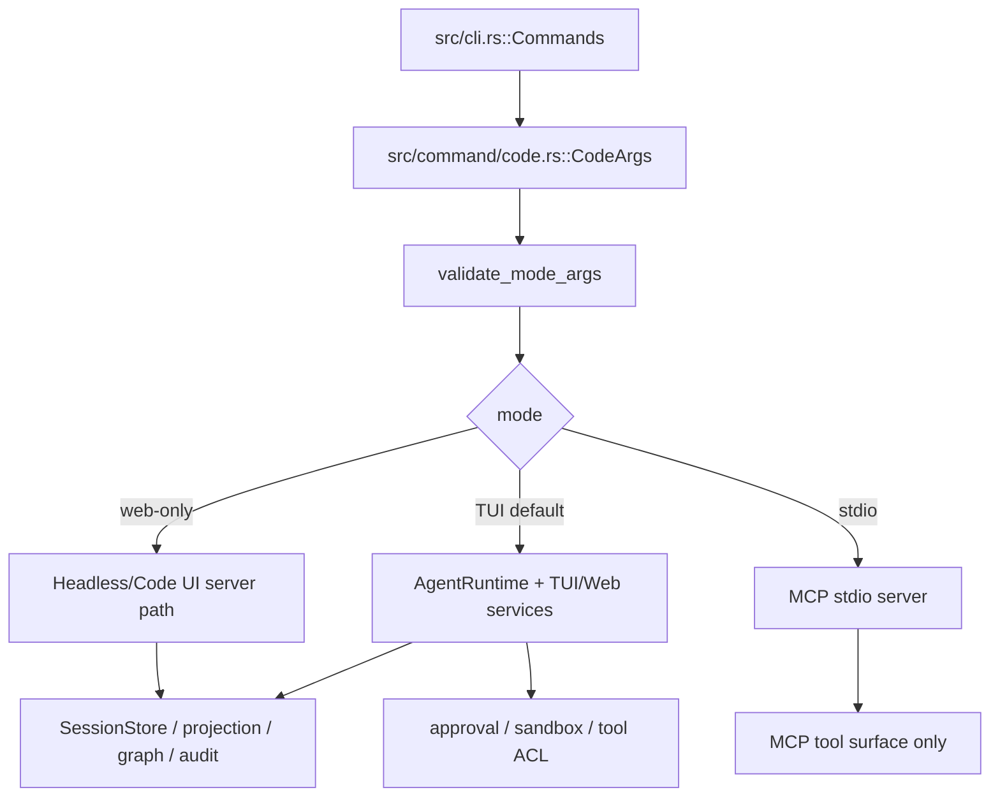

# `libra code` 开发设计

## 文档职责

本文是 `docs/development/tracing/plan.md` 的 Code 阶段目标文档，承接 C1~C8。它只描述 `libra code` 的内部 AgentRuntime、TUI/Web/headless/MCP、approval/sandbox/tool gate、session persistence 与 mutating fix bridge；`libra agent` 的 observed external-agent 捕获、hook、transcript、checkpoint 和 read-only review/investigate evidence 由 [`agent.md`](agent.md) 负责。

内部 AgentRuntime / Web-only 迁移的完整历史计划在 `docs/development/internal/code-agent-runtime.md`。本文只引用该文档中的源码锚点和 fix-bridge 证据，不恢复旧 `docs/development/code-agent-runtime.md`、`docs/development/agent.md` 或 `docs/development/web-only.md`。

## 命令实现目标

`libra code` 的目标是启动人类开发者与 AI agent 协作的受控编码会话。默认模式仍是交互式 TUI + 后台服务；普通请求先进入可审阅的 IntentSpec / 执行计划流程，再由用户确认是否执行。Code 阶段的核心目标不是发明新命令，而是把现有 mode、provider、Web/headless、MCP、session、approval、sandbox 和文档测试契约按源码事实收敛。

## 对比 Git 与兼容性

- 兼容级别：`intentionally-different`。Libra AI extension, not a Git command。
- 该命令属于 Libra 扩展；重点是清晰边界、结构化输出、稳定错误和可测试的 mode/provider 约束，不追求 Git 同形。

## 当前源码事实

- 入口与分发：`src/cli.rs::Commands` 公开接入；`src/command/mod.rs` 导出；主要实现文件是 `src/command/code.rs`，入口为 `execute`。
- 参数模型：`CodeArgs`、`CodeProvider`。`validate_mode_args` 当前负责三类 mode 校验：TUI 默认、`--web`/`--web-only`、`--stdio`。
- `--stdio` 是 MCP stdio transport。源码在 `validate_mode_args` 中明确拒绝 `--control write` 并提示使用 `libra code-control --stdio` 做本地 automation。
- 非 TUI mode 调用 `reject_non_tui_flags(args, mode, web_only)`，该函数按 mode 区分放宽（C2 已落地 C1 对 GAP-1/GAP-3 的 **code behavior** 分类）：
  - `--web`/`--web-only`（`web_only = true`）**放宽** `--provider`（全部 7 个 provider + Codex 分支）、`--model`、`--api-base`、`--temperature` 和 provider-specific tuning flags，使已构建的 headless web runtime / Codex web 分支 CLI 可达；这些 flag 转由 `validate_mode_args` 中的 cross-provider match gate 校验（不匹配的 provider-specific flag 仍拒绝，`--api-base` 在 `--provider=codex` 下仍拒绝）。banner/`BrowserControlMode` 注释/用户文档中的 `--web-only --provider <ollama|codex>` 示例因此变为真实可用。
  - `--stdio`（`web_only = false`）保持**完全锁定** provider/model/api-base/temperature 和 provider-specific flags —— 它是 MCP transport，没有 provider surface。
  - 两种非 TUI mode 都仍拒绝 `--resume`、`--env-file`、`--network-access allow`、`--context`、`--approval-policy`、`--approval-ttl`。其中 `--resume` **按设计仅限 TUI**（见本文第 48 行契约）：C5 已确认这是有意契约而非延后工作——session 层虽保留 headless resume 实现（`load_or_create_headless_web_session_state`），但 `--resume` CLI flag 永不接入非 TUI mode；web-only `--env-file` 的支持因 headless runtime 目前传 `CodeEnvFile::default()` 而**延后**（源码内已加注释说明）。
- provider-specific 约束：`--codex-bin`、`--codex-port`、`--plan-mode=true` 只允许 `--provider=codex`；`--api-base` 在 `--provider=codex` 下被拒绝；Ollama/DeepSeek/Kimi 的 thinking/stream/compact flags 只能用于对应 provider。
- `--control write` 要求 loopback host；control token、control info、browser control 和 Code UI API 的安全边界必须继续由 Code UI / code-control 相关测试守卫。

## Code 阶段契约

| 面向 | 当前结论 | 必须保持 / 补强 |
|---|---|---|
| Mode 与参数 | TUI、web-only、stdio 已共用 `CodeArgs` 和 `validate_mode_args`；C1 审计出的 help/banner 与 web-only provider 校验漂移已由 C2 放宽 web-only provider/model/api-base/temperature + provider-specific flags 消除（`--stdio` 保持锁定）。 | C2 已落地放宽并有 CLI regression（`code_cli_dispatch_test` + `src/command/code.rs::tests` web-only accept/reject 矩阵）；后续任何 mode 变更仍必须带 CLI regression。 |
| Provider / env | provider-specific flags 和 `--api-base` 规则已有校验；live/provider tests 依赖 `.env.test` 时不得泄露 key。 | C3 固定 provider factory、env-file 优先级、Vault/env lookup、missing-key 错误和 feature-gated live tests。 |
| Web-only / Code UI | Code UI API、SSE、browser control、control token、diagnostics redaction 是用户可见接口。 | C4 固定 `/api/code/*` observe-only contract；control token 0600；diagnostics/SSE/control info 不泄露 secrets。 |
| Session / graph | `--resume` 只应在 TUI path 允许；projection、graph handoff、audit sink 不能与 user transcript 混用。 | C5 固定 SessionStore JSONL unknown-event-safe、truncated-tail recovery、graph handoff 和 resume audit。 |
| MCP / code-control | `libra code --stdio` 是 MCP stdio server；`libra code-control --stdio` 是 automation/control client。 | C6 禁止把 MCP stdio 当 turn control plane；双入口 tool set、shutdown、token/lease gate 都要有测试。 |
| Sandbox / approval / fix bridge | workspace mutation 只能走内部 AgentRuntime serialized queue、approval、sandbox 和 tool ACL。 | C7 是 `review --fix` / `investigate fix` 的唯一解锁点；证据不足时 Agent 阶段必须返回 `ERR_AGENT_FIX_BRIDGE_UNAVAILABLE` 对应错误码。 |
| Docs / compat | `libra code` 是 Libra-only extension；用户文档、compat matrix、tests/INDEX 必须与源码同步。 | C8 收敛 `docs/commands/code.md`、zh-CN、`COMPATIBILITY.md`、`tests/INDEX.md`、release notes。 |

## C1~C8 任务映射

| 任务 | 目标 | 关键验证 |
|---|---|---|
| C1 source-grounded audit | 核对 `CodeArgs`、`CodeProvider`、`validate_mode_args`、Code UI routes、MCP stdio、resume、graph、audit sink；输出 code behavior / docs drift / test gap / deliberate difference 清单。 | `rg -n "validate_mode_args|reject_non_tui_flags|CodeUi|HeadlessCodeRuntime|LibraMcpServer|TracingAuditSink|SessionStore" src/command/code.rs src/internal/ai` |
| C2 mode/argument hardening | 固定 TUI/web-only/stdio 的互斥、provider-specific flags、错误消息和 JSON/quiet 行为。 | `cargo test --test code_cli_dispatch_test` |
| C3 provider/runtime/env | 固定 provider factory、Codex runtime、agent profile override、dotenv/Vault/env lookup 和 missing-key errors。 | `cargo test --test code_provider_boot_test`; `cargo test --test code_codex_runtime_test` |
| C4 Web/control/SSE | 固定 Code UI observe-only API、SSE、browser control、control token、diagnostics redaction。 | `cargo test --features test-provider --test code_ui_remote_security_matrix -- --test-threads=1`; `cargo test --test ai_code_ui_wire_test` |
| C5 session/graph/persistence | 固定 resume、SessionStore JSONL、projection bundle、graph handoff 和 audit sink。 | `cargo test --features test-provider --test code_resume_test -- --test-threads=1`; `cargo test --test ai_session_jsonl_test` |
| C6 MCP/code-control | 分离 `libra code --stdio` 与 `libra code-control --stdio`。 | `cargo test --features test-provider --test code_mcp_dual_entry_test -- --test-threads=1`; `cargo test --features test-provider --test code_ui_remote_security_matrix -- --test-threads=1` |
| C7 sandbox/approval/tool gate | 固定 mutating path 的 approval/sandbox/tool ACL；控制 review/investigate fix bridge。 | `cargo test --test code_tool_acl_test`; `cargo test --features test-provider --test code_ui_remote_approval_matrix -- --test-threads=1` |
| C8 docs/compat closeout | 同步 tracing/code、用户文档、compat matrix、tests/INDEX 和 release notes。 | `cargo test --test compat_matrix_alignment`; `cargo test --all` |

（`code_ui_remote_*`、`code_resume_test`、`code_mcp_dual_entry_test` 的真实用例逐项被 `#[cfg(feature = "test-provider")]` 门控，裸跑只编译并通过 1 个 `*_requires_test_provider_feature` 跳过占位测试、未执行任何真实用例；`ai_code_ui_headless_test` 则是整文件 `#![cfg(feature = "test-provider")]` 门控，裸跑编译为 0 个测试。两种形态裸跑都显示"通过"，均不得计为验收证据；完整验证命令口径以 plan.md §6/§9 为准。）

## 还未闭环的功能与风险

| 类别 | 风险 | 当前处理 |
|---|---|---|
| Mode 文档漂移 | ~~help/banner 示例、`docs/commands/code.md` 或本文声称某 web-only provider 组合可用，但 `validate_mode_args` 实际拒绝一切非 Gemini provider~~。**已在 C2 解决**：按 C1 的 code-behavior 分类放宽了 web-only 的 provider/model/api-base/temperature 与 provider-specific flags，Codex + 非 Gemini headless web 分支现已 CLI 可达，banner/文档示例变为真实。 | C2 已落地放宽 + CLI regression（`code_cli_dispatch_test`、`src/command/code.rs::tests` 的 web-only accept/reject 矩阵）；`--stdio` 保持锁定；web-only `--resume` 经 C5 确认为 TUI-only by design（永久拒绝，非延后）、web-only `--env-file` 延后。C4 复核端到端可达性。 |
| Mutating fix bridge | observed external agent 的 review/investigate findings 不能直接改工作区。 | 未找到内部 serialized fix bridge 证据前，Agent 阶段 fix/action 统一 unsupported。 |
| MCP/control 混同 | 把 MCP stdio 当 live turn/control plane 会绕过 token/lease/approval 边界。 | C6 固定 `code --stdio` 与 `code-control --stdio` 分工。 |
| MCP 授权门（Phase-5 scaffold，**延期**，Task C9） | `McpAuthorizer` 门在生产**仅部分接入**：`resources/{list,read,templates}`（`server.rs:186/194/479`）与**部分** `tools/call` 站点（`resource.rs` 至 :2297 一带）走 `authorize_or_error[_with_actor]`，但 **`tools/list` 未接入**（`McpOperation::ListTools` 仅存在于 `authz.rs` 枚举与测试），且**若干 tool impl 完全无 authz 调用**（如 `create_patchset_impl:2354`、`list_patchsets_impl:2423`、`create_evidence_impl:2483`、`create_tool_invocation_impl:2608` 等）。**最关键**：**生产从不安装 handler**（`set_authz` 仅测试调用），`authorize_with_principal_or_error`（`server.rs:144`）在无 handler 时无条件 `Ok(())`——即便对已接入站点，**当前生产 MCP 授权也是 allow-all no-op**。（principal 侧：actor-aware 的 `authorize_or_error_with_actor`（`server.rs:130`）已用 `PrincipalContext::from_actor`；非 actor 的 `authorize_or_error` 仍跑 system principal，见 `server.rs:116`。）C6 只固定 stdio/HTTP 分工与 token/lease，未安装真实授权策略。 | **显式延期**：安装真实授权策略（当前无 handler=allow-all）+ 补齐未接入的 tool impl 与 `tools/list` 授权门 + 非 actor 站点的 principal threading，均为 Phase-5 后续工作；重启条件为落地 `McpAuthorizer` 生产实现并接入 serve 全路径。C6/C7「完成」仅覆盖 stdio 边界与 approval/sandbox/tool-ACL，**不**声称 MCP 授权门已闭环。当前安全边界由 loopback-only + control token/lease + tool ACL 承担。 |
| Web-only headless IntentSpec 审批环（**延期**，Task C10） | `--web-only --provider <非 codex>` 的 headless runtime（`src/internal/ai/web/headless.rs:23-31,78`）把每次 browser submit 当单次直连 turn，**跳过** TUI 的 Phase 0/1 IntentSpec/Plan 审阅-审批环（`code.md`「命令实现目标」的默认契约）。tool ACL/sandbox 仍生效，属 workflow/approval-UX 差异而非裸安全洞。 | **显式延期，非漏实现**：headless 为 direct-turn 契约，Full IntentSpec plan approval 为后续工作（源码注释已注明 will land in subsequent phases）。重启条件为把 TUI Phase 0/1 审批环接入 headless 路径并补 CLI/UI regression。C4「完成」覆盖 observe-only API/SSE/browser-control/diagnostics，**不**覆盖 headless 的 IntentSpec 审批环。 |
| Secret 泄露 | `.env.test`、provider key、control token、diagnostics、SSE、raw transcript 都可能泄露。 | live tests 关闭 xtrace；输出只保留 redacted summary；diagnostics/control/SSE 必测 redaction。 |

## 实现历史

- 2026-02-20 `5bef0a9e`（`invoke mcp interfaces in command code (#212)`）：基础实现节点。
- 2026-06-02 `37d0568c`（`feat(code): activate live-run registry end-to-end (child runner writes, /agents pane reads) (v0.17.1264, CEX-S2-16)`）：live-run registry 演进。
- 2026-06-02 `1723ed00`（`feat(code): wire sub-agent PatchSet store; persist merge candidates from libra code (v0.17.1232, CEX-S2-16)`）：PatchSet / merge candidate 持久化演进。
- 2026-05-31 `a94ee7d0`（`fix(code): record resume audit`）：resume audit 修正。
- 2026-05-30 `8ce6cedd`（`test(code): pin browser control matrix`）：browser control 测试契约。

历史条目只作为背景；当前行为以 C1 当轮源码复核和测试结果为准。

## 维护要求

- 改进本命令前，必须先阅读并遵循 [docs/development/commands/_general.md](../commands/_general.md)。
- 任何行为变更都要先核对实现源码，再同步 `COMPATIBILITY.md`、`docs/commands/code.md`、`docs/commands/zh-CN/code.md` 和相关测试。
- 新增或改变 public flag、JSON 字段、MCP tool、Code UI route、control file、approval/sandbox 行为时，必须明确兼容层级、稳定错误码、用户提示、测试 target 和回滚方式。
