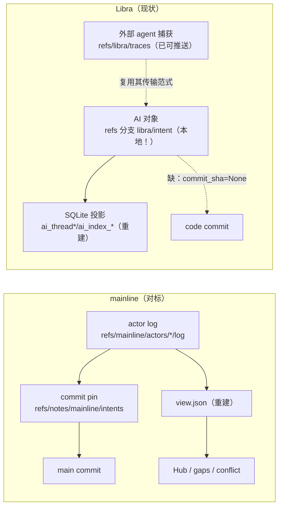
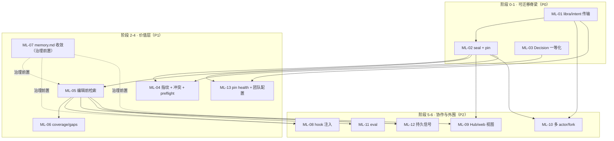
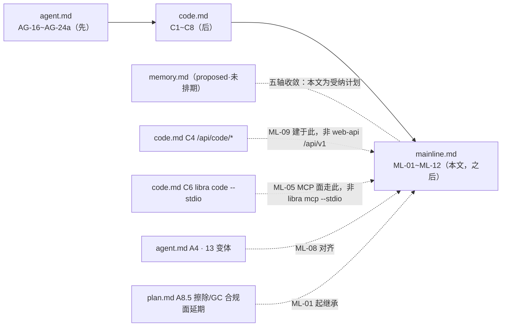

# `mainline` 对标改进计划：为 Libra 打通 git-native 可迁移意图记忆（Intent Portability & Pin）

## 文档职责

本文是 `docs/development/tracing/` 目录下的**独立对标提案**（draft proposal），职责是：以竞品项目 **mainline**（Go 实现的 "Git for the AI era"，把工程意图——目标 / 决策 / 被否方案 / 约束 / 风险 / 遗留项 / 语义指纹——存进 **Git refs + Git notes**，随 fetch / branch / merge / fork 天然流转）为参照系，逐能力对照 Libra 现有与计划中的 AI 意图 / agent / projection 基础设施，给出一份**可落地执行**的改进计划，并明确它相对同目录其他计划的**先后顺序与依赖**。

- 本文是**提案草稿**，与 `memory.md` / `sandbox.md` / `web-api.md` 同类，**不属于** [`plan.md`](plan.md) 固定的 `agent.md → code.md`（AG-16~AG-24a → C1~C8）执行链条。按 `plan.md` §0 规则，本文不得从 `memory.md` / `sandbox.md` / `web-api.md` 引入验收标准；可引用的设计权威只有 [`agent.md`](agent.md) 与 [`code.md`](code.md)（以及它们背后的源码事实源 `docs/development/internal/code-agent-runtime.md`）。
- 本文与 [`memory.md`](memory.md) 存在**五轴重叠**（意图记忆 / 决策证据记录 / 上下文注入 / 约束 / Hub 读视图）。二者的收敛策略在 §9 明确：本文成为「意图可迁移 / commit-pin / recall」这一轴的**受纳计划（committed schedule）**，`memory.md` 由其 owner 对齐，避免出现第三条平行平面。
- **完成判定以代码为准**：本文所有源码锚点均在撰写时经过实测核对（见 §11 源码事实索引）；任何实现推进都必须重新核对锚点，且更新代码时同步更新本文。

## 命令实现目标

Libra 已经拥有 mainline 所需的**绝大部分底层机件**（内容寻址 AI 对象、孤儿分支、CAS 追加、git notes、可推送自定义 ref、SQLite 投影重建、MCP、外部 agent 捕获）。因此本计划的目标**不是移植 mainline 的实现**，而是：

1. 把 Libra 已有的、**局部（local-only）**的意图 / 决策记录，改造成**随仓库流转的团队级可迁移意图平面**；
2. 补齐 Libra 缺失的三块高价值能力——**seal + intent↔commit 绑定（pin）**、**决策的「被否方案 + 理由」一等结构**、**改动前意图检索（intent-before-code）**；
3. 在此基础上增量补齐冲突检测、coverage/gaps、hook 上下文注入、Hub 读视图，最后再做多 actor / fork 协作与 eval。

## 对比 Git 与兼容性

- 兼容级别：`intentionally-different`。这是 Libra 的 AI 扩展平面，不是 Git 命令；不追求与任何 Git 子命令同形。
- 与 mainline 的关系是**概念对标**，不是二进制或线格式兼容：Libra 复用**自身**的 `refs/libra/traces` + `history.rs` 传输/存储范式，**不采用** mainline 的 `refs/notes/mainline/*` 机制（原因见 §5 核心设计决策）。

---

## 1. mainline 是什么（对标对象速览）

mainline 的核心论点：**Git 记录了代码「改了什么」，mainline 把「为什么这么改」也放回 Git**，让下一个 agent 在动手前先读到历史判断（被放弃的路线、被取代的决策、跨越代码本身的约束），从而不重复踩坑、不撤销昨天的决策、不违反没见过的硬约束。

其对象与存储模型：

| mainline 概念 | 内容 | 存储位置 |
|---|---|---|
| Intent（意图记录） | goal / summary(what,why,decisions,rejected) / fingerprint / lifecycle | actor 事件日志 `refs/mainline/actors/<id>/log`（append-only JSON-lines） |
| Materialized view | 由重放 actor 日志重建的只读视图 | `.mainline/view.json`（派生、gitignored） |
| Commit pin | sealed intent ↔ main commit 的绑定 | git notes `refs/notes/mainline/intents`（tree_hash / commit_hash / merge_parent / subject / branch_in_message / goal_text 级联，另有 GitHub PR 后验、backfill、同树 fan-out、manual pin） |
| 持久信号 | constraint（人类确认硬约束，永不截断，按文件重叠继承）/ risk（顾问式，open/resolved/expired）/ followup（显式遗留） | actor 日志事件 |
| Coverage | 每个 main commit ∈ {covered, skipped, uncovered} | 由 pin + skip trailer 派生；`gaps` 命令 |
| Conflict | phase-1 指纹重叠（加权 Jaccard）/ phase-2 agent 语义判定（`check --prepare/--submit`） | 引擎计算 |

其工作流（agent 视角）：`preflight → context(--current/--files/--query) → 读决策/约束/生命周期告警 → 校验意图 vs 代码 → 编辑 → append → seal(--prepare/--submit) → sync（自动 fetch+rebuild+auto-pin+overlap 告警）`。人类侧：`status --actionable / log / show / trace / gaps / hub open`。协作侧：`publish`（推 actor 日志）、`actor import` / `pr-import`（fork 贡献者意图的上游信任导入，只接受 author-seal）。另有 Hub（意图视图的静态 HTML 导出 + GitHub Pages）与 eval（8 场景×3 seed×2 模式，量化「intent-first vs code-first」的价值）。



---

## 2. 对比结论（Libra 现状 vs mainline）

经本轮对 `/Volumes/Data/competition/mainline/mainline` 与 Libra 当前源码的逐锚点核对，四条承重结论：

1. **Libra 不缺 git-native 存储，缺的是意图平面的 git-native「流转」。** 所有 AI 对象（`Intent`/`Task`/`Run`/`Plan`/`PatchSet`/`Evidence`/`ToolInvocation`/`Provenance`/`Decision`）已经是内容寻址 Git 对象，挂在孤儿分支 `libra/intent`（`src/internal/ai/history.rs:72`，以 kind='Branch'、name='libra/intent' 存于 SQLite reference 表），CAS 追加、GC-root 保护，模块文档明言「可经同一协议传输」。**但 `libra/intent` 从不在默认 push/fetch/clone 中出现**（实测 `src/command/{push,fetch,clone}.rs` 均无 `libra/intent`；`clone.rs:3597` 刻意不写 `+refs/*:refs/*`）→ Libra 的意图记录事实上是**本地私有**的。相反，`refs/libra/traces` 已经有可用传输：`libra agent push` 以 `refspec = "{TRACES_BRANCH}:refs/libra/traces"` + `--force-with-lease` 推送（`src/command/agent/push.rs:29-36`）。**机件齐全，管线未接。**

2. **中心问题的答案是「是」，但要走 Libra 自己的 traces/history.rs 范式，不走 mainline 的 git-notes。** 详见 §5。

3. **单点最高价值缺口是 intent↔commit 绑定（pin）。** IntentSpec 在 plan 期被持久化时 `commit_sha: None // Will be set when completed`（`src/internal/ai/intentspec/persistence.rs:54`），完成后从不回填，`commit.rs` 也不写反向 back-link → 意图与它所授权的 diff 是**两个互不相连的对象**。没有 pin，就没有 coverage、没有 seal 时刻的指纹、没有「这段代码为何如此」的可追溯性。

4. **Libra 的决策记录缺「被否方案」结构**——恰是 mainline 的核心价值主张。`agent_run::MergeDecision` 只有单一 verdict（`src/internal/ai/agent_run/decision.rs`），`ai_final_decision` 只存不透明的 `summary_json`（`src/internal/model/ai_final_decision.rs`）；「权衡了哪些备选 / 为何选 X 弃 Y」不可查询。

另有两条工程约束必须贯穿全程：

- **不要在 `agent_run` 模块上盖楼**：它是 schema-only、受 CP-4 门控、藏在 `subagent-scaffold` feature 后（`src/internal/ai/agent_run/mod.rs:5,13`，类型只实现 Serialize/Deserialize）。真正可用（live、已接线）的平面是 orchestrator + `intentspec/persistence.rs` + git-internal AI 对象 + `ai_index_*` SQLite 投影。
- **Libra 的 hook 是「只捕获」方向**（`src/internal/ai/hooks/runtime.rs` 的 `ingest_agent_traces_payload`），与 mainline「向 agent 注入上下文」正好相反；注入是净新增、只读、绝不 mint 意图。

---

## 3. 能力差距矩阵

按类别归并（源自 32 行逐能力对照）。`状态`：has-current（已具备）/ partial（部分）/ absent（缺失）/ different（有意不同）。`价值`/`工作量`：对 Libra 而言。锚点为实测源码位置或计划锚。

### 3.1 存储与传输（storage）

| mainline 能力 | Libra 状态 | Libra 锚点 | 差距与代价 | 价值/量 |
|---|---|---|---|---|
| 意图 git-native 随 fetch/push/merge/fork 流转 | partial | `history.rs:72`（对象可传输）；push/fetch **无** `libra/intent` | 机件在，管线缺；照搬 traces 传输即可 | 高 / M |
| commit pin（notes 绑定意图↔commit，抗 squash/rebase/merge） | **absent** | `persistence.rs:54`（commit_sha=None） | 最大单点缺口；**不走 notes**，走 `history.rs` 结构化事件；需覆盖 mainline 的六级 cascade、GitHub PR 后验、backfill、同树 fan-out、manual pin | 高 / L |
| log→view 重放式物化视图 | has-current | `projection/rebuild.rs:135`（事务化销毁重建） | 已等价；弱点：无 built-from 水位线，判新鲜度需全量重建 | 低 / S |
| per-actor append-only 日志 + CAS ref 更新 | has-current | `history.rs`（CAS）；`agent_run/event_store.rs:82`（run JSONL） | CAS 有；缺**多 actor 身份合流**（traces 单属主 first-writer-wins） | 中 / M |
| note upsert-merge（同一 squash commit 多意图共存） | different | `notes.rs:101`（无 NOTES_MERGE worktree，2-way 行合并） | notes 不用于 pin；同树 fan-out 去重要在 pin writer 里重写 | 中 / M |
| refspec 接线（元数据随普通 git push/fetch 走） | partial | `agent/push.rs`（traces 可推）；`fetch.rs` 硬编码 heads/tags/mr | 出站可任意目的 ref；入站命名空间不可配；线上可行、文件系统级 git-client 互操作不可及 | 中 / M |
| 历史重写后 notes 恢复（migrate notes 重键） | absent | 无 | pin 落地后重写会悬挂 pin，需重键路径；pin 存在前不急 | 低 / M |

### 3.2 生命周期（lifecycle）

| mainline 能力 | Libra 状态 | Libra 锚点 | 差距与代价 | 价值/量 |
|---|---|---|---|---|
| drafting→sealed→proposed→merged→abandoned/superseded/reverted | partial | `intentspec/types.rs`（Active + IntentEvent + 修订链） | 有本地生命周期；缺团队可见的 seal/proposed/merged 推进 | 中 / M |
| **seal**（在 commit/PR 边界冻结 summary+fingerprint） | **absent** | `persistence.rs:25`（plan 期存 Active，从不冻结） | 关键拱心石；pin/指纹/coverage 的前置 | 高 / L |
| 决策记「被否方案+理由」为一等字段 | **absent** | `decision.rs`（单 verdict）；`ai_final_decision.rs`（不透明 summary_json） | mainline 核心价值；需在 **live 平面**的 git-internal Decision 对象上加结构 | 高 / M |
| 持久信号 constraint/risk/followup（open/resolved/expired + 继承） | partial | `intentspec/types.rs`（声明式 per-task 约束）；`profiles.rs`（风险档默认） | 有静态 per-spec 策略块；缺团队共享、带生命周期的信号队列与跨意图继承 | 中 / L |
| backfill（`--commits/--range` 认领既有 commit） | absent | 无 | pin 存在后便宜；救援/coverage 用 | 低 / S |
| abandon/supersede 团队可见事件 | partial | `repair.rs`；`new_revision_chain` | 本地够用；缺随 view 流转的 reason/provenance | 低 / S |

### 3.3 检索 / 冲突 / coverage（retrieval / conflict / coverage）

| mainline 能力 | Libra 状态 | Libra 锚点 | 差距与代价 | 价值/量 |
|---|---|---|---|---|
| 编辑前三模检索（--current/--files/--query） | **absent** | 无（context_budget 是 prompt 窗口分配，非意图检索） | mainline 量化价值集中处；可作为 memory.md recall 在 sealed intent 上的落地 | 高 / L |
| 确定性加性相关度打分器（无 embedding） | absent | `intentspec/scope.rs`（仅文件重叠原语） | 净新增、自包含、可测 | 中 / M |
| 检索态分类（current/superseded/abandoned/stale） | absent | 无 | 需文件 churn 索引 + supersede 边 | 中 / M |
| 高危继承约束在 seal 时浮现 + 确认 | absent | `intentspec/types.rs`（约束仅 per-task） | Hub「改此文件前先读」的承重面 | 中 / L |
| phase-1 确定性指纹重叠冲突检测（加权 Jaccard） | absent | `scope.rs`（仅文件维度） | 依赖 sealed fingerprint 存在 | 中 / L |
| phase-2 agent 语义冲突判定 | absent | 无 | 需 phase-1 在先；可复用 orchestrator | 低 / L |
| 语义指纹（files/subsystems/arch/behavioral/api/tags） | partial | `types.rs`（touchHints/inScope）；`scope.rs` | 有路径 hint，无多维指纹；seal 时挂指纹是冲突+检索共同前置 | 中 / M |
| coverage 分类（covered/skipped/uncovered） | absent | 无（checkpoint 记 parent_commit 但无 rollup） | 硬依赖 pin | 中 / M |
| gaps + 可逆序救援建议 | absent | 无 | coverage 存在后便宜 | 低 / S |

### 3.4 协作 / hooks / Hub-eval / CLI

| mainline 能力 | Libra 状态 | Libra 锚点 | 差距与代价 | 价值/量 |
|---|---|---|---|---|
| 多 actor 身份 + fork 信任导入（author-seal-only） | absent | `agent/push.rs`（单属主）；`publish/ai_export.rs`（单向托管） | 最大工作量、与现模型最不契合；殿后 | 中 / XL |
| team digest 滚动汇总 | absent | 无 | 依赖多 actor 合并视图 | 低 / S |
| hook 作上下文提供者：会话开始注入意图/团队快照 | partial | `hooks/runtime.rs`（只捕获，不回注） | 方向相反；加 SessionStart 只读注入，高价值、增量 | 高 / L |
| skill 分发 + AGENTS.md 托管块 | absent | `internal/ai/skills/`（内部 loader，非外部分发） | 仅在采用 provider 模型时需要 | 低 / M |
| 多 agent hook 适配（Claude/Codex/Cursor/Pi） | partial | `hooks/runtime.rs`（claude+gemini 已接，CHECK 容 7 种）；`agent.md` roster | 增量适配；agent.md 已跟踪 roster | 低 / M |
| 静态 HTML Hub / 意图读视图 + 团队健康 | partial | `publish/ai_export.rs`（单向）；`code.md` C4（`/api/code/*` observe-only） | 复用 web 基建；**必须建在 C4 `/api/code/*`**，不用 web-api.md `/api/v1` | 中 / L |
| webhook 领域事件扇出 | absent | 无 | 净新增、可后置 | 低 / M |
| eval 证明意图记忆可度量价值 | absent | 无（有 L1/L2/L3 分层但无意图价值 eval） | 值得借来立项 + 守检索质量 | 中 / M |
| 统一 JSON envelope + 新鲜度门控 auto-sync | partial | `utils/output.rs`（--json/--machine）；无 auto-sync | 无 team-sync 可门控；传输落地后才相关 | 低 / S |
| doctor / migrate-notes 修复 + 信任诊断 | partial | `agent/`（doctor/clean 已有）；无 notes-migrate | pin + 共享视图存在后再做 | 低 / M |

| preflight 开工门禁（sync stale / base-behind / dirty / overlap） | **absent** | 无 | mainline `preflight.go` 在编辑前阻断 stale view、base-behind、proposed overlap；Libra 无等价 stop-line | 高 / M |
| pin health / 历史重写后 repair-migrate | absent | 无 | mainline `notes_recovery.go` + `doctor`；Libra 不用 notes 但仍需 pin 悬挂诊断与重键 | 中 / M |
| 团队配置（skip patterns / coverage baseline / sync freshness） | absent | `internal/config.rs`（Git config，非 intent 专用） | mainline `.mainline/config.toml` 的 `[mainline.skip]`/`[mainline.coverage]`/`[sync]` 驱动 coverage 与 auto-sync | 中 / S |

**兜底声明（no silent caps）**：本矩阵按类别归并了 **35** 行逐能力对照（§3.1~3.4 各表 + 上表 3 行补遗），未丢弃 mainline 源码中任何承重能力；被降优先级的（migrate-notes、phase-2、digest、webhook、skill 分发、多 agent roster 扩展、lint/trace/log/read、agents.md 托管块、webhook 扇出）在上表或 §14 均保留为独立行并标注了「后置/依赖」，不得被理解为「已覆盖」。

---

## 4. Libra 已具备的可复用机件（避免重复造轮子）

落地前必须先认清 Libra **已有**什么，任务卡一律优先复用：

| 机件 | 源码锚点 | 复用于 |
|---|---|---|
| AI 对象内容寻址 + 孤儿分支 `libra/intent` + CAS 追加 | `src/internal/ai/history.rs`（`AI_REF`、`create_append_commit`、`update_ref_if_matches`） | ML-01 传输、ML-02 pin 事件、ML-03 Decision |
| `refs/libra/traces` 传输范式（refspec + force-with-lease + tracking tip） | `src/command/agent/push.rs:29-40` | ML-01 传输 |
| SQLite 投影事务化重建 | `src/internal/ai/projection/rebuild.rs:135`、`resolver.rs`、`scheduler.rs` | ML-01 fetch 后重投影、各读模型 |
| IntentSpec 规范化/草稿/校验/评审/scope | `src/internal/ai/intentspec/{canonical,draft,validator,review,scope}.rs` | ML-02 seal、ML-04 指纹（scope 文件维） |
| git-internal Intent/Decision 对象 + MCP create | `src/internal/ai/mcp/`、`intentspec/persistence.rs`、`workflow_objects.rs` | ML-02/ML-03 |
| 外部 agent 捕获 + redaction | `src/internal/ai/hooks/runtime.rs` | ML-08 注入（复用 Redactor） |
| 嵌入式 Next.js + 单向 publish 导出 + C4 observe-only API | `src/internal/publish/ai_export.rs`、`src/internal/ai/web/`（C4 /api/code/*） | ML-09 Hub |
| 稳定错误码 + `--json/--machine` 输出 | `src/utils/{error,output}.rs` | 全部命令 |

> 关键取舍已在 §5 定论：**git notes 不复用于 pin**。Libra 的 notes 是「blob 存对象库、(notes_ref,object)→blob 映射存 SQLite `notes` 表」（`src/internal/notes.rs:3-4`），且无 NOTES_MERGE worktree（`notes.rs:101`），不按 git 标准 notes-tree 往返；`ConfigKind` 仅 Branch/Tag/Head（`src/internal/model/reference.rs:37`，无 Note/Intent 种类）。

---

## 5. 核心设计决策：git-native「流转」走 traces/history.rs 范式，不走 git-notes

这是本计划的拱心石决策，所有存储类任务卡都以它为前提。

**中心问题**：Libra 是否应把意图 / 决策记录从「SQLite 本地」变为「git-native 团队可迁移」？

**结论：是——但通过 Libra 自己的 `refs/libra/traces` + `history.rs` 提交链范式实现，而非移植 mainline 的 `refs/notes/mainline/*` 机制。**

理由（均经实测）：

1. **mainline 的 notes 机制在 Libra 里有硬摩擦**：Libra 的 ref 存于 SQLite（`ConfigKind` 仅 Branch/Tag/Head，无「Note」种类，`reference.rs:37`），没有 git 客户端可见的磁盘 `refs/notes/*` fanout tree；Libra notes 的映射在 SQLite 侧表、且做的是非 git 的 2-way 行合并（`notes.rs:3,101`）。把 pin 建在 notes 上会立刻撞上这层摩擦，且无法与外部 git 客户端标准 notes 互操作。
2. **Libra 已有等价且更契合的机件**：`refs/libra/traces` 是可用的提交链结构化存储（`history.rs` 的 write-tree / CAS），且**已经**经 `libra agent push` 以 `--force-with-lease` 流转。`libra/intent` 上的 AI 对象本就内容寻址、「可经同一协议传输」（`history.rs:72`）。
3. **因此**：把 pin 实现为 `libra/intent` 上的**结构化 `Pin`/`SealedEvent` 事件对象**（复用 `history.rs`），squash/rebase 抗性用「同树 fan-out」在 pin writer 里显式处理（对应 mainline `merge.go` 的语义，但不继承 notes 引擎）；可选再向 code commit 写一个 `Libra-Intent:` trailer，仅为纯 git 可见性。

**边界与继承的约束**：任何被推送的意图/决策平面都继承 Libra 现有的**合规实现面延期**——擦除 / 保留期 / GC 被 `plan.md` 归入 **Task A8.5**（`plan.md` 第 63/80 行：audit 表 / `--allow-raw` / retention / GC / erasure，明确「不得降级为纯文档验收」），且本地删除不保证传播到云端 durable tier（`object_index` → D1/R2，见 `agent.md` 关于 disable 不删除已捕获数据的约束）；本计划不得对可迁移意图平面宣称比现有 traces 平面更强的擦除保证。此外，Libra 现有的声明式 provenance/seal 字段（`types.rs` 的 `embedIntentSpecDigest`/`requireSlsaProvenance`/`transparencyLog`）是**策略位，无人计算摘要/签名**；唯一真正落地的完整性原语是内容寻址对象 id。ML-02 若要宣称「sealed / 防篡改」，必须落地真实的 digest/seal 步骤（当前缺失）。

---

## 6. 改进任务分解（ML-01 ~ ML-13）

每张卡格式：目标 / 范围（触达文件）/ 依赖 / 迁移与兼容 / 稳定错误码 / 验收与测试 / 风险。优先级 P0=可迁移脊梁，P1=价值层，P2=协作与外围。

### ML-01（P0）打通 `libra/intent` 团队传输（对齐 traces 范式）

- **目标**：让 `libra/intent`（`AI_REF`）像 `refs/libra/traces` 一样可 push/fetch，使意图/决策对象随仓库流转；SQLite 投影退化为纯可重建缓存，fetch/merge 后重投影。
- **范围**：新增 AI_REF 的推送路径，仿 `src/command/agent/push.rs`（refspec `libra/intent:refs/libra/intent`，`--force-with-lease` 对齐已记录的 tracking tip）；复用 `src/internal/ai/history.rs` 追加/CAS；在 `src/command/fetch.rs` 增加接收侧命名空间持久化（现仅路由 heads/tags/mr）；fetch 后触发 `src/internal/ai/projection/rebuild.rs` 重投影。附带小增强：给投影记 built-from 水位线（`libra/intent` head commit），使「视图是否新鲜」无需全量重建。
- **依赖**：无（traces 传输 + history.rs 机件已在）。
- **迁移与兼容**：新增 ref 命名空间为增量；接收侧对未知 `refs/libra/*` 采默认忽略→显式持久化，需声明 schema/protocol 窗口。存量单机仓库无 `libra/intent` 远端时命令须 no-op 且明确提示。
- **稳定错误码**：新增 `LBR-INTENT-00x`（远端拒绝 / lease 失配 / 非快进发散），登记 `docs/error-codes.md`（`compat_error_codes_doc_sync` 守卫）。
- **验收与测试**：新增 `tests/ai_intent_transport_test.rs`：两仓库间 push→fetch→重投影往返、force-with-lease 拒绝非快进、投影从 fetch 后的 head 重建一致；`rg -n "libra/intent" src/command/push.rs src/command/fetch.rs` 应从「无」变「有」。三门禁（fmt/clippy/`cargo test --all`）全绿。
- **风险**：不得与 `code.md` C6 的 MCP 传输、plan.md A8.5 擦除/GC 合规面延期冲突；多 actor 合流不在本卡（ML-10）。

### ML-02（P0）seal + intent↔commit pin（关闭 `commit_sha=None`）

- **目标**：新增 seal 转移——在 commit/PR 边界冻结 IntentSpec + summary + fingerprint，并写一个把它绑定到 code commit SHA + tree hash 的 `Pin`；这是 mainline 单点最高价值能力。
- **范围**：扩展 `src/internal/ai/intentspec/persistence.rs` 在 seal 时回填 `commit_sha`；在 `AI_REF` 上经 `history.rs` 新增 `Pin`/`SealedEvent` 结构化对象（**非 git note**），具体 schema 见 §12.6.1；pin writer 必须实现 mainline 源码中实际存在的策略集合：`tree_hash`、`commit_hash`、`merge_parent`、`subject`、`branch_in_message`、`goal_text`、GitHub PR 后验 `gh_pr_merge`、`backfill_commits` 覆盖、同树 direct-neighbor fan-out、以及 manual pin 兜底。可选在 `src/command/commit.rs` 写 `Libra-Intent:` trailer 供纯 git 可见。fingerprint 文件维复用 `intentspec/scope.rs::effective_write_scope`。落地真实 digest/seal 步骤（见 §5 边界）。
- **依赖**：ML-01（使 pin 随仓库流转）。
- **迁移与兼容**：存量以 `commit_sha=None` 持久化的 IntentSpec 需可读且可被 backfill（见 ML-06 backfill）；trailer 为增量、不改 commit 语义。
- **稳定错误码**：`LBR-INTENT-01x`（seal 于脏工作树未 --allow-dirty / pin 目标 commit 不存在 / 同 commit 冲突意图）。
- **验收与测试**：`tests/ai_intent_seal_pin_test.rs`：seal 冻结后 summary/fingerprint 不可变、pin 绑定 commit+tree、squash 后同树 fan-out 仍命中、rebase 后 subject 命中、merge commit 第二父命中、GitHub merge-message branch 命中、manual pin 兜底可审计、trailer 可解析；`persistence.rs` 不再出现 `commit_sha: None` 的完成态路径。
- **风险**：seal 触发时机要清晰（commit / PR 边界，类比 mainline `seal --submit`）；「防篡改」宣称必须有真实 seal 步骤支撑。

### ML-03（P0）决策一等化：结构化「被否方案 + 理由」

- **目标**：把「权衡了哪些备选 / 为何选 X 弃 Y」提升为 git-internal Decision 对象的一等字段，随意图平面 seal/pin/流转。
- **范围**：扩展 **live 平面**的 git-internal `Decision` 对象 + orchestrator/`persistence.rs`，携带 `alternatives[] { option, rationale, rejected_reason }`；在 `ai_final_decision` 旁加投影列/表供查询；在 seal/pin 中随 commit 流转。**严禁**建在 `agent_run`（schema-only、CP-4 门控、`subagent-scaffold` feature 后）。
- **依赖**：与 ML-02 配套；独立于 ML-01。
- **迁移与兼容**：`ai_final_decision.summary_json` 保留，新增结构化字段为叠加；投影列走 `sql/migrations/` 幂等前向 + `_down.sql`。
- **稳定错误码**：复用 seal 路径错误码；无新增网络码。
- **验收与测试**：`tests/ai_decision_alternatives_test.rs`：可写入/查询 rejected 备选与理由、随 pin 流转、投影可重建；`rg -n "alternatives" src/internal/ai/agent_run` 应仍为空（未误建在 scaffold）。
- **风险**：勿触碰 CP-4 门控的 scaffold；决策来源需标注 provenance。

### ML-04（P1）语义指纹 + phase-1 冲突 + preflight 开工门禁

- **目标**：sealed intent 带多维指纹后，在 seal/sync 时用加权 Jaccard 对「并发竞争工作」出粗粒度告警（screen）；并提供 `libra intent preflight` 作为 agent 编辑前的 stop-line（对应 mainline `preflight.go`）；phase-2 语义评审留作后续。
- **范围**：
  - 给 sealed IntentSpec 加 fingerprint 结构（files/subsystems 从 `scope.rs` 派生；behavioral/api 尽力而为）；新增加权 Jaccard 打分器（full fingerprint 权重对齐 mainline `conflict.go`：files .30、subsystems .25、architecture .15、behavioral .15、api .10、tags .05；draft partial 用 0.40 file + 0.40 keyword + 0.20 subsystem），在 seal/sync 时对 proposed + base 之后 merged 的意图跑重叠；置于 `src/internal/ai/intentspec/` 或新 `intent/conflict` 兄弟模块。
  - 新增 `libra intent preflight`（`src/command/intent.rs`）：至少覆盖 mainline 的 `not_initialized`、`identity_missing`、`sync_stale`、`branch_drift`、`active_intent_base_behind`、`dirty_without_commit_diff`、`proposed_overlap`、`upstream_merged_overlap`、`goal_text_overlap`；输出 `ok_to_continue` + `findings[]` + `overlaps[]` + `recommended_next[]`（JSON 形态对齐 mainline `PreflightResult`）。Libra 无 notes，**不实现** `notes_rewrite_drift`，改以 `projection_stale` / `pin_dangling` 等价诊断（见 ML-13）。
  - 新增 `libra intent check [--prepare|--submit]` 作为 phase-2 入口（prepare 生成候选对，submit 写 judgment event）；本卡只搭入口与事件 schema，语义判定可后置。
- **依赖**：ML-02（seal/fingerprint）；ML-01（sync stale 判定需 watermark）。
- **稳定错误码**：`LBR-INTENT-02x`（preflight hard-stop / check prepare 无效输入）。
- **验收与测试**：`tests/ai_intent_conflict_phase1_test.rs` + `tests/ai_intent_preflight_test.rs`：指纹重叠命中/阈值/假阳性调参；preflight 在 sync_stale/base_behind/proposed_overlap 时 `ok_to_continue=false`；确定性、无 embedding。
- **风险**：假阳性调参；behavioral/subsystems 派生的可靠性是难点；preflight 必须在 ML-05 检索之前可用（否则 agent 会在 stale view 上检索）。

### ML-05（P1）改动前意图检索（context modes + 相关度打分器）

- **目标**：给 agent「编辑前先读相关 sealed intent/decision」的读面——确定性（无 embedding）加性打分器 + 检索态叠加（current/superseded/abandoned/stale）。这是 mainline 量化价值集中处（eval CF-IF delta）。作为 `memory.md` recall 在 sealed intent 上的**具体落地**，而非平行系统。
- **范围**：在投影 + sealed intent 上建读面（query/files/current 三模），CLI/MCP 规格见 §12.6.2/12.6.3；打分器基于 `scope.rs` 文件重叠 + subsystem + title/what/why/decision 关键词 + open risk/followup + recency + same-thread + supersession lineage，保持确定性、无 embedding。检索态分类器（stale 由 age/file-churn，superseded 由 lineage）。经 CLI 与 MCP 暴露——MCP 走 `code.md` C6 的 `libra code --stdio`，**不用** `memory.md` 提议的 `libra mcp --stdio`。
- **依赖**：ML-02（有 sealed 记录可检索）；projection（has-current）；**与 memory.md recall/inject 收敛**（§9）。
- **验收与测试**：`tests/ai_intent_retrieval_test.rs`：三模检索、打分确定性可复现、检索态正确、abandoned/superseded/stale 命中告警、superseded lineage 不被阈值误丢、human-promoted constraint 永不截断；MCP 面经 C6 stdio 而非 `libra mcp --stdio`。
- **风险**：依赖 seal+pin；与 memory.md 重叠必须先按 §9 定案再实现。

### ML-06（P1）coverage / gaps over main commits

- **目标**：pin 到位后回答「哪些 main commit 没有意图记录」，并给可逆序救援（backfill/skip）。
- **范围**：coverage 分类器（有 live sealed pin=covered；pre-Libra baseline=skipped，读 `.libra/intent.toml` 的 `[intent.coverage] baseline_commit`；`Libra-Skip:` trailer 或 `[intent.skip] patterns` 匹配 subject=skipped；否则 uncovered；**covered 优先于 skip**，对齐 mainline `coverage.go`）+ `libra intent gaps` 命令；skip trailer 必须带非空 reason；abandoned/reverted intent 的 pin 不算 covered；复用 `agent_checkpoint.parent_commit` 约定；附带 backfill（`--commits/--range` 认领既有 commit，对应 ML-02 存量回填）。
- **依赖**：ML-02（pin）；ML-13（团队配置 baseline/skip patterns）。
- **验收与测试**：`tests/ai_intent_coverage_test.rs`：covered/skipped/uncovered 三态、covered 优先级高于 skip、空 skip reason 不生效、baseline skip、生效 pin 指向 abandoned intent 时转 uncovered、gaps 列表、backfill 认领后转 covered。
- **风险**：硬依赖 pin。

### ML-07（P1）与 memory.md 收敛，确立 mainline.md 为该轴受纳计划

- **目标**：解决 §9 五轴重叠，避免第三条平行平面。把 ML-01~ML-06 表述为 `memory.md` Phase A（可审计存储）+ Phase B/C（recall/inject）在「意图-pin 轴」的具体优先落地，本文成为该轴 committed schedule；`memory.md` owner 随后对齐其枚举（A4 已加 SubagentStart/End=13 变体，`memory.md` 的 11 变体断言过时）、MCP 传输（C6 `libra code --stdio`）、web 契约（C4 /api/code/*）。
- **范围**：文档级——本文引用 agent.md/code.md 为唯一设计权威；对五轴逐条给「subsume（收纳）/ defer（各自保留）」决策；标注 memory.md 欠对齐的枚举/MCP/web 项。具体执行清单见 §12.7。
- **依赖**：无（是 ML-05/ML-08/ML-09 的治理前置）。
- **验收**：§9 决策表落定；§12.7 跨文档收敛执行清单完成；`memory.md` 头部补 out-of-scope banner（由其 owner 执行，本文只声明冲突项）。

### ML-08（P2）hook 上下文注入：会话开始向外部 agent 注入意图快照

- **目标**：给 `hooks/runtime.rs` SessionStart 增加「渲染并发出上下文块」（脱敏后的意图/决策/约束快照），把 mainline eval 证明有效的「写前先读」上下文给到外部 agent。方向与现有「只捕获」相反，是净新增。
- **范围**：扩展 `src/internal/ai/hooks/runtime.rs` 的 SessionStart 渲染（类比 mainline dispatcher 的 RenderSessionStartContext）：先做机械 sync/status/context snapshot，再把只读 markdown/JSON 上下文交给 provider；**严守只捕获边界**——注入只读、绝不 mint intent/append/seal；内容过默认 Redactor；尊重 A4 的 13 生命周期变体。
- **依赖**：ML-05（选注入什么）；与 memory.md `with_memory` 注入收敛（§9）。
- **验收与测试**：`tests/ai_hook_context_injection_test.rs`：SessionStart 注入只读、脱敏、不写任何意图对象、13 变体对齐。
- **风险**：与 memory.md §8.5 `with_memory` 重叠；不得模糊捕获/注入边界。

### ML-09（P2）Hub / web 意图读视图 + digest（建在 C4 /api/code/*）

- **目标**：把可迁移意图平面变成共享只读读面（按文件约束、决策、coverage、关系、team digest），即 mainline 的 Hub。
- **范围**：sealed intent/pin/decision 的读模型 + 页面；扩展 C4 的 `/api/code/*` 路由（`src/internal/ai/web/`）与嵌入式前端；digest 汇总命令；可选扩展 `publish/ai_export` 做静态导出。**必须建在 C4 observe-only `/api/code/*`**，**不采用** web-api.md 的 mutating `/api/v1`（plan.md 冲突）。
- **依赖**：ML-02（pin）、ML-05（检索/打分）。
- **验收与测试**：`tests/ai_intent_hub_test.rs` + C4 wire 测试扩展；确认无 `/api/v1` 引入。
- **风险**：必须复用 C4 契约，不得引入 web-api.md /api/v1。

### ML-10（P2）多 actor 合流 + fork 信任导入（殿后）

- **目标**：mainline 的 per-actor 日志 + fork 导入（author-seal-only 信任边界）；与 Libra 现「单属主 per-ref traces（first-writer-wins）」最不契合，工作量最大，放最后。
- **范围**：把单属主 traces 模型扩展为 `libra/intent` 上的 per-actor 日志命名空间；跨 actor 的 merge/view-fold（类比 `projection/rebuild.rs` 但跨 actor）；导入命令带 author-seal-only 校验边界，只接受对方 actor 自己写出的 sealed/superseded/abandoned 事件，要求 source head 不漂移、目标 ref 祖先检查、import staging ref、导入分支对象抓取与 provenance event。触达面大（history.rs / protocol / projection）。
- **依赖**：ML-01、ML-02（传输 + sealed 记录）。
- **验收与测试**：`tests/ai_intent_multiactor_test.rs`：多 actor 日志合并成一致视图、fork 导入只接受 author-seal、拒绝 fork 侧约束/风险提权。
- **风险**：需扩展单属主模型；面大，务必在单仓库脊梁（ML-01~06）验证后再动。

### ML-11（P2）eval 谐架：证明并守护意图记忆价值

- **目标**：借 mainline 的方向性证据谐架（fixtures + 检索前置 + LLM-as-judge + CF-IF delta）立项并回归守护检索质量。契合 Libra L1/L2/L3 分层。
- **范围**：fixture 目录 + 基于 ML-05 检索的确定性检索前置打分器 + 可选 LLM-as-judge（L3，`test-live-ai` 门控）；新 `tests/` 区。
- **依赖**：ML-05（检索面）。
- **验收**：确定性部分 L1 可跑；live-judge 部分缺 key 打印 skip 不失败（`env_var_is_set` 模式）。

### ML-13（P1）pin health / repair + 团队 intent 配置

- **目标**：补齐 mainline `doctor` + `notes_recovery.go` 在 Libra pin 模型下的等价能力；并提供团队级 skip/coverage/sync 配置，驱动 ML-06 coverage 与 ML-01 auto-sync 门禁。
- **范围**：
  - `libra intent doctor` 扩展：诊断 projection watermark 滞后、`libra/intent` head 与远端 tracking tip 发散、历史重写（rebase/filter-branch）后 pin 悬挂、同 commit 多 pin 冲突。
  - `libra intent repair [--migrate-pins]`：对悬挂 pin 尝试 cascade 重匹配（复用 ML-02 pin writer）；失败列出需 manual pin 的 commit。
  - 团队配置：新增 `.libra/intent.toml`（提交到仓库）+ `.libra/intent-local.toml`（gitignore，per-developer actor 身份），字段对齐 mainline `domain/config.go` 的子集：`[intent.coverage] baseline_commit`、`[intent.skip] patterns`、`[sync] freshness_seconds`（默认 300）、`[check] phase1_threshold`（默认 0.10）。读取入口 `src/internal/ai/intent/config.rs`。
- **依赖**：ML-02（pin cascade）；ML-01（tracking tip / watermark）。
- **验收与测试**：`tests/ai_intent_doctor_repair_test.rs`：rebase 后 doctor 报告 dangling pin、repair 重键成功或给出 manual 建议；baseline_commit 使祖先 commit 分类为 skipped。
- **风险**：repair 不得静默丢弃 pin；迁移必须可审计。

### ML-12（P2，可选）持久信号 constraint/risk/followup 生命周期

- **目标**：把 IntentSpec 的静态 per-task 约束升级为团队共享、带 open/resolved/expired 生命周期的信号队列，含人类确认的 guard 层与按文件重叠的继承。
- **范围**：在意图平面加信号事件（constraint/risk/followup）+ 生命周期状态机 + seal 时高危继承约束浮现（配合 ML-05 检索）。mainline 源码已把 durable signal 写入与 seal 解耦：constraint 只能由 human guard 创建，risk/followup 需结构化 validation，seal 只能原子 resolve 风险/遗留项；Libra 若实现 ML-12，必须保留这个边界，不能让模型在 seal summary 里直接创建硬约束。
- **依赖**：ML-02、ML-05；**与 memory.md `procedural.*` 规则轴重叠，先按 §9 收敛再建**。
- **风险**：最易与 memory.md 重复；未收敛前不得实现。

---

## 7. 内部执行顺序（阶段图）



固定内部序：**(0) 传输 ML-01 →(1) seal+pin+Decision ML-02/03 →(2) 指纹/冲突/preflight ML-04 →(2b) pin health+团队配置 ML-13 →(3) 检索 ML-05 →(4) coverage ML-06 →(5) hook 注入 & Hub ML-08/09 →(6) 多 actor/fork & eval & 信号 ML-10/11/12**。理由：pin 依赖 seal；preflight 必须在检索前；冲突/检索/coverage/Hub/注入都依赖「可流转的 sealed 记录」；多 actor 是最大工作量、与单属主模型最不契合，殿后。ML-07 是 ML-05/08/12 的**治理前置**（先与 memory.md 定案再动重叠轴）。

---

## 8. 相对同目录其他计划的先后顺序（跨文档 ordering）

本文严格遵守 `plan.md` §0 的执行纪律，八条约束：

1. **整体排在 plan.md 固定链之后**：mainline.md 必须排在 `plan.md` 已受纳的 `agent.md`（AG-16~AG-24a 外部捕获）**整体完成** → `code.md`（C1~C8 内部 runtime）**整体完成**之后，且**不得**与其中任一阶段交错插入。plan.md §0/§10 以代码+测试判完成，新平面不得插队或劈开在途的 Agent/Code 环。
2. **内部严格阶段序**：见 §7（0→6）。
3. **不得引入三份 out-of-scope 草稿的验收项**：mainline.md 不得从 `memory.md` / `sandbox.md` / `web-api.md` 引入验收标准或实现项；可引用的设计权威仅 `agent.md` / `code.md`（plan.md §0 明确三者为 out-of-scope draft 且有已知冲突）。
4. **与 memory.md 五轴收敛**：把 ML-01~ML-06 作为「意图-pin/recall 轴」的 committed schedule，memory.md（proposed、未排期、无 §10 schedule）对齐之，避免第三平面（§9）。
5. **任何 Hub/web 视图建在 C4**：只用 `code.md` C4 的 observe-only `/api/code/*`，**绝不**用 `web-api.md` 的 mutating `/api/v1`（plan.md 已标为冲突并留待独立仲裁）。
6. **任何意图检索 MCP 面走 C6**：走 `code.md` C6 的 `libra code --stdio`（及 `libra code-control --stdio`），**不用** `memory.md` 提议的 `libra mcp --stdio`（plan.md 记为与 C6 冲突）。
7. **hook 注入对齐 A4 的 13 变体**：ML-08 必须对齐 `agent.md` A4 落地的 13 个 LifecycleEventKind（新增 SubagentStart/SubagentEnd）；memory.md 的 11 变体断言已过时；注入严格只读、绝不 mint 意图，保持 hook 只捕获边界。
8. **继承合规面延期（Task A8.5）**：任何被推送的意图/决策平面（ML-01 起）继承 plan.md 把擦除/保留期/GC 归入 Task A8.5 的延期（plan.md 第 63/80 行），且本地擦除不保证传播到云端 durable tier（object_index→D1/R2），不得宣称比 traces 平面更强的擦除保证。



---

## 9. 与 memory.md 的关系与五轴收敛

`memory.md` 是 Libra **自己**的近似提案：git-native `refs/libra/memory*`、`MemoryNote`/`MemoryEvent`、可重建 SQLite 投影、跨平面 `evidence_refs` 指向 git-internal Decision/Run/Evidence、branch-aware 查询、`with_memory` prompt 注入、Phase-E web 视图——与 mainline 在**五轴**重叠。它未开始、未排期（out-of-scope of plan.md，无 §10 schedule）。为避免出现「memory.md 平面 + mainline 平面 + 现有 intentspec 平面」三条平行结构，收敛决策如下（ML-07 落定）：

| 重叠轴 | mainline 视角 | memory.md 视角 | 收敛决策 |
|---|---|---|---|
| 意图记忆存储（git refs + 投影重建） | actor log + view.json | `refs/libra/memory*` + MemoryNote/Event | **共用底座**：都落在 `libra/intent` 传输（ML-01）+ projection 重建；memory 若需独立 ref 命名空间，复用 ML-01 的传输/接收机制，不另造传输 |
| 决策/证据记录 | Decision(rejected/rationale) | `evidence_refs` 指向 Decision/Run/Evidence | **本文主导**：ML-03 在 live git-internal Decision 上加结构；memory 的 evidence_refs 指向同一对象，不重定义 |
| 上下文注入 | hook 会话开始注入 | `with_memory` prompt 注入 | **合流为一条注入管线**：ML-08 SessionStart 注入 = memory `with_memory` 的落地；先按本轴定案再实现（ML-07 前置 ML-08） |
| 约束 | constraint/risk/followup 队列 | `procedural.*` 规则轴 | **先收敛后建**：ML-12 与 memory 的 procedural 规则轴重叠，未定案不实现 |
| Hub / 读视图 | 静态 HTML Hub | Phase-E web 视图 | **共用 C4**：都建在 code.md C4 `/api/code/*`；ML-09 与 memory Phase-E 合为一个读面 |

**归属**：本文成为「意图可迁移 / pin / recall / 注入 / 约束」这些轴的 **committed schedule**；`memory.md` 头部**已有** out-of-scope banner（其 §0 第 3 行已注明 11→13 变体与 `libra mcp --stdio`→C6 两处冲突），owner 另需在其正文对齐枚举描述（§ 887 行的 11 变体）、MCP 面（§ 1036 行的 `libra mcp --stdio` 改走 C6）、web 契约（走 C4）。修订 memory.md 的设计断言由其 owner 负责，不在本文范围。

---

## 10. 风险与未闭环项

| 类别 | 风险 | 当前处理 |
|---|---|---|
| 传输与云删除 | 推送意图平面后本地擦除不保证传播到 D1/R2 | 继承 plan.md 合规面延期（Task A8.5，第 63/80 行）；不宣称强擦除；ML-01 文档明记 |
| notes 误用 | 若有人用 git notes 实现 pin，会撞 ConfigKind/SQLite 侧表/无 NOTES_MERGE 摩擦 | §5 定论：pin 走 history.rs 结构化事件，**禁用** notes；ML-02 验收含「无 notes 依赖」检查 |
| 建错平面 | 在 CP-4 门控的 `agent_run` scaffold 上建决策/pin 会被 feature gate 挡住且非 live | §2/§4 明令用 orchestrator + persistence.rs + git-internal 对象；ML-03 验收含「scaffold 无 alternatives」反向检查 |
| seal 语义 | 无真实 digest/签名却宣称「防篡改」 | ML-02 必须落地真实 digest/seal；否则只宣称「内容寻址完整性」 |
| memory.md 重复 | 不收敛会造第三平面 | ML-07 治理前置，五轴决策先落定（§9） |
| 多 actor 契合度 | 现单属主 first-writer-wins（runtime.rs:650）与多 actor 合流不契合 | ML-10 殿后，单仓库脊梁验证后再动 |
| 冲突假阳性 | phase-1 指纹重叠误报干扰 agent | ML-04 定为粗筛 screen；阈值可调；phase-2 语义评审后置 |
| ref 命名一致性 | `reference.rs:13` 文档注释列出「Intent」种类，但 `ConfigKind` 枚举（:37）实为 Branch/Tag/Head——注释与实现漂移；规范存法为 `AI_REF="libra/intent"`、kind='Branch' | 实现以 `history.rs::AI_REF` 为唯一事实源；ML-01 落地时顺手订正 `reference.rs:13` 注释漂移 |
| 历史重写悬挂 pin | rebase/filter 后 pin 悬挂 | migrate-notes 类重键路径列为后置（pin 落地并观察到重写后再做） |

---

## 11. 源码事实索引（撰写时实测核对）

以下锚点为本文承重结论的证据，实现推进前必须重新核对：

- `src/internal/ai/history.rs:72` — `AI_REF = "libra/intent"`，所有 AI 对象（Intent/Task/Run/Plan/PatchSet/Evidence/ToolInvocation/Provenance/Decision/ContextFrame/...）挂此孤儿分支，以 kind='Branch'、name='libra/intent' 存于 reference 表，CAS 追加、GC-root。完整类型清单见 `src/command/cat_file.rs:154-191`。
- `src/command/{push,fetch,clone}.rs` — 实测**无** `libra/intent`；`clone.rs:3597` 刻意不写 `+refs/*:refs/*` → 意图平面本地私有。
- `src/command/agent/push.rs:30-83` — traces 传输范式：`TRACES_REMOTE_REF="refs/libra/traces"`、`refspec="{TRACES_BRANCH}:refs/libra/traces"`、用 last-pushed tip 构造 `--force-with-lease`（ML-01 直接对齐；原 `src/command/agent/push.rs:29-36` 只覆盖常量定义，lease 逻辑在 :49-83）。
- `src/command/agent/session.rs` — `libra agent session promote` 可把捕获的外部 agent session 手动复制到 `refs/libra/intent`，但这只是**人工**入库路径，不改变默认 push/fetch/clone 不传输 `libra/intent` 的事实。
- `src/command/op.rs:634-658` — `prune_candidates` 把 `libra/intent`、`libra/traces`、`libra/src`、`libra/target` 列为受保护内部 ref，禁止被 prune/restore 清理。
- `src/internal/ai/intentspec/persistence.rs:54` — `commit_sha: None, // Will be set when completed`（pin 缺口）。
- `src/internal/ai/agent_run/mod.rs:5,13` — 「schema-only … gated on CP-4」，类型仅 Serialize/Deserialize，藏在 `subagent-scaffold` feature 后（禁止在其上建）。
- `src/internal/ai/runtime/phase4.rs:510-524` — 内部 runtime 的 live `FinalDecision` 同样只有 `verdict` + `FinalDecisionSummary { route, risk_score, rationale }`，无 alternatives / rejected 结构，强化 ML-03 必须改 live 平面。
- `src/internal/model/reference.rs:37` — `ConfigKind` 仅 Branch/Tag/Head（无 Note/Intent 种类）；`reference.rs:13` 注释仍写 "Branch, Tag, Head, Intent"，与实现漂移。
- `src/internal/notes.rs:3-4,101` — notes blob 在对象库、(notes_ref,object)→blob 映射在 SQLite `notes` 表、无 NOTES_MERGE worktree、2-way 行合并（notes 不用于 pin 的依据）。
- `src/internal/ai/projection/rebuild.rs:135` — 事务化销毁重建投影（log→view 已等价，has-current）。
- `src/internal/ai/agent_run/decision.rs`、`src/internal/model/ai_final_decision.rs` — 决策仅单 verdict / 不透明 summary_json（ML-03 依据）。
- `src/internal/ai/hooks/runtime.rs`（`ingest_agent_traces_payload`）— hook 只捕获、不回注（ML-08 是反方向净新增）。
- `src/internal/ai/intentspec/scope.rs::effective_write_scope` — 文件重叠原语（ML-02 指纹文件维 / ML-04 Jaccard 复用）。
- 竞品事实源：`/Volumes/Data/competition/mainline/mainline` 的 `docs/specs/{intent-record-v0,agent-context-protocol-v0}.md`、`docs/reference.md`、`internal/engine/{seal,pin,notes,conflict,coverage,context_retrieval}.go`、`internal/cli/`、`internal/hub|webhook|eval/`（对标源，非 Libra 代码）。mainline 实现比其 spec/CLI help 更完整：pin cascade 在 `internal/engine/merge.go` 已实现 6 策略 + GitHub PR 后验 + backfill + 同树 fan-out + manual；`internal/domain/types.go:148-153` 与 `internal/cli/pin.go:27-28` 的 help 文字仍只列旧 3 项，属于滞后来源，落地 Libra 时不得只按它们实现。

> 说明：本节锚点来自本轮对 `/Volumes/Data/competition/mainline/mainline` 与当前 Libra 工作区的直接源码核对。mainline 部分以源码实现为准，文档 spec 中仍有个别滞后表述（例如 pin cascade 只列 3 项，而 `internal/engine/merge.go` 已实现 6 项 + GitHub PR 后验 + manual/backfill/fan-out）；落地 Libra 时不得只按 spec 的旧简表实现。

---

## 12. 本轮完整性复核与落地补强

本轮结论：本文原先的大方向正确，但**还不完整到可以直接排期实现**。缺口集中在六类：pin 策略被简化、seal 安全契约不够细、sync/view 新鲜度未形成命令门禁、retrieval/coverage 的边界条件不足、多 actor / hook / signal 的信任边界没有写成验收项、以及缺少每个阶段的最小纵切执行顺序。以下补强项对 §6 任务卡生效；若前文简表与本节冲突，以本节为准。

### 12.1 mainline 源码事实核对摘要

| 子系统 | 已核对的源码事实 | 对 Libra 的直接要求 |
|---|---|---|
| Intent 生命周期 | `IntentStatus` 是 `drafting → sealed_local → proposed → merged`，旁路有 abandoned/superseded/reverted；`IntentSealedEvent` 固化 `code_commit/code_tree/summary/fingerprint/backfill/references/resolves_*`（`internal/domain/types.go:7-13,37-76`，`events.go:30-78`）。 | Libra 的 seal 不能只是回填 `commit_sha`；必须有独立 sealed event，并让 projection 能从 event 重建生命周期与 status evidence。 |
| Seal prepare/submit | prepare 记录 HEAD、branch、worktree、dirty files、starter schema；submit 在任何状态写入前完成 identity/config/JSON/lint/snapshot 校验，强制 `summary.user_goal` 来自 draft，不接受 legacy signal 字段（`seal.go:19-174,275-331,390-424,437-641`）。 | ML-02 必须实现 prepare snapshot 和 submit 前置校验；失败不能留下半 sealed 状态；`--allow-dirty` 只能审计记录，不能伪装 evidence complete。 |
| Pin | 实际策略是 `tree_hash, commit_hash, merge_parent, subject, branch_in_message, goal_text`，之后还有 `gh_pr_merge` 后验、`BackfillCommits`、同树 direct-neighbor fan-out、manual pin（`merge.go:143-178,384-459,553-582,694-774`）。 | ML-02 的测试必须覆盖每个策略；只实现 tree/hash/goal 会低估真实 merge/rebase/squash 场景。 |
| Notes merge/repair | mainline 用 `refs/notes/mainline/intents`，并有 notes rewrite health/migrate；Libra 的 notes 是 SQLite `notes` 表 + blob，不是标准 notes tree（Libra `src/internal/notes.rs`）。 | Libra pin 坚持走 `history.rs` 结构化事件，但仍要做 pin health/repair/migrate 等价能力，不能因为不用 notes 就省掉历史重写诊断。 |
| Sync/view | sync 一次 fetch main、actor refs、legacy refs、notes；随后 rebuild view、auto-pin、再次 rebuild、写 proposed index、记录 last-sync、发 `sync_completed/conflict_detected`（`sync.go:34-209,515-592,625-864`）。 | ML-01 不能只做 push/fetch；必须定义 view built-from 水位线、auto-pin 后重投影、新鲜度状态，以及哪些命令运行前必须 auto-sync 或告警 stale。 |
| Retrieval | 三模式 `current/files/query` 共用入口；默认 limit 5、decision limit 3、threshold 0.05、stale 90 天或文件后续触达 3 次；优先用 SQLite 反向索引，缺失时 JSON view fallback；abandoned/superseded 不丢，只降权；constraint 永不截断（`context_retrieval.go:184-373,482-539,561-725,765-919`）。 | ML-05 需要固定可测 scorer 权重、status 分类、supersession 排序、不截断 inherited constraints，并声明索引不可用时的 fallback。 |
| Conflict/check | phase-1 full fingerprint overlap 权重为 files .30、subsystems .25、architecture .15、behavioral .15、api .10、tags .05；draft partial fingerprint 另用 0.40 file + 0.40 keyword + 0.20 subsystem；phase-2 check 需要显式 prepare/submit（`conflict.go:25-148,227-330`，`check.go:16-236`）。 | ML-04 要拆清楚 draft preflight、seal-time warning、sync delta warning、phase-2 semantic check 四个面，避免把 advisory warning 当 hard block。 |
| Preflight | preflight 有初始化/身份/sync stale/notes drift/branch drift/base behind/dirty no commit diff，以及 proposed/upstream merged/goal_text overlap（`preflight.go:16-140,220-300`）。 | ML-04/05 之前就要定义 `libra intent preflight` 的 stop-line，否则 agent 仍会在 stale view 或 base-behind 状态下开工。 |
| Coverage/gaps | covered 优先于 skip；baseline 其次；skip trailer/config 再次；空 `Mainline-Skip:` reason 不生效；abandoned intent 不算 covered（`coverage.go:16-199`）。 | ML-06 要有 baseline 与非空 skip reason，不能只写 covered/skipped/uncovered 三态名词。 |
| Explicit signals | constraint 是 human-promoted guard；risk 要 failure_mode + trigger/impact + mitigation/validation/owner；followup 要显式 source；seal summary 不得创建 durable signals，seal 只能原子 resolve（`domain/signals.go:17-132`，`events.go:111-164`）。 | ML-12 若后置，也必须提前保留 schema 边界；ML-02 seal schema 不得把 risks/followups/anti_patterns 重新塞回 summary。 |
| Actor import | fork/actor 导入先 fetch 到 staging ref，校验 expected source head、target ancestry、event type、actor_id、author-sealed intent，再写 accept provenance event、rebuild、auto-pin、push（`actor_import.go:42-225,232-299`）。 | ML-10 的安全边界不能只是“多 actor 合并”；必须显式拒绝非 author-sealed 事件和漂移 source head。 |
| Hooks | hooks 子进程不得生产语义内容；SessionStart 只做 sync/status/staleness 与上下文渲染，TurnStart 只做 status/proposals 轻量提醒，其余事件只走 webhook observer（`hooks/dispatcher.go:11-22,91-101,222-264,296-417`）。 | ML-08 必须是只读注入，不得自动 start/append/seal，也不得让 hook 替模型生成 goal/fingerprint；若支持 TurnStart，只能注入轻量状态提醒，不能替代 `context` 检索。 |

### 12.2 Libra 现状核对后的缺口判定

| Libra 现有面 | 已核对事实 | 缺口判定 |
|---|---|---|
| AI object history | `src/internal/ai/history.rs` 明确 `AI_REF = "libra/intent"`，所有 AI artifacts 都在同一孤儿分支，CAS append，可经同一协议传输。 | 存储机件足够；缺默认 team transport、remote tracking、freshness watermark。 |
| IntentSpec persistence | `persist_intentspec` 创建 active intent 时 `commit_sha: None`。MCP `update_intent` 支持 commit/status，但当前 plan/seal 流程没有完成态回填。 | ML-02 是脊梁；否则 coverage/retrieval/conflict 都没有可靠 code anchor。 |
| External agent traces | `libra agent push` 已把本地 `traces` 推到 `refs/libra/traces`，并用 last-pushed tip 做 force-with-lease。 | ML-01 应复用这个传输模式，而不是发明无 lease 的 ref push。 |
| Notes | Libra notes 是 SQLite row + blob，`ConfigKind` 只有 Branch/Tag/Head。 | 不适合作为 mainline-style pin 底座；但可借鉴 notes health 的诊断思想。 |
| Projection | `projection/rebuild.rs` 可从 formal objects 重建线程投影并事务化物化。 | 缺 `AI_REF` head watermark、跨 actor fold、pin/read-model 专用索引。 |
| Decision | live runtime 有 `ai_final_decision.summary_json` 和 git-internal Decision/MCP；`agent_run::MergeDecision` 是 schema scaffold。 | ML-03 必须改 live Decision 平面，不得建在 `agent_run`。 |
| Hooks | `hooks/runtime.rs` 当前主责是 capture/ingest；`HookTarget::AgentTraces` 已写 traces。 | ML-08 是反向只读注入，需要独立设计，不应改写捕获语义。 |

### 12.3 可执行最小纵切

按以下切片落地，任一切片不完整不得宣称该阶段完成。

| 切片 | 包含任务 | 必须交付的代码面 | 必须交付的测试/文档 |
|---|---|---|---|
| A. Transport + freshness | ML-01 | `refs/libra/intent` push/fetch、force-with-lease、remote-tracking tip、fetch 后 projection rebuild、view watermark、stale 判定。 | 两仓库往返、lease 失配、无远端 no-op、stale view JSON、`COMPATIBILITY.md`/error codes/command docs。 |
| B. Seal + pin | ML-02 | prepare snapshot、submit 前置校验、sealed event、commit/tree pin、全 pin cascade、manual/backfill、dirty audit、digest/seal。 | seal/pin 覆盖 clean/dirty/stale prepare、squash/rebase/no-ff/GitHub merge/backfill/manual、半失败无状态污染。 |
| C. Decision + fingerprint/conflict/preflight | ML-03/04 | live Decision alternatives/rejected、sealed fingerprint、多维 overlap scorer、seal-time/sync warnings、`libra intent preflight`、`libra intent check` 入口。 | rejected alternatives 查询、scorer 权重固定、draft partial overlap、preflight stop-line（sync_stale/base_behind/overlap）、phase-2 prepare/submit。 |
| C2. Pin health + team config | ML-13 | `libra intent doctor --repair`、`.libra/intent.toml`、baseline/skip patterns。 | rebase 后 dangling pin 诊断、repair 重键或 manual 建议、baseline skip。 |
| D. Retrieval + coverage | ML-05/06 | current/files/query 检索、索引 fallback、retrieval status、inherited constraints、coverage/gaps/backfill/skip baseline。 | deterministic ranking、superseded lineage、constraint never truncated、coverage priority、abandoned pin uncovered、gaps rescue。 |
| E. Injection + Hub | ML-08/09 | SessionStart only-read context block、C4 `/api/code/*` read model、Hub/digest/static export if needed。 | no start/append/seal from hooks、redaction、C4 observe-only wire tests、no `/api/v1` mutating route。 |
| F. Collaboration + eval + signals | ML-10/11/12 | per-actor fold/import trust boundary、eval fixtures、explicit signal lifecycle。 | actor import rejects drift/foreign actor/unsupported event, L1 deterministic eval, risk/followup/guard validation and resolution tests。 |

### 12.4 实施前源码复核命令

每个实现 PR 开工前先跑以下只读检查，确认本文锚点没有漂移：

```bash
# Libra fact checks
rg -n "AI_REF|libra/intent" src/internal/ai/history.rs src/internal/ai/mcp/server.rs
rg -n "commit_sha: None|CreateIntentParams|update_intent_impl" src/internal/ai/intentspec src/internal/ai/mcp/resource.rs
rg -n "refs/libra/traces|TRACES_REMOTE_REF|force-with-lease" src/command/agent/push.rs src/command/push.rs
rg -n "FinalDecision|summary_json|DecisionProposal|MergeDecision" src/internal/ai src/internal/model
rg -n "ConfigKind|refs/notes|DEFAULT_NOTES_REF" src/internal/model/reference.rs src/internal/notes.rs

# mainline comparison checks
rg -n "pinStrategies|gh_pr_merge|sameTreePinTargets|PinExplicit" /Volumes/Data/competition/mainline/mainline/internal/engine/merge.go
rg -n "SealPrepare|validateSealSnapshot|validateNoLegacySealSummarySignals|SealSubmitWithOptions" /Volumes/Data/competition/mainline/mainline/internal/engine/seal.go
rg -n "RetrieveContext|classifyRetrievalStatus|scoreIntentRelevance|BuildInheritedConstraints" /Volumes/Data/competition/mainline/mainline/internal/engine/context_retrieval.go
rg -n "CoverageWindow|SkipReasonFromMessage|liveIntents" /Volumes/Data/competition/mainline/mainline/internal/engine/coverage.go
rg -n "PreflightFinding|detectSyncConflicts|FingerprintOverlap|CheckPrepare" /Volumes/Data/competition/mainline/mainline/internal/engine
rg -n "ImportActorLog|knownImportedActorEventType|ActorLogAcceptedEvent" /Volumes/Data/competition/mainline/mainline/internal
```

### 12.5 不能落地的简化方案

以下方案看似省工，但会直接丢掉 mainline 的承重价值，禁止作为本文任务完成口径：

- 只把 `libra/intent` 推上远端，但不记录 projection watermark、不定义 stale/read-only 状态。
- 只在 IntentSpec 里写 `commit_sha`，没有 sealed event、prepare snapshot、dirty audit、summary/fingerprint freeze。
- 只实现 `tree_hash → commit_hash → goal_text`，缺 `merge_parent/subject/branch_in_message/gh_pr_merge/backfill/manual`。
- 把 pin 写到 Libra notes 表，绕开 `history.rs`，导致团队传输、repair、projection 都另起一套。
- 把 rejected alternatives 写进 `summary_json` 字符串，不给 query/projection 一等字段。
- 在 hook 里自动 start/append/seal 或生成 goal/fingerprint。
- 把 risks/followups/anti_patterns 放回 seal summary，由模型直接创建硬约束。
- 在 Hub/web 上引入 mutating `/api/v1`，绕开 `code.md` C4 observe-only 契约。

### 12.6 可执行落地补充：对象 Schema、CLI 面、MCP 面与迁移

前文已确定「做什么」与「不做什么」，本节把 P0/P1 阶段必须落地的接口写成可直接编码的规格，避免实现时再次发散。

#### 12.6.1 新增/扩展的 git-internal 对象 Schema（复用 history.rs 追加模式）

所有新对象类型必须注册进 `src/command/cat_file.rs` 的 AI object type 列表，并在 `src/internal/ai/history.rs` 的 tree 分区约定下存储。建议新增顶层目录：

- `intent/` — 已有 `git-intent` 对象。
- `sealed/` — `IntentSealedEventV1`（内容寻址 blob，文件名即对象 id）。
- `pin/` — `IntentPinV1`。
- `decision/` — 已有 `decision` 对象；本计划新增 `DecisionV1` schema version（或扩展现有 schema），必须保证旧 reader 跳过未知字段。

`IntentSealedEventV1` 最小字段（对应 mainline `IntentSealedEvent` + v0.3 审计字段）：

```json
{
  "schema_version": "libra.intent.sealed.v1",
  "intent_id": "<uuid/object-id of the sealed Intent>",
  "status": "sealed",
  "code_commit": "<sha1/sha256>",
  "code_tree": "<sha1/sha256>",
  "sealed_at": "2026-07-08T06:20:38Z",
  "sealed_by_actor": {"kind": "system", "id": "libra-seal"},
  "summary": {
    "user_goal": "<来自 draft.goal 的原始目标，seal 时强制覆盖>",
    "what": "...",
    "why": "...",
    "decisions": ["..."],
    "rejected_alternatives": [
      {"option": "...", "rationale": "...", "rejected_reason": "..."}
    ]
  },
  "fingerprint": {
    "files": ["src/foo.rs"],
    "subsystems": ["ai/intentspec"],
    "architecture": ["content-addressed-history"],
    "behavioral": ["..."],
    "api": ["..."],
    "tags": ["..."]
  },
  "backfill_commits": ["<sha>"],
  "references": {"fixes": [], "related_intents": []},
  "resolves_risks": [],
  "resolves_followups": [],
  "evidence_complete": false,
  "worktree_status": {"dirty_files": [], "untracked_files": []},
  "sealed_at_branch": "main",
  "allow_dirty": false
}
```

`IntentPinV1` 最小字段（每个命中策略写独立 pin 对象，便于 projection 索引与审计）：

```json
{
  "schema_version": "libra.intent.pin.v1",
  "intent_id": "<uuid>",
  "sealed_event_id": "<object-id of IntentSealedEventV1>",
  "target_commit": "<sha>",
  "target_tree": "<sha>",
  "match_strategy": "tree_hash|commit_hash|merge_parent|subject|branch_in_message|goal_text|gh_pr_merge|backfill|same_tree_neighbor|manual",
  "match_evidence": {
    "subject": "...",
    "branch_in_message": "...",
    "pr_number": "...",
    "manual_reason": "..."
  },
  "created_at": "...",
  "actor": {"kind": "...", "id": "..."}
}
```

`DecisionV1` 扩展（仅 live 平面；不得侵入 `agent_run` scaffold）：

```json
{
  "schema_version": "libra.intent.decision.v1",
  "decision_id": "<uuid>",
  "intent_id": "<uuid>",
  "verdict": "accept|reject|escalate",
  "alternatives": [
    {
      "option": "方案 A",
      "rationale": "...",
      "selected": false,
      "rejected_reason": "..."
    }
  ],
  "selected_rationale": "...",
  "risk_score": 0,
  "provenance": {"source": "orchestrator", "run_id": "<uuid>"}
}
```

#### 12.6.2 CLI 命令面（新增 `src/command/intent.rs`，在 `src/cli.rs` 注册为 `Commands::Intent`）

```text
libra intent push [<remote>] [--force-with-lease]     # ML-01：对齐 agent push 范式
libra intent sync [<remote>] [--no-auto-pin] [--no-fetch]
libra intent seal [--prepare|--submit] [--allow-dirty] [--message <msg>] [<intent-id>]
libra intent pin <commit-ish> [--intent <intent-id>] [--manual-reason <reason>] [--backfill]
libra intent preflight [--intent <intent-id>]         # ML-04：编辑前 stop-line
libra intent check [--prepare|--submit] [<intent-id>]
libra intent context [--current|--files <paths...>|--query <text>] [--limit N] [--status current|superseded|abandoned|stale|all]
libra intent gaps [--range <rev-range>] [--backfill|--skip-reason <reason>]
libra intent status [--actionable] [--json]
libra intent show <intent-id> [--json]
libra intent abandon <intent-id> [--reason <text>]
libra intent supersede <intent-id> --by <new-intent-id> [--reason <text>]
libra intent doctor [--repair] [--migrate-pins]       # ML-13
```

命令边界：

- `push` / `sync`：`push` 以 `libra/intent:refs/libra/intent` refspec + `--force-with-lease` 推送（lease key 为上次 push 见到的远端 tip，对齐 `agent/push.rs`）；`sync` = fetch `libra/intent`（可选 traces）+ rebuild projection + 可选 auto-pin + 写 `last_sync` watermark。二者共享 freshness 判定（默认 300s，见 §12.6.9）。
- `seal`：prepare 只产生 snapshot 与 dry-run 报告；submit 才写 `IntentSealedEventV1` + `IntentPinV1`。submit 必须在写入任何状态前完成 identity/config/JSON schema/snapshot contract 校验；失败不得留下半 sealed 状态。`--allow-dirty` 只能把 dirty files 写入审计字段，不能把 evidence 标为 complete。
- `pin`：manual pin 兜底；正常流程由 seal/sync auto-pin 产生。pin 写入前必须校验目标 commit 存在且非 dangling。`--backfill` 对应 mainline `start --commits` / `BackfillCommits`。
- `preflight`：返回 `ok_to_continue`；hard findings（sync_stale、base_behind、identity_missing）默认阻断；overlap findings 为 advisory 但须在 JSON 中显式列出。运行前若 freshness 窗口已过，内部先触发轻量 sync（可用 `--no-sync` 跳过，对齐 mainline `--no-sync`）。
- `check`：phase-2 语义冲突；prepare 输出候选 intent 对与 phase-1 score；submit 写 `CheckJudgmentEvent` 到 `libra/intent`（投影到 `ai_intent_check` 表，供 `show`/`Hub` 读取 `last_check`）。
- `context`：三模式入口；默认 `--limit 5`、decision limit 3、relevance threshold 0.05；stale 判定 90 天或单文件 churn ≥3（对齐 mainline `context_retrieval.go`）；abandoned/superseded 降权但不丢弃；high-severity inherited constraint 不截断。
- `gaps`：coverage 三态；`--backfill` 把 range 内 commit 与指定 intent 建立 pin；`--skip-reason` 必须非空。skip trailer 键为 `Libra-Skip:`（Libra 命名空间，语义对齐 mainline `Mainline-Skip:`）。
- `status --actionable`：人类/agent 每日入口，聚合 recent sealed、open gaps、stale view 告警、suggested next steps（对齐 mainline `status --actionable`）。
- `abandon` / `supersede`：写团队可见生命周期事件到 `libra/intent`（非仅本地 IntentSpec 修订）；supersede 必须记录 `superseded_by_intent` 供检索降权。
- `doctor`：诊断 pin health、view staleness、历史重写后悬挂 pin；`--repair --migrate-pins` 尝试 cascade 重键（ML-13）。

#### 12.6.3 MCP 工具面（走 `code.md` C6 `libra code --stdio`，不新增 `libra mcp --stdio`）

新增 tool 注册在 `src/internal/ai/mcp/server.rs` 的 tool 列表，实现文件建议放在 `src/internal/ai/mcp/intent/`：

- `libra_intent_seal` — 参数 `{intent_id, stage: "prepare|submit", allow_dirty?, summary_override?}`。
- `libra_intent_context` — 参数 `{mode: "current|files|query", files?, query?, limit?, status_filter?}`。
- `libra_intent_pin` — 参数 `{commit_sha, intent_id, strategy: "manual", reason}`。
- `libra_intent_gaps` — 参数 `{range?, include_backfill_candidates?}`。
- `libra_intent_preflight` — 参数 `{intent_id?}`；返回 `ok_to_continue` + findings（ML-04）。

边界：MCP tool 只能读取或 seal/pin 已有 intent，**不得** mint 新 intent（避免把 MCP stdio 当 turn control plane）。MCP 不得替代 `libra intent check --submit` 的 judgment 写入（phase-2 仍走 CLI 或 code-control 显式调用）。

#### 12.6.4 SQLite 投影与迁移

新增/扩展表（`sql/migrations/` 幂等前向 + `_down.sql`）：

- `ai_intent_sealed` — sealed event 行：intent_id, sealed_event_object_id, code_commit, code_tree, status, sealed_at, summary_json, fingerprint_json, actor_kind, actor_id。
- `ai_intent_pin` — pin 行：pin_object_id, intent_id, sealed_event_id, target_commit, target_tree, match_strategy, evidence_json, actor_kind, actor_id, created_at。
- `ai_decision_alternative` — 决策备选：decision_id, option, rationale, selected, rejected_reason。
- `ai_intent_coverage` — coverage 状态：commit_sha, coverage_status, source_pin_id, skip_reason, baseline。
- 扩展 `ai_final_decision` 表或新增 `ai_decision_v1` 投影表，把 `alternatives` 从 JSON 字符串拆成结构化列/表；保留 `summary_json` 作为叠加字段。
- 扩展 `ai_index_*` 或新增 `ai_intent_retrieval_index` 用于文件/关键词反向索引；必须记录 `built_from` watermark（`libra/intent` head commit）。

迁移原则：

- 所有迁移文件命名 `YYYYMMDDNN_*.sql`，含幂等 `CREATE TABLE IF NOT EXISTS` 与 `_down.sql`。
- 现有 `commit_sha: None` 的 IntentSpec 保持可读，ML-02 提供 `libra intent pin --backfill` 手工回填路径；projection rebuild 时把 sealed event 与 pin 作为新表来源，不把旧 `commit_sha=None` 行自动升级。

#### 12.6.5 Ref 命名、传输与版本窗口

- 本地 ref：`refs/libra/intent`（与 `AI_REF` 一致）。
- 远端接收 ref：`refs/libra/intent`（默认 fetch/push 不自动映射，需显式 refspec）。
- 传输 refspec：`"+refs/libra/intent:refs/libra/intent"`（镜像）或 `"refs/libra/intent:refs/libra/intent"`（普通）。ML-01 首 PR 强制使用 `--force-with-lease`，lease key 记录远端上次见到的 head。
- `libra intent sync` 触发 fetch 后必须写 `last_sync` watermark（建议 `.libra/intent-sync.json` 或 SQLite `config_kv`），并判定 projection 是否 stale。
- Schema/protocol version 建议：对象 blob 内嵌 `schema_version`；CLI/MCP 在 help/错误中显式版本；一个 release window 内同时支持旧 reader 跳过未知字段。

#### 12.6.6 向后兼容与回滚

- 新增命令/flag/JSON 字段均为增量；不改现有 `libra/intent` 上已有 Intent/Task/Run 对象布局。
- `IntentSealedEventV1` / `IntentPinV1` 以新 blob 类型出现；旧 reader（如现有 MCP `read_intent`）跳过未知 sealed/pin 分区。
- 回滚：删除 `refs/libra/intent` 上新增 commit 可使 projection rebuild 回到旧表状态；但已推送远端的数据按 A8.5 合规面延期处理，本地删除不保证云端删除。

#### 12.6.7 工作流映射：mainline 命令 → Libra 等价物

Libra **不移植** mainline 的 actor-log + draft/turn 模型；下列映射说明概念等价与刻意差异，避免实现时误造平行平面：

| mainline 工作流 | Libra 等价 / 差异 | 任务卡 |
|---|---|---|
| `mainline start` / `append`（draft + turn 追加） | Libra 已有 IntentSpec draft/plan + orchestrator Task/Run；**不新增** turn JSONL。seal 前内容在 IntentSpec + `libra/intent` 上的 Intent/Task 对象 | 复用现有 intentspec；ML-02 seal 冻结 |
| `mainline seal --prepare/--submit` | `libra intent seal --prepare/--submit` | ML-02 |
| `mainline sync` + auto-pin | `libra intent sync` + pin writer | ML-01/02 |
| `mainline publish`（推 actor log） | `libra intent push`（推 `libra/intent`） | ML-01 |
| `mainline context` | `libra intent context` | ML-05 |
| `mainline preflight` | `libra intent preflight` | ML-04 |
| `mainline check` | `libra intent check` | ML-04（入口）/ 后置语义 |
| `mainline gaps` | `libra intent gaps` | ML-06 |
| `mainline actor import` / `pr-import` | `libra intent import`（殿后，ML-10） | ML-10 |
| `mainline hooks` SessionStart 注入 | `hooks/runtime.rs` SessionStart 只读块 | ML-08 |
| `mainline hooks` TurnStart 轻量提醒 | `hooks/runtime.rs` TurnStart 只读 status/proposals 摘要（可选，低优先级）；不得替代 `context` 检索 | ML-08 |
| `mainline hub` | C4 `/api/code/*` + 可选 publish 静态导出 | ML-09 |
| `mainline lint`（seal 前校验） | 并入 `libra intent seal --prepare` 的 schema/lint 校验（对齐 mainline `lint.go`） | ML-02 |
| `mainline trace` / `log` / `read` | `libra intent show` + `libra log`/`libra show` 组合；Hub 补团队视图 | ML-09 |
| `mainline eval` | `tests/intent_eval_*`（ML-11） | ML-11 |

#### 12.6.8 团队配置 Schema（`.libra/intent.toml`）

提交到仓库的最小配置（对齐 mainline `domain/config.go` 子集）：

```toml
[intent]
main_branch = "main"
remote = "origin"

[intent.coverage]
baseline_commit = "<sha>"   # 安装 Libra intent 前的 main HEAD；祖先 commit 分类为 skipped

[intent.skip]
patterns = ["^chore:", "^release:"]   # 匹配 subject 的 regex；与 Libra-Skip: trailer 二选一入口

[sync]
freshness_seconds = 300     # auto-sync 窗口；对齐 mainline 默认
stale_threshold_seconds = 86400
auto_check_after_sync = true
auto_pin_after_sync = true

[check]
phase1_threshold = 0.10      # full fingerprint 冲突阈值；draft partial 用 0.25

[hooks]
enabled = true
auto_sync_on_session_start = true
```

本地身份（`.libra/intent-local.toml`，gitignore）：

```toml
[actor]
id = "<uuid>"
name = "Developer Name"
```

seal/pin 事件的 `sealed_by_actor` / `actor` 字段读取此文件；缺失时 `preflight` 报 `identity_missing`（对齐 mainline `requireIdentity`）。

配置边界：`freshness_seconds` 驱动 auto-sync wrapper；`stale_threshold_seconds` 驱动 `status`/`preflight` 的 stale 标记；`auto_pin_after_sync` 与 `auto_check_after_sync` 控制 ML-01/02/04 在 sync 后是否自动 pin 与 phase-1 检查。若首 PR 只落 ML-01，必须至少解析并保留这些字段；未实现的开关返回明确的 ignored/not-yet-implemented warning，不得静默丢弃配置。

#### 12.6.9 auto-sync 门禁命令列表

下列命令在运行前若超出 `sync.freshness_seconds` 窗口，须先执行轻量 `libra intent sync`（网络失败非致命，stderr 告警后继续本地数据；可用 `--no-sync` 跳过）。列表分为两类：**A 类必须对齐 mainline `internal/cli/root.go:autoSyncCommands`**；**B 类是 Libra 可选强化**，若采用必须在命令 help/测试中说明理由，不能声称是 mainline 原样行为。

**A 类：对齐 mainline auto-sync 的命令**

| 命令 | 必须 fresh 的原因 |
|---|---|
| `libra intent check` | phase-1 须对比最新远端 sealed intent |
| `libra intent status` / `status --actionable` | 「团队刚 shipped」误判为 idle；建议块依赖 staleness 状态 |
| `libra intent gaps` | 新 merge + pin 未重建会假阳性 uncovered |
| `libra intent preflight` | stale view 会漏掉 proposed overlap / base-behind |
| `libra intent digest`（若实现） | 团队摘要读面必须反映最新 sealed/pinned 状态 |
| Hub 导出 / Hub 打开 / C4 intent 读 API | 静态快照与 status 同失败模式 |
| `libra intent pr-comment` / `libra intent import`（若实现 ML-10/PR 流程） | 接受 fork actor refs、写 pin 或生成 PR 说明前必须基于最新 upstream refs |

**B 类：Libra 可选强化**

| 命令 | 采用条件 |
|---|---|
| `libra intent seal --submit` | mainline `root.go` 未 auto-sync `seal`；Libra 若把 submit 作为 team-visible seal/pin 边界，可在 submit 前强制 freshness/preflight 检查，但必须作为 Libra hardening 明确测试，不能写成“对齐 mainline”。 |

**刻意不 auto-sync**（对齐 mainline）：`libra intent context`（脚本友好）、`libra intent pin`（用户已指定 commit）、`libra intent show`、`libra intent log`（若实现，默认 instant；可提供 opt-in `--sync`）。

ML-01 首 PR 若只实现 `push/sync`，应先落 `status/preflight/gaps/check` 的 freshness helper 与 JSON 字段占位，或在 §12.8 中明确这些命令未注册前不启用 auto-sync wrapper；不得让 help 显示的命令绕开 freshness 规则。

### 12.7 跨文档收敛执行清单（ML-07 落地版）

mainline.md 与 memory.md 的五轴重叠必须在实现 ML-05/ML-08/ML-12 之前以文档 + 代码方式收敛。清单如下：

| 重叠轴 | mainline.md 承担 | memory.md 必须对齐项 | 验证命令 |
|---|---|---|---|
| 存储底座 | `libra/intent` 传输（ML-01） | 复用同一 ref / 不再新建独立 `refs/libra/memory*` 传输层 | `rg -n "refs/libra/memory" src/` 应为空（除了本文档引用） |
| 决策/证据 | live `DecisionV1` 加 alternatives（ML-03） | evidence_refs 指向同一 Decision 对象，不重定义 schema | `rg -n "alternatives" src/internal/ai/agent_run` 保持为空；`rg -n "DecisionV1\|ai_decision_alternative" src/internal/ai` 非空 |
| 注入管线 | SessionStart 只读上下文块（ML-08） | `with_memory` 注入合流到同一入口；不另开 `libra mcp --stdio` | `rg -n "libra mcp --stdio" docs/` 仅在 memory.md 历史引用处；`rg -n "SessionStart.*context" src/internal/ai/hooks/runtime.rs` 非空 |
| 约束/规则 | ML-12 后置；先保留 schema 边界 | procedural 规则轴与 signal lifecycle 收敛前不得新建表 | `rg -n "ai_intent_signal\|constraint_event" src/internal/ai` 在 ML-12 前为空 |
| Hub/读视图 | C4 `/api/code/*`（ML-09） | Phase-E web 视图合到 C4；不引入 `/api/v1` | `rg -n "/api/v1" src/internal/ai/web/` 为空；`rg -n "api/code" src/internal/ai/web/` 非空 |

执行动作：

1. 在 memory.md §0 out-of-scope banner 中追加本清单引用，并声明 memory.md 进入「按 mainline.md 收敛」状态。
2. memory.md owner 在实现本轴任何重叠能力前，先提交 PR 把 memory.md 正文中 11 变体枚举改为 13 变体、把 `libra mcp --stdio` 改为 `libra code --stdio`、把 web 契约改为 C4 `/api/code/*`。
3. mainline.md 实现者不得在 memory.md 对齐前实现 ML-05/ML-08/ML-12。

### 12.8 启动切片：ML-01 首 PR 的最小可交付范围

ML-01 是第一条可独立合入的纵切。首 PR 必须同时包含以下代码、测试、文档，缺一不可：

**代码面（必须文件）**

- `src/command/intent.rs`：至少实现 `libra intent sync`（fetch `libra/intent` + rebuild projection + watermark）与 `libra intent push`（refspec + force-with-lease，对齐 `agent/push.rs`）。
- `src/command/push.rs` / `src/command/fetch.rs`：增加 `libra/intent` 显式 refspec 路径（普通 push/fetch 仍不默认包含，需 `libra intent sync` 或显式 refspec）。
- `src/internal/ai/history.rs`：暴露 `push_ai_ref()` / `fetch_ai_ref()` helper（复用现有 CAS + ref 更新）。
- `src/internal/ai/projection/rebuild.rs`：记录 `built_from` watermark（`libra/intent` head）。
- `src/cli.rs`：注册 `Commands::Intent`。
- `src/command/mod.rs`：新增 `pub mod intent;`。

**测试面（必须 target，注册进 `Cargo.toml` + `tests/INDEX.md`）**

- `tests/ai_intent_transport_test.rs`：
  - 两本地仓库间 `libra intent sync` 往返。
  - force-with-lease 拒绝非快进发散。
  - fetch 后 projection watermark 等于远端 `libra/intent` head。
  - 无远端时命令 no-op 并打印明确提示。
- `tests/compat/intent_command_exists.rs`：验证 `libra intent --help` 存在且列在命令矩阵中。

**文档面**

- `docs/commands/intent.md`（含 zh-CN）：`libra intent sync` help。
- `COMPATIBILITY.md`：新增命令行。
- `docs/error-codes.md`：登记 `LBR-INTENT-001/002/003`（远端拒绝 / lease 失配 / 非快进发散）。
- `tests/INDEX.md`：新增 `ai_intent_transport_test` / `intent_command_exists` 行。

**门禁**

- `cargo +nightly fmt --all --check`
- `cargo clippy --all-targets --all-features -- -D warnings`
- `source .env.test && cargo test --all`
- 新增测试 `cargo test --test ai_intent_transport_test --test intent_command_exists`

**完成后可宣称**：`libra/intent` 平面首次具备团队传输能力；后续 ML-02~ML-12 均建立在此底座上。

---

## 13. 维护要求

- 改进本轴前，必须先阅读并遵循 [`docs/development/commands/_general.md`](../commands/_general.md) 与 [`plan.md`](plan.md) §0 执行纪律。
- 本文是 out-of-scope draft：任何实现前，先按 §8/§9 确认它未插队 plan.md 固定链、未从 memory/sandbox/web-api 引入验收项、未违反 C4/C6/A4 约束与 A8.5 合规面延期。
- 任何触达 public JSON、DB row、object layout、RPC、hook envelope、ref 命名空间的 PR，必须声明：变更边界、未触碰项、schema/protocol version 与 compat 窗口、migration/backfill 状态、用户可见行为、稳定错误码、回滚方式、测试命令。
- 落地判定以**代码 + 测试**为准，三门禁必须本地全绿后才算完成：`cargo +nightly fmt --all --check`、`cargo clippy --all-targets --all-features -- -D warnings`、`source .env.test && cargo test --all`（L2/L3 缺 key 打印 skip 不失败）。
- 新增命令/flag/JSON 字段/MCP tool/ref 命名空间/稳定错误码时，同步 `COMPATIBILITY.md`、`docs/commands/*`（含 zh-CN）、`docs/error-codes.md`、`tests/INDEX.md`，并把新测试 target 注册进 `Cargo.toml`。
- 本文源码锚点会随代码演进漂移；引用任何锚点前先 `rg` 复核，发现漂移先更新本文再推进（**代码为唯一事实源**）。

---

## 14. 完整性审计报告（2026-07-08，对照 mainline 源码复核）

本节记录对 `/Volumes/Data/competition/mainline/mainline` 与 Libra 当前工作区的**二次实测核对**结论，用于判定本文是否达到「可排期实现」标准。

### 14.1 核对方法

- 执行 §12.4 所列 `rg` 命令；Libra 锚点全部命中，mainline 锚点全部命中。
- 逐文件对照 mainline `internal/engine/{merge,seal,sync,context_retrieval,coverage,preflight,conflict,actor_import}.go`、`internal/cli/root.go`、`internal/domain/{types,config,signals}.go`。
- 对照 Libra `history.rs`、`agent/push.rs`、`intentspec/persistence.rs`、`projection/rebuild.rs`、`hooks/runtime.rs`、`phase4.rs`；确认 `push.rs`/`fetch.rs` **仍无** `libra/intent`（传输缺口属实）。

### 14.2 文档已正确覆盖的承重结论（经验证）

| 结论 | mainline 证据 | Libra 证据 | 判定 |
|---|---|---|---|
| pin cascade 6 策略 + gh_pr_merge + backfill + same-tree + manual | `merge.go:171-178,436,553,694` | 无 pin | ✅ 差距判定正确 |
| seal prepare/submit 契约含 dirty audit、legacy signal 拒绝 | `seal.go:19-641` | `commit_sha: None` 永不回填 | ✅ ML-02 方向正确 |
| 不走 git notes 走 history.rs | N/A（mainline 用 notes） | `notes.rs` SQLite 侧表 + 无 Note ConfigKind | ✅ §5 决策成立 |
| traces 传输可复用 | N/A | `agent/push.rs:30-83` force-with-lease | ✅ ML-01 范式正确 |
| 决策缺 alternatives | mainline `IntentSummary.rejected` | `phase4.rs:500-524` 仅 rationale | ✅ ML-03 方向正确 |
| hook 只捕获 vs SessionStart/TurnStart 只读注入 | `hooks/dispatcher.go:16-22,91-101,296-417` | `hooks/runtime.rs` ingest only | ✅ ML-08 方向正确；本次补充 TurnStart 轻量提醒边界 |
| retrieval 常量与 stale 规则 | `context_retrieval.go:184-214` | 无 intent retrieval | ✅ ML-05 可对齐 |
| coverage 优先级与 skip reason | `coverage.go:16-62` | 无 | ✅ ML-06 可对齐 |
| actor import 信任边界 | `actor_import.go:42-299` | 单属主 traces | ✅ ML-10 殿后合理 |

### 14.3 原稿缺口与本次补强（§12 修订摘要）

| 缺口 | 风险 | 本次补强 |
|---|---|---|
| 无 `preflight` 任务卡/CLI | agent 在 stale view 上检索/编辑 | ML-04 扩展 + §12.6.2 `preflight` + MCP tool |
| 无 pin repair/migrate | rebase 后 pin 悬挂无救援 | 新增 ML-13 + `doctor --repair` |
| 无团队配置 schema | coverage baseline/skip/auto-sync 无法配置 | §12.6.8 `.libra/intent.toml` |
| 无 auto-sync 命令列表 | 各命令新鲜度门禁不一致 | §12.6.9 |
| 无 mainline→Libra 工作流映射 | 误造 turn/actor-log 平行平面 | §12.6.7 |
| ML-01 缺 `push` 子命令 | 只有 fetch 无出站传输 | §12.6.2/12.8 补 `libra intent push` |
| 矩阵声称 32 行但实际遗漏 3 项 | 静默欠覆盖 | §3 补 3 行 + 计数改 35 |
| `check` phase-2 无 schema | Hub `last_check` 无法落地 | §12.6.2 `check` + judgment event 说明 |
| auto-sync 列表与 mainline `root.go` 不完全一致 | 把 Libra hardening 误写成 mainline 对齐，导致验收口径漂移 | §12.6.9 拆为 A 类 mainline 对齐与 B 类 Libra 可选强化，补 `digest/pr-comment/pr-import`，把 `seal --submit` 标为可选强化 |
| hooks 只写 SessionStart，漏 TurnStart 轻量上下文 | ML-08 实现时可能缺 per-prompt reminder，或误把 TurnStart 做成语义注入 | §12.1/§12.6.7 补 TurnStart 只读 status/proposals 摘要，明确不得替代 `context` 检索 |

### 14.4 刻意后置 / 不在本计划承重面的 mainline 能力

以下能力在 mainline 存在，但按 Libra 架构**刻意不移植或 P2 后置**；实现者不得因「mainline 有」而悄悄塞进 P0：

| mainline 能力 | 后置理由 |
|---|---|
| per-actor JSONL log（`refs/mainline/actors/*/log`） | Libra 用内容寻址 AI 对象 + `libra/intent`；多 actor 合流见 ML-10 |
| `.ml-cache/view.json` 物化 | Libra 已有 SQLite projection（等价） |
| `refs/notes/mainline/intents` | §5 定论不走 notes |
| webhook 扇出（`internal/webhook/`） | P2；团队可观测性，非 intent 脊梁 |
| agents.md 托管块（`agents_managed.go`） | P2；依赖 skill/provider 模型 |
| `mainline lint` 独立命令 | 并入 seal prepare（§12.6.7） |
| `binary_staleness` | 可选；可在 ML-08 SessionStart 注入时附带 |
| `mainline trace`/`log` 浏览命令 | 由 `show` + Hub + 现有 `libra log` 覆盖 |

### 14.5 落地就绪判定

| 维度 | 修订前 | 修订后 |
|---|---|---|
| 存储/传输决策 | ✅ 可执行 | ✅ |
| seal/pin schema | ⚠️ 有 schema 缺 preflight/repair | ✅ §12.6.1 + ML-02/13 |
| CLI 面 | ⚠️ 缺 push/preflight/check/status | ✅ §12.6.2 |
| 任务分解 | ⚠️ 缺 ML-13、ML-04 过窄 | ✅ ML-04/13 |
| 首 PR 切片 | ✅ ML-01 可开工 | ✅（含 push） |
| 跨文档收敛 | ✅ §9/12.7 | ✅（memory.md 正文仍待 owner 对齐） |

**结论**：修订后本文达到**可排期实现**标准。开工顺序：确认 `agent.md`+`code.md` 链完成 → ML-01 首 PR（§12.8）→ ML-02/03 并行 → ML-04/13 → ML-07 治理 → ML-05/06。

### 14.6 Residual risk（实现时须持续核对）

- `memory.md` 正文仍引用 11 变体与 `libra mcp --stdio`（§1036）；ML-05/08/12 前必须由 owner 对齐。
- Libra IntentSpec 与 mainline DraftIntent 字段不完全同构；seal 时 `user_goal` 必须强制来自 draft `goal`，不得从模型 summary 反写（对齐 mainline `validateSealSnapshot`）。
- `behavioral`/`architecture` 指纹维度在 Libra 无 mainline 同等派生源，ML-04 允许「尽力而为 + 测试固定样例」，不得假装与 mainline 同精度。
- A8.5 擦除/GC 合规面延期：任何「团队可迁移」宣称不得暗示云端强删除。
