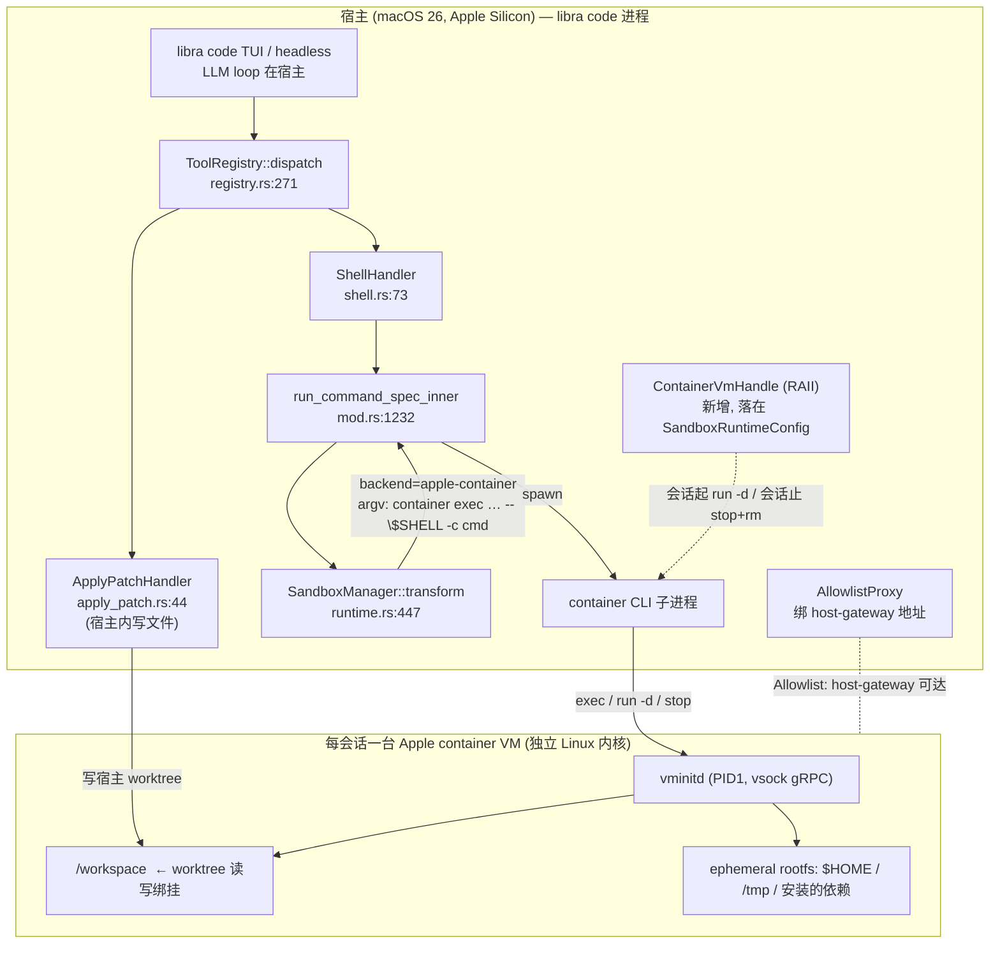

# Libra `code` 沙箱改进计划：macOS Apple `container` VM 级隔离后端

> **Out-of-scope of `tracing/plan.md`**（§0 范围声明）：命令沙箱/安全策略设计面不属于 AG-16~AG-24 外部捕获改进计划。已知冲突（plan.md §0 记录，line 25）：本文档的 **VM/AppleContainer 后端是净新增功能，不并入 C7**（违反 §6 "不发明额外功能"口径），作为独立后续工作另行排期——A9/C7 读者不得从本文档引入该后端为验收项。次要交叠：外部 agent RPC spawn（AG-18）复用 `env_clear`+allowlist 硬化，但沙箱 enforcement（seatbelt/seccomp/bwrap）的既有形态由本文档而非 plan.md 管辖。

> 状态：设计提案（Design Proposal）/ 实现路线图
> 兼容级别：`intentionally-different`（Libra AI 安全运行扩展，非 Git 命令）
> 适用范围：`libra code`（TUI / headless / web-only 会话）执行 AI agent shell 命令时的进程隔离后端
> 关联文档：[`docs/development/commands/sandbox.md`](commands/sandbox.md)（`libra sandbox status` 命令设计）、[`COMPATIBILITY.md`](../../COMPATIBILITY.md)
> 调研基线：apple/container `1.0.0`、apple/containerization（pre-1.0），均为 Apple Silicon + macOS 26 (Tahoe) 目标；ricccrd/dd `9b950a2`（2026-07-04，`https://github.com/ricccrd/dd`）

---

## 0. 摘要（TL;DR）

`libra code` 当前在 macOS 上用 **seatbelt（`/usr/bin/sandbox-exec` + SBPL）** 隔离 agent 执行的 shell 命令，在 Linux 上用 **seccomp/bwrap**。seatbelt 是**同内核、基于 profile 的进程级**沙箱：它能限制文件读写和网络，但 agent 代码仍然运行在宿主内核上，逃逸面积大、对供应链/不可信代码的隔离弱，且 Apple 已长期将 `sandbox-exec` 标注为 deprecated。

本计划新增一个**可选的 macOS 后端 `MacosAppleContainer`**：把每个 `libra code` 会话的 shell 命令放进一台 **Apple `container` 轻量级虚拟机**（基于 `Virtualization.framework`，一容器一 VM、独立 Linux 内核）里执行，提供**硬件虚拟化级别的隔离边界**。该后端：

- **以子进程方式驱动 `container` CLI**（`container system start` / `run -d` / `exec` / `stop` / `rm`），不链接 Swift、不直接走 XPC——这是当前唯一稳定、受支持的非 Swift 集成面（见 §3.5）。
- **opt-in**：通过 `LIBRA_SANDBOX_BACKEND=apple-container`（或 `.libra/sandbox.toml` 的 `[sandbox] backend`、或 `libra code --sandbox-backend`）选择；缺省仍是 seatbelt，保证零回归。
- **会话级 VM 生命周期**：会话开始创建一台带 worktree 绑定挂载的常驻 VM，每个 shell 工具调用 `container exec` 进去执行，会话结束销毁。
- **失败闭合**：在 `SandboxEnforcement::Required` 下，若平台不满足（非 Apple Silicon / 非 macOS 26 / 无 `container` 二进制 / 无虚拟化授权），按现有 enforcement 语义 fail-closed 或降级回 seatbelt。
- **落地目标**：达到“可以在隔离 VM 里安全地跑 AI coding agent（`libra code` 本身，或在 VM 内整跑 Claude Code）做真实开发”的程度（见 §13 运行手册）。

整个改动**复用现有 spawn/stdio/timeout/evidence 管线**：新后端本质上只是把 `seatbelt-exec … -- <cmd>` 这层 argv 包装换成 `container exec … -- <cmd>`，加上一套会话级 VM 生命周期与网络协调逻辑。

本次补充的 `ricccrd/dd` 对照分析不改变上述主路线：`dd` 证明了“无 VM、userspace Linux kernel + Docker Engine API”的轻量方向在 macOS 上有性能与开发体验价值，但它默认仍是同宿主内核的 JIT 进程，`DDJIT_UNTRUSTED` sentry split 也处于早期能力阶段。结论是：**短期继续以 Apple `container` VM 作为不可信 agent 的强隔离后端；中期先吸收 `dd` 的 typed launch contract、path-jail/overlay/network/resource/test-oracle 方法；长期再评估 `MacosDdJit` 作为 trusted/fast 或 VM 内加速后端**（详见 §15.1）。

---

## 1. 目标与范围

### 1.1 目标（In Scope）

1. 为 `libra code` 在 macOS 上提供一个 **VM 级隔离后端**，作为 seatbelt 的可选升级。
2. 复用并扩展现有沙箱抽象（`SandboxType` / `SandboxManager::transform` / `ExecEnv` / `SandboxRuntimeConfig`），**不破坏** seatbelt / seccomp / bwrap 既有行为与测试。
3. 把现有策略模型（`SandboxPolicy` 的 writable roots、`NetworkAccess` 的 Denied/Allowlist/Full、`SandboxEnforcement` 的三档）**忠实映射**到 VM 的挂载与网络配置上。
4. 保证 `apply_patch`（在宿主进程内直接写文件）与在 VM 内执行的 shell 命令**看到同一份 worktree**（通过读写绑定挂载），消除“shell 在 VM 里、文件改在宿主上”的不一致。
5. 扩展诊断（`libra sandbox status`）、配置面、错误码、evidence 事件与测试矩阵（L1/L2/L3）。
6. 提供能直接交给 Claude Code 实现的**分阶段任务清单 + 验收标准 + 文件锚点**。

### 1.2 非目标（Out of Scope）

- **不**在 Linux/Windows 上引入 VM 后端（Linux 已有 seccomp/bwrap；Windows 仍未实现）。本计划只针对 macOS。
- **不**链接 apple/containerization 的 Swift API、**不**自写 XPC bindings、**不**复刻 vminitd 的 vsock 协议（理由见 §3.5）。
- **不**移除或弱化 seatbelt 后端；它仍是 macOS 缺省、且是 VM 不可用时的降级目标。
- **不**追求 `container` 之外的第三方 VM/容器栈（Docker、Lima、Colima 等）——本计划聚焦“macOS 下选用 Apple 官方方案”。可在 §15 作为未来扩展点留口。

### 1.3 验收口径（与仓库一致）

任何阶段“完成”都以三条本地全过为准（对应 CI 的 `compat-rustfmt` / `compat-clippy` / `compat-offline-core`）：

1. `cargo +nightly fmt --all --check` 无差异。
2. `cargo clippy --all-targets --all-features -- -D warnings` 无告警。
3. `source .env.test && cargo test --all` 全过（L1 必跑；L2/L3 未配 env 时打印 `skipped` 不算失败）。

新增 Git 兼容面为零（纯扩展），但需同步 `COMPATIBILITY.md`、`docs/commands/sandbox.md`、`docs/development/commands/sandbox.md`、`docs/error-codes.md` 与相关 compat guard（见 §11）。

---

## 2. 现有沙箱架构（改造基线）

> 以下行号为撰写时（基线 commit 见 `libra log`）的锚点，实现时以源码为准。

### 2.1 单层、无 trait 的后端模型

当前沙箱在 `src/internal/ai/sandbox/` 下分四层：

| 层 | 文件 | 职责 |
|---|---|---|
| 策略模型 | `policy.rs` | `SandboxPolicy` / `NetworkAccess` / `SandboxEnforcement` / `.libra/sandbox.toml` 收紧规则 |
| 静态命令安全预检 | `command_safety.rs` | tree-sitter 解析 shell 串，标注 known-safe / 危险命令 |
| 后端运行时 | `runtime.rs` | `SandboxManager::{select_initial, transform}` 把 `CommandSpec` 包装成 `ExecEnv` |
| 网络代理 | `proxy.rs` + `proxy_runtime.rs` | Allowlist 模式下的 loopback HTTP/CONNECT 转发代理 |

**关键事实：后端选择不是 trait dispatch，而是一个闭合 enum + 编译期 `cfg`。**

```rust
// src/internal/ai/sandbox/runtime.rs:37
pub enum SandboxType {
    None,
    MacosSeatbelt,
    LinuxSeccomp,
    WindowsRestrictedToken,
}
```

后端在 `SandboxManager::select_initial(policy, permissions) -> SandboxType`（`runtime.rs:409-445`）里选定，**纯靠 `#[cfg(target_os = …)]`，没有任何运行期/配置开关**：

- `permissions.requires_escalated_permissions()` → `None`（`runtime.rs:414`）
- `policy.is_none()` → `None`（`runtime.rs:418`）
- `DangerFullAccess | ExternalSandbox` → `None`（`runtime.rs:422-427`）——这是“外部托管沙箱”的既有逃生口
- 否则按平台：macOS → `MacosSeatbelt`（`runtime.rs:429-432`）；linux → `LinuxSeccomp`；windows → `WindowsRestrictedToken`；其它 → `None`

随后 `SandboxManager::transform`（`runtime.rs:447-706`）**重新调用 `select_initial`**（`runtime.rs:569`）并 `match sandbox { … }`（`runtime.rs:579-687`）逐臂拼 argv：

- macOS 臂（`runtime.rs:581-601`）：`[/usr/bin/sandbox-exec, -p, <SBPL>, -D<K>=<v>…, --, <cmd…>]`，`MACOS_PATH_TO_SEATBELT_EXECUTABLE` 见 `runtime.rs:33`。
- Linux 臂（`runtime.rs:602-676`）：外部 helper（`LIBRA_LINUX_SANDBOX_EXE`）或内建 `bwrap`（`create_bwrap_command_args_with_seccomp`）。
- Windows 臂：返回 `WindowsSandboxNotImplemented`。

**强制闭合门**在 match 之前：若 `select_initial` 返回 `None`、但 `enforcement.requires_effective_sandbox()`（即 `Required`）且 `internal_sandbox_required(policy, perms)`（`ReadOnly`/`WorkspaceWrite`），则直接 `EnforcementFailed`（`runtime.rs:570-577`，`internal_sandbox_required` 见 `runtime.rs:708-720`）。

### 2.2 命令是怎么真正跑起来的（spawn 链路）

`transform` **本身从不 spawn**，只重写 argv 并打包成 `ExecEnv`（`runtime.rs:210-230`）；真正落地在：

```
shell 工具 → run_shell_command_with_approval (mod.rs:909)
           → run_command_spec (mod.rs:1204)  # 注入私有 0700 TMPDIR
           → run_command_spec_inner (mod.rs:1232)
           → build_command_from_spec (mod.rs:1408)   # 读 env/配置 → transform → ExecEnv
           → ExecEnv::into_command (runtime.rs:239)   # → tokio::process::Command
           → start_allowlist_proxy_if_needed (mod.rs:1250)  # 按需起 loopback 代理 + 注入 *_PROXY
           → cmd.stdout(piped).stderr(piped); cmd.spawn() (mod.rs:1258-1259)
           → tokio::select! { child.wait() vs timeout-kill } (mod.rs:1291-1305)
           → SandboxExecOutput { exit_code, stdout, stderr, timed_out } (mod.rs:1329)
```

`ExecEnv::into_command`（`runtime.rs:239-258`）做的事：`Command::new(argv[0]).args(argv[1..]).current_dir(canonical(cwd)).envs(env)`；对 seatbelt/seccomp 装 `setsid()` pre_exec（`new_session`，`runtime.rs:698-701`）；Linux 装 seccomp FD pre_exec。

**这条链路对新后端极其友好**：只要新后端在 `transform` 里产出一段 `["container","exec",…,"--",$SHELL,"-c",cmd]` 的 argv，`into_command` + 整个 spawn/drain/timeout/evidence 管线（`mod.rs:1256-1334`）就能零改动复用——这是本计划选择 **“argv 包装”** 而非“重写 spawn”的根本原因（见 §5）。

### 2.3 配置与 env 旋钮（现状）

| 旋钮 | 含义 | 读取点 |
|---|---|---|
| `LIBRA_SANDBOX_ENFORCEMENT` | `required` / `prefer_strict` / `best_effort`（缺省 best_effort） | `resolve_sandbox_enforcement` `mod.rs:1831-1850`；`FromStr` `policy.rs:66` |
| `LIBRA_SANDBOX_NETWORK_DISABLED` | **输出信号**（非输入）：Denied/降级时写进子进程 env | `runtime.rs:25,558-563` |
| `LIBRA_LINUX_SANDBOX_EXE` | 外部 Linux helper 路径（Linux only） | `resolve_linux_sandbox_exe` `mod.rs:1773-1787` |
| `LIBRA_USE_LINUX_SANDBOX_BWRAP` | 强制内建 bwrap（Linux only） | `mod.rs:1417-1419` |
| `LIBRA_BWRAP_BINARY` | bwrap 二进制定位覆盖 | `runtime.rs:881`；`mod.rs:1791` |
| `LIBRA_SECCOMP_POLICY` | 预编译 BPF 路径，缺省 `~/.libra/seccomp.bpf` | `mod.rs:1865-1914` |
| `.libra/sandbox.toml` | 收紧式 `deny_read` + `[sandbox.network]`（mode + services） | `mod.rs:1555-1642`，path `mod.rs:1704-1708` |

**当前没有任何“同一 OS 上在多后端间选择”的旋钮**——macOS 永远是 seatbelt。这是本计划要新增的核心配置面。

`SandboxRuntimeConfig`（`mod.rs:73-98`，`#[derive(Clone, Debug, Default)]`）是所有 env 旋钮的进程内覆盖载体，目前字段：`linux_sandbox_exe` / `use_linux_sandbox_bwrap` / `enforcement` / `deny_read_paths` / `evidence_sink` / `seccomp_policy_path`。**新后端的 VM 句柄/配置应当落在这里**。

### 2.4 `libra code` 会话如何接入沙箱

- 入口 `command/code.rs::execute`（`code.rs:696`）→ `execute_tui` / `execute_web_only` / `execute_stdio`。
- worktree 根由 `resolve_code_working_dir`（`code.rs:2465`，优先级 `--cwd` > `--repo` > `current_dir()`）解析、`validate_code_working_dir` 校验——**这就是未来 VM 的挂载根**。
- TUI：`execute_tui`（`code.rs:1401`）建 `ToolRegistry`（注册 `shell`=`ShellHandler`、`apply_patch`=`ApplyPatchHandler`），再 `run_tui_with_model`。
- 每会话 `runtime_context` 在 `run_tui_with_model_inner`（`code.rs:2753`）里由 `default_tui_runtime_context`（`code.rs:3406`）构造；该函数据 `CodeContext` 选策略：`Review|Research` → `ReadOnly`；`Dev|None` → `WorkspaceWrite { writable_roots: vec![working_dir], network_access, … }`（`code.rs:3414-3433`）。
- **关键现状**：`sandbox_runtime: None` 在 `code.rs:3433` 硬编码——TUI 今天完全靠 env / `.libra/sandbox.toml` 调后端。**VM 后端最干净的接入点就是在这里把 `sandbox_runtime` 填上一个带 VM 句柄的 `SandboxRuntimeConfig`。**
- 终端恢复用了 `scopeguard::guard`（`code.rs:2810`）；它是 VM 销毁的**位置参考**，但该闭包是同步的、无法 `await` 外部 `container stop && rm`——VM 销毁需用 §7 Phase 2 的**三层保障**（正常路径 await + Drop 内阻塞兜底 + 启动期 PID 感知回收），不能直接照搬。
- headless/web 走 `build_headless_web_code_ui_runtime`（`code.rs:1968`），需同等处理。

每个工具调用过 `ToolRegistry::dispatch`（`registry.rs:271`），它把 `invocation.working_dir = self.working_dir` 重新盖章（`registry.rs:286`，“sandbox 单一事实源”）。只有 `ShellHandler`（`shell.rs:73`）会进 `run_shell_command_with_approval`；`ApplyPatchHandler`（`apply_patch.rs:44`）在**宿主进程内直接写文件**，不经 OS 沙箱（这是 §9 要专门处理的一致性点）。

### 2.5 网络代理（现状）与对 VM 的影响

- `transform` 算出 `NetworkAccessMode`（`runtime.rs:722-745`）；Allowlist 时用 `allowlist_proxy_from_policy`（`proxy.rs:230`）建 `AllowlistProxy`，`select_network_proxy`（`proxy.rs:359`）据 `ProxyEnforcement`（由 `SandboxEnforcement` 推导）决定 Proxy/Reject/DegradeToDenied。
- 命令级（非会话级）起代理：`start_allowlist_proxy_if_needed`（`mod.rs:1250` / `proxy_runtime.rs:62`）`bind 127.0.0.1:0`，注入 `HTTP_PROXY/HTTPS_PROXY/ALL_PROXY`(+ 小写)、`NO_PROXY=''`、`LIBRA_SANDBOX_ALLOWLIST_PROXY`；子进程退出后 `shutdown`（`mod.rs:1325-1327`）。
- **强制力来自 OS 沙箱**：seatbelt 在 Allowlist 模式只放行 `127.0.0.1`/`::1`（`runtime.rs:967-975`），Denied 给空网络策略，Full 给完整 `SEATBELT_NETWORK_POLICY`。

> ⚠️ **对 VM 的根本影响**：代理绑在**宿主** loopback。VM 有自己的网络命名空间，注进 guest 的 `HTTP_PROXY=http://127.0.0.1:port` 指向的是 **guest 的 loopback**，宿主代理不可达；`--share-net`/`--unshare-net`/SBPL 网络段都是命名空间概念，对 VM 毫无意义。**网络协调是本计划最难的一块（§8）。**

---

## 3. apple/container 调研结论

> 一手来源：`github.com/apple/container`（README、`docs/technical-overview.md`、`docs/command-reference.md`、Releases `1.0.0`、issue #66）、`github.com/apple/containerization`（README、vminitd）、WWDC 2025 session 346。详见 §17。带 *UNVERIFIED* 的条目为公开文档未明确、需在 Phase 0 spike 实测确认。

### 3.1 是什么

`apple/container` 是 Apple 2025 年开源（Swift、Apache-2.0）的命令行容器工具：**一容器一台轻量级 VM**，基于 `Virtualization.framework`，跑优化过的 Linux 内核 + 最小 rootfs + `vminitd`（静态 Swift 写的 guest PID 1，通过 vsock 上的 gRPC 收发进程/IO/信号）。镜像是标准 OCI，可与 Docker 镜像/registry 互通。底层能力来自 `apple/containerization` 这个 Swift 包（`container` 是它之上的 Docker-like CLI）。

### 3.2 硬性要求

- **Apple Silicon（arm64）**，**不支持 Intel**（依赖 `Virtualization.framework`）。
- **macOS 26 (Tahoe)** 为 `1.0.0` 的支持目标；macOS 15 (Sequoia) 仅 0.x 预览且**网络严重受限**（vmnet 只能给互相隔离的网络、容器间通信几乎不可用），`1.0.0` 不支持 15。
- 需要 `com.apple.security.virtualization` 授权来创建 VM（`container` 的签名二进制自带；第三方嵌入的签名细节 *UNVERIFIED*——但我们走 CLI 子进程，授权由 `container` 二进制自身持有，见 §3.5）。
- linux/amd64 镜像需 Rosetta 2；否则只能跑 linux/arm64。

### 3.3 架构（运行时拓扑）

| 组件 | 角色 |
|---|---|
| `container`（CLI） | 瘦客户端，**不直接管 VM**，把请求经 **XPC** 发给 apiserver |
| `container-apiserver` | `launchd` agent（`container system start` 拉起），暴露管理 API（XPC），编排 helper |
| `container-core-images` | 镜像 API + 本地 OCI content store 的 XPC helper |
| `container-network-vmnet` | 经 `vmnet` 管网络的 XPC helper（`1.0.0` 引入 connection-as-lease 修 IP 泄漏） |
| `container-runtime-linux` | **每容器一个**的运行时 helper，经 `Virtualization.framework` 驱动该容器的 VM |
| `vminitd` | 每 VM 的 guest PID 1（静态、无 libc/无 coreutils），vsock 上 gRPC 拉起 guest 进程 |

### 3.4 CLI 命令面（我们要用的子集）

| 命令 | 作用 | 我们的用法 |
|---|---|---|
| `container system start` / `stop` / `status` | 启停 apiserver 与 helper（**首次必须 start 一次**） | 会话/进程级预检与拉起（§7.2） |
| `container run [-d] [--rm] [--name N] [-v H:G[:ro]] [--mount …] [-w DIR] [-e K=V] [--cpus] [--memory] [--network …] IMAGE [cmd]` | 据 OCI 镜像启一台新 VM | 会话起：`run -d` 起常驻 VM + 绑挂 worktree |
| `container create` / `start` / `stop` / `kill` / `rm` | 生命周期细粒度控制 | 会话止：`stop` + `rm` |
| `container exec [-i] [-t] [-w DIR] [-e K=V] <ctr> <cmd…>` | 在**运行中**容器里起新进程（经 vminitd vsock） | **每个 shell 工具调用** |
| `container ls --format json` / `inspect` | 列举/查询（JSON） | 诊断、健康检查、孤儿回收 |
| `container logs [--follow]` | 流式日志 | 调试 |
| `container build` / `image pull/push/tag/save/load` | 构建/管理 OCI 镜像 | 准备 sandbox 基础镜像（§7.3） |
| `container network create [--subnet] [--internal]` | 建虚拟网络（macOS 26+） | Allowlist/Denied 的网络隔离（§8） |
| `container cp` | host↔guest 拷文件（`1.0.0`） | 兜底文件同步（一般用绑挂，不需要） |

### 3.5 编程集成面（关键决策依据）

**对一个 Rust 宿主进程，今天唯一稳定、受支持的集成方式是 shell out 到 `container` CLI。** 依据：

- apiserver 只暴露 **XPC**，本质 Swift-only；社区请求 socket/HTTP API 的诉求汇总在 issue #66（仍在跟踪，Apple **未承诺**；曾另开的 #636 已于 2025-11-03 作为 #66 的重复关闭，用户被指向外部 `socktainer` 项目）；`1.0.0` 还移除了 v0 XPC（跨大版本不稳定）。→ **不要从 Rust 直连 XPC。**
- 直接链接 `apple/containerization` Swift 包需要：写 Swift shim、对着 macOS 26/Xcode 26 编译、自管 `com.apple.security.virtualization` 授权与签名、跟一套 pre-1.0 不稳定 API。→ **高成本、低稳定，排除。**
- guest 内 `vminitd` 的 vsock gRPC 是干净 RPC 边界，但那是 host↔guest 内部契约；要用它你得自己用 `Virtualization.framework` 建 VM、连 vsock——等于重写 containerization 包。→ **排除。**
- `cctl` 是 demo 工具，非稳定 CLI。→ **不要在它上面建产品。**

**结论**：把 `container` 当子进程编排（`spawn` + `--format json` 解析 + PTY/管道接 stdio），**门槛锁定在 macOS 26 + Apple Silicon**；若将来 Apple 发布稳定 socket/REST API，再评估直连（§15 留口）。

### 3.6 文件系统

- 每容器从一个 **ext4 rootfs**（containerization 用 Swift 在宿主上构建并作为 virtio 块设备喂给 guest）启动；guest 直接 mount 块设备，**不在 VM 内解层**（冷启动/IO 快的关键）。
- 宿主目录绑挂：`container run -v <hostpath>:<guestpath>[:ro]` 或 `--mount type=…,source=…,target=…[,readonly]`；匿名卷 `container volume create`。
- 绑挂入 VM 的**传输方式（virtio-fs vs 块设备）公开文档未明说**——*UNVERIFIED*，Phase 0 spike 必须实测读写语义、uid 映射、性能、`fsync`/`mmap` 行为（对 Rust/Cargo 构建尤其重要）。

### 3.7 网络

- **macOS 26**：每容器一个**专属 IP**（`vmnet`），基本免端口转发；可建多网络、容器间通信（`network create --subnet[/--subnet-v6]`，不同网络互相隔离）；`--internal` 在 Apple 文档中的定义是 *host-only network*（“Restrict to host-only network”），即不连外网——“无对外出口”是其推论，但**精确出网/可达宿主语义需 Phase 0 实测**（§8 不应过度依赖未经证实的“no NAT”保证）。
- **macOS 15**：vmnet 只能给互相隔离的网络，容器间通信几乎不可用——这是 `1.0.0` 要 macOS 26 的主因。
- 端口发布 `-p host:hostport:ctrport`（IPv6 亦可）；多网络下 publish 只走第一块网卡。
- DNS：`container system dns create <domain> --localhost <IP>`，会**关闭 macOS Private Relay** 且**重启不保留**。
- 默认子网在 `~/.config/container/config.toml`。

### 3.8 安全模型（我们为什么要它）

- **隔离边界是每容器一台完整 VM**（`Virtualization.framework`），硬件虚拟化级别，**强于** Docker 那种共享内核 + namespace；对“跑不可信 AI agent 代码”是质变。
- **不共享 Linux 内核**：一个 guest 的内核漏洞不直接跨到别的容器或宿主。
- host↔guest 面**刻意窄**：只有 vsock（gRPC 控制面 + 专用 stdio 端口），无共享宿主内核、缺省无宽网络暴露。
- host helper 以**用户态 launchd agent / XPC helper** 运行，**不是单个 root daemon**（与 Docker 不同）。
- 宿主 FS 暴露**默认无、按需绑挂**；`:ro` 只读；registry 凭据进 Keychain。
- **对 libra 的取舍**：安全性只与 `Virtualization.framework` + virtio 一样强（其 CVE 态势 *UNVERIFIED*）；默认姿态应为**单一 worktree 读写挂载 + Denied/Internal 网络**，除非明确需要出网。

### 3.9 已知限制（直接影响设计）

1. macOS 26 + Apple Silicon 硬门槛；macOS 15 不支持、Intel 不支持。
2. 无非 Swift 稳定 API（仅 CLI + 不稳定 XPC）。
3. 一容器一 VM：亚秒启动但每台是带独立内核/内存的完整 VM，**密集 fan-out 比 namespace 容器更吃 RAM**（影响并行 sub-agent，见 §12）。
4. `container system start` 是**用户会话级 launchd agent**——**headless/CI 是否需要登录会话 *UNVERIFIED***，Phase 0 必须验证（§14 风险）。
5. DNS 域关 Private Relay 且不持久；多网络 publish 只到第一网卡。
6. 嵌套虚拟化需 M3+；无 GUI；guest 仅 Linux。
7. 启动延迟：Apple 称亚秒；第三方实测冷启 <1s（vs Docker 3–5s）、boot 2–5s，**近似、非官方**。

---

## 4. 为什么需要 VM 级隔离

| 维度 | seatbelt（现状） | Apple `container` VM（本计划） |
|---|---|---|
| 隔离边界 | 同宿主内核，进程级 profile | 独立 Linux 内核，硬件虚拟化 VM |
| 逃逸面 | 宿主内核全部系统调用面 | 仅 vsock + virtio 设备面 |
| 不可信代码 | 一旦 profile 有洞即触宿主 | 逃逸需先破 guest 内核再破 VMM |
| 供应链（恶意依赖/postinstall） | 能在宿主用户态任意执行（受 FS/网限制） | 困在一次性 guest，会话结束即焚 |
| 文件影响面 | writable roots 之外受 SBPL 限制，但仍宿主 FS | 仅绑挂的 worktree；其余写入留在 ephemeral rootfs |
| 网络 | SBPL + loopback 代理 | VM 网络命名空间 + 网络级 allowlist |
| Apple 态度 | `sandbox-exec` 长期标 deprecated | 官方在投入的现代方案 |
| 成本 | 近零启动、零额外内存 | 每会话一台 VM（数百 MB 级 RAM、亚秒~数秒启动） |

**动机一句话**：要让 AI agent（包括 `libra code` 自己，或在 VM 内整跑 Claude Code）去**真实开发**——装依赖、跑构建/测试、执行不可信脚本——seatbelt 的同内核隔离不足以让人放心“danger-full / 自动批准”，而 VM 边界把“最坏情况”从“宿主被入侵”降到“一台一次性 VM 被搞坏、销毁重建即可”。

---

## 5. 设计决策

| # | 决策 | 取舍 / 理由 |
|---|---|---|
| D1 | **驱动 `container` CLI 子进程**，不链 Swift、不走 XPC | §3.5：唯一稳定受支持的非 Swift 面；零 Swift 工具链依赖 |
| D2 | **新增 `SandboxType::MacosAppleContainer` 变体 + match 臂**（而非先做 trait 大重构） | 复用既有 spawn 管线，最低风险落地；trait 重构作为 Phase 8 可选演进（§6.4） |
| D3 | **argv 包装模型**：shell 调用 = `container exec … -- $SHELL -c <cmd>` | 完全复用 `ExecEnv::into_command` + spawn/drain/timeout/evidence（`mod.rs:1256-1334`），`new_session=false`、无 seccomp pre_exec |
| D4 | **会话级常驻 VM**（`run -d` 起、`exec` 用、会话末 `stop`+`rm`），而非每命令一 VM | 每命令起 VM 延迟不可接受；常驻 VM 的 `exec` 是亚秒级；生命周期挂在 `libra code` 会话上 |
| D5 | **opt-in，缺省仍 seatbelt** | 零回归；逐步 dogfood；CI 无 Apple Silicon/macOS 26 runner 时不受影响 |
| D6 | **worktree 读写绑挂（host↔guest 共享）** | 解决 `apply_patch`（宿主写）与 shell（guest 写）的一致性（§9）；worktree 外写入留 ephemeral rootfs = 想要的隔离 |
| D7 | **网络按策略映射到 VM 网络配置**：Denied→`--network none`；Full→默认 NAT 网络；Allowlist→`--internal` 网络 + 宿主代理经 host-gateway 暴露 + guest 默认拒绝（§8） | 让强制力落到**网络层**而非仅 env 提示 |
| D8 | **失败闭合 / 降级遵循现有 enforcement 三档** | `Required` 平台不满足→`EnforcementFailed`；`PreferStrict`→审批回退；`BestEffort`→降级 seatbelt |
| D9 | **`SandboxRuntimeConfig` 承载 VM 句柄/配置** | 已 `Clone`、已贯穿 spec→transform 链路；`default_tui_runtime_context` 的 `None`（`code.rs:3433`）改填实例 |
| D10 | **新增配置面三入口**：`LIBRA_SANDBOX_BACKEND` env、`.libra/sandbox.toml [sandbox] backend`、`libra code --sandbox-backend` | 与现有 env/file/flag 三层一致；`auto` 自动探测 |

### 5.1 后端取值语义

`backend ∈ { auto, seatbelt, apple-container, none }`：

- `auto`（缺省）：macOS 上若**预检全过**（Apple Silicon + macOS≥26 + `container` 二进制可用 + apiserver 可启）则用 `apple-container`，否则 seatbelt；Linux 不受影响。
- `seatbelt`：强制 seatbelt（现状行为）。
- `apple-container`：强制 VM；预检不过时按 enforcement 档处理（D8）。
- `none`：显式无 OS 沙箱（受 `Required` 闭合门约束）。

> 注意：为零回归，**`auto` 在 v1 落地时可先等价于 `seatbelt`**（即默认不启用 VM），把 `apple-container` 设为显式 opt-in；待 dogfood 稳定后再把 `auto` 的探测逻辑打开（§16 里程碑 M5）。

---

## 6. 目标架构

### 6.1 组件图



### 6.2 关键不变量

1. **LLM 循环 + TUI 始终在宿主**；只有 shell 工具执行的命令进 VM。这避免把整个 agent 栈搬进 guest，集成面最小。
2. **worktree 是 host↔guest 共享读写挂载**（guest 路径如 `/workspace`）。`apply_patch` 在宿主写、shell 在 guest 写，双方看到同一份文件。
3. **worktree 之外的一切（系统、`$HOME`、`/tmp`、`cargo install`、`npm i -g`、`apt install`）落在 ephemeral rootfs**，会话结束随 VM 焚毁——这正是隔离价值。
4. **VM 生命周期 = `libra code` 会话生命周期**，由 RAII guard 保证销毁（含 panic/早退）。

### 6.3 新增/改动的类型（签名草案）

```rust
// src/internal/ai/sandbox/runtime.rs
pub enum SandboxType {
    None,
    MacosSeatbelt,
    MacosAppleContainer,      // 新增
    LinuxSeccomp,
    WindowsRestrictedToken,
}

// 后端选择旋钮（新增），从 env / sandbox.toml / --sandbox-backend 解析
#[derive(Clone, Copy, Debug, Default, PartialEq, Eq)]
pub enum SandboxBackendChoice {
    #[default] Auto,
    Seatbelt,
    AppleContainer,
    None,
}

// 会话级 VM 句柄；克隆廉价（内部 Arc）。落在 SandboxRuntimeConfig.vm
// src/internal/ai/sandbox/container_vm.rs（新文件）
#[derive(Clone, Debug)]
pub struct ContainerVmHandle {
    pub container_id: String,         // container run -d 返回的 id/name
    pub host_worktree: PathBuf,       // 宿主 worktree 根
    pub guest_worktree: PathBuf,      // guest 内挂载点，如 /workspace
    pub network: VmNetworkMode,       // None / Internal+Proxy / Nat
    pub host_gateway: Option<String>, // Allowlist 时 guest 可达的宿主代理地址
}

// container CLI 编排器（新文件 container_vm.rs）
pub struct AppleContainerRuntime;
impl AppleContainerRuntime {
    pub fn probe() -> ContainerAvailability;                 // 见 §10
    pub async fn ensure_system_started() -> Result<(), VmError>;
    pub async fn ensure_image(image: &str) -> Result<(), VmError>;
    pub async fn create_session_vm(cfg: &VmLaunchSpec) -> Result<ContainerVmHandle, VmError>;
    pub async fn destroy_session_vm(handle: &ContainerVmHandle);   // stop + rm，幂等、吞错
    pub fn exec_argv(handle: &ContainerVmHandle, spec: &CommandSpec) -> Vec<String>; // container exec …
}

// src/internal/ai/sandbox/mod.rs：SandboxRuntimeConfig 增字段
pub struct SandboxRuntimeConfig {
    // …既有字段…
    pub backend: SandboxBackendChoice,       // 新增
    pub vm: Option<ContainerVmHandle>,       // 新增：会话级 VM 句柄
}
```

### 6.4 是否引入 `trait SandboxBackend`？

调研一致指出当前无后端 trait、dispatch 是硬 `match`。两条路：

- **(A) 最小侵入（推荐先做）**：加 enum 变体 + 一条 `transform` 臂 + `select_initial` 的 macOS 分支按 `backend` 选择。改动集中、易测、易回退。**Phase 1–5 全部走这条。**
- **(B) trait 重构（可选演进，Phase 8）**：抽 `trait SandboxBackend { fn available()->…; fn wrap(spec,policy,…)->ExecEnv; fn session_setup/teardown(); }`，把 seatbelt/seccomp/VM 都实现成 backend。更干净、利于未来第三方后端，但触碰每条 `match` 臂、风险大。**仅在 (A) 稳定后、确有第三方后端需求时做。**

本计划主体按 (A) 编写，(B) 作为 §15 未来工作。

---

## 7. 详细实现计划（分阶段）

> 每阶段都给出：改动点（文件:行锚点）、最小可验证产出、验收标准。任务粒度按“可由 Claude Code 单独实现并自测”切分。

### Phase 0 — 可行性 spike 与探针（必须先做，blocking）

**目的**：把 §3 的 *UNVERIFIED* 项变成事实，决定后续设计常量。**不写产品代码，只产出一份 `docs/development/sandbox-spike-findings.md` + 探针函数。**

任务：

1. **环境探针** `AppleContainerRuntime::probe()`：检测
   - `std::env::consts::ARCH == "aarch64"`（Apple Silicon）；
   - macOS 版本 ≥ 26（`sw_vers -productVersion` 或 `sysctl kern.osproductversion`，解析主版本）；
   - `container` 二进制可用（照搬 `locate_bwrap_binary` 的 PATH 走查 + `is_executable_file`，`runtime.rs:880-924`），并 `container --version` 取版本；
   - `container system status` 是否 running / 可 `start`。
   返回 `ContainerAvailability { apple_silicon, macos_major, binary: Option<PathBuf>, version: Option<String>, system_running: bool, reason: Option<String> }`。
2. **绑挂语义实测**：`container run --rm -v $PWD/scratch:/workspace alpine sh -c '…'` 验证：guest 写 `/workspace` 宿主可见、宿主写宿主目录 guest 可见、uid/gid 映射、`fsync`/`rename`/`mmap`、对一个真实 Cargo 构建的吞吐（关键：libra 自身 `cargo build` 在挂载 worktree 上能否跑、慢多少）。
3. **headless/launchd 实测**：在无图形登录会话（如 `ssh` + `launchctl` 用户态）下能否 `container system start` 并 `run`/`exec`——决定 CI 与远程 `libra code` 是否可用。
4. **网络实测**：`--network none` 是否真的零出口；`--internal` 网络下 guest 能否访问宿主某端口（host-gateway 地址是什么、如何取）；默认网络的 NAT 出网。
5. **启动延迟基准**：`run -d` 起常驻 VM 与单次 `exec` 的 P50/P95。

**验收**：spike-findings 文档回答上述每条，给出推荐常量（默认镜像、guest 挂载点、host-gateway 取法、是否支持 headless），并对“macOS 15 是否值得兜底”给结论（默认结论：不兜底，<26 一律降级 seatbelt）。

**Phase 0 决定后续可行性的硬分支（kill / fallback criteria）**：

| spike 结论 | 对后续阶段的影响 |
|---|---|
| host-only 网络下 **无 guest 可达的宿主地址** | §8 Allowlist **首版不交付**；Allowlist 在 `Required` 下降级 Denied（§8.5）；功能仅出 Denied/Full |
| **headless/launchd 不可用**（需登录会话） | CI/远程 `libra code` 该后端不可用；这些环境 `Auto`/`BestEffort` 降级 seatbelt、`Required` 报错（决策表 §10） |
| 绑挂 **fsync/mmap 语义破坏 `cargo build`** 或慢到不可用 | 重新评估“worktree 共享挂载”模型；可能改为 guest 内独立 checkout + `container cp` 回写（牺牲 §9 的 apply_patch 即时一致性），或暂缓该后端用于 Rust 构建 |
| uid/gid 映射导致写回宿主文件属主异常 | 文档明示并在镜像/挂载参数里修正；必要时加 `--user` 或 idmap |

上述任一“不可用”结论都不阻断 Phase 1（骨架/配置/argv 纯逻辑可照常做），但会裁剪 Phase 4 的交付范围——**Phase 0 findings 必须显式写明本表每行的实测结论**。

### Phase 1 — 后端骨架与配置面（可单元测试，不依赖真 VM）

改动点：

1. `SandboxType::MacosAppleContainer` 变体（`runtime.rs:37`）。
2. `SandboxBackendChoice` enum + `FromStr`（接受 `auto|seatbelt|apple-container|none`，大小写/连字符/下划线宽松），放 `policy.rs` 或新 `container_vm.rs`。
3. `SandboxRuntimeConfig` 增 `backend` + `vm` 字段（`mod.rs:73-98`），保持 `Default`（`backend: Auto`, `vm: None`）。
4. 配置解析：新 `resolve_sandbox_backend(cfg, env) -> SandboxBackendChoice`，仿 `resolve_sandbox_enforcement`（`mod.rs:1831-1850`），优先级 `SandboxRuntimeConfig.backend` > `LIBRA_SANDBOX_BACKEND` env > `.libra/sandbox.toml [sandbox] backend` > `Auto`。扩 `SandboxConfigSection`（`mod.rs:1567-1572`，注意 `deny_unknown_fields`）加 `backend: Option<String>`。
5. `SandboxTransformRequest` 增 `backend: SandboxBackendChoice` + `vm: Option<&ContainerVmHandle>`（`runtime.rs:350-367`），`build_command_from_spec`（`mod.rs:1408-1462`）填入。
6. `select_initial`（`runtime.rs:409-445`）：macOS 分支据 `backend` 返回 `MacosAppleContainer`（`AppleContainer`，或 `Auto` 且探针过）或 `MacosSeatbelt`。**`Auto` 在 v1 等价 seatbelt（D5 注）。**
7. `transform`（`runtime.rs:579-687`）加 `SandboxType::MacosAppleContainer => { … }` 臂：用 `AppleContainerRuntime::exec_argv(vm, &spec)` 产出 argv；`new_session=false`（`runtime.rs:698-701` 集合不含它）；不设 seccomp。**若 `vm` 为 `None`**（没有会话 VM 句柄）→ 按 enforcement 返回 `EnforcementFailed`/降级（见 Phase 5）。
8. `exec_argv`：`[container, exec, --workdir <guest_cwd>, (-e K=V)*, <id>, $SHELL, -c, <cmd>]`。**路径/env 翻译**（§9.2）：把 `spec.cwd` 的 `host_worktree` 前缀换成 `guest_worktree`；env 里指向宿主 worktree 的覆盖（`apply_task_worktree_env_overrides` 注入的 `HOME/XDG_*/CARGO_HOME`，`runtime.rs:101-119`）**不能原样带进 guest**——要么重映射到 guest 路径，要么交给 guest 自己的 `$HOME`（推荐后者：VM 内用 guest 默认 HOME，只透传无害的 env）。

验收：纯 L1 单测——给定 backend/policy/cwd/env 与一个假的 `ContainerVmHandle`，断言 `transform` 产出的 argv 形如 `container exec --workdir /workspace/sub -e … <id> /bin/sh -c "<cmd>"`，cwd 翻译正确、worktree-env 不泄漏宿主路径；`backend=seatbelt` 时与现状逐字节一致（回归）。`FromStr` / 配置优先级单测。`cargo fmt/clippy/test` 三过。

### Phase 2 — 会话级 VM 生命周期（接 `libra code`）

改动点：

1. 新文件 `src/internal/ai/sandbox/container_vm.rs`：`AppleContainerRuntime` 的 `ensure_system_started` / `ensure_image` / `create_session_vm` / `destroy_session_vm`，全部 `tokio::process::Command` 驱动 `container`，超时 + 结构化错误 `VmError`。
   - `create_session_vm`：`container run -d --name libra-code-<host_pid>-<session> --label libra.owner_pid=<host_pid> -v <host_worktree>:/workspace:rw -w /workspace <network-flags> --cpus <n> --memory <m> <image> sleep infinity`，解析返回的 container id。**名字/标签编入宿主 PID**，供并发安全的孤儿回收（见下）。
   - `destroy_session_vm(&handle)`：**async**，`container stop <id>`（带超时）+ `container rm -f <id>`，幂等、吞错、记 evidence。
2. **销毁的三层保障（不要照搬 proxy 的 `Drop`）**。⚠️ `RunningAllowlistProxy::Drop`（`proxy_runtime.rs:51-59`）只做**进程内同步** `task.abort()`，它**从不 spawn/await 外部进程**；`scopeguard::guard`（`code.rs:2810`）的闭包是**同步 `FnOnce`，不能 await**。而 `destroy_session_vm` 必须 spawn 并**等待** `container stop && rm` 这个**外部子进程**跑完；在多线程 tokio 运行时（`cli.rs:551`）里：worker 线程的 `Drop` 中 `Handle::current().block_on()` 会 **panic**，`Drop` 里 detach 的 `tokio::spawn` 常常**进程退出前跑不完 → 泄漏 VM**。正确做法分三层：
   - **(a) 正常路径（首选）**：在 `run_tui_with_model_inner` 返回前，于现有 web/mcp/managed 关停序列（`code.rs:3225-3233`）旁边**显式 `destroy_session_vm(&handle).await`**。为覆盖 `code.rs:2820-3025` 间众多早退分支，把会话主体抽到一个内层 `async fn`，外层 `let result = inner().await; if let Some(h)=&vm { destroy_session_vm(h).await; } result`，保证任何 `?` 早退都先 await 清理。
   - **(b) panic / 硬退兜底**：再挂一个 `Drop` guard，但里面用**阻塞 `std::process::Command::new("container").args(["rm","-f",&id])`**（同步、不碰 tokio、`Drop` 任意线程安全），best-effort 吞错。它只是兜底，不替代 (a)。
   - **(c) 启动期 PID 感知孤儿回收（真正的 backstop）**：见下。
3. `command/code.rs` 接入：
   - 在 `run_tui_with_model_inner`（`code.rs:2753`）解析出 `backend`，若 `apple-container` 且探针过：`ensure_system_started` → `ensure_image` → `create_session_vm(working_dir)` → 得 `ContainerVmHandle`；填进 `default_tui_runtime_context` 产出的 `SandboxRuntimeConfig.sandbox_runtime`（把 `code.rs:3433` 的 `None` 换成 `Some(cfg_with_vm)`）；按 2(a)/(b) 装清理。
   - headless：`build_headless_web_code_ui_runtime`（`code.rs:1968-2027`）同等处理。
4. **孤儿回收（PID 感知，并发安全）**：进程启动时 `container ls --format json` 列出 `libra-code-*`，**只回收 `libra.owner_pid` 标签对应进程已死的容器**（用 `kill(pid, 0)` / `/proc` 或 `libc::kill` 探活）。⚠️ 同主机**并发多个 `libra code` 会话是正常场景**——仅靠 `libra-code-*` 名匹配会误杀别的存活会话；必须按 owner PID 存活性判定。做成**启动期静默清理**，不新增 CLI 子命令（避免一串 compat guard 改动，见 §11）。
4. **CLI flag**：`libra code --sandbox-backend <auto|seatbelt|apple-container|none>`（`CodeArgs`），并入 `--help` EXAMPLES（满足三条 help 契约，见 §11）。

验收：L2/L3（gated，需真 macOS 26 + Apple Silicon，见 §10 的 `env_var_is_set` + feature gate）端到端：起会话→VM 出现在 `container ls`→跑一条 `echo`→会话结束→`container ls` 不再有该 VM。L1：用一个**可注入的 fake runner**（trait 化 `container` 调用，类似 test-provider 思路）断言生命周期调用序列（start→image→run→exec→stop→rm）与早退清理。

### Phase 3 — 文件系统 / worktree 映射与 apply_patch 一致性

改动点：

1. **writable roots → 挂载**：把 `policy.get_writable_roots_with_cwd(cwd)`（`policy.rs:727-735`，`WorkspaceWrite.writable_roots`）翻译成 `-v host:guest:rw`。**模板就是 `create_bwrap_command_args_with_seccomp`（`runtime.rs:799-858`；同名瘦包装 `create_bwrap_command_args` 在 `runtime.rs:776-791`，writable-roots→`--bind`/deny_read→`--tmpfs` 的实际映射在 `:838-853`）**——照搬其映射逻辑到 `container run` 的 `-v`/`--mount`。
   - 主 worktree → `/workspace:rw`；额外 writable roots → 各自 guest 挂载点；`deny_read_paths`（`mod.rs:1425-1426`）→ 不挂载（VM 内本就不可见，天然满足）或挂 `--mount …,readonly` 排除。
   - `rebased_to_workspace`（`policy.rs:611-636`，sub-agent 把 writable roots 收窄到单一 workspace 根）→ 对应单一挂载根，利于多 VM。
2. **apply_patch 一致性（D6 核心）**：因为 worktree 是**共享读写挂载**，`ApplyPatchHandler`（`apply_patch.rs:44`，宿主内写 `working_dir`）写的文件 guest 立即可见，guest 内 shell 写的也宿主可见——**无需把 patch 逻辑搬进 VM**。需验证：跨 virtio-fs 的写入对随后 guest 内进程可见、无缓存一致性坑（Phase 0 已实测）。文档明确：**worktree 内一致；worktree 外（guest 装的依赖、`$HOME`）宿主不可见，按设计如此。**
3. **路径翻译工具** `map_host_to_guest(path, handle)`（在 `container_vm.rs`），供 `exec_argv` 的 `--workdir` 与任何 host→guest 路径转换复用；非 worktree 子路径的 cwd 视为非法/回退到 `/workspace`。

验收：L1 路径翻译单测（前缀替换、非 worktree 路径处理）；L2/L3：`apply_patch` 写一个文件后 `container exec cat` 能读到、`container exec` 写一个文件后宿主能读到；libra 自身 `cargo build` 在 `/workspace` 挂载上成功（性能记录进 findings）。

### Phase 4 — 网络协调（最难，见 §8 深入设计）

改动点：把 `NetworkAccessMode`（`runtime.rs:722-745`）映射到 VM 网络：

1. **Denied** → `container run --network none`（或 `--internal` 无路由）；不起代理；`disable_network` 逻辑（`runtime.rs:558-563`）对 VM 改为“确实无网”而非仅 env 提示。
2. **Full** → 默认 NAT 网络（每容器 IP 出网）。
3. **Allowlist** → `--internal`（host-only network）+ 宿主 `AllowlistProxy` 绑在 **guest 可达的 host-gateway 地址**（Phase 0 取得）+ 把注入的 `*_PROXY` 重写成该 host-gateway:port（覆盖 `inject_allowlist_proxy_env` `mod.rs:1533-1553` 的硬编码 loopback）+ guest 侧**默认拒绝直连**（镜像内 baked nftables default-deny，仅放行到代理；host-only 限制使唯一可达外部出口就是代理）。代理生命周期从“每命令”提到“每会话”（与 VM 同寿）。**前提**：host-only 网络下 guest 必须能访问到宿主代理地址——若 Phase 0 实测发现不可达，本模式按 §8.5 的兜底降级。
4. **强制力**：Allowlist 在 `Required` 下，若 guest 侧默认拒绝尚未就绪（即无法保证直连被挡），必须 fail-closed（不能退化成“env 提示但实际能直连”）。

验收：L3 网络矩阵：Denied 下 guest `curl` 任意外网失败；Full 下成功；Allowlist 下仅允许列表内 host 成功、列表外失败、且绕过 `*_PROXY` 的直连也失败。

### Phase 5 — 诊断、enforcement 与降级

改动点：

1. **`libra sandbox status`**（`command/sandbox.rs`）：
   - `sandbox_type` 计算（`sandbox.rs:123-189`）加 `apple-container` 臂。
   - `SandboxStatusOutput`（`sandbox.rs:55-69`）加字段：`backend`、`apple_container_available`、`apple_container_version`、`apple_silicon`、`macos_version`、`container_system_running`、可选 `virtualization_entitlement`（*UNVERIFIED*，可省）。同步 human/JSON 渲染（`sandbox.rs:236-316`）与其单测 fixture（`sandbox.rs:564-659`）。
2. **enforcement 映射**（D8，仿 seatbelt 的闭合门 `runtime.rs:570-577` 与 `prefer_strict_sandbox_fallback_reason` `mod.rs:1735-1771`）：
   - 选了 `apple-container` 但探针不过 / `vm==None`：
     - `Required` → `SandboxTransformError::EnforcementFailed { reason }`（带可操作提示：装 `container`、升级 macOS 26、用 Apple Silicon、或显式 `--sandbox-backend seatbelt`）。
     - `PreferStrict` → 触发审批回退（沿用现有 fallback 文案路径）。
     - `BestEffort` → `tracing::warn!` 并**降级回 `MacosSeatbelt`**（不是 `None`，因为 seatbelt 在 macOS 总可用）。
3. **新错误码**：遵循仓库 `StableErrorCode` 方案——**PascalCase 枚举变体映射到 `LBR-<DOMAIN>-NNN` 字符串**（如 `AgentBudgetExceeded => "LBR-AGENT-001"`，见 `src/utils/error.rs:185+`）。当前 `error.rs` / `docs/error-codes.md` **尚无任何 sandbox 码**，需新开一个 `LBR-SANDBOX-NNN` 段，例如：`SandboxVmUnavailable => "LBR-SANDBOX-001"`、`SandboxVmStartFailed => "LBR-SANDBOX-002"`、`SandboxVmExecFailed => "LBR-SANDBOX-003"`、`SandboxVmUnsupportedPlatform => "LBR-SANDBOX-004"`。每个变体同步进 `docs/error-codes.md`（否则 `compat_error_codes_doc_sync` guard 失败）。
4. **evidence 事件**（`evidence.rs`）：VM 创建/销毁/exec 失败/网络拒绝（复用 `SandboxEvidenceEvent`，新增 VM 相关变体）。

验收：L1：各 enforcement 档 × 探针不过的组合，断言错误/降级路径正确；`libra sandbox status --json` 含新字段且在非 macOS / 无 container 时给出合理值（`available=false`、`reason` 可读）。

### Phase 6 — 测试矩阵（贯穿，见 §16）

见 §16。要点：L1 用 fake `container` runner 覆盖所有逻辑分支；L2/L3 gated 真机端到端；新增 `tests/sandbox_apple_container_*.rs` 与 compat guard。

### Phase 7 — 文档与兼容矩阵

- `COMPATIBILITY.md`：`libra sandbox` 行保持 `intentionally-different`，补“macOS Apple container VM 后端”说明。
- `docs/commands/sandbox.md`（用户文档）+ `docs/development/commands/sandbox.md`（开发文档）：新增后端、配置、status 字段、降级语义；保证 Examples / Common Commands 小节存在（`compat_command_docs_examples_section`）。
- `libra code` / `libra sandbox` 的 `<CMD>_EXAMPLES` 常量覆盖新 flag（三条 help 契约，§11）。
- 本文件（`docs/development/sandbox.md`）随实现推进从“提案”转“现状”。

---

## 8. 网络协调深入设计

这是 seatbelt→VM 迁移里语义最不平凡的一块。核心矛盾：**现有 Allowlist 强制力来自“OS 沙箱只放行 loopback + 子进程 `HTTP_PROXY` 指向宿主 loopback 代理”**（`runtime.rs:967-975` + `mod.rs:1533-1553`）；VM 里 `127.0.0.1` 是 guest 自己的 loopback，宿主代理不可达，SBPL 网络段失效。

### 8.1 三模式映射

| 策略 | VM 网络配置 | 代理 | 强制机制 |
|---|---|---|---|
| `Denied` | `--network none` | 无 | VM 无任何网络接口 = 物理无网 |
| `Full` | 默认 NAT 网络（容器专属 IP） | 无 | 等同普通容器出网；隔离仍由 VM 边界提供 |
| `Allowlist` | `--internal`（host-only network，不连外网） + 宿主代理经 host-gateway 暴露 | 会话级 `AllowlistProxy` 绑 host-gateway | host-only 使唯一可达外部出口是代理；guest 默认拒绝直连兜底 |

### 8.2 Allowlist 的可达性与重写

1. 宿主 `AllowlistProxy`（`proxy.rs:158` / `proxy_runtime.rs`）从“每命令 `bind 127.0.0.1:0`”改造为**每会话**，绑在 guest 可达地址：
   - 优先 host-gateway 地址（Phase 0 取得：vmnet 网关 IP，如 `192.168.64.1`，或 `host.containers.internal` 类 DNS）。
   - 退路：绑 `0.0.0.0:port` 并仅靠 `--internal` 限制可达范围（注意安全：别让宿主其它进程/网络也能用这个代理；用临时 token 头校验或绑具体网关 IP）。
2. `inject_allowlist_proxy_env`（`mod.rs:1533-1553`）对 VM 后端**重写** `HTTP_PROXY/HTTPS_PROXY/ALL_PROXY` 为 `http://<host-gateway>:<port>`（而非 loopback URL `proxy_runtime.rs:37`）。
3. **guest 默认拒绝（防 `*_PROXY` 绕过）**：sandbox 基础镜像 baked 一套 nftables default-deny output，只放行到代理 host:port（与 DNS 若需）。这把“强制走代理”从“env 约定”升级为“网络层强制”。在该 baked 规则就绪前，**Allowlist 在 `Required` 下 fail-closed**（D7/Phase 4 验收）。

### 8.3 DNS

Allowlist/Full 下 guest 需 DNS。优先用默认网络自带 DNS；若用 `--internal` 则需在代理侧做 CONNECT-by-name（现有 `AllowlistProxy` 已按 Host/CONNECT 目标匹配，`proxy.rs:199-290`，天然支持按域名 allowlist），guest 只把流量丢给代理、由代理解析——**这反而比 seatbelt 路径更干净**（无需 guest 本地 DNS 出网）。`container system dns create` 会关 Private Relay 且不持久，**避免使用**，改走代理。

### 8.4 与 enforcement 的耦合

沿用 `proxy_enforcement_from_sandbox`（`runtime.rs:747-753`）：`Required`→代理不可用即 `Reject`（`NetworkEnforcementFailed`）；`PreferStrict`/`BestEffort`→`DegradeToDenied`。

**⚠️ 关键修正：VM 网络模式不能从“会话策略”推出。** `default_tui_runtime_context`（`code.rs:3413-3421`）构造的会话 `SandboxPolicy` 只会是 `ReadOnly` 或 `WorkspaceWrite{Full|Denied}`——`network_access` 经 `from_legacy_bool` 只能得 `Full`/`Denied`，**永远不是 `Allowlist`**。`Allowlist` 仅由 `build_command_from_spec`（`mod.rs:1436-1449`）在**命令级**读 `.libra/sandbox.toml [sandbox.network]` 经 `with_network_restriction`（收紧式）注入。因此**会话创建 VM 时，代码并不知道后续命令会不会是 Allowlist**。

v1 的确定性做法：

1. **会话起新增一次显式读取** `.libra/sandbox.toml [sandbox.network]`（独立于命令级那次加载，复用 `load_sandbox_config_network_access` `mod.rs:2112-2116`），与会话 `WorkspaceWrite.network_access` 合并，**取两者中更严的**作为**会话固定 VM 网络模式**：
   - 会话 `Denied`（`--network-access deny`）→ `--network none`，无视 toml（最严）。
   - 会话 `Full`（`--network-access allow`）+ toml `mode="allowlist"` → host-only + 代理（Allowlist）。
   - 会话 `Full` + 无 toml 限制 → 默认 NAT（Full）。
2. **承认 session 与 effective(命令级) 策略在网络上会发散**：命令级若把网络**收紧**（如某次调用降到 Denied）而 VM 创建时是 Full/Allowlist——v1 **不重建 VM**，该收紧仅作用于代理 allowlist（Allowlist→更小的放行集）。
3. **明确的执行空洞 + 闸门**：上一条意味着“命令级收紧到 `Denied`、但 VM 是 Full/Allowlist”时，`LIBRA_SANDBOX_NETWORK_DISABLED=1`（`runtime.rs:558-563`）只是 guest 内**提示**，VM 仍有网——**v1 不强制此情形**。因此：在 `SandboxEnforcement::Required` 下，若检测到“命令级 Denied 收紧 vs VM 已联网”，**必须 fail-closed**（拒绝该命令并提示需要 Denied 会话），而不是放行；`BestEffort` 下 warn 并放行。彻底修复需会话内重建 VM 网络（§15 留口）。

### 8.5 Allowlist 不可达时的兜底（Phase 0 决定）

§8.2 的整套 Allowlist 设计**以“host-only 网络下 guest 能访问到宿主代理地址”为前提**。Phase 0 spike 必须给出 host-gateway 可达性的明确结论，并据此走以下分支：

- **可达** → 按 §8.1/§8.2 实现 Allowlist。
- **不可达 / 不确定** → Allowlist 在 `Required` 下**降级为 `Denied`（fail-closed，不静默放行直连）**，`PreferStrict`/`BestEffort` 降级 Denied 并 warn；**首版功能仅承诺 `Denied` 与 `Full` 两种 VM 网络模式**，Allowlist 留待 host-gateway 方案落实后再开。这把“Allowlist 是最难的一块”修正为“Allowlist 可能首版不交付”，避免基于未证实假设过度承诺。

---

## 9. 文件系统、路径与环境翻译

### 9.1 挂载布局

| guest 路径 | 来源 | 模式 | 说明 |
|---|---|---|---|
| `/workspace` | 宿主 worktree 根（`resolve_code_working_dir` `code.rs:2465`） | rw | 主工作区；apply_patch + shell 共享 |
| `/workspace/<extra>` 或专属点 | 额外 writable roots（`WorkspaceWrite.writable_roots`） | rw | 仿 `create_bwrap_command_args_with_seccomp`（`runtime.rs:799-858`）翻译 |
| （不挂载） | `deny_read_paths`（`mod.rs:1425`） | — | VM 内本不可见，天然满足 |
| ephemeral | 系统/`$HOME`/`/tmp`/依赖 | rw（VM 内） | 随 VM 焚毁 |

### 9.2 路径与 env 翻译（易错点，务必单测）

- `--workdir`：`spec.cwd`（`runtime.rs:48`）若在 `host_worktree` 下，前缀替换为 `guest_worktree`；否则回退 `/workspace` 并 warn。
- **不要**把 `apply_task_worktree_env_overrides`（`runtime.rs:101-119`）注入的宿主路径 `HOME/XDG_CONFIG_HOME/XDG_CACHE_HOME/CARGO_HOME/LIBRA_LOG_FILE` 原样带进 guest——这些指向宿主 worktree 子目录，在 guest 里无意义或会误指。两种处理：
  1. **推荐**：VM 后端跳过这些 host-path 覆盖，让 guest 用镜像里的默认 `$HOME` 等；只透传与路径无关的 env（`PATH` 用 guest 的、`LANG` 等）。
  2. 或：把这些路径同样前缀重映射到 guest（仅当对应目录也在挂载内）。
- **精确实现点（务必只对 VM 生效）**：`apply_task_worktree_env_overrides`（`runtime.rs:101-119`）是在 `CommandSpec::shell` 构造时**上游**写进 `spec.env` 的，等到 `transform` 时这些键已在 env map 里。因此过滤要发生在 **VM 后端臂内**（`exec_argv` 拼 `-e` 之前，或 transform 的 `MacosAppleContainer` 臂里）对**已填充的 `spec.env`** 做一次按 `SandboxType` 区分的剔除——**deny-list**：`HOME`、`XDG_CONFIG_HOME`、`XDG_CACHE_HOME`、`CARGO_HOME`、`LIBRA_LOG_FILE`、`TMPDIR`（这些指向宿主路径，带进 guest 会导致 `CARGO_HOME` 指向不存在目录而构建失败）；其余键 allow。**绝不能**在通用路径上剔除，否则会破坏 seatbelt 臂（它需要这些宿主路径覆盖）。建议写成 `fn guest_env(spec_env) -> HashMap` 只在 VM 臂调用，并配单测断言 seatbelt 臂 env 不变、VM 臂剔除了上述 6 个键。
- `TMPDIR`：现有逻辑注入宿主私有 0700 tmpdir（`mod.rs:1212-1213,1373-1379`）；VM 内应让 guest 用自己的 `/tmp`（ephemeral），故 VM 后端不透传宿主 `TMPDIR`。
- `LIBRA_SANDBOX_NETWORK_DISABLED`（`runtime.rs:558-563`）：对 VM 仍可作为 guest 内进程的提示信号透传，但真正强制靠 `--network none`（§8.1）。

### 9.3 uid/gid

绑挂的 worktree 在 guest 内由某 uid 写入；需保证写回宿主后文件属主/权限合理（Phase 0 实测）。若 virtio-fs 做 uid 映射，记录于 findings 并在文档说明（开发者可能看到 guest-root 拥有的新文件）。

---

## 10. 探针、可用性与 enforcement 决策

`ContainerAvailability`（§7 Phase 0）驱动两处：

1. **`select_initial` / `build_command_from_spec`**：`Auto` 时决定用 VM 还是 seatbelt；`AppleContainer` 时决定 fail-closed/降级。
2. **`libra sandbox status`**：把每个探测维度直出给用户（可读 `reason`）。

探针实现参照既有惯例：二进制定位照搬 `locate_bwrap_binary`（`runtime.rs:880-899`）+ `is_executable_file`（`runtime.rs:907-924`）；可用性失败时的可操作提示文案参照 bwrap 缺失分支（`runtime.rs:660-665`）。

**决策表**（backend × 探针 × enforcement）：

| backend | 探针 | Required | PreferStrict | BestEffort |
|---|---|---|---|---|
| apple-container | 通过 | 用 VM | 用 VM | 用 VM |
| apple-container | 不过 | `EnforcementFailed` | 审批回退→seatbelt | warn→seatbelt |
| auto | 通过（M5 后） | 用 VM | 用 VM | 用 VM |
| auto | 不过 / v1 | seatbelt | seatbelt | seatbelt |
| seatbelt | — | seatbelt | seatbelt | seatbelt |
| none | — | 受 `internal_sandbox_required` 闭合门约束 | 同 seatbelt 现状 | 无 OS 沙箱 |

---

## 11. 兼容面、CLI 契约与 compat guard

新增 CLI 面：

- `libra code --sandbox-backend <auto|seatbelt|apple-container|none>`：新 flag，需进 `CODE_EXAMPLES`（或对应 after_help）。
- （可选）`libra sandbox vm gc` / 启动期孤儿回收：若新增子命令，需注册 `[[test]]`、加 compat guard 行、更新 `docs/commands/sandbox.md` 与 `docs/development/commands/sandbox.md`，并满足三条 help 契约：
  1. `compat_help_examples_banner`（每个 `<cmd> --help` 有 EXAMPLES）；
  2. `root_after_help_lists_every_visible_command`（每个可见命令在 Command Groups 出现）；
  3. `compat_command_docs_examples_section`（每个 `docs/commands/<name>.md` 有 Examples 标题）。
- `compat_matrix_alignment` / `compatibility_matrix_matches_cli_commands`：若改 CLI 命令集合需同步。
- `compat_error_codes_doc_sync`：新 `StableErrorCode` 必须进 `docs/error-codes.md`。
- 生产 `unwrap()` 审计 guard：新代码避免 `unwrap()/expect()`（除测试与 `// INVARIANT:` 显然不可失败处），用 `anyhow::Context` / `thiserror`。

**为最小化 CLI 面冲击，v1 优先只加 `--sandbox-backend` flag + env + toml 三入口，孤儿回收做成启动期静默清理而非新子命令**（避免一串 compat guard 改动）。

---

## 12. 性能与资源

- **每会话一台 VM**：常驻 `run -d` + per-call `exec`。`exec` 亚秒级，命令延迟可接受；VM 创建一次性成本（Phase 0 基准）摊到整个会话。
- **RAM**：每 VM 数百 MB 级（独立内核）。`--memory`/`--cpus` 应可配（`.libra/sandbox.toml [sandbox]` 加 `vm_memory`/`vm_cpus`，缺省如 2 vCPU / 2–4 GiB，按 Phase 0 调）。
- **并行 sub-agent**：当前并行 sub-agent 调度（见近期 `wire the parallel sub-agent scheduler` 提交）若每个 sub-agent 一会话一 VM，会乘上 RAM 成本。v1 策略：**sub-agent 复用父会话的同一台 VM**（共享 `/workspace`，靠 `exec` 并发），仅在需要强隔离时才一 agent 一 VM（§15 留口）。
- **镜像缓存**：`ensure_image` 幂等；基础镜像本地常驻；构建（若用 Dockerfile）只首次。
- **warm pool（可选优化，§15）**：预起 1 台空闲 VM 降低会话启动延迟。

---

## 13. 落地运行手册（“能用 Claude Code 开发”）

本节给出两种使开发者**真正在 VM 隔离里做开发**的工作流，并把它当作本计划的最终验收场景。

### 13.1 基础镜像

提供 `template/sandbox/Dockerfile.libra-dev`（OCI，linux/arm64），预装：`bash coreutils git curl ca-certificates build-essential pkg-config`、Rust 工具链（rustup + 与仓库 `rust-toolchain` 对齐的 nightly fmt）、`nodejs`/`npm`（如需在 VM 内跑 Claude Code）、以及 baked nftables default-deny 规则（§8.2）。`container build -t libra-sandbox:dev -f template/sandbox/Dockerfile.libra-dev .` 产出，`LIBRA_SANDBOX_VM_IMAGE` 覆盖。

### 13.2 模式 A：`libra code` agent 在宿主、命令进 VM（主路径）

```bash
# 一次性
container system start
container build -t libra-sandbox:dev -f template/sandbox/Dockerfile.libra-dev .

# 若要 Allowlist 出网：在项目根写 .libra/sandbox.toml（这是当前唯一能得到
# NetworkAccess::Allowlist 的入口——见下方“关于 --network-access”）
cat > .libra/sandbox.toml <<'TOML'
[sandbox.network]
mode = "allowlist"
[[sandbox.network.services]]
host = "*.crates.io"
ports = [443]
protocol = "tcp"
[[sandbox.network.services]]
host = "static.crates.io"
ports = [443]
protocol = "tcp"
TOML

# 每次开发会话（worktree 读写绑挂进 VM，命令全在 VM 跑）
export LIBRA_SANDBOX_BACKEND=apple-container
export LIBRA_SANDBOX_ENFORCEMENT=required      # 平台不满足直接报错，不静默降级
export LIBRA_SANDBOX_VM_IMAGE=libra-sandbox:dev
libra code --sandbox-backend apple-container   # 出网模式由上面的 sandbox.toml 决定
```

> **关于 `--network-access`**：现有 `CodeNetworkAccess`（`code.rs:388`）只有 `allow` / `deny` 两个取值——`--network-access allowlist` 会**clap 解析失败**。会话级 `WorkspaceWrite.network_access` 因此只可能是 `Full`（allow）或 `Denied`（deny），`Allowlist` **只能**经 `.libra/sandbox.toml [sandbox.network] mode="allowlist"` 在命令级注入（`with_network_restriction`，收紧式）。若希望提供 `--network-access allowlist` 直选，需作为 Phase 4 的**前置任务**给 `CodeNetworkAccess` 增一个 `Allowlist` 变体并贯穿到会话策略——本计划默认走 toml，不改该枚举。

此时：LLM 循环/TUI 在宿主；agent 的每条 `run_shell`（`cargo build`、`cargo test`、装依赖、跑脚本）经 `container exec` 在一次性 VM 内执行；`apply_patch` 写到共享 `/workspace`，VM 内构建立即看到；会话结束 VM 焚毁。`libra sandbox status` 应显示 `sandbox_type: apple-container`、`apple_container_available: true`。

### 13.3 模式 B：整跑 Claude Code（或任意 agent）于 VM 内（全隔离）

当希望**把 agent 本体也关进 VM**（最大隔离，适合不可信任务）：

```bash
container system start
# 启常驻 VM，绑挂 worktree，装好 node + claude code 的镜像
container run -d --name dev-box \
  -v "$PWD":/workspace -w /workspace \
  --memory 6g --cpus 4 \
  libra-sandbox:dev sleep infinity

# 在 VM 内安装并运行 Claude Code（agent 与命令都在 guest）
container exec -it dev-box bash -lc '
  npm i -g @anthropic-ai/claude-code &&
  export ANTHROPIC_API_KEY=...  &&
  claude            # 在 /workspace 上开发，完全隔离于宿主
'
# 结束
container stop dev-box && container rm dev-box
```

模式 B 不需要 libra 代码改动（纯 `container` CLI 工作流），但本计划应在文档里收录为推荐的“全隔离开发”姿势，并让 §13.1 的镜像把这条路打通（预装 node/claude-code）。模式 A 是 libra 原生集成、模式 B 是兜底/最强隔离——两者共用同一基础镜像与网络/挂载设计。

### 13.4 验收（end-to-end dogfood）

在一台 Apple Silicon + macOS 26 机器上：用模式 A 让 `libra code` 完成一次真实改动（编辑→`cargo build`→`cargo test` 全在 VM）、提交；确认宿主只多出 worktree 内的改动、VM 已销毁、`container ls` 干净。用模式 B 在 VM 内用 Claude Code 完成同样改动。两者均通过即视为“可落地用于开发”。

---

## 14. 安全模型与威胁模型

**信任边界**：宿主 = 受信；guest VM = 半信（跑 agent 决定的命令/不可信依赖）。

**VM 边界提供**：guest 内任意代码执行不直接等于宿主沦陷；逃逸需破 guest 内核 + VMM（`Virtualization.framework`）。worktree 之外的破坏随 VM 焚毁。

**残留风险与缓解**：

| 风险 | 缓解 |
|---|---|
| 绑挂 worktree 被 guest 恶意改写 | 设计如此（开发要写代码）；worktree 外不可写宿主；提交前人审 diff |
| `Virtualization.framework`/virtio 0-day | 与所有 VM 方案同；保持 macOS 更新；高危任务用 `--network none` |
| Allowlist 被 `*_PROXY` 绕过直连 | guest baked nftables default-deny（§8.2）；规则未就绪时 `Required` fail-closed |
| 凭据泄漏进 guest | 默认不透传宿主 `HOME`/`*_PROXY` 之外 env；密钥按需经 env 显式注入 |
| 孤儿 VM 资源泄漏 | 三层销毁：正常路径 await + Drop 内阻塞兜底 + 启动期 **PID 感知**孤儿回收（§7 Phase 2，并发会话安全） |
| headless 无登录会话不可用 | Phase 0 实测；不可用则该环境降级 seatbelt（`BestEffort`）或报错（`Required`） |
| 密集并行耗尽 RAM | sub-agent 复用父 VM（§12）；`vm_memory`/`vm_cpus` 可配 |

**默认姿态**：单一 worktree 读写挂载 + `Denied` 网络（除非显式放开：`--network-access allow`=Full，或 `.libra/sandbox.toml [sandbox.network] mode="allowlist"`=Allowlist）。

---

## 15. 未来工作 / 留口

- **trait `SandboxBackend` 重构**（§6.4 路线 B）：稳定后抽象，便于第三方后端。
- **warm pool**：预热空闲 VM 降启动延迟。
- **一 sub-agent 一 VM**：强隔离的并行（成本换隔离）。
- **直连稳定 API**：若 Apple 落地 socket/REST（issue #66），从 CLI 子进程迁到 API，降延迟、得结构化事件。
- **其它 VM 栈**：Lima/Colima/krunkit 作为非 Apple-官方备选后端（同一 `SandboxBackendChoice` 扩展）。
- **macOS 15 兜底**：若有强需求，针对 0.x 预览的受限网络做降级模式（默认不做）。
- **快照/检查点**：利用 VM 快照做会话级 undo（远期）。

### 15.1 `ricccrd/dd` 对照改进方案（无 VM userspace-kernel 后端）

#### 15.1.1 `dd` 功能拆解

`dd` 的定位是：在 Apple Silicon macOS 上**不启动 Linux VM**，通过 JIT 翻译 guest 指令并在 userspace 服务 Linux syscall，让普通 Docker CLI 通过 Docker Engine API 驱动容器。仓库按职责拆成：

| 模块 | 功能 | 对 Libra 的启发 |
|---|---|---|
| `dd-jit/` | C runtime + Rust binding；构建 `linux/aarch64`、`linux/x86_64`、`darwin/aarch64` 三类 engine；`Guest` + `SpawnConfig` 是前端唯一 launch contract。 | Libra 不应让每个后端散落解析 env/argv；先抽一个 typed `SandboxLaunchSpec`，再由 seatbelt/bwrap/apple-container/dd-jit 各自降低到 argv。 |
| `dd-daemon/` | 实现 Docker Engine API v1.43：image/container/exec/logs/archive/volume/network/build/events/system 等路径；Unix socket + Docker CLI 兼容。 | `libra code` 不需要实现 Docker API，但 `libra sandbox` 可以借鉴“状态/生命周期/API 与执行引擎分层”，把 status/evidence 做成后端无关的诊断面。 |
| `SpawnConfig` | 类型化描述 rootfs、lower layers、volumes、publish、netns、hostname、memory/pids/cpus、uid/gid、guest env、argv，然后生成 engine 命令。 | Libra 当前 `CommandSpec` 偏“运行一条命令”；VM/未来 userspace-kernel 后端需要补一层“会话容器/沙箱 launch spec”。 |
| VFS / overlay | userspace path-jail、copy-up、`.wh.` whiteout、merged `getdents`、read-only bind mount、rootfs read-only；daemon 侧 `archive_host_path` / `overlay_host_path` 与 JIT 路由保持一致。 | Libra 的 worktree 挂载、`apply_patch` 与 shell 互见、deny_read/writable roots 都应有统一的 host↔guest 路径映射与一致性测试，而不是只在 Apple `container` 分支临时处理。 |
| network | `DD_NETNS` 私有 loopback、`DD_NET_ISOLATE` null network、user-defined network 的 IPAM/embedded DNS/host port forwarder。 | Libra 的 `Denied/Allowlist/Full` 要变成后端能力矩阵：是否能硬阻断出网、是否只能 env 提示、代理能否被绕过，必须在 status/evidence 中直出。 |
| resource | `DD_MEM_MAX`、`DD_PIDS_MAX`、`DD_CPUS`、`DD_ROOTFS_RO`、`DD_ULIMITS` 映射 Docker 资源语义。 | `libra code` 的 shell 工具需要资源上限：内存、进程数、CPU、日志缓冲、超时统一进入 `SandboxPolicy`/runtime config。 |
| sentry split | `DDJIT_UNTRUSTED` / `DDJIT_SANDBOX`：worker 只跑 JIT/guest compute，deny-default Seatbelt；sentry 持有 host fs/net/proc 权限，通过共享内存 ring 转发 syscall。README 与源码都标注核心 fs syscall 已通、socket/exec/fork 等仍在 landing。 | 这是未来轻量后端的安全形态，但**不能作为当前不可信 agent 的主隔离边界**；只有 sentry syscall 覆盖、Seatbelt profile、escape 测试和 oracle 矩阵成熟后才能进入 `Required`。 |
| tests | engine × case 矩阵、native oracle diff、real Docker oracle、PTY 字节级 diff、overlay differential、LTP compliance。 | Libra sandbox 测试不能只断言 argv；需要后端行为 oracle：文件、PTY、env、network、resource、timeout、cleanup 与跨后端 parity。 |

#### 15.1.2 对当前 Apple `container` 主路线的修正

1. **不把 `dd` 直接替代 Apple `container` VM**。`dd` 的默认 trusted 路径仍在宿主进程内服务 syscall，安全边界弱于独立 Linux 内核 + VMM；`DDJIT_UNTRUSTED` 的 sentry split 还不是完整 syscall 面。`libra code` 跑不可信依赖/自动批准命令时，默认仍应选择 VM。
2. **提前抽 `SandboxLaunchSpec`，不要等 Phase 8 才抽 trait**。§6.4 原计划把 `trait SandboxBackend` 放到未来工作；`dd` 的 `SpawnConfig` 说明 launch contract 本身比 backend trait 更重要。Phase 1 应至少新增内部结构：

   ```rust
   pub struct SandboxLaunchSpec {
       pub session_id: String,
       pub host_worktree: PathBuf,
       pub guest_worktree: PathBuf,
       pub cwd: PathBuf,
       pub argv: Vec<String>,
       pub env: BTreeMap<String, String>,
       pub writable_roots: Vec<PathBuf>,
       pub deny_read_paths: Vec<PathBuf>,
       pub network: NetworkAccess,
       pub resources: SandboxResourceLimits,
       pub isolation: IsolationStrength,
   }
   ```

   `CommandSpec -> SandboxLaunchSpec -> backend argv` 成为新链路；seatbelt/bwrap 路径也走同一 spec，避免 VM 分支单独维护路径/env 规则。
3. **把资源限制纳入一等配置**。参考 `dd` 的 memory/pids/cpus/ulimit/rootfs-ro，给 `.libra/sandbox.toml [sandbox.resources]` 增：
   - `memory_mb`
   - `pids_max`
   - `cpu_count`
   - `stdout_stderr_bytes`
   - `rootfs_read_only`

   v1 可只在 Apple `container` 与 Linux bwrap/seccomp 上强制，seatbelt 无法强制的字段在 `libra sandbox status --json` 中标 `enforced=false`。
4. **把“文件一致性”从 VM 专项提升为全局 invariant**。`dd` 用 `DD_FSGEN_FILE` 解决 daemon-side 写入与 JIT VFS cache 的一致性；Libra 目前没有 JIT VFS cache，但同样存在 `apply_patch` 宿主写、shell 后端读写、future dd-jit 读写三方一致性。新增 `SandboxFsCoherence` 测试族：
   - 宿主 `apply_patch` 后，后端 shell 立即读到。
   - 后端 shell 写文件后，宿主 `libra diff/status` 立即看到。
   - rename、symlink、chmod、nested writable root、deny_read 路径都覆盖。
   - 若未来 `MacosDdJit` 引入路径缓存，必须有类似 `fsgen` 的 external-writer epoch。
5. **把 backend capability 暴露给用户**。`libra sandbox status --json` 追加：
   - `isolation_boundary`: `profile|namespace|vm|userspace-kernel|none`
   - `host_kernel_shared`: bool
   - `network_enforcement`: `kernel|namespace|vm-network|proxy-only|env-only|none`
   - `fs_model`: `host-path-jail|bind-mount|virtiofs|overlay|none`
   - `resource_controls`: 每项 `{requested,enforced,reason}`
   - `trusted_for_required`: bool

   这样 `dd`、seatbelt、bwrap、Apple VM 的强弱不会被同一个 `sandbox_type` 字符串掩盖。

#### 15.1.3 可落地任务卡

| 任务 | 改动 | 验收 |
|---|---|---|
| **DD-0 源码事实锁定** | 在本节引用的 `dd` 基线固定为 commit `9b950a2`；记录功能边界：Docker Engine API、JIT/userspace syscall、path-jail、overlay、netns、resource、sentry early state。 | 文档不再把 `dd` 描述成 VM，也不把 sentry 描述成完整 untrusted 方案。 |
| **DD-1 `SandboxLaunchSpec`** | 新增 typed launch contract；`SandboxManager::transform` 先构造 spec，再由 seatbelt/bwrap/apple-container lowering。 | 现有 seatbelt/Linux 单测逐字节回归；VM path/env 过滤测试复用同一 spec。 |
| **DD-2 capability/status** | 为每个后端填 `SandboxBackendCapabilities` 并进入 `libra sandbox status --json`。 | 非 macOS、seatbelt、Linux bwrap、Apple VM fake runner 均能输出完整 capability；Required 决策只看 capability，不靠字符串。 |
| **DD-3 资源限制** | `.libra/sandbox.toml [sandbox.resources]` + env/flag 覆盖；贯穿到 Apple `container run --memory/--cpus`、Linux bwrap/rlimit、shell stdout/stderr cap。 | L1 fake runner 断言 lowering；L3 真机跑 memory/pids/CPU/log cap；未强制字段报告 `enforced=false`。 |
| **DD-4 sandbox oracle 测试矩阵** | 新增 `tests/sandbox_backend_parity_test.rs` 与 fixtures：fs, env, pty, network, resource, timeout, cleanup。参考 `dd-tests` 的 oracle 思路，使用 host/native 行为或 Docker/Apple VM 作为 ground truth。 | 每个后端至少跑 L1 fake + 本机可用后端；PTY 用真实 pseudo-terminal；Denied/Allowlist/Full 有绕过尝试。 |
| **DD-5 `MacosDdJit` spike（非产品）** | 只做实验后端，二选一：A. shell out 到 `dd-daemon`/Docker API；B. 直接依赖 `ddjit::SpawnConfig`（需评估 vendoring、MIT license、codesign/MAP_JIT entitlement、C toolchain）。 | 产出 spike findings：启动延迟、Rust/Cargo 构建可用性、path jail 逃逸测试、resource enforcement、network deny、sentry 覆盖缺口。未通过前不得进入 `auto` 或 `Required`。 |
| **DD-6 sentry 安全闸门** | 若 DD-5 继续，定义 sentry 必过项：fs/net/proc/exec/fork/thread/mmap/socket/fd-passing 覆盖、Seatbelt deny-default profile、no host fd in worker、ring bounds、fuzz/differential/LTP。 | 只有全部通过且有 escape regression tests，`MacosDdJit` 才能标 `trusted_for_required=true`；否则仅允许 `BestEffort` / trusted workload。 |

#### 15.1.4 与现有里程碑的关系

- **M0-M6 仍以 Apple `container` VM 交付为主**；`dd` 不阻塞 VM 后端落地。
- **DD-1/DD-2 应前置到 M1/M2**：它们降低 Apple VM 实现风险，并为未来后端留干净接口。
- **DD-3/DD-4 可并行进入 M3/M4**：资源限制与 oracle 测试会直接提升 Apple VM 方案质量。
- **DD-5/DD-6 是远期探索**：只有当用户明确需要“无 VM、更快、更省 RAM”的 trusted 后端，且 `dd` sentry 成熟后，再考虑产品化。

#### 15.1.5 最小产品决策

短期产品形态保持：

```text
default macOS backend: seatbelt
explicit strong backend: apple-container
future fast/trusted backend: macos-dd-jit (spike only)
untrusted automatic backend: apple-container only
```

也就是说，`dd` 给 Libra 的第一批改进不是“马上跑一个 JIT Linux kernel”，而是把沙箱接口、资源、文件一致性、网络强制力、诊断和测试 oracle 做到足够严谨。等这些基础变成稳定 contract 后，才有条件接入 `dd` 这样的 userspace-kernel 后端。

---

## 16. 里程碑、测试矩阵与验收

### 16.1 里程碑

| 里程碑 | 内容 | 退出标准 |
|---|---|---|
| **M0** | Phase 0 spike | findings 文档回答全部 *UNVERIFIED*；定常量 |
| **M1** | Phase 1 骨架 + 配置面 | L1 全过；seatbelt 路径逐字节回归；fmt/clippy/test 三过 |
| **M2** | Phase 2 生命周期 + code 接入 | fake-runner L1 通过；真机 L3 起停 VM 通过 |
| **M3** | Phase 3 FS/apply_patch 一致性 | 真机 cargo build 于挂载成功；patch↔shell 互见 |
| **M4** | Phase 4 网络协调 | L3 网络三模式矩阵通过 |
| **M5** | Phase 5 诊断/enforcement + `auto` 打开 | status 字段全；降级矩阵 L1 通过；`auto` 探测启用 |
| **M6** | Phase 7 文档/兼容 + dogfood | §13 两模式 e2e 通过；文档与 compat guard 全绿 |

### 16.2 测试矩阵

| 层 | gate | 覆盖 |
|---|---|---|
| **L1（必跑）** | 无（fake `container` runner，注入式） | 配置解析/优先级、`FromStr`、`select_initial` 后端选择、`transform` argv 形态、路径/env 翻译、生命周期调用序列、enforcement 降级矩阵、seatbelt 回归 |
| **L2** | 既有 `LIBRA_TEST_*`（如需 registry 拉镜像）| 镜像拉取/构建路径（若联网） |
| **L3** | 新 feature `test-apple-container` + `env_var_is_set("LIBRA_TEST_APPLE_CONTAINER")`（真 Apple Silicon + macOS 26 + `container`） | 端到端：起停 VM、`exec` 跑命令、worktree 互见、cargo build、网络三模式、孤儿回收、§13 dogfood |

实现遵循仓库惯例：L3 用 `env_var_is_set` + 早退 `eprintln!("skipped (set …)")`（见 `tests/cloud_storage_backup_test.rs:30`）；新增 `tests/sandbox_apple_container_*.rs`；fake runner 仿 `test-provider` 的注入思路，把 `container` 调用抽象成可替换的 trait，L1 不碰真二进制。新增 compat guard（若有 CLI 面）注册 `[[test]]` 并补 `tests/compat/README.md` 行。

### 16.3 全局验收

每个 PR 满足 §1.3 三条；M6 完成时：macOS（seatbelt 缺省）与 Linux（seccomp/bwrap）行为零回归；Apple Silicon + macOS 26 上 VM 后端可端到端开发；`libra sandbox status` 如实反映后端；文档/错误码/兼容矩阵同步。

---

## 17. 参考资料（调研来源）

- apple/container README、`docs/technical-overview.md`、`docs/command-reference.md`、`docs/how-to.md`
- apple/container Releases `1.0.0`、issue #66（socket/API 请求的汇总跟踪；#636 已作为其重复关闭）、discussion #855
- apple/containerization README、`vminitd/`、DeepWiki（VM management）
- WWDC 2025 session 346（Meet Containerization）
- 第三方技术解读（the New Stack、4sysops、addozhang、anil.recoil.org、kubeace）——延迟/网络/限制的非官方实测，仅作旁证
- ricccrd/dd README、`dd-jit/src/lib.rs`、`dd-daemon/src/{main.rs,runtime.rs,model.rs,archive.rs,networks.rs,util.rs}`、`dd-jit/src/runtime/os/linux/{sentry.c,container/vfs/resolve.c}`、`dd-tests/` oracle/scenario/PTY/overlay suites（基线 commit `9b950a2`）

> 带 *UNVERIFIED* 的条目（绑挂传输方式、headless launchd、虚拟化授权细节、macOS 15 兜底价值、`container machine` 适用性）必须在 Phase 0 spike 用真机落实，再据实更新本文档。

---

## 18. 实现锚点速查（给实现者）

| 要做的事 | 文件:行（撰写时） |
|---|---|
| 加 `SandboxType` 变体 | `src/internal/ai/sandbox/runtime.rs:37` |
| `select_initial` 后端分支 | `runtime.rs:409-445` |
| `transform` 新增 match 臂 | `runtime.rs:579-687`（仿 macOS 臂 `581-601`） |
| `new_session` 集合（VM 不入） | `runtime.rs:698-701` |
| writable roots→挂载 模板 | `create_bwrap_command_args_with_seccomp` `runtime.rs:799-858`（瘦包装 `create_bwrap_command_args` `:776-791`） |
| `ExecEnv::into_command`（复用） | `runtime.rs:239-258` |
| spawn/drain/timeout（复用） | `mod.rs:1232-1334` |
| `build_command_from_spec` 填 backend/vm | `mod.rs:1408-1462` |
| `SandboxRuntimeConfig` 加字段 | `mod.rs:73-98` |
| `resolve_sandbox_backend`（仿 enforcement） | `mod.rs:1831-1850` |
| `.libra/sandbox.toml` 加 `[sandbox] backend` | `SandboxConfigSection` `mod.rs:1567-1572` |
| 注入代理 env 重写（host-gateway） | `inject_allowlist_proxy_env` `mod.rs:1533-1553` |
| 会话起/止 VM 接入 + RAII | `run_tui_with_model_inner` `code.rs:2753`、`scopeguard` `code.rs:2810`、`default_tui_runtime_context` `code.rs:3406-3433`、headless `code.rs:1968-2027` |
| worktree 根解析（挂载根） | `resolve_code_working_dir` `code.rs:2465` |
| `--sandbox-backend` flag | `CodeArgs`（`command/code.rs`） |
| status 新字段/计算 | `command/sandbox.rs:55-69,123-189,236-316,564-659` |
| 探针二进制定位 模板 | `locate_bwrap_binary` `runtime.rs:880-924` |
| RAII guard 模板 | `RunningAllowlistProxy` `proxy_runtime.rs:30-60` |
| 新文件 | `src/internal/ai/sandbox/container_vm.rs`、`template/sandbox/Dockerfile.libra-dev`、`tests/sandbox_apple_container_*.rs` |
